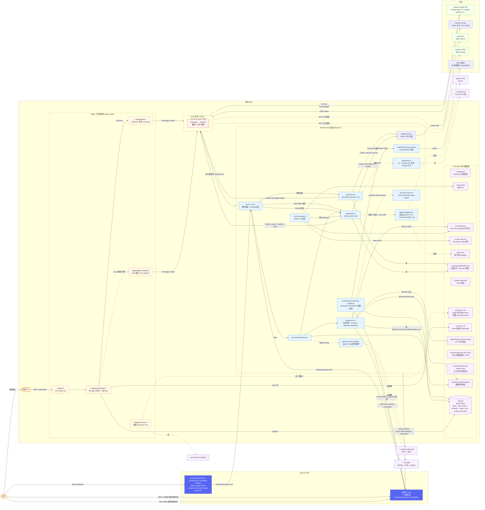
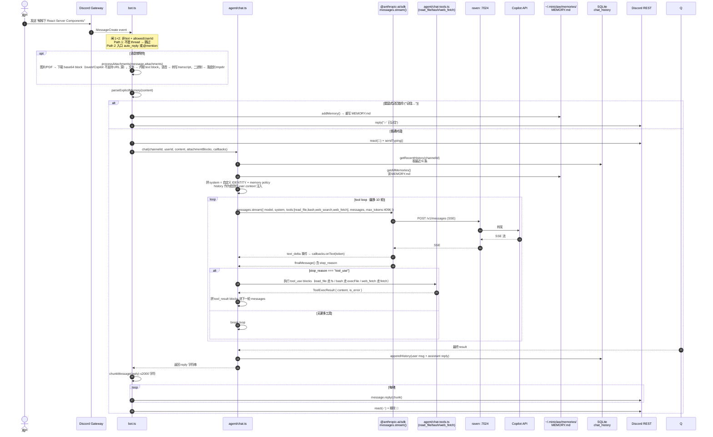
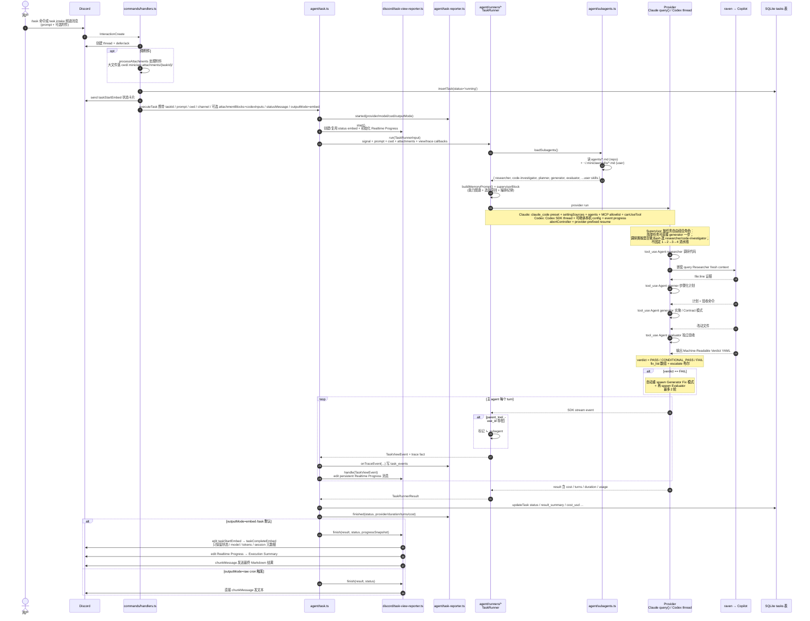
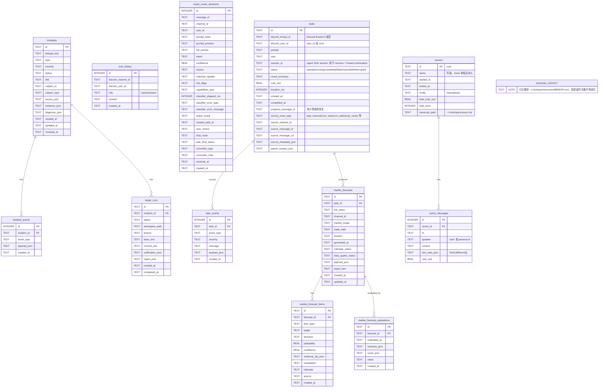

# MiniClaw 架构图册

> 核心图册 + 用户级扩展全景，由外到内，10 分钟看懂全局。
> 所有图用 Mermaid 渲染，GitHub 直接显示。

---

## 1. 系统架构 — 整条链路



**关键设计点**

- **四入口**：`@mention` / auto-reply 走 `chat.ts`（轻量对话）；`/task` 和 `routing.task_channels` 走 `task.ts`（Supervisor 模式 + subagent 编排）；`cron` 调度自动触发
- **Stage 是对偶子系统**：`pnpm stage` 启另一进程（Ink TUI），多 agent 群聊编排，与 Discord bot 路径独立但共享 chat-tools / db / config / log（详见 `docs/features/01-stage.md`）
- **代码 vs 用户级数据严格分离**：
  - 代码在 git repo（`agents/*.md` / `src/`）
  - 用户级数据全在 `~/.miniclaw/`（config / cron / skills / scripts / memories / channel-map）
- **memories 走 markdown 不再走 SQLite 表**：`~/.miniclaw/memories/MEMORY.md` 可直接 vim 编辑、git diff、跨工具复用（hermes 同模式）
- **分层配置**：结构化设置优先放 `~/.miniclaw/config.yaml`；`.env` 保留 secrets、代理和临时 override；优先级是内置默认值 < YAML < env
- **可控继承本机 Agent 配置**：Codex 可用 `inherit` 回落到 `~/.codex/config.toml`；Claude task 显式加载 `user/project/local` settings，默认禁用 hooks；MCP 仍通过 `mcp.allowlist` 控制
- **Task runtime 三边界**：`src/agent/runners/*-task-runner.ts` 负责 Claude / Codex / fake runtime parsing；`src/discord/task-view-reporter.ts` 负责 Discord status/progress/final output；`src/agent/task-reporter.ts` 只写 SQLite trace
- **Discord task 三层输出**：状态 embed 只放元数据；progress message 执行中持续 edit、完成后保留 Execution Summary；最终结果走普通 Markdown 分片
- **Bot dispatch 边界**：`src/bot.ts` 保留 Discord event registration、draining guard 和外层 message route；`src/bot/message-thread-continuation.ts`、`src/bot/message-task-channel.ts`、`src/bot/message-chat.ts` 分别负责 MessageCreate 的三条业务路径；`src/bot/button-dispatch.ts` 负责 cron retry / smart router 按钮顺序和错误回复；`src/bot/slash-dispatch.ts` 负责 slash command 到 `commands/handlers.ts` 的映射
- **Task trace 观测层**：`src/agent/task-reporter.ts` 把 task lifecycle、provider/tool event、Discord delivery failure 写入 `task_events`；`src/store/task-trace-export.ts` 用 payload allowlist + redaction 生成安全 Markdown trace，供 `pnpm run task:trace`、`/task-log` 和 Auto Doctor incident hint 使用；`tasks.trace_auto_attach` 可在 task final output 后按失败、耗时或事件数阈值自动附加同一份安全 trace
- **pre-provider 扩展点**：cron `task` 可先运行 provider 采集结构化数据，再把 JSON 注入 prompt；微信公众号日报通过 `wechat-mp` provider 落地，邮件类任务通过通用 `email` capability + `email-query` / `cmb-credit-card-email` provider 复用同一只读邮箱基础能力
- **Market Intel official evidence 边界**：`src/providers/market-intel/collectors/official.ts` 只保留 public facade 和 market-scope fan-out；`collectors/macro.ts`、`news.ts`、`events.ts` 负责官方 source-family endpoint orchestration，`collectors/scoring-input.ts` 负责 evidence section assembly / derived risk，`collectors/official-http.ts` 和 `official-shared.ts` 分别承载 HTTP client 与 source status/warning helpers；source-specific parsing、freshness、HTML/JSON/XML fixture parsing 拆到 `src/providers/market-intel/collectors/parsers/*`
- **Auto Doctor / guarded repair**：`/doctor` 和 scheduled scan 聚合 DB、cron state、connectivity、PM2、日志与 Git 证据；自动修复只允许隔离 worktree/repair branch，ship 到 `main` 必须走显式 operator approval 和 safe-restart guard
- **白名单两道闸**：`discord.allowed_user_id` 限制谁能用，`routing.auto_reply_channels` 决定哪些频道无需 @mention 进入 chat，默认 `["*"]` 表示全部 guild channel；`routing.task_channels` 决定哪些频道无需 @mention 直接创建 task；旧 `MINICLAW_*` env 仍可覆盖
- **Smart Task Router 是 chat/task 边界上的升级层**：启用后只在本来会响应的 chat 入口运行，先提取 URL/附件/空消息等客观事实，再用 LLM capability classifier 判断自然语言 prompt，必要时用按钮确认后复用 `/task` 的线程、DB、progress 和 final output 链路；决策默认以 hash + capped preview 写入 SQLite
- **LLM 流量全部经过 raven**：`ANTHROPIC_BASE_URL=http://localhost:7024` 让两个 SDK 都走本地代理

---

## 2. @mention 消息时序图

> 场景：你在 #常规 发 "解释下 React Server Components"



**chat vs task 引擎差异**：

| 维度 | chat（@mention） | task（/task） |
|---|---|---|
| SDK | Claude: `@anthropic-ai/sdk` / Codex: `@openai/codex-sdk` | Claude: `@anthropic-ai/claude-agent-sdk` / Codex: `@openai/codex-sdk` |
| system prompt | 自定义短 prompt + memory policy；history 低信任注入 user context | claude_code preset + memory policy + supervisorBlock |
| 工具 | Claude: 4 个手写工具；Codex: read-only Codex thread | Claude: 全套 + Agent + MCP + Edit/Write；Codex: workspace-write Codex thread |
| 子进程 | Claude chat 无；Codex 由 SDK 包装 CLI | SDK 子进程 |
| TTFT | ~500-800ms | 2-5s |
| 设计意图 | 闲聊 + 调研 + 信息查询 | 编码 + 多文件改动 + subagent 编排 |
| 用户被要求"修代码" | 主动告知"请用 /task" | 实际执行 |

---

## 3. /task Supervisor + Verdict 自动迭代

> 场景：`/task prompt:"加 /metrics 命令"`，或在 task intake 频道直接发同样的任务描述；看 5 角色 subagent 由 Supervisor 按"能力图谱"自由编排（非固定流水线）



**Supervisor 模式精髓**

| 角色 | 职责 | 工具集（物理隔离） | 输出契约 |
|------|------|------|------|
| **researcher** | 本地代码轻量调研、Findings + file:line | Read/Glob/Grep/WebFetch/MCP search | findings markdown |
| **code-investigator** | 深度调研（git clone / Bash 遍历仓库） | Read/Glob/Grep/**Bash**/WebFetch/MCP | 自由格式调研报告 |
| **planner** | 把模糊需求拆步骤化计划 | Read/Glob/Grep/WebFetch | spec + 验收命令清单 |
| **generator** | 写代码（Supervisor 显式要求时先 Contract） | Read/Write/Edit/Bash/Glob/Grep | 改动报告（不下"完成宣言"） |
| **evaluator** | 独立验收 | Read/Grep/Glob/Bash | 自然语言总结 + **可选 Verdict YAML** |

**为什么这样设计**

- **物理工具隔离**：researcher / planner / evaluator 没 Write/Edit；generator 没 Agent；code-investigator 有 Bash 但靠 prompt + canUseTool 守住"只读心智"
- **Supervisor prompt 是能力图谱不是流水线**：4+1 个角色由 LLM 按任务自由组合，不强制 1→2→3→4 顺序；简单任务可直接 generator 一步
- **Context 隔离**：subagent 看不到主 agent 历史，Supervisor 调用时**必须完整传上下文**
- **Verdict YAML 是 opt-in**：只在 Supervisor 显式要求时 evaluator 才输出机器可读 YAML 触发自动 Fix 循环；默认自然语言总结
- **canUseTool gate**：拦 `Skill(triad)` / `Skill(triad-resume)`、拦高风险 Bash（`rm -rf /` / `sudo` / `npm publish` / `git push --force`）

---

## 4. Cron 子系统

```mermaid
flowchart LR
    Boot[ClientReady] --> SS[startScheduler]
    SS --> LD[loadCronJobs<br/>scan ~/.miniclaw/cron/*.yaml]
    LD --> Reg[node-cron.schedule<br/>每个 enabled job 可注册一个或多个 ScheduledTask]

    subgraph Tick["定时触发 (每分钟检查)"]
        Reg --> Disp[dispatch<br/>同名 job 运行中则跳过]
        Disp --> Retry[retry wrapper<br/>最多 5 次 attempt<br/>10m → 20m → 40m → 80m]
        Retry --> Run[run by job.type]
        Retry -->|attempt failed| Alert[failure-notifier.ts<br/>send/edit 失败摘要<br/>立即重新执行按钮]
        Alert --> Btn[Discord button<br/>requestCronRetryNow]
        Btn -->|waiting backoff| Wake[wake 当前 retry sleep]
        Btn -->|not running| Manual[单次立即重试<br/>NO_RETRY_POLICY]
        Wake --> Retry
        Manual --> Disp
        Run --> RT[runner-task.ts<br/>type=task]
        Run --> RS[runner-script.ts<br/>type=script]
        Run --> RK[runner-task.ts<br/>type=skill]
        Run --> RM[runner-message.ts<br/>type=message]
    end

    RT -->|"可选 pre_script"| Spawn[spawn 脚本 → stdout 拼到 prompt 顶部]
    RT -->|"可选 pre_provider"| PP[runPreProvider<br/>采集结构化数据 → JSON 拼到 prompt 顶部]
    RT --> ET1[executeTask<br/>outputMode='raw']
    PP --> ET1

    RS --> Spawn2[spawn 脚本]
    Spawn2 -->|stdout| Parse[extractAttachments<br/>解析 MEDIA: 或 png_path]
    Parse --> Send1[Discord channel.send 文本 + 附件]

    RK --> ET2[executeTask<br/>outputMode='raw']
    RM --> RT2[renderTemplate {{date}} ...] --> Send2[channel.send]

    ET1 --> State[recordRun<br/>~/.miniclaw/cron/state.json<br/>last_run / completed / duration]
    ET2 --> State
    Send1 --> State
    Send2 --> State

    classDef boot fill:#fff7e6,stroke:#fa8c16
    classDef sched fill:#e6f7ff,stroke:#1890ff
    classDef runner fill:#f9f0ff,stroke:#722ed1
    classDef state fill:#f6ffed,stroke:#52c41a
    class Boot,SS boot
    class LD,Reg,Disp,Retry,Run,Tick,Alert,Btn,Wake,Manual sched
    class RT,RS,RK,RM,Spawn,PP,Spawn2,Parse,ET1,ET2,RT2 runner
    class State,Send1,Send2 state
```

失败重试策略在 `scheduler.ts` 的调度层统一执行：定时触发的 job 首次失败后 10 分钟重试，之后每次间隔翻倍，最多总尝试 5 次；每次 attempt 都会写入 `~/.miniclaw/cron/state.json`。失败 attempt 会通过 `failure-notifier.ts` 向该 cron 的 Discord channel 发送或编辑一条短摘要，并附带 `立即重新执行` 按钮。按钮 custom id 只包含随机 `failure_run_id`，点击后由 `requestCronRetryNow()` 从本地 cron YAML 重新解析 job；如果原 job 正在 backoff，则唤醒当前 retry sleep，如果已经耗尽且当前没有运行，则启动一次 `NO_RETRY_POLICY` 单次重试。`pnpm cron:test <name>` 保持单次试跑，不进入长时间 retry 等待，也不发送失败重试按钮。

`state.json` 除 `last_run_at` / `last_status` / `last_error` / `last_duration_ms` / `completed` 外，还会记录故障追踪字段：`last_attempt`、`max_attempts`、`next_retry_at`、`failure_run_id`、`failure_alert_channel_id`、`failure_alert_message_id`。这些字段只用于健康检查、按钮解析和恢复展示，不保存 prompt、provider 配置、script args、cookie、token、账户号或原始 provider JSON。

**4 种 type 用法**

| type | 适合场景 | 示例 |
|------|----------|------|
| `task` | 纯 LLM 任务（搜资料 + 整理） | github-trending |
| `task` + `pre_script` | 先执行用户脚本再 LLM 分析（hermes hybrid 模式） | daily-tldr / daily-app-trending |
| `task` + `pre_provider` | 先运行内置 provider 采集结构化数据，再由 LLM 总结 | daily-wechat-mp / daily-cmb-credit-card / cn-stock-pre-market |
| `script` | 纯脚本输出（含图片附件） | hourly-token-report → PNG dashboard |
| `skill` | 调用用户级 subagent | （自定义）|
| `message` | 模板化推送 | morning-greet `{{date}}` |

---

## 5. Connectivity Monitor

`connectivity-monitor.ts` 在 Discord `ClientReady` 后启动，默认每 60 秒检查一次 Discord gateway、Discord REST、普通 HTTPS 网络和 SMTP reachability。结果写入 `~/.miniclaw/runtime/connectivity.json`。连续失败达到 `connectivity.failure_threshold` 后，如果普通网络和 SMTP 可用但 Discord 不可用，会通过 `notifications/smtp-email.ts` 发送 Email fallback；Discord 恢复后再发送一次恢复邮件。

这个 monitor 是进程内能力，只能发现 “MiniClaw 活着但 Discord 链路异常” 的问题。它不替代外部 watchdog；如果 Node 进程、pm2、Mac 或整机网络都不可用，仍然需要 launchd/外部机器兜底。

---

## 6. Auto Doctor 与 Guarded Repair

`ops/doctor.ts` 是只读诊断入口，CLI 通过 `pnpm run doctor`，Discord 通过 `/doctor`、`/incidents` 和 `/incident` 操作。它读取 SQLite task / task_events / incidents / repair_runs、cron state、connectivity state、PM2 状态、MiniClaw 日志和 Git 状态，然后输出 incident type、severity、likely category、repairAllowed 和 recommended action。

`ops/doctor-scheduler.ts` 在 Discord `ClientReady` 后启动，但自动扫描默认需要显式打开 `doctor.auto_diagnose_enabled`。scheduled scan 会把 actionable symptom 持久化到 `incidents` / `incident_events`；如果 `doctor.auto_repair_enabled` 打开，才会把 repair-eligible incident 交给 `doctor:repair`。调度入口只保留 scan loop 和 dependency wiring；log fingerprint/concurrency state 在 `ops/doctor-scheduler/state.ts`，incident 分组在 `ops/doctor-scheduler/grouping.ts`，Discord 通知文案在 `ops/doctor-scheduler/notifications.ts`，repair eligibility/rate-limit policy 在 `ops/doctor-scheduler/repair-policy.ts`。

`ops/doctor-repair.ts` 的执行边界是隔离 worktree + `doctor-repair/<incident-id>` 分支。它拒绝 provider auth、provider data、network、Discord、third-party 类问题，检查 allowed/blocked paths，运行质量门禁，验证通过后可按配置 commit/push repair branch；它不会直接改 live main worktree。

`ops/doctor-ship.ts` 是 repair branch 进入 live `main` 的显式审批边界。只有 `doctor:ship --execute --approve-main` 或 Discord `/incident approve-ship` 会尝试 fast-forward `main`，且必须验证 recorded repair commit SHA。restart 也必须走 `ops/safe-restart.ts`，它会拒绝有 active task/chat 的 PM2 restart，除非操作者显式 force。

---

## 7. 用户级目录布局（`~/.miniclaw/`）

```
~/.miniclaw/
├── config.yaml              # MiniClaw 分层配置（非 secret）
├── data.db                  # SQLite: tasks / task_events / incidents / repair_runs / market_forecasts 等
├── memories/
│   └── MEMORY.md            # 长期记忆（4 section + § 分隔，可 vim 编辑）
├── cron/
│   ├── *.yaml               # 定时 job 定义
│   └── state.json           # last_run/completed/duration 持久化
├── scripts/
│   ├── *.py / *.sh          # cron type=script + pre_script 调用
│   └── ...                  # 可执行权限必需 (chmod +x)
├── providers/
│   ├── wechat-mp/
│   │   ├── *.yaml           # provider 配置（账号列表、窗口、state_path）
│   │   └── state.json       # fakeid cache + 已发送文章去重
│   ├── email-query/
│   │   └── *.yaml           # 通用邮件查询 provider 配置
│   ├── cmb-credit-card-email/
│   │   └── *.yaml           # 招商信用卡邮件解析 provider 配置
│   ├── eastmoney-jywg-readonly/
│   │   ├── config.yaml      # 东方财富 jywg.18.cn profile 配置（无密码、无交易密码）
│   │   └── *.yaml           # 股票日报 provider 配置（脱敏级别、market_session）
│   ├── futu-stock/
│   │   ├── config.yaml      # 富途 OpenD profile 配置（无密码、无 token）
│   │   └── *.yaml           # 股票日报 provider 配置（脱敏级别、market_session）
│   ├── stock-portfolio/
│   │   └── *.yaml           # 聚合多个只读股票账户 provider，并配置 CNY 汇率/Top movers
│   ├── stock-pulse/
│   │   └── *.yaml           # 盘中 hourly 异动扫描 provider 配置
│   ├── market-intel/
│   │   └── *.yaml           # CN/US 盘前市场情报 provider 配置
│   └── market-forecast-evaluation/
│       └── *.yaml           # 盘后 forecast 评价与 calibration 配置
├── capabilities/
│   └── email/               # 通用只读邮箱能力（IMAP adapter、MIME 解析、dedupe state）
│       ├── config.yaml      # 邮箱 profile 配置（非 secret）
│       └── *-state.json     # 邮件 UID/hash 去重 state
├── secrets/
│   ├── wechat-mp-session.json # 公众号后台 token/cookies，敏感凭据
│   ├── eastmoney-jywg-session.json # 东方财富 jywg.18.cn cookie，敏感凭据，权限 0600
│   └── email/
│       └── *.json           # 邮箱 app password / OAuth token，敏感凭据
├── skills/
│   └── *.md                 # 用户级 subagent (覆盖 repo agents/)
├── personas/
│   └── *.md                 # Stage 用户级 persona (覆盖 repo personas/)
├── scenes/
│   └── *.md                 # Stage `/save <name>` 输出的 transcript
├── runtime/
│   └── connectivity.json    # Discord / HTTPS / SMTP 链路探测状态（无 secret）
├── logs/
│   └── miniclaw-{out,error}.log  # pm2 模式日志（配置在 ecosystem.config.cjs）
└── channel-map.json         # setup-miniclaw-channels.ts 输出
```

**严格分离原则**：repo 内是**通用代码**（任何人 fork 都能用），`~/.miniclaw/` 是**你的个人配置**（不进 git）。

---

## 8. 附件流（多模态）

源文件：`src/discord/attachments.ts`。`src/bot/message-chat.ts`、`src/bot/message-task-channel.ts`、`src/bot/message-thread-continuation.ts` 和 `handlers.ts` `/task` 都在调它。

```
Discord Attachment
       │
       ▼
classify by mime + ext
       │
   ┌───┼─────┬──────┬─────┬──────────┐
   ▼   ▼     ▼      ▼     ▼          ▼
 image pdf  text  audio  binary    超限
   │   │     │      │     │          │
   │   │     │      │     │       notice
   │   │     │      │     │      ⚠️ skip
   │   │     │      │     │
   │   │     │      │     └─→ 下载落盘<br>
   │   │     │      │         <cwd>/.miniclaw-attachments/{scope}/<name><br>
   │   │     │      │         + text block "📎 已保存到 ..."
   │   │     │      │
   │   │     │      └─→ 下载（.ogg 先经 ffmpeg 转 webm）→ OpenAI audio transcription<br>
   │   │     │           <audio_transcript name=...>...</audio_transcript><br>
   │   │     │           失败时 notice "❌ 转写失败: ..."
   │   │     │
   │   │     └─→ fetch → utf8 → text block
   │   │         "<file name=...>...</file>"  (≤1MB)
   │   │
   │   └─→ 下载 → base64 → document block<br>
   │       { source: { type:'base64', media_type:'application/pdf', data } }
   │
   └─→ 下载 → base64 → image block<br>
       { source: { type:'base64', media_type:'image/png|jpeg|...', data } }
       （注：raven 转 Copilot 不支持 URL 源，必须 base64）
```

**SDK 入参形态**：有附件 → `prompt: AsyncIterable<SDKUserMessage>`，message.content = `[...attachmentBlocks, {type:"text", text: prompt}]`；无附件 → `prompt: string`（保持轻量）。

**清理**：task 路径附件落到 `<cwd>/.miniclaw-attachments/<taskId>/`，executeTask `finally` 块 `rmSync` 整目录。chat 路径走 `os.tmpdir()`，靠 OS 周期清理。

**配置**：推荐写在 `attachments.max_mb` / `attachments.max_count`；旧 `MINICLAW_MAX_ATTACHMENT_MB` / `MINICLAW_MAX_ATTACHMENTS` env 仍可覆盖。语音转写配置在 `attachments.audio_transcription.*`，env 覆盖为 `MINICLAW_AUDIO_TRANSCRIPTION_ENABLED` / `MINICLAW_AUDIO_TRANSCRIPTION_PROVIDER` / `MINICLAW_AUDIO_TRANSCRIPTION_MODEL` / `MINICLAW_AUDIO_TRANSCRIPTION_LOCAL_MODEL` / `MINICLAW_AUDIO_TRANSCRIPTION_LOCAL_PYTHON` / `MINICLAW_AUDIO_TRANSCRIPTION_LOCAL_DEVICE` / `MINICLAW_AUDIO_TRANSCRIPTION_LOCAL_COMPUTE_TYPE` / `MINICLAW_AUDIO_TRANSCRIPTION_MAX_MB` / `MINICLAW_AUDIO_TRANSCRIPTION_TIMEOUT_MS` / `MINICLAW_AUDIO_TRANSCRIPTION_LANGUAGE`。`provider: auto` 在存在 `OPENAI_API_KEY` 时调用 OpenAI Audio Transcriptions API，否则走本机 `local_faster_whisper`；Raven/Codex 代理不提供 `/audio/transcriptions`，所以无 OpenAI key 的 Raven 环境应使用本地 faster-whisper。OpenAI 路径会把 Discord `.ogg` voice message 先用本机 `ffmpeg` 转成 `.webm` 再上传；本地 faster-whisper 路径会用 `ffmpeg` 转成 16kHz mono wav 后再调用配置的 Python。

**chat_history 取舍**：附件不写入 chat_history（只写文字 prompt），续话需要重新上传——避免 base64 反复进 context。

---

## 9. 数据库 schema

`~/.miniclaw/data.db`（SQLite WAL 模式）。schema 版本使用 SQLite `PRAGMA user_version` 管理，当前版本由 `src/store/db.ts` 的 `SCHEMA_VERSION = 9` 定义。



---

## 阅读建议

1. **第一次接触** → 看图 1 + 用户级目录布局，对照 `src/index.ts`、`src/bot.ts` 和 `src/bot/*` 通读
2. **想改 chat 行为** → 看图 2，集中改 `src/agent/chat.ts`
3. **想加新 subagent** → 看图 3 + Supervisor 表，新增 `agents/<name>.md`（repo） 或 `~/.miniclaw/skills/<name>.md`（user）
4. **想加新 cron** → 看图 4，写 `~/.miniclaw/cron/<name>.yaml` 重启 bot
5. **想改微信公众号日报** → 看 `docs/features/02-wechat-mp-provider.md`，重点是 provider config、固定窗口、登录态刷新和 dedupe state
6. **想加新 slash command** → `register.ts` 注册 + `handlers.ts` 处理 + `src/bot/slash-dispatch.ts` 映射
