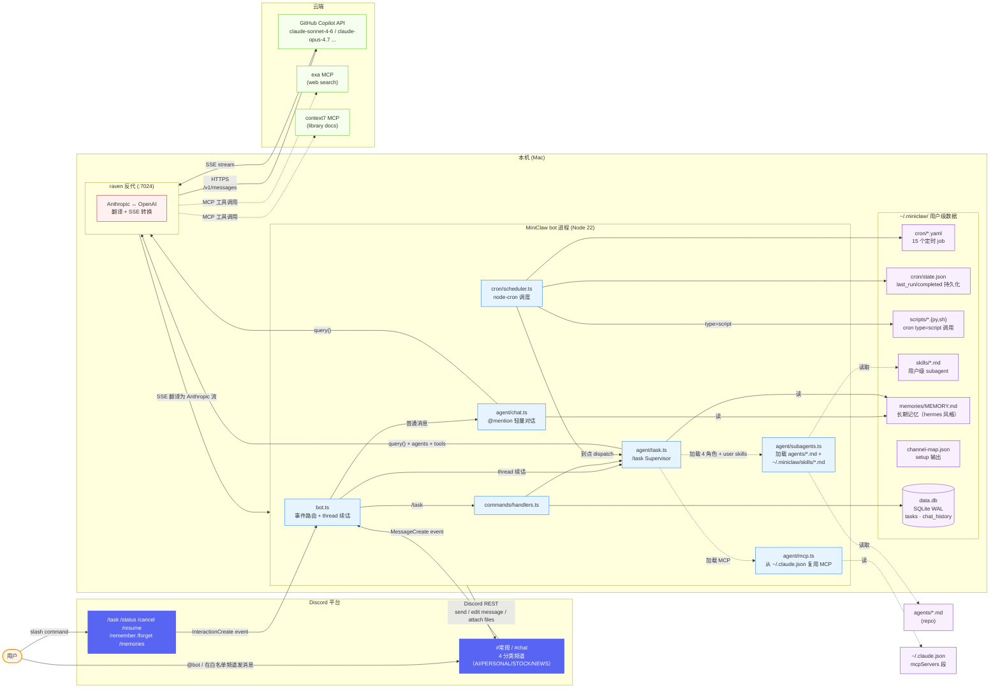
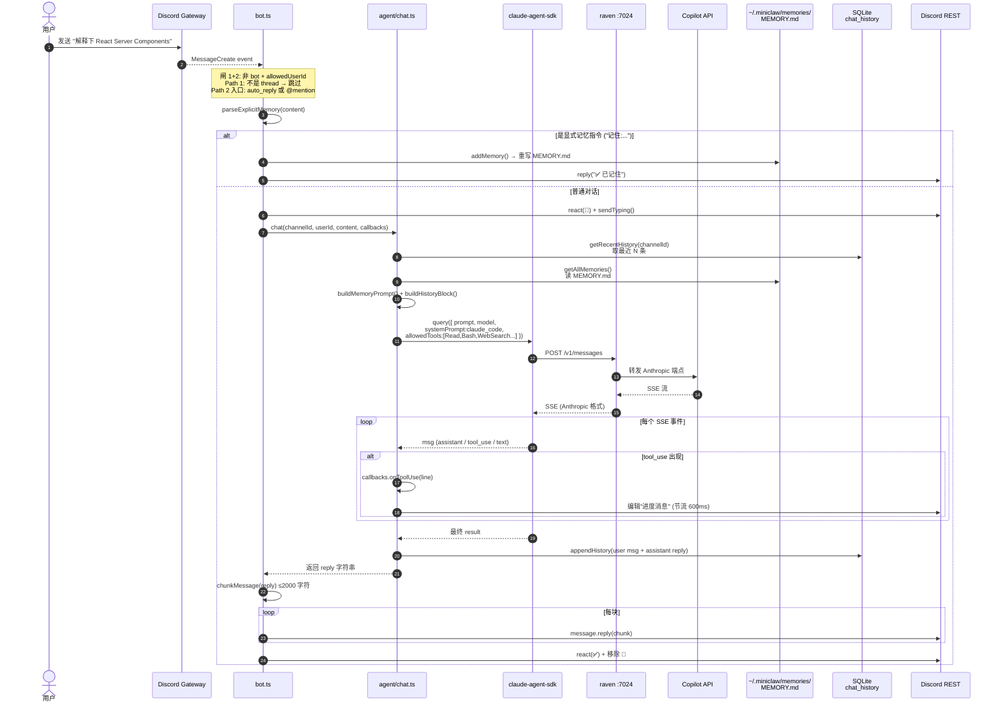
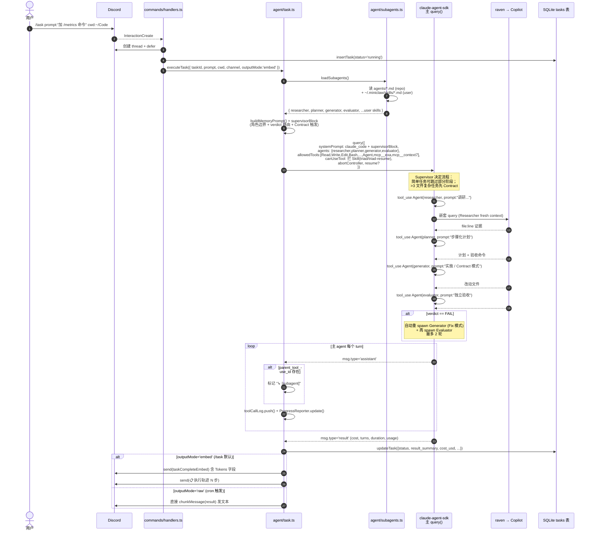
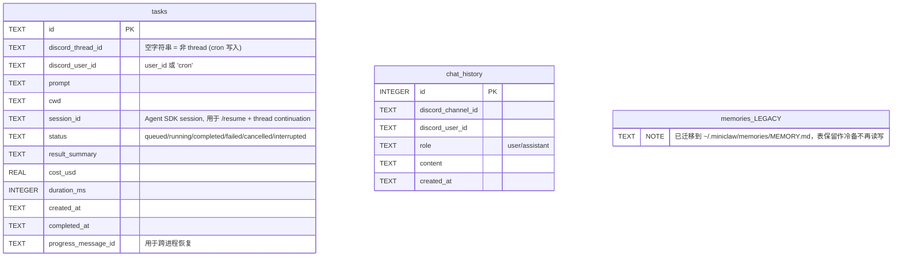

# MiniClaw 架构图册

> 三张图 + 用户级扩展全景，由外到内，10 分钟看懂全局。
> 所有图用 Mermaid 渲染，GitHub 直接显示。

---

## 1. 系统架构 — 整条链路



**关键设计点**

- **三入口**：`@mention` 走 `chat.ts`（轻量对话）；`/task` 走 `task.ts`（Supervisor 模式 + subagent 编排）；`cron` 调度自动触发
- **代码 vs 用户级数据严格分离**：
  - 代码在 git repo（`agents/*.md` / `src/`）
  - 用户级数据全在 `~/.miniclaw/`（cron / skills / scripts / memories / channel-map）
- **memories 走 markdown 不再走 SQLite 表**：`~/.miniclaw/memories/MEMORY.md` 可直接 vim 编辑、git diff、跨工具复用（hermes 同模式）
- **MCP 复用不重维护**：mcp.ts 直接读 `~/.claude.json` 的 `mcpServers` 段，零 key 管理
- **白名单两道闸**：`MINICLAW_ALLOWED_USER_ID` 限制谁能用，`MINICLAW_AUTO_REPLY_CHANNELS` 决定哪些频道无需 @mention
- **LLM 流量全部经过 raven**：`ANTHROPIC_BASE_URL=http://localhost:7024` 让两个 SDK 都走本地代理

---

## 2. @mention 消息时序图

> 场景：你在 #常规 发 "解释下 React Server Components"



---

## 3. /task Supervisor + Verdict 自动迭代

> 场景：`/task prompt:"加 /metrics 命令"`，看 4 角色 subagent + verdict YAML 自动循环



**Supervisor 模式精髓**

| 角色 | 职责 | 工具集（物理隔离） | 输出契约 |
|------|------|------|------|
| **Researcher** | 调研代码、收集 file:line 证据 | Read/Glob/Grep/WebFetch/MCP search | findings markdown |
| **Planner** | 基于调研出步骤化计划 | Read/Glob/Grep/WebFetch | spec + 验收命令清单 |
| **Generator** | 按计划写代码（**或先 Contract**） | Read/Write/Edit/Bash/Glob/Grep | 改动报告（不下"完成宣言"） |
| **Evaluator** | 独立验收 | Read/Grep/Glob/Bash | **`## Machine-Readable Verdict` YAML** |

**为什么这样设计**

- **物理工具隔离**：Researcher / Planner 没 Write/Edit 权限，模型即便冲动也写不了文件
- **Context 隔离**：subagent 看不到主 agent 历史，Supervisor 调用时**必须完整传上下文**
- **机器可读 verdict**：Evaluator 输出 YAML → Supervisor 程序化解析 → 决定 PASS / 自动 Fix 循环 / escalate
- **Contract 模式**：复杂任务 (>3 文件) Generator 先输出 Contract → Supervisor 审 → 第二轮真实施
- **canUseTool gate** 拦 `Skill(triad)` / `Skill(triad-resume)`：防 Supervisor 自动调用 CLI-only slash command

---

## 4. Cron 子系统

```mermaid
flowchart LR
    Boot[ClientReady] --> SS[startScheduler]
    SS --> LD[loadCronJobs<br/>scan ~/.miniclaw/cron/*.yaml]
    LD --> Reg[node-cron.schedule<br/>每个 enabled job 注册一个 ScheduledTask]

    subgraph Tick["定时触发 (每分钟检查)"]
        Reg --> Disp[dispatch by job.type]
        Disp --> RT[runner-task.ts<br/>type=task]
        Disp --> RS[runner-script.ts<br/>type=script]
        Disp --> RK[runner-task.ts<br/>type=skill]
        Disp --> RM[runner-message.ts<br/>type=message]
    end

    RT -->|"可选 pre_script"| Spawn[spawn 脚本 → stdout 拼到 prompt 顶部]
    RT --> ET1[executeTask<br/>outputMode='raw']

    RS --> Spawn2[spawn 脚本]
    Spawn2 -->|stdout| Parse[extractAttachments<br/>解析 MEDIA: 或 png_path]
    Parse --> Send1[Discord channel.send 文本 + 附件]

    RK --> ET2[executeTask<br/>outputMode='raw']
    RM --> RT2[renderTemplate {{date}} ...] --> Send2[channel.send]

    ET1 --> State[recordRun<br/>~/.miniclaw/cron/state.json<br/>last_run / completed / duration]
    ET2 --> State
    Send1 --> State
    Send2 --> State

    classDef boot fill:#fff7e6,stroke:#fa8c16
    classDef sched fill:#e6f7ff,stroke:#1890ff
    classDef runner fill:#f9f0ff,stroke:#722ed1
    classDef state fill:#f6ffed,stroke:#52c41a
    class Boot,SS boot
    class LD,Reg,Disp,Tick sched
    class RT,RS,RK,RM,Spawn,Spawn2,Parse,ET1,ET2,RT2 runner
    class State,Send1,Send2 state
```

**4 种 type 用法**

| type | 适合场景 | 示例 |
|------|----------|------|
| `task` | 纯 LLM 任务（搜资料 + 整理） | github-trending |
| `task` + `pre_script` | 先采集结构化数据再 LLM 分析（hermes hybrid 模式） | daily-tldr / daily-app-trending |
| `script` | 纯脚本输出（含图片附件） | hourly-token-report → PNG dashboard |
| `skill` | 调用用户级 subagent | （自定义）|
| `message` | 模板化推送 | morning-greet `{{date}}` |

---

## 5. 用户级目录布局（`~/.miniclaw/`）

```
~/.miniclaw/
├── data.db                  # SQLite: tasks + chat_history（运行时数据）
├── memories/
│   └── MEMORY.md            # 长期记忆（4 section + § 分隔，可 vim 编辑）
├── cron/
│   ├── *.yaml               # 15 个定时 job 定义
│   └── state.json           # last_run/completed/duration 持久化
├── scripts/
│   ├── *.py / *.sh          # cron type=script + pre_script 调用
│   └── ...                  # 可执行权限必需 (chmod +x)
├── skills/
│   └── *.md                 # 用户级 subagent (覆盖 repo agents/)
└── channel-map.json         # setup-miniclaw-channels.ts 输出
```

**严格分离原则**：repo 内是**通用代码**（任何人 fork 都能用），`~/.miniclaw/` 是**你的个人配置**（不进 git）。

---

## 数据库 schema

`~/.miniclaw/data.db`（SQLite WAL 模式）



---

## 阅读建议

1. **第一次接触** → 看图 1 + 图 5（用户级目录），对照 `src/index.ts` + `src/bot.ts` 通读
2. **想改 chat 行为** → 看图 2，集中改 `src/agent/chat.ts`
3. **想加新 subagent** → 看图 3 + Supervisor 表，新增 `agents/<name>.md`（repo） 或 `~/.miniclaw/skills/<name>.md`（user）
4. **想加新 cron** → 看图 4，写 `~/.miniclaw/cron/<name>.yaml` 重启 bot
5. **想加新 slash command** → `register.ts` 注册 + `handlers.ts` 处理 + `bot.ts` switch case
