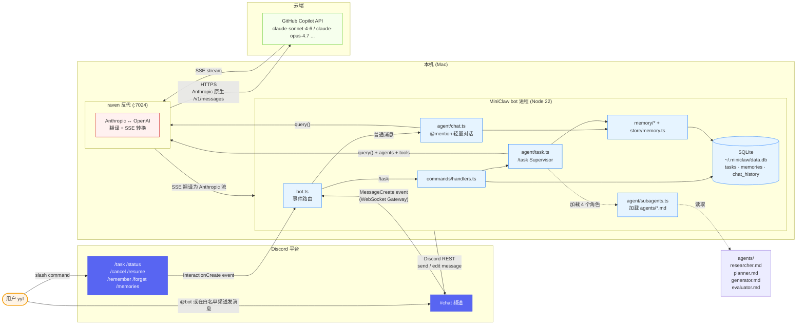
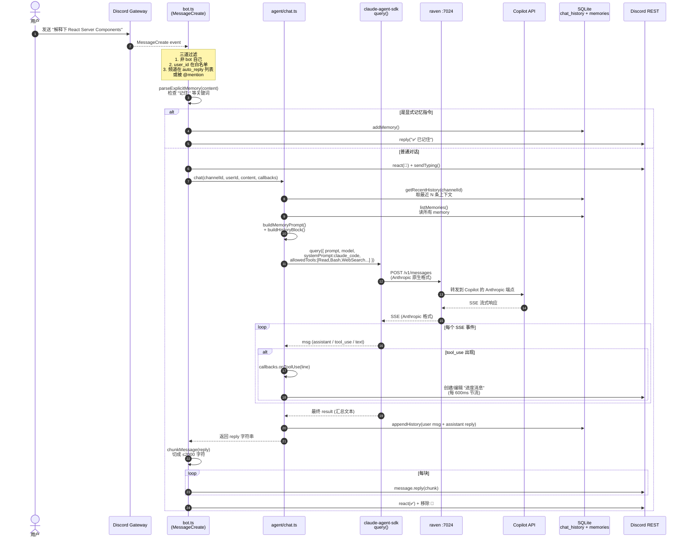
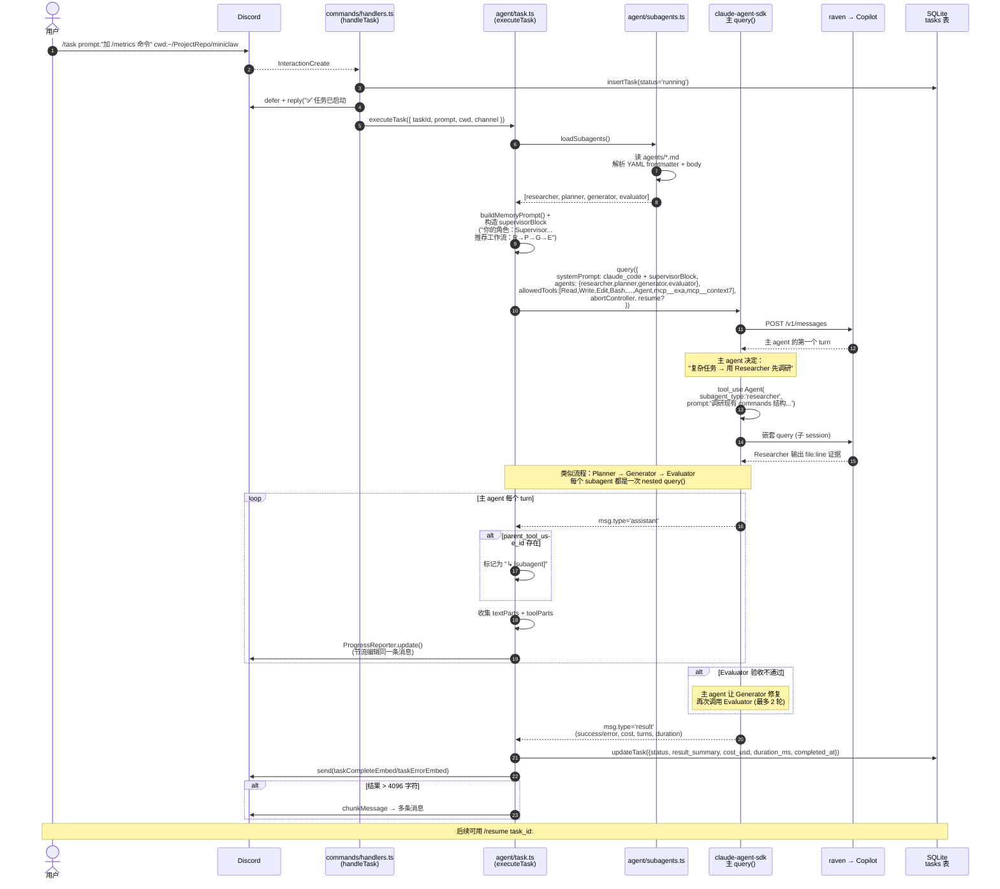
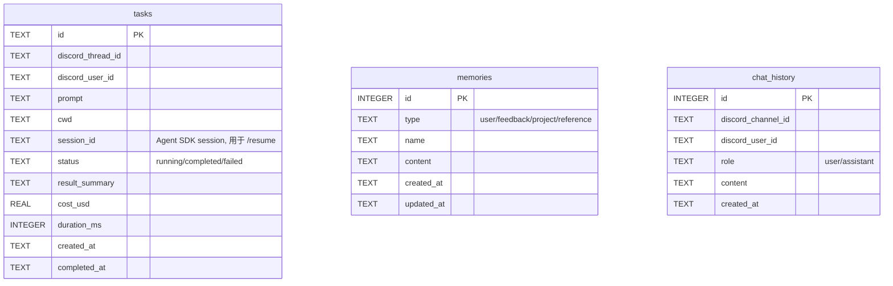

# MiniClaw 架构图册

> 三张图，由外到内，10 分钟看懂全局。
> 所有图用 Mermaid 渲染，GitHub 直接显示。

---

## 1. 系统架构 — 整条链路

**关键设计点**

- **双入口**：`@mention` 走 `chat.ts`（轻量对话）；`/task` 走 `task.ts`（Supervisor 模式 + subagent 编排）
- **持久化只在本地**：SQLite 单文件，**不要在两台机器之间同步**（否则状态分裂）
- **LLM 流量全部经过 raven**：`ANTHROPIC_BASE_URL=http://localhost:7024` 让两个 SDK（`@anthropic-ai/sdk` 和 `@anthropic-ai/claude-agent-sdk`）都走本地代理
- **白名单两道闸**：`MINICLAW_ALLOWED_USER_ID` 限制谁能用，`MINICLAW_AUTO_REPLY_CHANNELS` 决定哪些频道无需 @mention

---

## 2. @mention 消息时序图 — 一句话怎么走完整条流程

> 场景：你在 #chat 发 "解释下 React Server Components"，看一句话从输入到回复经过哪些代码。

**易错点提示**

- **第 1 步**：用户必须是 `MINICLAW_ALLOWED_USER_ID`，否则消息被静默丢弃
- **第 6-7 步**：去重 Map (`processed`) 只在单进程内有效；同一台机器跑两个 bot 进程不会去重
- **第 14 步**：`allowedTools` 决定 chat 模式能用什么工具 — 默认含 `Read/Bash/Glob/WebSearch/WebFetch/Agent`，**没有** `Write/Edit`（只读模式）
- **第 17-18 步**：raven 看到 `claude-*` 模型走 Anthropic 原生通道，零翻译开销
- **第 26 步**：Discord 单消息上限 2000 字符，超过会被截

---

## 3. /task Supervisor 时序图 — 主 agent 怎么分派 subagent

> 场景：你跑 `/task prompt:"给 miniclaw 加一个 /metrics 命令显示昨日 token 消耗"`，看 Supervisor 模式怎么编排 4 个角色化 subagent。

**Supervisor 模式精髓**

| 角色 | 职责 | 工具集 |
|------|------|--------|
| **Researcher** | 调研代码、收集 file:line 证据 | Read/Glob/Grep/WebSearch |
| **Planner** | 基于调研输出步骤化计划 | 通常只读 |
| **Generator** | 按计划写代码 | Read/Write/Edit/Bash |
| **Evaluator** | 独立验收，**必跑 `pnpm build`** | Read/Bash（不写代码）|

**为什么这样设计**（不是简单一锅炖）

- **Context 隔离**：subagent 看不到主 agent 的对话历史，主 agent 调用时**必须完整传上下文**（见 task.ts:71）
- **职责分离**：Generator 不能自己说"做完了"，必须 Evaluator 独立判定 — 防止 LLM 自我吹嘘
- **可迭代**：Evaluator 不通过 → Generator 修复 → 再验收，最多 2 轮（task.ts:72）
- **Supervisor 整合**：主 agent 负责把 4 段 subagent 输出**整合后**回复用户，不直接抛原文（task.ts:73）

---

## 数据库 schema（额外参考）

`~/.miniclaw/data.db`（SQLite WAL 模式）

三张表互不关联（无 FK），按时间窗口和 channel 隔离查询。

---

## 阅读建议

1. **第一次接触** → 看图 1，对照 `src/index.ts` + `src/bot.ts` 通读一遍
2. **想改 chat 行为** → 看图 2，集中改 `src/agent/chat.ts`
3. **想加新 subagent** → 看图 3，新增 `agents/<name>.md`，`loadSubagents()` 自动发现
4. **想加新 slash command** → `src/commands/register.ts` 注册定义 + `src/commands/handlers.ts` 加处理器 + `src/bot.ts` switch 加 case
