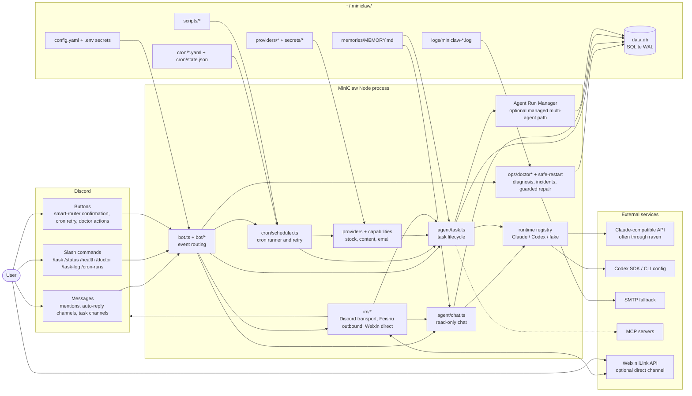
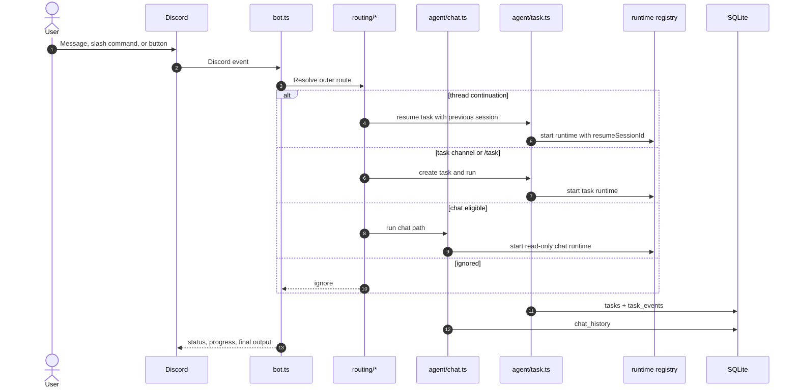
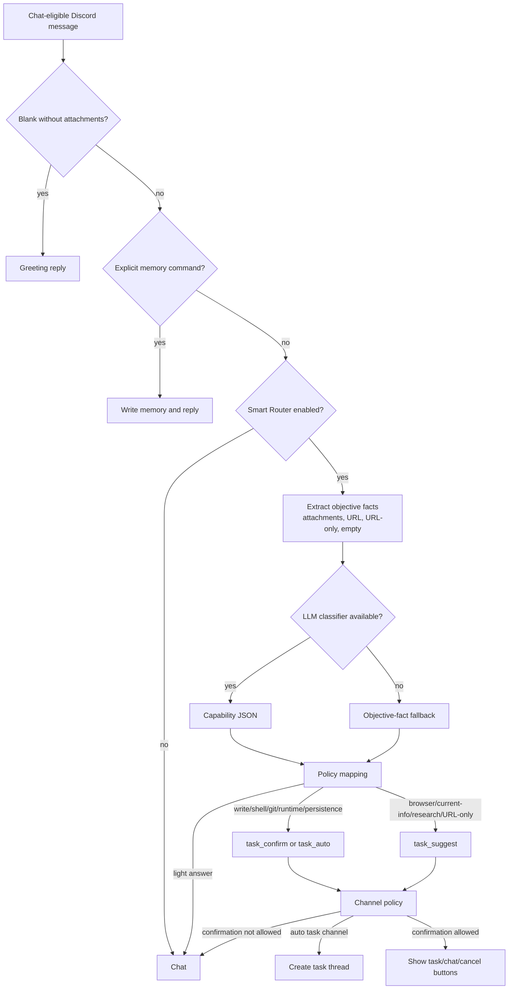
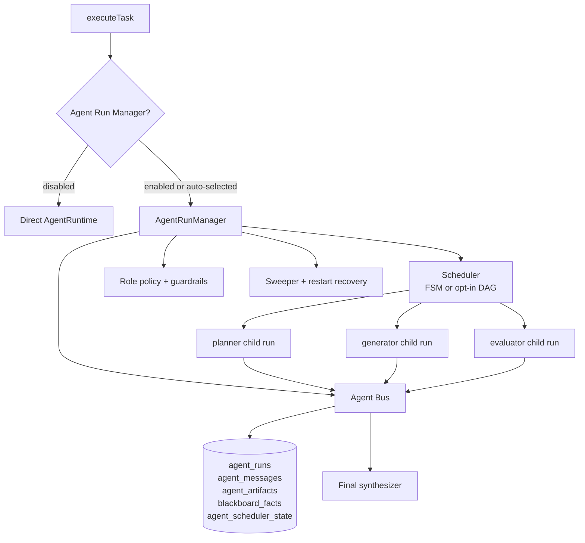
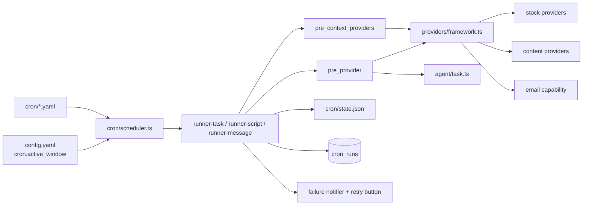
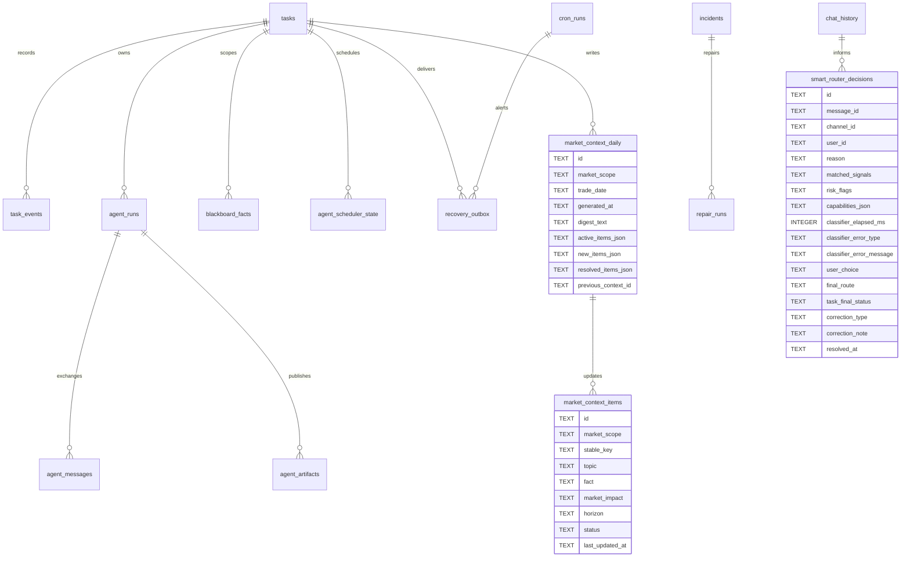

# MiniClaw Architecture

> MiniClaw is a local-first Discord-native agent runtime. Discord is the primary user surface, with optional Weixin direct as a lightweight personal entry point; Node 22 is the process runtime; `~/.miniclaw/` is the user data boundary; SQLite records durable task, routing, incident, provider, and Agent Run Manager state.

## System View

## Runtime Boundaries

MiniClaw keeps hard boundaries between code, user state, and public docs:

- Repo code and repo-owned prompts live in `src/`, `prompts/`, `agents/`, and `personas/`.
- User configuration, cron jobs, memory, scripts, provider sessions, logs, and SQLite state live under `~/.miniclaw/`.
- Secrets belong in `.env` or `~/.miniclaw/secrets/**`, never in public docs or examples.
- `docs/` is the implementation source of truth; `website/` is a presentation layer.

The runtime registry separates agent execution from routing. `src/runtime/agent-runtime.ts` defines the common runtime interface. `src/agent/runtimes/registry.ts` maps the configured runtime to Claude, Codex, or fake task runners. `runtime.default_agent` is the preferred config key; legacy `agent.provider` remains a compatibility fallback.

## Message And Task Flow

## Smart Router

The Smart Router is a second-stage decision inside the chat-eligible path. The first stage still decides hard Discord routing: ignore, thread continuation, task channel, or chat candidate. The second stage decides whether the chat candidate should remain chat, show task confirmation, or become an automatic task in configured channels.

## Agent Run Manager

Agent Run Manager is an optional controlled insertion layer between `executeTask()` and `AgentRuntime`. When `agent_run_manager.enabled=false` and `agent_run_manager.auto_enabled=false`, the system keeps the single-agent runtime path. When enabled, MiniClaw creates a root supervisor run and managed child runs with typed messages, artifacts, blackboard facts, policy checks, sweeper recovery, and optional ACP-style access.

Implemented state:

- Managed fake runtime E2E covers planner, generator, evaluator, typed messages, artifacts, blackboard facts, and final synthesis.
- Claude and Codex child runtime injection supports `miniclaw-agent-bus` MCP configuration plus a turn-end `miniclaw_agent_envelope` fallback.
- Role policy keeps planner/evaluator read-only by default and allows generator workspace writes under explicit policy.
- Sweeper handles stale active runs, waiting scheduler timeouts, orphan children, terminal cleanup, and restart recovery.
- ACP server is localhost, task-scoped, bearer-token protected, and disabled by default.

## Providers And Cron

`cron.active_window` in `config.yaml` is a scheduler-level guard. When enabled, scheduled cron dispatches and missed-run catch-ups are recorded as skipped outside the configured local-time window before runners or providers execute. Manual `pnpm cron:test` remains an explicit operator path for troubleshooting.

`pre_context_providers` are optional, non-blocking background providers that run before `pre_script` and the primary `pre_provider`; they prepend durable context such as rolling market memory without replacing the task's source-of-truth provider. Provider collection is read-only unless a provider explicitly documents a commit phase. `commit()` is delayed until downstream task success. Provider docs live under `docs/providers/`; private account/session details live under `docs/private/` or `~/.miniclaw/` and must not enter public docs.

Stock provider names remain cron-facing compatibility contracts in `src/providers/index.ts`, but stock implementation ownership now lives under `src/stock/*`. Top-level stock provider folders under `src/providers/*` keep only `index.ts` wrappers and provider-named `config.ts` loaders; reusable stock types, report formatting, chart rendering, calibration, source adapters, data domains, and signal logic are imported directly from `src/stock/data`, `src/stock/signals`, `src/stock/sources`, and `src/stock/reports`. Cron and store code that persists market forecast or market context payloads should depend on stock data-domain types rather than provider facade types.

## Storage Model

MiniClaw uses `~/.miniclaw/data.db` in SQLite WAL mode. Schema migrations are managed through `PRAGMA user_version`; the current schema is defined by `src/store/schema.ts` as `SCHEMA_VERSION = 15`.

State retention is configured through `state.retention.*`. Cleanup is dry-run first through `pnpm run state:cleanup -- --dry-run`; destructive cleanup requires `--execute`.

`market_context_daily` stores one rolling digest per market scope and trade date. `market_context_items` stores deduplicated long-lived market facts keyed by `(market_scope, stable_key)` so daily update cron jobs can resolve stale items and ordinary stock cron jobs can inject only active context.

## Delivery And Recovery

`recovery_outbox` separates local execution results from IM delivery. `cron_failure_alert` stores retryable cron failure alerts when Discord delivery is unavailable. `task_result_delivery` stores task result fragments for later delivery recovery. Discord remains the primary full-fidelity gateway; Feishu is outbound-only; Weixin direct is opt-in text interaction backed by local `~/.miniclaw/weixin` account state and a Discord task bridge channel for confirmed `/task` execution.

## Observability And Operations

- `task_events` records lifecycle, protocol/tool events, and Discord status transitions.
- `src/store/task-trace-export.ts` and `src/store/agent-run-trace-export.ts` produce redacted Markdown traces for `/task-log`, incident views, and local CLI review.
- `/doctor` and scheduled scans aggregate DB, cron state, config, PM2, logs, and Git evidence.
- Guarded repair and ship flows require explicit operator approval and work through a repair branch before touching `main`.
- `safe-restart` blocks unsafe restarts when active task/chat work is in progress.

## Design Invariants

- Discord routing decides entry; agent runtimes do not decide whether a Discord event is allowed.
- Chat is read-oriented. File writes, shell execution, Git changes, durable output, and multi-step coding belong in task runtime.
- Cron and providers are source-isolated. A provider may collect structured input, but task execution remains under the agent runtime boundary.
- User state belongs in `~/.miniclaw/`; repo docs and examples must use placeholders.
- Website pages must cite `docs/` sources and cannot become implementation authority.
