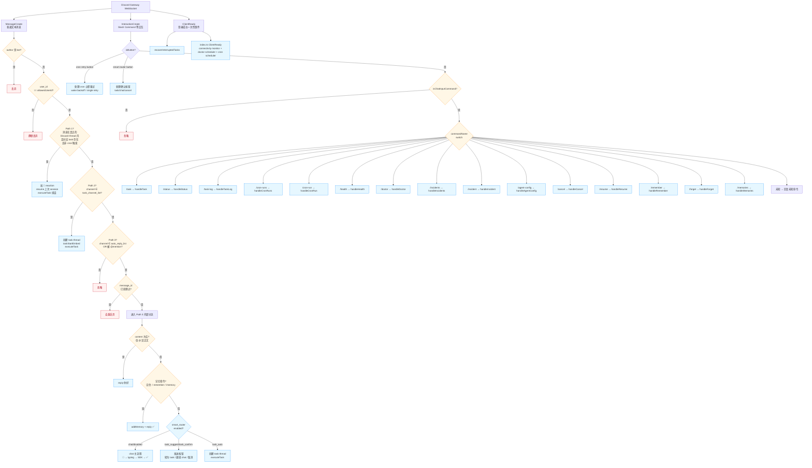

# `src/bot.ts` / `src/bot/*` 消息路由全解析

> `src/bot.ts` 只注册 **3 个 Discord 事件监听器**，每个负责一类事件；MessageCreate 分支和 interaction dispatch 的细节已经下沉到 `src/bot/*`。
> 看完这一篇你就能改触发词 / 加新命令 / 调整路由规则。

---

## 全景图



---

## 三个监听器分别在哪

| 位置 | 事件 | 干什么 |
|------|------|--------|
| `createBot()` | `MessageCreate` | 计算外层 message route，并委托 `message-thread-continuation.ts` / `message-task-channel.ts` / `message-chat.ts` |
| `createBot()` | `InteractionCreate` | 委托 `button-dispatch.ts` 先处理 cron retry 按钮、再处理 smart router 按钮；随后委托 `slash-dispatch.ts` 处理 slash commands |
| `createBot()` | `ClientReady` | 登录成功后恢复中断任务 |

另外 `src/index.ts` 也在同一个 Discord client 上注册 `ClientReady`，用于启动 connectivity monitor、Auto Doctor scheduler 和 cron scheduler。

---

## MessageCreate 决策链

### 闸 1+2：硬过滤

```ts
if (message.author.bot) return;                       // bot 不互回
if (message.author.id !== config.allowedUserId) return; // 单用户白名单
```

### Path 1: Thread Continuation

> 设计意图：你 `/task` 创建过的 thread 里，再发任何文字 = 续话。

**3 个守卫同时满足才进入**：

```ts
const isInThread = "isThread" in message.channel && message.channel.isThread();
const continuableTask = isInThread ? getTaskByThreadId(message.channel.id) : undefined;
if (continuableTask && continuableTask.session_id && continuableTask.discord_user_id !== "cron") {
```

| 守卫 | 防什么 |
|------|--------|
| `isThread()` | 防普通 channel 命中 thread 续话逻辑 |
| `getTaskByThreadId(channel.id)` 命中 | 这个 thread 必须真的有 task 历史 |
| `discord_user_id !== "cron"` | cron 触发的 task 不算用户的"上次会话" |

匹配则：
1. 加 `🔄` reaction（视觉提示"识别为续话"）
2. 新建 task row（同 thread + 新 prompt）
3. `executeTask({ ..., resumeSessionId: continuableTask.session_id })`
4. SDK 接住上次的完整 transcript，不需要 prompt 里重复上下文

### Path 2: Task Intake Channel

> 设计意图：专门的任务频道里，普通消息无需 `@MiniClaw`，直接变成 `/task` 风格任务。

入口条件：

```ts
const isTaskChannel = config.taskChannelIds.includes(message.channel.id);
```

匹配则：

1. 去重 `message.id`
2. 取消息正文；如果只有附件则默认 prompt 为 `请处理这些附件`
3. 检查 `getActiveTaskCount() < maxConcurrentTasks`
4. `message.startThread()` 创建 task thread
5. `createTask()` 写 DB
6. 发送 `taskStartEmbed`
7. `executeTask()` 在 thread 中运行

这个路径和 `/task` 使用同一套 `executeTask()`、progress message、完成 embed 和最终 Markdown 输出。它只改变触发方式，不改变 runtime、sandbox、cwd、附件处理和 session 存储。task runtime 以 `runtime.default_agent` 为准；未配置时回退 legacy `agent.provider`。若 `tasks.trace_auto_attach.enabled` 打开，task final output 后还会按失败、耗时或事件数阈值自动附加安全 Markdown trace。

`MINICLAW_AUTO_REPLY_CHANNELS` 默认等价于 `*`，即所有允许用户可见的 guild channel 普通消息都会进入 chat；设为 `none` 或 YAML `auto_reply_channels: []` 可恢复为只响应 @mention。若一个频道同时出现在 `MINICLAW_TASK_CHANNELS` 和 `MINICLAW_AUTO_REPLY_CHANNELS`，task channel 优先，避免写权限任务被误走 chat，也避免同一条消息双处理。

### 闸 3+4：Path 3 Chat 入口

```ts
const isAutoChannel =
  config.autoReplyChannelIds.includes("*") ||
  config.autoReplyChannelIds.includes(message.channel.id);
const isMentioned = message.mentions.has(client.user!);
if (!isAutoChannel && !isMentioned) return;
// 然后 processed 去重 Map（5 分钟 TTL，500 条做老化）
```

### Path 3 内部分流（按优先级 if-else）

| 优先级 | 判断 | 走向 |
|--------|------|------|
| **预处理** | `message.attachments` 非空 | `processAttachments()` → `attachmentBlocks: ContentBlockParam[]`，notices 直发频道 |
| **高** | content 为空 **且** attachmentBlocks 为空 | `reply("你好！...")` → return |
| **中** | `parseExplicitMemory` 命中"记住:" / "remember" / "/memory" | `addMemory` + reply ✅ → return |
| **低** | 其他所有内容（含纯附件 → 默认 prompt"请分析这些附件"） | smart router（如果启用）→ chat / 按钮确认 / task_auto |

### Smart Task Router

> 设计意图：chat 入口仍保持轻量和只读，但在真正进入 chat 前识别“这其实是一个 task”的自然语言请求。

入口条件：

- 只在已通过 `allowed_user_id`、且本来就会响应的 auto-reply channel 或 @mention 消息中运行。
- `routing.task_channels` 仍然优先，专用 task 频道不会再弹确认按钮。
- `routing.smart_router.enabled: false` 时行为保持旧逻辑。

处理顺序：

1. 先处理空消息和显式记忆指令。
2. `classifyMessageCapabilities()` 只提取客观事实：空消息、附件、外部 URL、URL-only。
3. 非空 chat eligible 消息直接调用 LLM capability classifier；它只输出需要哪些能力，不直接决定 chat/task。失败时回退到客观事实，并记录 `classifier_failed` / `classifier_unavailable`，不让路由失败阻断 chat。
4. `resolveCapabilitiesToRouteDecision()` 把 capability 映射为 `chat` / `task_suggest` / `task_confirm`。
5. `resolveSmartRouterAction()` 根据频道配置决定最终动作：
   - `chat`：继续原 chat 流程；
   - `task_suggest` / `task_confirm`：发送 `转为 task` / `继续 chat` / `取消` 按钮；
   - `task_auto`：仅在 `routing.smart_router.auto_task_channels` 中直接创建 task。
   - `routing.smart_router.confirm_channels: []` 或 `["*"]` 表示所有 eligible auto-reply / @mention channel 都允许展示确认按钮；写具体频道 ID 时只限制这些频道。
6. route decision 写入 SQLite `smart_router_decisions`，默认只存 prompt hash、capped preview、capability JSON 和 action result，不存完整 prompt。后续确认按钮和 task 完成路径会补写 `user_choice`、`final_route`、`task_final_status`、`correction_type` 和 `resolved_at`，供 `pnpm run router:review -- --days 7` 聚合评估。

确认按钮状态是 10 分钟内存态。按钮 `custom_id` 只包含短 token，不携带 prompt；重启后旧按钮会过期，用户重新发送即可。

确认后的 task 通过 `src/discord/task-intake.ts` 进入和 `/task` 相同的创建线程、写 DB、发送 status embed、启动 `executeTask()` 流程。Smart Router decision 会保留 `created_task_id`，`tasks.status` 最终变成 `completed`、`failed`、`cancelled` 或 `interrupted` 时同步写回 `task_final_status`。默认只把当前消息作为 task 指令；如果 prompt 明确引用“上面/刚才/your plan/continue”等上下文，才会注入最近少量 chat history，并标记为 untrusted context。

附件处理细节见 `docs/architecture.md`「附件流」段：图片/PDF 下载后给 Claude 生成 base64 content blocks，同时给 Codex 生成 local_image/text 输入；文本内联，二进制落盘到 cwd 让 agent 用工具读取。

### chat 主流程（视觉反馈完整链）

```
react(👀)              ← 立即反馈
  ↓
sendTyping() 每 8s     ← Discord "正在输入..." 循环刷新
  ↓
chat() 按 MINICLAW_AGENT_PROVIDER 分发：
  Claude → @anthropic-ai/sdk messages.stream()（不走 claude-agent-sdk）
  Codex  → @openai/codex-sdk read-only thread
  ├─ tool loop（最多 10 轮）：
  │    finalMessage.stop_reason === "tool_use" → 调 chat-tools.ts 执行
  │    把 tool_result blocks 拼回 messages 进下一轮
  ├─ onToolUse 回调 → flushSteps() 编辑"步骤消息"（节流 600ms）
  ├─ onText 回调 → 实时 token 流（暂未在 Discord 上展示，未来可加）
  └─ 返回最终文本
  ↓
chunkMessage 切 2000 字  ← Discord 单消息上限
  ↓
逐块 reply()
  ↓
移除 👀 + 加 ✅          ← 完成态
```

**chat 引擎**：Claude provider 下是 messages.stream + 手写 4 工具循环（read_file / bash / web_fetch）；Codex provider 下是 read-only Codex thread。**与 task 的写权限模式有意区分** —— task 才允许 workspace-write 和多文件改动。

异常路径：catch → 移除 👀 + 加 ❌ + reply "回复出错"。

---

## InteractionCreate 的简单 switch

现在 `src/bot.ts` 只判断 interaction 类型：

- `interaction.isButton()` → `src/bot/button-dispatch.ts`
- `interaction.isChatInputCommand()` → `src/bot/slash-dispatch.ts`

按钮仍然先处理 cron retry，再处理 smart router 确认。其他按钮或菜单仍忽略。

15 个 top-level slash command 由 `slash-dispatch.ts` **直接转发到 `commands/handlers.ts`** 的对应 handler，dispatch 层不做业务逻辑：

- `/task`
- `/status`
- `/task-log`
- `/cron-runs`
- `/cron-run`
- `/health`
- `/doctor`
- `/incidents`（默认 open status set，可选 `status/type/severity/category/provider/route/repair_status/limit` 过滤）
- `/incident`（`view` 展示 incident core facts、task/cron links、safe task trace exporter summary、latest repair review fields、ship/restart state、rollback hint 和 next action；`ship-preview` 返回与 `doctor:ship` dry-run 共用的 repair review report）
- `/agent-config`
- `/cancel`
- `/resume`
- `/remember`
- `/forget`
- `/memories`

错误处理有个细节：要根据 `cmd.deferred || cmd.replied` 决定用 `editReply` 还是 `reply` —— 因为 handler 可能已经 `deferReply()` 过了（耗时任务必须在 3 秒内 defer）。包了 `try-catch` 防错误回复本身又抛异常导致进程崩。

---

## ClientReady 启动逻辑

```ts
client.once(Events.ClientReady, (c) => {
  log.info(`Logged in as ${c.user.tag}`);
  void recoverInterruptedTasks(c);     // 把 status='running' 但进程已死的任务标 'interrupted'
});
```

另外 `src/index.ts` 也注册了一个 `ClientReady`：
```ts
bot.once("clientReady", (client) => {
  connectivityMonitor = startConnectivityMonitor(client);
  doctorScheduler = startDoctorScheduler(client);
  if (!config.e2e.disableScheduler) startScheduler(client);
});
```

启动时：

- `startConnectivityMonitor(client)` 写 `~/.miniclaw/runtime/connectivity.json`，必要时触发 Email fallback。
- `startDoctorScheduler(client)` 在启用 `doctor.auto_diagnose_enabled` 后做定时只读诊断、incident persistence 和可选 guarded repair。
- `startScheduler(client)` 载入 `~/.miniclaw/cron/*.yaml`，注册到 `node-cron`，到点自动 dispatch；E2E 模式可通过 `MINICLAW_DISABLE_SCHEDULER=true` 禁用。

SIGINT / SIGTERM 由 `src/index.ts` 的 graceful shutdown 处理：先停止 monitor / doctor scheduler / cron scheduler，再等待 active task/chat drain，超时后标记 interrupted。

---

## Button Interaction 分流

`InteractionCreate` 的按钮分支现在有两类 custom id 前缀：

- `miniclaw:cron:retry:<runId>`：cron 失败通知的立即重试按钮，由 `handleCronRetryButton()` 处理；这里的 `runId` 是 retry chain 的 `failure_run_id`，不是 durable `cron_runs.id`。
- `miniclaw:smart:*`：smart router 的 task/chat/cancel 确认按钮，由 `handleSmartRouterButton()` 处理。

`button-dispatch.ts` 保持 cron retry 按钮先于 smart router 按钮处理，避免误落到普通 slash command 分支。它只接受 `config.allowedUserId` 操作；custom id 里只放随机 `failure_run_id`，不会放 cron name、prompt、provider 配置、script args 或任何账号数据。真正执行时由 `requestCronRetryNow()` 在本机读取 `~/.miniclaw/cron/*.yaml`，如果失败 run 仍在 backoff，就唤醒当前 retry sleep；如果已经不在运行，则启动一次单独的立即重试。失败通知正文会单独显示 durable `cron_runs.id`，并给出 `pnpm run cron:runs -- --id <prefix>`、`/cron-run id:<run-prefix>`、`/task-log id:<task-prefix>`、`/incident view id:<incident-prefix>` 等排查入口。Discord 侧 `/cron-runs job:<optional> limit:<n>` 只读展示最近 durable run，`/cron-run id:<run-prefix>` 用完整 id 或唯一前缀展示单条 run 详情；两者都复用本地 `cron_runs` 表，不读取 cron YAML 或启动 job。

---

## 路由设计的几个聪明决定

1. **Path 1 三重守卫** —— 防 cron 在普通 channel 留下的 fake `discord_thread_id` 误命中
2. **去重 Map 在内存里** —— 单进程单机简单粗暴够用；分布式才需要 Redis
3. **记忆指令短路** —— "记住 xxx" 直接进 markdown 文件不调 LLM，零延迟、零费用
4. **chat 默认走 chat 而非 task** —— 默认轻量回答，要执行任务必须显式 `/task` 或把消息发到 `MINICLAW_TASK_CHANNELS`
5. **scheduler 跟随 ClientReady** —— bot 没登录前不调度（避免 "channel not found"）

---

## Smart Task Router 文档

详细设计见 `docs/features/04-smart-task-router.md`（中文复查版）和 `docs/features/05-smart-task-router.en.md`（英文版）。当前实现遵循核心原则：**不提升 chat 权限，而是把 task-like prompt 转入现有 task 执行链路**。

---

## 想改路由时的常见场景

| 想做什么 | 改哪里 |
|----------|--------|
| 加**新触发词**（如 `/search`） | `register.ts` 加定义 → `handlers.ts` 加 handler → `src/bot/slash-dispatch.ts` 加 handler 映射 |
| 让 bot **只响应 @mention** | 设置 `MINICLAW_AUTO_REPLY_CHANNELS=none` 或 YAML `routing.auto_reply_channels: []` |
| 新增**免 @ task 频道** | 创建 Discord 频道 → 把频道 ID 加到 `MINICLAW_TASK_CHANNELS` → 重启 bot |
| 在 chat 入口启用自然语言 task 识别 | `routing.smart_router.enabled: true`，必要时配置 `confirm_channels` / `auto_task_channels` |
| 加**多用户支持** | 把 `config.allowedUserId` 改成数组，并同步 hard filter 的判断 |
| 让 bot 响应**新按钮点击** | 在 `src/bot/button-dispatch.ts` 加新的按钮 handler，新增 custom id 需避免和 `miniclaw:smart:*` / `miniclaw:cron:retry:*` 冲突 |
| **关掉 thread 续话** | 调整 Path 1 的 thread continuation 分支（保留 Path 2） |
| 加**新 cron job** | 不改代码，写 `~/.miniclaw/cron/<name>.yaml` 重启 bot |

---

## 相关文档

- [`architecture.md`](architecture.md) — 系统架构图 + 整体时序图
- `src/agent/chat.ts` — chat 主流程的 LLM 调用细节
- `src/agent/task.ts` — `/task` Supervisor 模式细节
- `src/cron/scheduler.ts` — cron 调度引擎
- `src/commands/handlers.ts` — 15 个 top-level slash command 的实现
- `src/bot/message-thread-continuation.ts` — task thread 续话、session provider guard、resume task 创建
- `src/bot/message-task-channel.ts` — dedicated task channel 的普通消息 intake
- `src/bot/message-chat.ts` — chat route 内的记忆指令、smart router、附件处理和 chat 回复
- `src/bot/button-dispatch.ts` — cron retry / smart router 按钮顺序和错误回复
- `src/bot/slash-dispatch.ts` — slash command 到 handler 的映射和错误回复
- `src/bot/message-smart-router.ts` — smart router confirmation prompt、button component 和 decision log helpers
