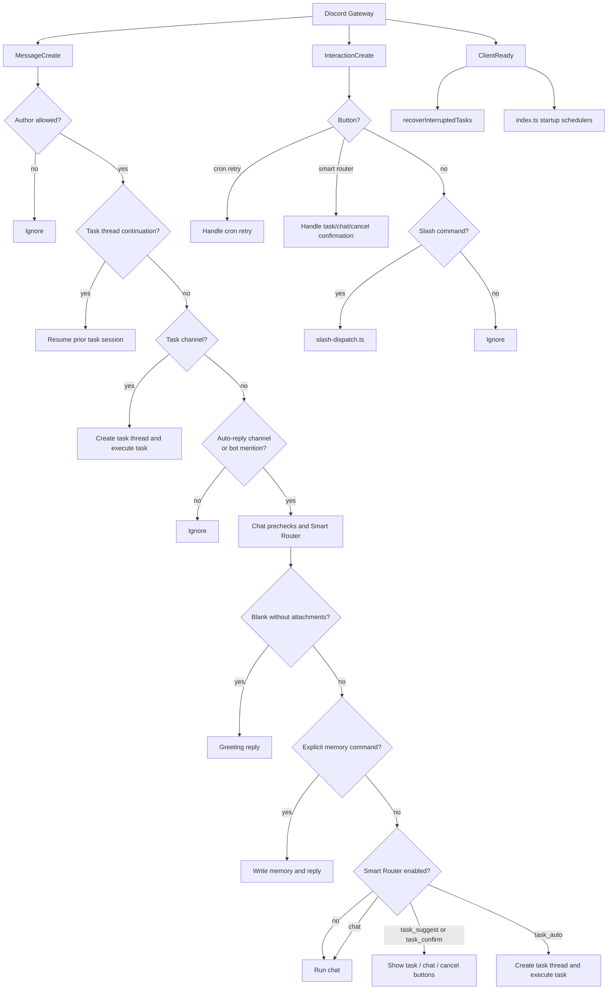
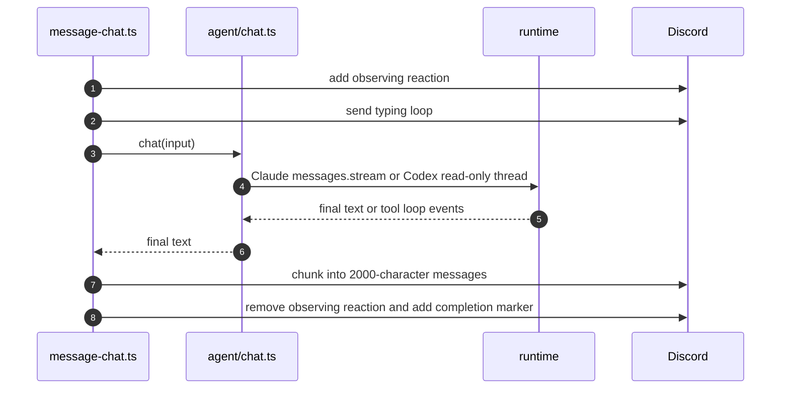

# Discord Bot Routing

> `src/bot.ts` registers a small set of Discord event listeners and delegates all business routing into `src/bot/*`. This document is the current routing map for message intake, slash commands, button interactions, and task-thread continuation.

## Event Panorama



## Listener Responsibilities

| Location | Event | Responsibility |
|---|---|---|
| `createBot()` | `MessageCreate` | Compute the outer message route and delegate to `message-thread-continuation.ts`, `message-task-channel.ts`, or `message-chat.ts`. |
| `createBot()` | `InteractionCreate` | Delegate buttons to `button-dispatch.ts`, then slash commands to `slash-dispatch.ts`. |
| `createBot()` | `ClientReady` | Recover interrupted tasks after login. |
| `src/index.ts` | `ClientReady` | Start connectivity monitor, Auto Doctor scheduler, and cron scheduler. |

## MessageCreate Decision Chain

### Gate 1: Author

```ts
if (message.author.bot) return;
if (message.author.id !== config.allowedUserId) return;
```

E2E mode may allow configured test sender IDs. Production mode remains single-user by default.

### Path 1: Task Thread Continuation

Thread continuation wins before task-channel and chat routing. A message enters this path only when:

| Guard | Purpose |
|---|---|
| `isThread()` | Prevent normal channels from matching continuation logic. |
| `getTaskByThreadId(channel.id)` | Ensure the thread belongs to an existing task. |
| `session_id` exists | Ensure the previous task can be resumed. |
| `discord_user_id !== "cron"` | Prevent cron-created tasks from becoming a user's prior chat session. |

The handler adds a reaction, creates a new task row, and calls `executeTask({ resumeSessionId })` in the same Discord thread.

### Path 2: Task Intake Channel

If the channel is in `config.taskChannelIds`, a normal message is treated as `/task` input without requiring a mention. The handler deduplicates by `message.id`, parses the prompt and attachments, checks concurrency, creates a thread, writes the task row, sends the start embed, and calls `executeTask()`.

If a channel is both a task channel and an auto-reply channel, the task-channel path wins to avoid double processing.

### Path 3: Chat Candidate

A message becomes chat-eligible when the channel is in `config.autoReplyChannelIds`, `config.autoReplyChannelIds` contains `*`, or the bot was mentioned. The chat handler then:

1. Deduplicates by `message.id`.
2. Removes bot mentions from content.
3. Detects attachments.
4. Replies with a greeting when both text and attachments are empty.
5. Handles explicit memory commands before any LLM call.
6. Runs the Smart Router when enabled.
7. Falls through to `agent/chat.ts` when the final route is chat.

## Smart Router Actions

| Priority | Decision | Result |
|---|---|---|
| Precheck | Attachments present | Build attachment blocks and emit any notices. |
| High | Empty content and no attachments | Greeting reply, then return. |
| Medium | Explicit memory command | Write memory, reply success, then return. |
| Low | All other content | Smart Router decides chat, confirmation, or task auto-route. |

Smart Router button custom IDs contain only a short token, not the prompt. Confirmation state expires after a short window and does not survive process restart.

## InteractionCreate

Button dispatch runs before slash command dispatch:

1. `button-dispatch.ts` handles cron retry buttons.
2. `button-dispatch.ts` handles Smart Router confirmation buttons.
3. `slash-dispatch.ts` maps slash commands to `commands/handlers.ts`.

Top-level slash commands currently include:

- `/task`
- `/status`
- `/task-log`
- `/cron-runs`
- `/cron-run`
- `/health`
- `/doctor`
- `/incidents`
- `/incident`
- `/agent-config`
- `/cancel`
- `/resume`
- `/remember`
- `/forget`
- `/memories`

## Chat Runtime Feedback



Chat is intentionally read-oriented. Workspace writes, shell execution, Git operations, durable output, and multi-file coding work should go through task runtime.

Final Discord Markdown delivery uses the shared 2000-character chunker. Bare `https://...` links are collected into a final link-preview footer while body chunks suppress embeds, but Discord no-embed links wrapped as `<https://...>` keep their no-preview semantics and are not copied into that footer. This applies to chat replies, task results, Discord IM fanout, recovery replay, and script cron `DISCORD_MESSAGE` output; new Discord text-delivery paths should use the same helper instead of calling `channel.send()` with raw content. Cron prompts that publish many links should prefer the angle-bracket form when they want clickable links without preview cards.

## Safe Change Map

| Goal | Change Area |
|---|---|
| Add a slash command | `commands/register.ts`, `commands/handlers.ts`, and `src/bot/slash-dispatch.ts`. |
| Add a new button action | `src/bot/button-dispatch.ts`; avoid collisions with `miniclaw:smart:*` and `miniclaw:cron:retry:*`. |
| Add a task intake channel | Create a Discord channel, add its ID to `MINICLAW_TASK_CHANNELS` or YAML config, then restart. |
| Restrict normal chat to mentions only | Set `MINICLAW_AUTO_REPLY_CHANNELS=none` or `routing.auto_reply_channels: []`. |
| Enable natural-language task detection | Set `routing.smart_router.enabled: true`, then configure `confirm_channels` or `auto_task_channels`. |
| Disable thread continuation | Change the Path 1 continuation branch while preserving task-channel and chat routing. |
| Add a cron job | Add `~/.miniclaw/cron/<name>.yaml`; code changes are not required. |
