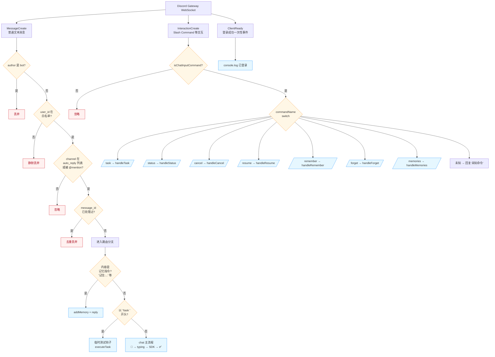
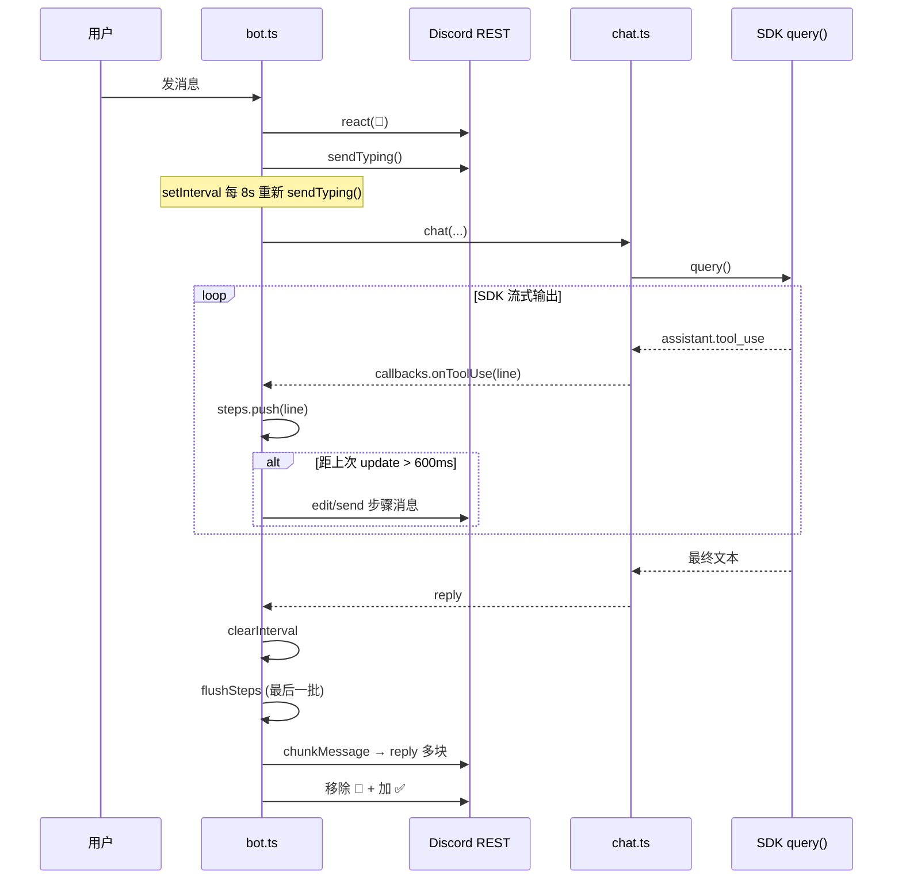
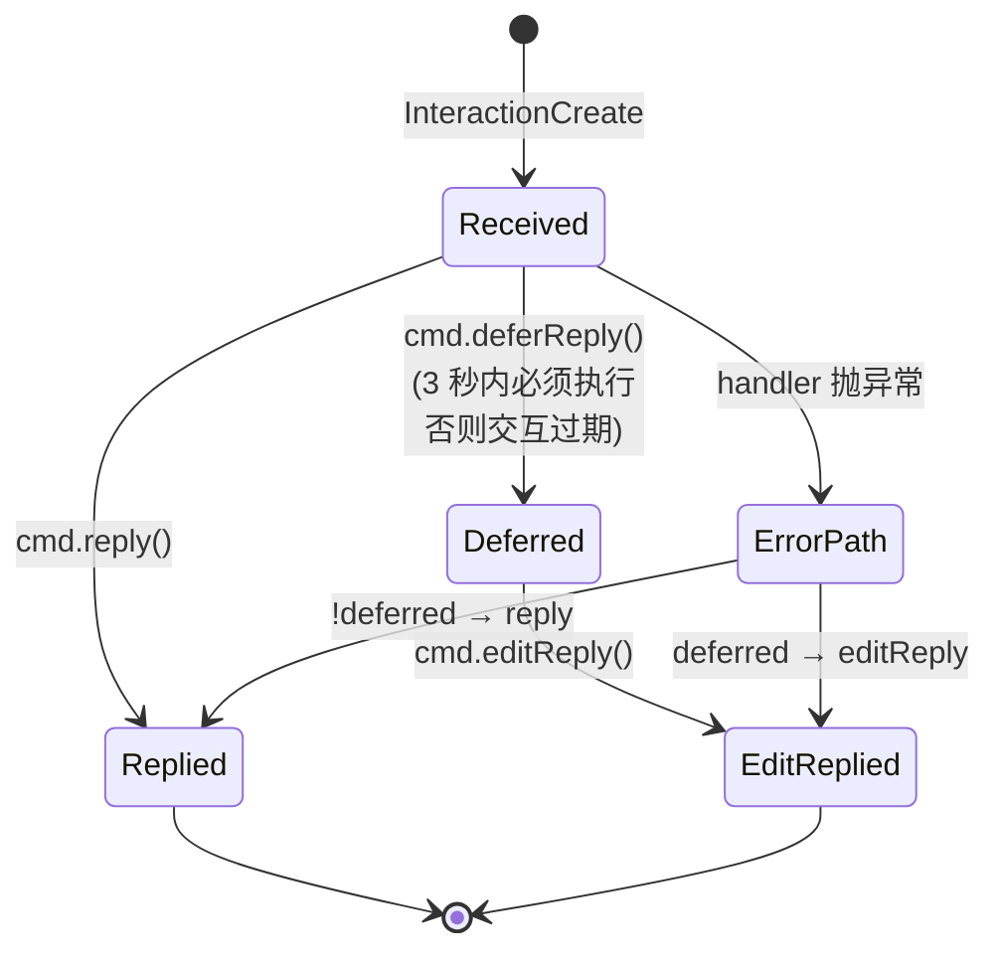

# `src/bot.ts` 消息路由全解析

> 整个文件只注册了 **3 个 Discord 事件监听器**，每个负责一类消息。
> 看完这一篇你就能改出新的触发词 / 新命令 / 新过滤规则。

---

## 全景图



---

## 三个监听器分别在哪

| 行号 | 事件 | 干什么 |
|------|------|--------|
| `bot.ts:31` | `MessageCreate` | 处理 #chat / @mention / `!task` |
| `bot.ts:141` | `InteractionCreate` | 处理 `/xxx` slash commands |
| `bot.ts:182` | `ClientReady` | 启动时打一行日志 |

---

## MessageCreate 的「四道闸 + 三岔路」

### 四道闸（按顺序短路）

| # | 行 | 闸 | 目的 |
|---|----|----|------|
| 1 | `:32` | `author.bot` 拒 | 防止 bot 跟 bot 互相回复死循环 |
| 2 | `:33` | `author.id !== allowedUserId` | 单用户限制（私人助手） |
| 3 | `:35-37` | 不在 auto_reply 频道 **且** 没被 @ | 频道白名单 + @mention 双触发 |
| 4 | `:39-46` | `processed` Map 去重 | 防止 Discord 重发同一条 message_id 时**双跑**；带 5 分钟 TTL，超过 500 条做老化清理 |

### 内容预处理（`:48-50`）

```ts
content = message.content.replace(/<@!?{botId}>/g, "").trim()
```

把 `<@1498197...>` 这种 mention 标记从原文里抹掉，下游看到的是纯净文本。空 content 直接回 "你好！"。

### 三条业务岔路（按优先级 if-else 短路）

| 优先级 | 行 | 判断 | 走向 |
|--------|----|------|------|
| **高** | `:57-62` | `parseExplicitMemory` 命中（"记住: xxx" 之类） | 写 SQLite → reply ✅ → return |
| **中** | `:67-82` | content 以 `!task ` 开头 | **临时测试钩子** — 走 `executeTask`（`/task` 的全流程，不经过 slash command 系统） |
| **低** | `:84-138` | 其他所有内容 | 进入 chat 主流程 |

> ⚠️ **`!task` 钩子的存在很关键**：注释写着 `[TEMP TEST HOOK]`，这是绕过 Discord slash command 注册延迟、用纯文本快速测试 `/task` 逻辑的后门。**正式使用应该用 `/task`**，这块代码以后可能会删。

### chat 主流程（`:84-138`）—— 视觉反馈很重的一段

```
react(👀)               ← 立即给反馈，让你知道收到了
  ↓
sendTyping() 每 8s     ← Discord 的"正在输入..."要循环刷新
  ↓
chat() 调 SDK           ← 这才是真正的 LLM 调用
  ├─ onToolUse 回调 → flushSteps() 编辑"步骤消息"（节流 600ms）
  └─ 返回最终文本
  ↓
chunkMessage 切 2000 字  ← Discord 单消息上限
  ↓
逐块 reply()
  ↓
移除 👀 + 加 ✅          ← 完成态
```

**进度反馈的微观时序**：



异常路径：catch → 移除 👀 + 加 ❌ + reply "回复出错"。

---

## InteractionCreate 的简单 switch（`:141-180`）

只处理 `isChatInputCommand`（即 slash command），其他交互（按钮、菜单）目前不处理。

7 个 case 都是**直接转发到 `commands/handlers.ts`** 的 7 个 handler，bot.ts 自己不做业务逻辑。

错误处理（`:172-179`）有个小细节：要根据 `cmd.deferred || cmd.replied` 决定用 `editReply` 还是 `reply` —— 因为 handler 可能已经 `deferReply()` 过了（耗时任务必须在 3 秒内 defer，否则交互过期）。



---

## 路由设计的几个聪明决定

1. **去重 Map 在内存里**（`processed`）—— 简单粗暴够用；分布式去重要 Redis，但单机单进程没必要
2. **Memory 指令优先级最高** —— "记住 xxx" 直接进库不调 LLM，零延迟、零费用
3. **`!task` 后门** —— 开发期不用每次改命令都 `pnpm register`
4. **chat 默认走 chat 而非 task** —— 默认的轻量回答 ≠ 写代码任务，符合用户预期；要执行任务必须显式 `/task`

---

## 想改路由时的几个常见场景

| 想做什么 | 改哪里 |
|----------|--------|
| 加一个**新触发词**（如 `!search xxx`）| `bot.ts:67` 之后再加 `if (content.startsWith("!search "))` |
| 让 bot **不响应某个频道** | 把该频道 ID 从 `MINICLAW_AUTO_REPLY_CHANNELS` 拿掉，且别 @ 它 |
| 加**多用户支持** | 把 `config.allowedUserId` 改成数组，`:33` 改 `includes` 判断 |
| 加**新 slash command** | `register.ts` 加定义 → `handlers.ts` 加 handler → `bot.ts:146` 加 case |
| 让 bot 响应**按钮点击** | 在 `InteractionCreate` 里加 `interaction.isButton()` 分支 |

---

## 相关文档

- [`architecture.md`](architecture.md) — 系统架构图 + 整体时序图
- `src/agent/chat.ts` — chat 主流程的 LLM 调用细节
- `src/agent/task.ts` — `/task` Supervisor 模式细节
- `src/commands/handlers.ts` — 7 个 slash command 的实现
