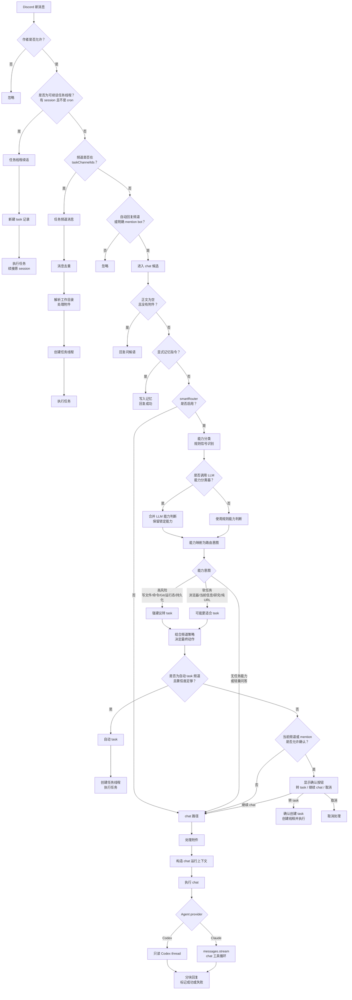

# MiniClaw Chat Router Current Logic

> Snapshot: 2026-05-11.
> This document describes the code path that currently decides whether an inbound Discord message is ignored, handled as chat, converted into a task, or resumed in an existing task thread.

## Conclusion

MiniClaw 的 chat router 不是一个单点判断，而是两层路由：

1. `src/routing/message-route.ts` 先做硬分流：`ignore`、`thread_continuation`、`task_channel`、`chat`。
2. 只有已经进入 `chat` 的消息，才会在 `src/routing/intent.ts` 里走 smart router，把自然语言请求进一步判成 `chat`、`task_suggest`、`task_confirm` 或 `task_auto`。

当前默认倾向是保守的：明确写文件、运行命令、Git、运行态排查、持久化输出会进 task；普通解释、总结、轻量分析留在 chat；浏览器、当前信息、多步研究、URL-only 等软信号通常只给 task suggestion。

## 路由流程图



## Code Map

- `src/bot.ts`: Discord `MessageCreate` / button interaction 的主编排。
- `src/routing/message-route.ts`: 外层 message route，决定是否进入 thread continuation、task channel、chat 或 ignore。
- `src/routing/intent.ts`: smart router 的 deterministic heuristic、capability 到 route intent 的映射、频道策略。
- `src/routing/llm.ts`: 可选 LLM capability classifier，只判断能力需求，不直接决定最终 route。
- `src/routing/confirmations.ts`: smart router 按钮确认的 10 分钟内存态。
- `src/discord/task-intake.ts`: task 创建、thread 创建、DB 写入、`executeTask()` 启动。
- `src/agent/chat.ts`: 真正执行 chat 的 Claude / Codex 分支。
- `src/routing/context.ts`, `src/routing/task-context.ts`, `src/routing/chat-context.ts`: recent chat、source metadata、reply parent context 注入。

## Layer 1: Discord Message Route

入口在 `src/bot.ts` 的 `Events.MessageCreate`。第一层 route 由 `resolveDiscordMessageRoute()` 计算，优先级固定如下。

### 1. Author Gate

先判断作者是否允许：

- 普通运行态：只允许 `config.allowedUserId`，bot 自己或其他用户直接 `ignore`。
- E2E mode：允许 `config.e2e.senderUserIds`，其中 bot author 也只在 E2E mode 下允许。

实现点：`src/e2e/safety.ts:isAllowedDiscordMessageAuthor()`。

### 2. Thread Continuation

满足以下条件时返回 `thread_continuation`：

- 当前 Discord channel 是 thread。
- `getTaskByThreadId(channel.id)` 能找到 task。
- 找到的 task 有 `session_id`。
- `discord_user_id !== "cron"`，避免 cron 产生的记录被误当成用户续话。

命中后，MiniClaw 会：

- 加 `🔄` reaction。
- 新建一个 task row。
- 构造 source metadata 和 reply parent context。
- 调 `executeTask({ resumeSessionId: continuableTask.session_id })` 续上原 session。

这个路径优先于 task channel 和 chat channel。

### 3. Task Channel

如果当前 channel 在 `config.taskChannelIds` 中，返回 `task_channel`。

命中后普通消息直接变成 task：

- 去重 `message.id`。
- 移除 bot mention 后取正文；只有附件时 prompt 用 `请处理这些附件`。
- 检查 `maxConcurrentTasks`。
- 按 channel default 或 default cwd 解析工作目录。
- `message.startThread()` 创建 task thread。
- `createAndRunDiscordTask()` 写 DB、发 status embed、启动 `executeTask()`。

如果一个 channel 同时在 task channel 和 auto-reply channel 中，task channel 优先。

### 4. Chat Eligible

如果未命中前两类，满足任一条件时返回 `chat`：

- `config.autoReplyChannelIds` 包含 `*`。
- `config.autoReplyChannelIds` 包含当前 channel id。
- 消息明确 mention 了 bot。

否则返回 `ignore`。

当前本机运行配置的关键点是：`auto_reply_channels` 是 wildcard，smart router enabled，`confirm_channels` 也是 wildcard，`auto_task_channels` 为空。因此绝大多数允许用户发出的普通 channel 消息都会先进入 chat eligible，再由 smart router 判断是否弹 task 按钮；不会自动创建 task，除非以后配置 auto-task channel。

## Layer 2: Chat Entry Prechecks

进入 `chat` route 后，`src/bot.ts` 继续做本地短路判断：

1. 对 `message.id` 做内存去重。Map 上限 500 条，旧记录按 5 分钟窗口清理。
2. 移除 bot mention，得到 `content`。
3. 收集附件，但此时尚未解析附件内容；smart router 只知道 `hasAttachments`。
4. 如果没有正文也没有附件，直接回复问候语并 return。
5. 如果命中显式记忆指令，调用 `parseExplicitMemory()` 和 `addMemory()`，直接写 memory 并 return。
6. 如果 `config.smartRouter.enabled`，进入 smart router。
7. 如果 smart router 最终决定继续 chat，才解析附件、加 `👀` reaction、发 typing、构造 chat runtime context、调用 `chat()`。

注意：附件内容不会参与 smart router 的文本分类。router 只拿到当前消息正文和 `hasAttachments` 布尔值。

## Smart Router: Capability Classification

`classifySmartRoute()` 先运行 deterministic heuristic，再按策略决定是否调用 LLM classifier。

### Heuristic Signal Groups

`TASK_SIGNALS` 是强 task 倾向：

- `runtime_diagnostics`: 任务失败、报错、排查、定位问题、debug、troubleshoot。能力：`needsRuntimeInspection`、`needsShell`。这是高风险能力。
- `modify`: 修复、修一下、改一下、修改、实现、重构、更新、加上、删除、迁移、改成、补上、落地、implement、fix、update、add、delete 等。能力：`needsFileWrite`。这是高风险能力。
- `docs_or_file`: README、docs、文档、文件、写到、创建文件、生成页面/报告等。能力：`createsPersistentOutput`。这是高风险能力。
- `capture_or_persist`: 抓取、采集、持续监控、输出到、落盘、导出、保存到文件/笔记/Obsidian 等。能力：`needsLongRunning`、`createsPersistentOutput`。其中持久化输出是高风险能力。
- `validation`: 跑测试、构建、编译、build、lint、typecheck、e2e 等。能力：`needsShell`、`needsLongRunning`。shell 是高风险能力。
- `execution`: 触发一次、部署、启动服务、重启、运行、执行、run/start/restart/deploy/trigger。能力：`needsShell`。这是高风险能力。
- `git`: commit、push、提交、推送、merge、rebase 等。能力：`needsGit`、`needsShell`。这是高风险能力。
- `complete_workflow`: 并验证、跑完后、完成后、end to end、实现并验证、fix test、update commit 等。能力：`needsLongRunning`。

`CHAT_SIGNALS` 是轻量 chat 倾向：

- `explain`: 解释、简述、讲讲、是什么、为什么、why、explain、describe。
- `summary`: 总结、概括、摘要、TLDR、summarize。
- `analysis`: 分析一下、对比、风险、方案、怎么看、compare、analyze。
- `knowledge`: 如何理解、补充背景、概念、设计是什么样。

`AMBIGUOUS_SIGNALS` 是软 task 倾向：

- `repo_analysis`: 深入分析 repo / 仓库 / 项目。
- `external_activity_research`: 当前或近期 GitHub activity、contribution、repo、PR、issue、release 等动态调查。
- `research`: 调研、研究一下、找方案、research、investigate。
- `test_word`: 测试一下、test this、try it。

URL 额外规则：

- 普通 URL 增加 `external_url`。
- 微信公众号链接或“公众号文章”增加 `wechat_article` 和 `browser_required`。
- 出现浏览器、登录态、动态加载、反爬、验证码、cookie、opencli、browser 等词，设置 `needsBrowser`。

### Confidence Rules

heuristic 的 confidence 规则大致如下：

- 空消息无附件：`0.9`，但上层已先问候，不进入正常 chat。
- 附件-only：`0.65`，默认仍可 chat。
- runtime diagnostics：`0.82`。
- 高风险能力或 task score >= 5：`0.68 + min(taskScore, 7) * 0.04`，最高 clamp 到 1。
- browser required：`0.7`。
- research/current/multi-step/long-running 软能力：`0.58`。
- 只有 chat signal、没有 task/ambiguous signal：`0.72 + min(chatScore, 6) * 0.04`。
- 其他无明显 signal：`0.55`，reason 为 `no capability signal found`。

### Capability To Intent

`resolveCapabilitiesToRouteDecision()` 将能力映射为 route intent。

高风险能力直接变 `task_confirm`：

- `needsFileWrite`
- `needsShell`
- `needsGit`
- `needsRuntimeInspection`
- `createsPersistentOutput`

软 task 能力变 `task_suggest`：

- `needsBrowser`
- `needsCurrentInfo && needsMultiStepResearch`
- `needsLongRunning`
- `needsMultiStepResearch`
- `hasExternalUrl && !hasChatSignal`

其他情况保持 `chat`。

这里的关键边界是：`needsCurrentInfo`、`needsMultiStepResearch`、`needsBrowser`、`needsLongRunning` 本身不算高风险，所以它们不会直接强制确认，只会 suggestion。

## Optional LLM Classifier

LLM classifier 在 `src/routing/llm.ts`，只输出 capability JSON，不回答用户问题，也不直接决定最终 route。

### 什么时候会调用

前提：

- `policy.enabled === true`
- `policy.llmClassifier.enabled === true`

如果 `onlyWhenAmbiguous === false`，只要前提满足就调用。

当前默认 `onlyWhenAmbiguous === true` 时，调用条件更窄：

- 没有任何 signal 且没有附件：不调用。
- 已有高风险能力且 confidence >= `0.75`：不调用，避免 LLM 降级写文件/运行命令等硬边界。
- `needsBrowser` 且 browser 是 locked capability：不调用，避免 LLM 降级微信/动态页面边界。
- 有 external URL、current info、多步研究、long-running：调用。
- confidence 低于 `minConfirmConfidence`：调用。
- 有 risk flags 且 confidence < `0.75`：调用。

### LLM 结果怎么合并

`mergeCapabilityDecisions()` 会保留 heuristic 的 locked capabilities。也就是说：

- heuristic 已经锁定的 `needsFileWrite`、`needsShell`、`needsGit`、`needsRuntimeInspection`、`needsBrowser`、`createsPersistentOutput` 不允许被 LLM 改成 false。
- LLM 可以升级软判断，比如把普通 URL 总结升级成 current multi-step research。
- LLM 也可以把未锁定的软 research 降级回 chat。
- LLM 失败时不会阻断消息；系统使用 heuristic，并在 `riskFlags` 增加 `classifier_failed`。

Codex provider 下的 classifier 使用 read-only Codex thread，关闭 web search 和 network，30 秒内超时；Claude provider 下使用 Anthropic messages API，temperature 0。

## Final Action Policy

`resolveSmartRouterAction()` 负责把 `task_suggest` / `task_confirm` 变成最终动作。

### Smart Router Disabled

如果 `policy.enabled === false`，所有 smart router decision 都被改回 `chat`。

### Chat / Ignore

如果 intent 已经是 `chat` 或 `ignore`，直接保持，不再按频道提升。

### Auto Task

只有满足全部条件才会自动创建 task：

- 当前 channel 在 `policy.autoTaskChannelIds`。
- confidence >= `policy.minAutoConfidence`。
- intent 是 `task_auto`，或 `defaultMode === "auto"`，或 intent 是 `task_confirm`。

当前本机 `auto_task_channels` 为空，因此不会自动创建 task。

### Confirmation Allowed

如果不是 auto task，需要看当前 channel 是否允许展示确认按钮：

- 消息 mention 了 bot：允许。
- `confirmChannelIds` 为空：允许所有 eligible chat channel。
- `confirmChannelIds` 包含 `*`：允许所有 eligible chat channel。
- `confirmChannelIds` 包含当前 channel id：允许。

不允许时，decision 会降回 `chat`，reason 追加 `channel is not configured for smart-router confirmation`。

### Confirm Or Suggest

允许 confirmation 后：

- `task_confirm` 保持 `task_confirm`，展示“转为 task / 继续 chat / 取消”按钮。
- `task_suggest` 保持 `task_suggest`，也展示同一组按钮，但文案更弱：可能更适合 task。
- 旧路径里只有没有 capabilities 的 decision 且 confidence 达标时，才会按 confidence 提升为 `task_confirm`；当前主分类路径都会带 capabilities，因此基本不会走这个提升分支。

## Action Execution Details

### `task_auto`

执行顺序：

1. 写 `smart_router_decisions`，`action_result=auto_task_start`。
2. 回复“已识别为 task，正在创建任务线程...”。
3. 加 `👀` reaction。
4. `createAndRunDiscordTask()` 创建 thread、写 `tasks`、发 status embed、启动 `executeTask()`。
5. 成功后把 decision log 更新为 `auto_task_created` 并写入 `created_task_id`。
6. 失败时更新 `auto_task_failed`，加 `❌` reaction 并回复错误。

### `task_suggest` / `task_confirm`

执行顺序：

1. 写 `smart_router_decisions`，`action_result=confirmation_pending`。
2. 保存 `PendingTaskConfirmation` 到内存 Map，默认 10 分钟过期。
3. Discord 回复按钮：`转为 task`、`继续 chat`、`取消`。

按钮处理：

- custom id 形如 `miniclaw:smart:<action>:<token>`，不携带 prompt。
- 只有原始用户可以操作。
- `cancel`: 更新 log 为 `cancelled`。
- `chat`: 更新 log 为 `continued_chat`，用原 prompt 继续 chat。
- `task`: 创建 task thread，成功后更新 log 为 `confirmed_task_created` 和 `created_task_id`。
- 进程重启后内存确认状态丢失，旧按钮会提示过期或 missing。

### `chat`

执行顺序：

1. 写 `smart_router_decisions`，`action_result=chat`。
2. 如果有附件，解析附件并发送 notice。
3. 加 `👀` reaction，每 8 秒刷新 typing。
4. 构造 `discord_message_context` 和可选 `reply_parent_context`。
5. 调用 `chat()`。
6. 分块 reply，移除 `👀`，加 `✅`。
7. 出错时移除 `👀`，加 `❌`，并回复格式化错误。

Codex chat 的当前实现使用 `codexThreadOptions("chat", config.defaultCwd)` 启动 read-only thread。channel-specific cwd 会进入 runtime context，但不是 Codex chat thread 的 working directory。task 路径才会把 resolved cwd 作为 `executeTask()` 的工作目录。

## Context Injection

smart router 创建 task 时默认只把当前消息作为任务指令。只有 prompt 明确引用最近上下文时，`buildSmartTaskPrompt()` 才会注入 recent chat：

- 触发词包括：刚才、上面、前面、上一条、之前、继续、基于你的分析、按上面、这个方案、you just、above、previous、continue、your plan 等。
- 注入内容包在 `<recent_chat_context trust="untrusted">` 中。
- 当前任务包在 `<user_task priority="current">` 中。

所有 task 路径都会尽量附带 source metadata：

- route type
- guild/channel/message 信息
- message URL
- cwd
- was mentioned
- attachments summary

如果用户是在 Discord reply 某条消息，系统还会捕获 reply parent context，同样以 untrusted context 注入。

## Decision Logging

smart router decision 会写入 SQLite `smart_router_decisions`：

- `message_id`, `channel_id`, `user_id`
- `prompt_hash`
- `prompt_preview`
- `full_prompt`，只有 `store_full_prompt=true` 时写入；当前本机为 false。
- `intent`, `confidence`, `reason`
- `matched_signals`, `risk_flags`
- `capabilities_json`
- `action_result`
- `created_task_id`

这张表是排查“消息 router 到哪里”的主证据。运行日志里的 `[bot] route decision ...` 只保留 channel 尾号、intent、confidence 和 signals；完整 prompt preview 要查 SQLite。

## Current Edge Cases From Real Prompts

### `steipete的1099 次贡献他是如何做到的？你能给我简单拆解一下吗？`

当前 classifier 输出：

- intent: `chat`
- confidence: `0.55`
- signals: `[]`
- reason: `no capability signal found`

原因：

- `external_activity_research` 现在主要识别 GitHub / contributions / commits / PR / issues / repos / 仓库 / 开发动态 / 今天 / 最近 等组合。
- 这个 prompt 只有中文“贡献”和“1099”，没有被当前 regex 识别成 GitHub current activity research。
- 没有 signal 且没有附件时，LLM classifier 不会被调用。

所以它会直接走 read-only chat。

### `stock-pulse中的当前持仓盘中快照 ... 加个 总的日内盈亏 ... 按照日内盈亏来排序`

当前 classifier 输出：

- intent: `chat`
- confidence: `0.55`
- signals: `[]`
- reason: `no capability signal found`

原因：

- `modify` signal 识别“修复、改一下、修改、实现、更新、加上、改成、补上”等词，但没有识别口语“加个”。
- “排序”本身也没有映射到 file write 或 provider/template 修改。
- 没有 signal 且没有附件时，LLM classifier 不会被调用。

所以它会进入 chat，chat agent 再在 read-only 模式下判断“需要改文件”，并要求用户改用 `/task`。

## Verification Commands

当前逻辑可以用这些命令验证：

```bash
pnpm exec tsx -e 'import { classifyMessageIntent } from "./src/routing/intent.ts"; const p="修改 README 并跑测试"; console.log(classifyMessageIntent({content:p, channelId:"chat-1"}));'
```

```bash
pnpm exec vitest run src/routing/__tests__/intent.test.ts src/routing/__tests__/message-route.test.ts src/routing/__tests__/router-eval.test.ts
```

```bash
sqlite3 ~/.miniclaw/data.db 'select id, message_id, channel_id, intent, confidence, action_result, created_task_id, prompt_preview from smart_router_decisions order by id desc limit 20;'
```

## Practical Implications

- 想稳定触发 task，不要只说“加个/排序/处理一下”；应明确写“修改/更新/实现/修复，并跑测试”。
- 想触发当前 GitHub activity research，prompt 里最好包含 GitHub、今天/最近、contribution/commit/PR/release 等词。
- 想让普通频道自动创建 task，必须配置 `routing.smart_router.auto_task_channels`，并满足 `min_auto_confidence`。
- 只要 `auto_task_channels` 为空，smart router 最多展示按钮，不会直接执行写权限任务。
- 当前 chat path 是轻量 read-only 体验；文件修改、运行验证、commit/push 应进入 task path。
