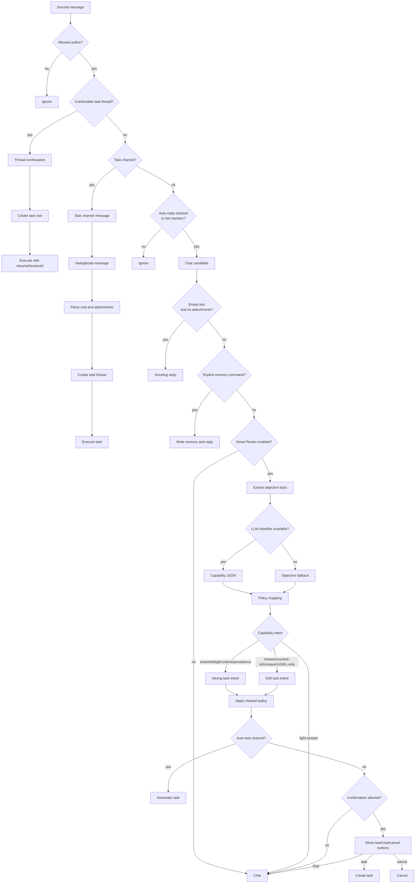

# MiniClaw Chat Router Current Logic

> Snapshot: 2026-05-15. This document describes the current code path that decides whether an inbound Discord message is ignored, handled as chat, converted into a task, or resumed in an existing task thread.

## Conclusion

MiniClaw's router has two layers:

1. `src/routing/message-route.ts` makes the hard Discord route: `ignore`, `thread_continuation`, `task_channel`, or `chat`.
2. Only messages that enter `chat` can reach `src/routing/intent.ts`, where Smart Router maps objective facts and optional LLM capability classification into `chat`, `task_suggest`, `task_confirm`, or `task_auto`.

The current policy is LLM-first but conservative. Regex task/chat signals no longer own the decision. Objective facts such as attachments, URL-only messages, and empty messages remain available as fallback facts when the classifier is disabled or unavailable.

Weixin direct has its own gateway path before this Discord hard route. It applies the Weixin allowlist, extracts text/voice/image inputs, then reuses the same Smart Router classifier for chat-vs-task decisions. When Smart Router says task for Weixin, MiniClaw always asks for y/n text confirmation instead of using Discord buttons or automatic task creation.

## Route Flow

The diagram above is the Discord message flow. Weixin direct enters after its own long-poll receive path: media extraction -> optional Smart Router classification -> y/n text confirmation for task-like prompts -> chat runtime or Weixin task view reporter.

## Code Map

- `src/bot.ts`: Discord event registration, client lifecycle, and outer message-route delegation.
- `src/bot/message-chat.ts`: memory commands, Smart Router, attachment processing, and chat response.
- `src/bot/message-task-channel.ts`: task-channel intake.
- `src/bot/message-thread-continuation.ts`: task thread continuation.
- `src/bot/button-dispatch.ts`: cron retry and Smart Router button dispatch.
- `src/bot/slash-dispatch.ts`: slash command dispatch.
- `src/routing/message-route.ts`: hard message route.
- `src/routing/intent.ts`: objective facts, capability-to-route mapping, and channel policy.
- `src/routing/llm.ts`: optional LLM capability classifier.
- `src/routing/confirmations.ts`: short-lived Smart Router confirmation state.
- `src/discord/task-intake.ts`: task creation and `executeTask()` entry.
- `src/im/adapters/weixin/gateway.ts`: Weixin allowlist, media extraction, Smart Router y/n confirmation, direct chat, and direct task execution.
- `src/agent/chat.ts`: actual chat runtime execution.
- `src/routing/context.ts`, `src/routing/task-context.ts`, `src/routing/chat-context.ts`: recent context and source metadata.

## Layer 1: Discord Message Route

### Author Gate

Production mode accepts only `config.allowedUserId`. Bot-authored messages and other users are ignored. E2E mode can allow configured test sender IDs.

### Thread Continuation

`thread_continuation` is returned only when the current channel is a thread, the thread maps to an existing task, the task has a `session_id`, and the task was not created by cron. MiniClaw then creates a new task row and calls `executeTask({ resumeSessionId })`.

### Task Channel

`task_channel` is returned when the current channel ID is in `config.taskChannelIds`. The message becomes a task prompt. Attachment-only prompts use the default attachment handling prompt. The handler checks concurrency, creates a thread, writes DB state, emits a start embed, and starts `executeTask()`.

### Chat Eligible

`chat` is returned when the bot was mentioned or the current channel is allowed by `config.autoReplyChannelIds`. If none of those conditions apply, the route is `ignore`.

The current common local-machine setup uses wildcard auto-reply channels with Smart Router enabled, no auto-task channels, and configured confirmation channels. That means many messages first become chat candidates, then Smart Router decides whether to show task confirmation.

## Layer 2: Chat Entry Prechecks

After a route becomes `chat`, `src/bot/message-chat.ts` applies local short-circuits:

1. Deduplicate by `message.id`.
2. Remove bot mentions from text.
3. Collect attachment metadata.
4. Reply with a greeting when there is no text and no attachment.
5. Execute explicit memory commands through `parseExplicitMemory()` and `addMemory()`.
6. Enter Smart Router if enabled.
7. If the final route remains chat, process attachments, add feedback reactions, send typing, and call `chat()`.

Attachments are represented to the classifier only as objective facts. Attachment content is processed later by the selected runtime path.

## Smart Router Capability Classification

`classifySmartRoute()` extracts objective facts first and then calls an LLM classifier whenever policy allows.

Objective facts include:

- `empty_message`
- `attachments` / `hasAttachments`
- `external_url` / `hasExternalUrl`
- `url_only` / `isUrlOnly`

The objective layer does not infer natural-language intent from words such as "modify", "sort", "summarize", or "research". Those semantic judgments belong to the classifier.

The classifier:

- outputs JSON only
- does not answer the user
- does not browse, fetch URLs, read files, or run commands
- judges required capabilities rather than final route
- maps coding, persistence, shell, Git, and runtime changes toward task confirmation

Example intents:

- A prompt asking how a contributor achieved many contributions should set `needs_current_info=true` and `needs_multi_step_research=true`.
- A prompt asking to add and sort a field in `stock-pulse` should set `needs_file_write=true`.

## Provider Selection For The Classifier

The classifier uses the lightweight model client layer, not the task runtime:

- When `routing.smart_router.llm_classifier.provider` is unset, Smart Router prefers `model.default_client`.
- `provider: auto` tries Anthropic-compatible config first, then OpenAI-compatible config, then Codex only if configured to do so.
- `provider: raven` or `provider: anthropic` forces the Anthropic Messages API path.
- `provider: openai` requires `OPENAI_API_KEY`.
- `provider: openai_compatible` requires `OPENAI_BASE_URL`; `OPENAI_API_KEY` is optional when the server does not require bearer auth.
- `provider: codex` forces the legacy read-only Codex classifier path.

Classifier failure falls back to objective facts and records the failure reason. Routing should not fail only because the classifier is unavailable.

## Route Mapping

| Capability | Default Intent |
|---|---|
| file writes, shell, Git, runtime state, durable output | `task_confirm` |
| browser/current info, multi-step research, URL-only requests | `task_suggest` |
| light Q&A, explanation, simple reading | `chat` |
| configured auto-task channel with strong task intent | `task_auto` |

Discord channel policy decides whether a task intent becomes automatic task creation, confirmation buttons, or fallback chat. Weixin treats `task_auto`, `task_confirm`, and `task_suggest` as "ask by text first"; `y` creates a task, `n` continues chat, and cancel words discard the pending confirmation.

## Known Boundaries

- Smart Router does not read attachment content before routing.
- Confirmation state is process-local and short-lived.
- The classifier judges capability requirements, not user value or answer quality.
- Discord `/task` and task-channel intake bypass Smart Router because the user or channel already selected task mode.
- Weixin `/task ...` still asks for y/n confirmation so the mobile chat surface has one reversible task conversion path.
- Chat remains read-oriented even when the model can reason about code; workspace-changing work must go through task mode.
