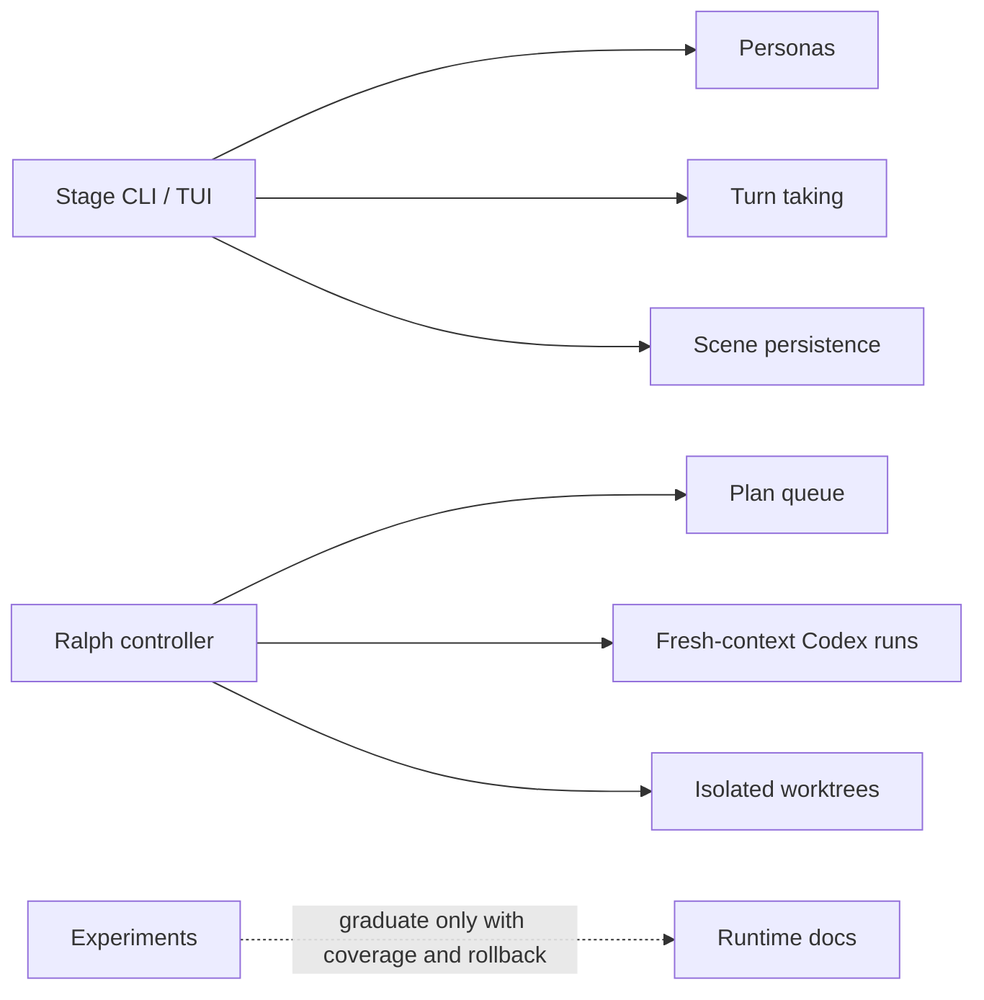

# MiniClaw Experiments

> Conclusion: experiments validate future runtime patterns, but they are not default MiniClaw product behavior. This directory separates experimental control planes from stable runtime and provider docs.

## Experiment Map



## Stage

Owner code paths:

```text
src/stage/**
personas/**
pnpm stage
pnpm stage:smoke
```

Purpose:

- Stage is an experimental CLI/TUI multi-agent console for persona, turn-taking, transcript, and scene-management research.
- It runs outside the Discord bot process and should not become the default task path by accident.
- It can reuse MiniClaw runtime contracts and model clients, but Stage persona state, TUI state, and orchestrator rules are experimental.

Current behavior:

- Starts an Ink TUI through `pnpm stage`.
- Loads persona files from `personas/`.
- Supports slash-like commands for summoning/dismissing participants, showing roster/cost, saving/loading scenes, and controlling auto mode.
- Persists scenes separately from default chat/task state.
- Enforces anti-loop, budget, and turn-cap guards.

Boundary contract:

- Stage can experiment with multi-agent UX, but it must not mutate normal Discord task routing.
- Stage promotion requires normal runtime coverage, rollback semantics, and docs outside `docs/plans/**`.
- Stage smoke/e2e checks should stay separate from default bot startup.

## Ralph Controller

Owner docs and code paths:

```text
docs/ralph/README.md
docs/ralph/queue.json
docs/ralph/learnings.md
scripts/ralph-run.ts
scripts/ralph-loop.ts
scripts/ralph-verify.ts
```

Purpose:

- Ralph is a thin controller for plan-based Codex work with fresh context.
- It is external to the bot runtime and does not modify live MiniClaw state.
- It serializes selected plan tasks through isolated worktrees and verification profiles.

Execution model:

```text
queue task
  -> fresh codex exec --ephemeral context
  -> isolated worktree / branch
  -> verification profile
  -> commit task branch
  -> optional integration-safe merge / push-main
```

Boundary contract:

- One plan task per Codex run.
- Raw run logs stay local and ignored under `.ralph/`.
- Durable learnings are append-only in `docs/ralph/learnings.md`.
- `ralph:loop --merge-main --push-main` must fetch/rebase/reverify and use lease-aware push behavior.
- Ralph is an automation controller, not a Discord-facing feature.

## Legacy Compatibility

The previous feature-level experiment docs are compatibility stubs for one migration cycle:

- [`../archive/features/01-stage.md`](../archive/features/01-stage.md)
- [`../archive/features/15-ralph-controller.md`](../archive/features/15-ralph-controller.md)

New implementation facts should be added here or to `docs/ralph/**`, not to the stubs.

## Graduation Rule

An experiment can move into runtime docs only after its code path is enabled in normal MiniClaw execution, has rollback semantics, has quality coverage, and has source-of-truth docs outside `docs/plans/**`.

Verification owner:

```bash
pnpm vitest run src/stage
pnpm ralph:verify -- --task <task-id>
pnpm run quality:docs
```
