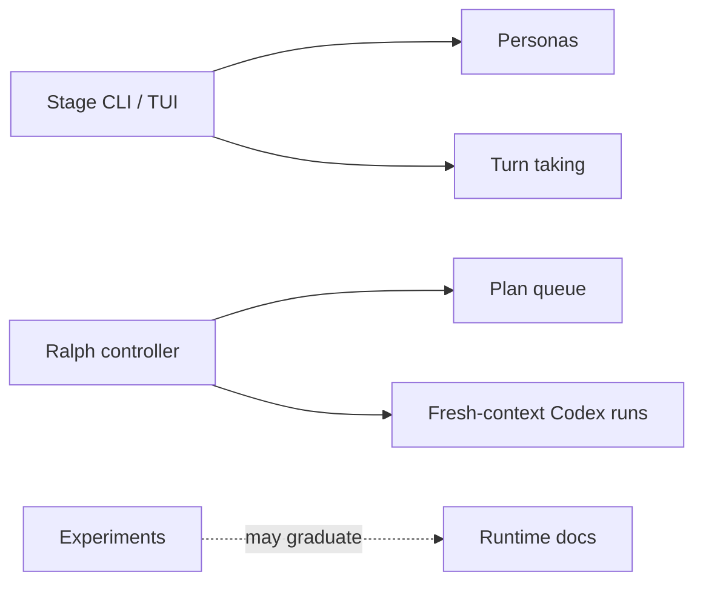

# MiniClaw Experiments

> Conclusion: experiments are useful for validating future runtime patterns, but they are not default product behavior. This directory separates experimental control planes from stable runtime and provider docs.

## Experiment Map

## Current Experiments

- [`../features/01-stage.md`](../features/01-stage.md): Stage experimental CLI multi-agent console.
- [`../features/15-ralph-controller.md`](../features/15-ralph-controller.md): Ralph plan-based fresh-context execution controller.
- [`../ralph/README.md`](../ralph/README.md): Ralph local queue and operating notes.

## Graduation Rule

An experiment can move into runtime docs only after its code path is enabled in normal MiniClaw execution, has rollback semantics, has quality coverage, and has source-of-truth docs outside `docs/plans/**`.
