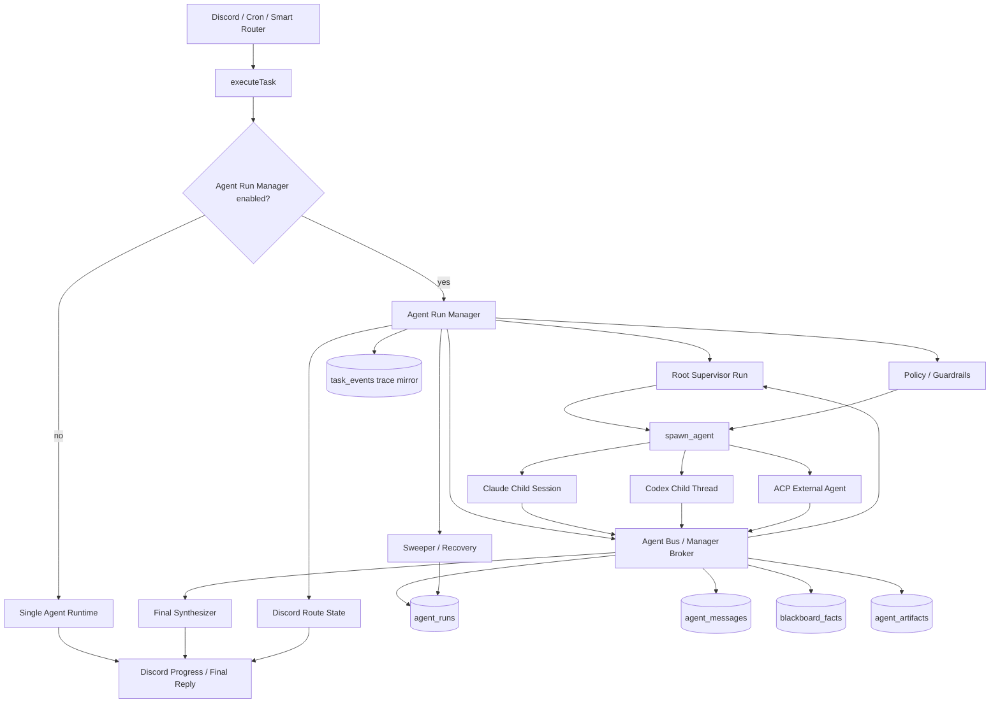

# MiniClaw Agent Run Manager Design

Status: completed-foundation
Date: 2026-05-14

## Background

MiniClaw already has an `AgentRuntime` abstraction that wraps Claude, Codex, and fake task runners behind a common coding-agent runtime. The existing `/task` multi-agent behavior was uneven:

- Claude could use Claude Agent SDK native `agents` and the `Agent` tool.
- Codex only received a Supervisor prompt and had no SDK-level child-agent registry, mailbox, blackboard, or child-run state.
- `task_events` captured trace facts, but it was an observation layer, not a safe transport for agent-to-agent collaboration.

The goal was not to turn MiniClaw into a generic agent marketplace. The goal was to add a controlled Agent Run Manager inside the existing Discord, cron, and task runtime, with a minimal ACP-compatible bus/server so the root agent, child agents, and optional external ACP-style agents can exchange structured messages, artifact references, and blackboard facts.

## Goals

- Give Supervisor and child agents two-way structured communication instead of passing full prior outputs through prompts.
- Provide a uniform managed multi-agent execution model for Claude and Codex.
- Support typed messages such as `finding`, `question`, `answer`, `challenge`, `handoff`, and `verdict`.
- Use artifact references for large diffs, research reports, logs, and provider payloads.
- Enforce per-agent runtime, sandbox, write permission, budget, timeout, loop, and cancellation policy.
- Support task-scoped dynamic child runs under one Discord bot account.
- Preserve existing `/task`, cron task, Discord progress, and `task_events` observability.

## Non-Goals

- Do not make every task multi-agent by default.
- Do not build a public agent marketplace, full agent discovery catalog, or multi-tenant hosting platform.
- Do not create multiple Discord bot identities for child agents.
- Do not let child agents bypass MiniClaw Manager and talk to each other indefinitely.
- Do not treat long-term memory as the task blackboard. Memory is cross-task knowledge; blackboard state is single-task collaboration state.
- Do not move Stage persona or TUI orchestration into the Discord task path.

## Existing Architecture Evidence

- `src/runtime/agent-runtime.ts` defines `AgentRuntime.startTask()`, `resumeTask()`, and `startChat()`.
- `src/agent/task.ts` owns task lifecycle, abort handling, DB state updates, Discord view reporting, and trace callback wiring.
- `src/agent/runners/claude-task-runner.ts` already supports Claude native subagent behavior.
- `src/agent/runners/codex-task-runner.ts` previously injected only a Supervisor prompt.
- `src/store/task-events.ts` writes task trace facts but does not model agent runs, mailboxes, artifacts, or blackboard state.
- `agents/*.md` remains the role definition source for managed child prompts and permissions.

## Target Execution Model

MiniClaw's target is **single Discord account, task-scoped dynamic spawn**, not gateway-wide multi-account routing.

- One chat, `/task`, or cron-triggered task creates one root `agent_run` with `role="supervisor"`.
- The Supervisor can spawn child runs such as `researcher`, `planner`, `generator`, and `evaluator`.
- Child runs are internal MiniClaw runtime sessions with their own context, tool profile, budget, timeout, artifacts, and mailbox.
- All visible Discord updates are emitted by MiniClaw from the root route state. Child raw transcripts are not sent directly to Discord.
- Child completion and peer messages return through Manager-owned bus state, not polling or direct prompt mutation.

The model borrows from OpenClaw's run/session lifecycle, push completion, `sessions_yield` pattern, active child context, depth/fan-out guardrails, and ACP adapter boundary. MiniClaw keeps the collaboration contract as typed Manager-routed messages rather than gateway-wide persona routing.

## Proposed Architecture



The Manager sits inside `executeTask()` between the task lifecycle and provider-specific runtimes. Normal tasks keep the single-agent path. A task enters the managed path only when explicitly enabled or when the auto classifier selects it.

## Locked First-Phase Decisions

- **Manager placement**: Agent Run Manager is an `executeTask()` internal orchestration layer, not a new `AgentRuntime`.
- **Feature flag**: `agent_run_manager.enabled` defaults to `false`; normal `/task`, cron task, and chat behavior remain unchanged when disabled.
- **Runtime mode**: Claude native `Agent` remains a compatibility path; MiniClaw-managed child runs are the source of truth.
- **Bus transport**: Manager API, MCP tools, and ACP endpoints are the agent-facing transport. SQLite is durable append and recovery state, not the live collaboration transport.
- **Context mode**: child runs default to `context_mode="isolated"`; `fork` is explicit.
- **Route state**: only the root run/Manager owns Discord channel, thread, and message state.
- **ACP scope**: phase one exposes only the minimal local ACP-compatible adapter/server. No marketplace, remote discovery, or multi-tenant hosting.
- **Loop control**: parent-owned child completion and peer-to-peer typed messages are separate paths with bounded return behavior.

## Data Model

### `agent_runs`

Records each root, child, or external managed execution entity.

```ts
type AgentRunStatus =
  | "queued"
  | "running"
  | "waiting"
  | "completed"
  | "failed"
  | "cancelled";

type AgentContextMode = "isolated" | "fork";
type AgentControlScope = "root" | "child" | "peer";

interface AgentRun {
  id: string;
  task_id: string;
  parent_run_id?: string;
  controller_run_id?: string;
  requester_run_id?: string;
  role: "supervisor" | "researcher" | "code-investigator" | "planner" | "generator" | "evaluator" | string;
  runtime: "claude" | "codex" | "external-acp";
  provider_session_id?: string;
  status: AgentRunStatus;
  spawn_depth: number;
  control_scope: AgentControlScope;
  context_mode: AgentContextMode;
  cwd: string;
  tool_policy_id: string;
  can_spawn: boolean;
  can_write_workspace: boolean;
  can_send_kinds: string[];
  can_receive_kinds: string[];
  started_at: string;
  completed_at?: string;
  error_message?: string;
}
```

Key requirements:

- The root run owns Discord route state.
- `spawn_depth`, `control_scope`, and `can_spawn` prevent unbounded child creation.
- `can_send_kinds` and `can_receive_kinds` are enforced by Manager, not only described in prompts.

### `agent_messages`

Main durable channel for task-scoped structured communication.

```ts
type AgentMessageKind =
  | "finding"
  | "question"
  | "answer"
  | "challenge"
  | "decision"
  | "handoff"
  | "artifact"
  | "verdict"
  | "error";

interface AgentMessage {
  id: string;
  task_id: string;
  from_run_id: string;
  to_run_id?: string;
  kind: AgentMessageKind;
  content_text?: string;
  payload_json?: unknown;
  artifact_ids?: string[];
  causal_message_id?: string;
  created_at: string;
}
```

### `blackboard_facts`

The blackboard stores only Manager-accepted facts, decisions, and current state. It does not store every raw transcript line.

```ts
interface BlackboardFact {
  id: string;
  task_id: string;
  key: string;
  content: string;
  source_message_id: string;
  confidence: "low" | "medium" | "high";
  status: "active" | "superseded" | "rejected";
  created_at: string;
  updated_at: string;
}
```

### `agent_artifacts`

Large outputs are referenced as artifacts. Messages should carry artifact IDs and summaries, not full bodies.

```ts
interface AgentArtifact {
  id: string;
  task_id: string;
  run_id: string;
  kind: "markdown" | "json" | "diff" | "log" | "file_ref";
  path: string;
  title?: string;
  summary?: string;
  content_hash: string;
  created_at: string;
}
```

### `agent_scheduler_state`

Durable snapshot for root Supervisor orchestration, wait state, and recovery.

```ts
interface AgentSchedulerState {
  task_id: string;
  root_run_id: string;
  scheduler_version: string;
  status: "initialized" | "running" | "waiting" | "completed" | "failed" | "cancelled";
  current_step: string;
  wait_run_id?: string;
  wait_kinds: AgentMessageKind[];
  last_message_id?: string;
  plan_json: unknown;
  created_at: string;
  updated_at: string;
}
```

### Required Indexes

- `agent_runs(task_id, status, created_at)`
- `agent_runs(parent_run_id, status)`
- `agent_runs(requester_run_id, status)`
- `agent_messages(task_id, created_at)`
- `agent_messages(to_run_id, created_at)`
- `agent_messages(from_run_id, created_at)`
- `blackboard_facts(task_id, key, status)`
- `agent_artifacts(task_id, run_id, created_at)`
- `agent_scheduler_state(status, updated_at)`
- `agent_scheduler_state(root_run_id)`

Store repositories must expose typed APIs such as `createRun`, `updateRunStatus`, `appendMessage`, `readMailbox`, `upsertBlackboardFact`, `writeArtifact`, and `upsertAgentSchedulerState`. Manager code must not spell raw SQL inline.

## Communication Contract

Inter-agent communication must not degrade into "write SQLite and hope another agent polls it." The live path is Agent Bus through Manager API, MCP tools, or ACP endpoint. SQLite remains the durable log and recovery/audit source.

Recommended hot path:

```text
subagent A
  -> agent_bus.send_message(JSON)
  -> Agent Run Manager validates schema, permissions, and target
  -> in-memory mailbox wakes subagent B or Supervisor
  -> SQLite append-only durable log
  -> artifact store keeps large object references
```

This keeps two guarantees:

- **Speed**: live messages wake waiting runs without DB polling.
- **Visibility**: each run receives a roster, allowed message kinds, and bus usage instructions.

### Direct JSON Message

Every message must include `from`, `to`, `kind`, `task_id`, and typed content.

```json
{
  "from": "researcher",
  "to": "planner",
  "kind": "finding",
  "task_id": "task-123",
  "content": {
    "summary": "Codex runner only injects a supervisor prompt; it does not register subagents.",
    "evidence": ["src/agent/runners/codex-task-runner.ts:26"]
  },
  "artifacts": []
}
```

### Bus Tools / API

- `list_agents()`
- `send_message(to, kind, payload, artifacts?)`
- `wait_for_message(filter, timeout_ms)`
- `read_mailbox(after_cursor?)`
- `publish_artifact(kind, title, content_or_path, summary?)`
- `read_artifact(artifact_id)`
- `list_blackboard()`
- `upsert_blackboard_fact(key, content, confidence, source_message_id)`

### Durable Envelope

Runtimes without live bus access can return a turn-end envelope as a compatibility fallback. This is not the target experience.

```json
{
  "messages": [
    {
      "kind": "finding",
      "content_text": "Codex child runtime needs managed threads for real child-agent behavior.",
      "payload_json": {
        "evidence": ["src/agent/runners/codex-task-runner.ts:26"]
      }
    }
  ],
  "artifacts": [
    {
      "kind": "markdown",
      "title": "Codex child-agent capability findings",
      "path": ".miniclaw-task/task-1/artifacts/run-2/findings.md"
    }
  ],
  "summary": "Codex path needs managed child threads for real child-agent behavior."
}
```

## Execution Flow

1. `executeTask()` checks `agent_run_manager.enabled` and auto-routing policy.
2. Manager creates a root `agent_run` with `role="supervisor"`.
3. Supervisor produces a structured orchestration plan.
4. Manager starts child runs with `spawn_agent(...)`; spawn is non-blocking and returns run metadata immediately.
5. Supervisor can enter `yield_until_child_event` or `wait_for_message`; Manager parks the root orchestration turn.
6. Child runs send typed JSON messages through Agent Bus.
7. Manager writes durable `agent_messages`, `agent_artifacts`, and `blackboard_facts`.
8. Evaluator `verdict=FAIL` may trigger a bounded generator fix loop.
9. Final Synthesizer reads active blackboard facts, artifacts, run status, and verdict signals to produce the user-facing result.
10. Manager mirrors critical status to `task_events`, `/task-log`, incident views, and trace export.
11. Sweeper handles stale active runs, waiting scheduler timeouts, orphan children, terminal cleanup, and restart recovery.

## Provider Strategy

### Claude

Claude native `Agent` remains available as a compatibility path, but Manager-owned `agent_runs`, `agent_messages`, `blackboard_facts`, and `agent_artifacts` are the source of truth.

### Codex

Each Codex child is a managed child thread. Planner/evaluator roles default to read-only policy; generator can receive workspace-write policy when explicitly allowed. Since Codex does not expose Claude SDK per-subagent tool registration, Manager must enforce sandbox, prompt, execution policy, and artifact/message boundaries.

### ACP Server And External Agents

ACP is a protocol adapter into Agent Bus, not the scheduler. The first phase is local by default, bearer-token protected, task-scoped, and not exposed as a public marketplace.

## Context Management

Agent Run Manager should reduce prompt growth:

- Supervisor does not copy full child output into the next child prompt.
- Child runs receive the original user goal, compact role brief, active blackboard facts, and needed artifact references.
- Large artifacts are passed by ID, title, kind, summary, and path/ref.
- Final synthesis reads blackboard facts, artifact metadata, messages, and verdicts without expanding all artifact bodies.

## Permission And Safety

- `generator` is the only default role allowed to write workspace files.
- `researcher`, `planner`, and `evaluator` are read-only by default.
- `code-investigator` may have Bash, but dangerous commands remain blocked by Manager policy.
- Every run has `max_turns`, `timeout_ms`, `max_messages`, `max_artifact_bytes`, and `max_fix_iterations`.
- Manager has `max_spawn_depth`, `max_children_per_run`, `max_concurrent_runs`, `max_ping_pong_turns`, and `cleanup_ttl_ms`.
- Root cancellation cascades to active child runs.
- Agents cannot write directly to each other's prompts, sessions, or SQLite state.
- Only redacted, user-facing conclusions should reach Discord.

## Discord And Trace UX

Only one Discord bot account is visible. Child agent presence is represented as compact task progress:

- `supervisor: plan created`
- `researcher: 3 findings`
- `planner: 5 implementation steps`
- `generator: changed 2 files`
- `evaluator: verdict PASS`

`task_events` remains the observation mirror, with Agent Run Manager event types such as:

- `agent_run_started`
- `agent_run_completed`
- `agent_message_posted`
- `blackboard_fact_upserted`
- `artifact_written`
- `verdict_received`
- `manager_route_decision`

## Implementation Plan

1. Add DB schema for `agent_runs`, `agent_messages`, `agent_artifacts`, `blackboard_facts`, and `agent_scheduler_state`.
2. Add typed store repositories; Manager must not write raw SQL inline.
3. Add `src/agent/run-manager/` with run registry, in-memory mailbox, artifact store, blackboard store, scheduler, and policy checks.
4. Add Agent Bus service API and MCP-compatible tool surface.
5. Add fake runtime E2E covering planner, generator, evaluator, typed messages, artifacts, blackboard facts, and final synthesis.
6. Integrate with `executeTask()` behind `agent_run_manager.enabled`.
7. Add Codex managed child thread support.
8. Add Claude managed child session support.
9. Add evidence-oriented Final Synthesizer.
10. Add local ACP-compatible server/adapter.
11. Add sweeper and restart recovery.
12. Add docs, trace export, and quality-gate coverage.

## Current Implementation Status

Snapshot date: 2026-05-15.

### Completed

- Schema tables and required indexes landed.
- Typed store APIs landed for runs, messages, mailbox, blackboard, artifacts, and scheduler state.
- Agent Bus core landed with direct in-memory wake plus durable append.
- Fake managed runtime E2E covers planner -> generator -> evaluator.
- `executeTask()` feature flag integration landed; default remains single-agent path.
- Turn-end envelope fallback landed for Claude/Codex child runs.
- Bounded evaluator fix loop and root cancellation cascade landed.
- Guardrail config and enforcement landed.
- Minimal local ACP adapter/server landed.
- `miniclaw-agent-bus` MCP-compatible tool surface landed with `pnpm run mcp:agent-bus`.
- Live MCP bus injection landed for real child runtimes.
- Dynamic scheduler / `yield_until_child_event` foundation landed.
- Runtime role policy enforcement landed for Codex and Claude child runs.
- Sweeper and restart recovery landed.
- Complexity classifier can route medium/high complexity tasks into the managed path when `agent_run_manager.auto_enabled=true`.
- C7 arbitrary DAG scheduler foundation landed.
- C8 evidence-rich final synthesizer landed.
- C9 multi-agent trace UX landed for `/task-log` and incident views.

### Partially Implemented

- LLM-generated DAG admission remains gated. C7 supports controlled opt-in DAG plans, but Planner auto-generated plans are not automatically admitted.
- Per-node DAG replay remains snapshot-based through `agent_scheduler_state.plan_json`; there is no independent node-state table yet.

### Not Yet Implemented

- Separate visual timeline UI for managed traces.
- Per-node `repeat_policy` execution in the DAG executor.

## Next Phase Plan

### C0 - Status and Slice Planning

- Keep this plan as the current implementation/status record.
- Keep future work sliced so runtime injection, scheduler changes, sweeper behavior, and ACP hardening stay reviewable.
- Verification: `pnpm run quality:docs`.

### C1 - Guardrails and Policy Enforcement

- Extend `agent_run_manager` policy config and env overrides as new limits are needed.
- Keep guardrails enforced in Manager spawn path and Bus path.
- Verification: config tests, Agent Bus tests, managed runtime tests, and `pnpm run build`.

### C2 - Live MCP Bus Injection

- Completed 2026-05-15.
- Keep turn-end envelope fallback available when live bus is unavailable.
- Verification: fake MCP bus fixture, Codex/Claude runner unit tests, and managed runtime fallback regression.

### C3 - Dynamic Scheduler and Yield/Resume

- Completed 2026-05-15.
- Current default remains planner -> generator -> evaluator plus bounded fix loop.
- Verification: dynamic spawn fixture, direct wake without polling, cancel during waiting, and fan-out regression.

### C4 - Role Policy Enforcement at Runtime Boundary

- Completed 2026-05-15.
- Continue negative tests for read-only planner/evaluator and positive tests for generator writes.
- Verification: per-role runner config tests and dangerous-command denial fixtures.

### C5 - Sweeper and Restart Recovery

- Completed 2026-05-15.
- Sweeper handles stale runs, orphan children, waiting scheduler timeout, and manager-owned artifact cleanup.
- Verification: stale run fixture, orphan child fixture, restart recovery simulation, and state cleanup dry run.

### C6 - ACP Lifecycle, Classifier Routing, and Docs Promotion

- Completed 2026-05-15.
- ACP remains localhost/token protected by default.
- Verification: ACP lifecycle tests, classifier routing tests, docs quality gate, and single-agent regression.

### C7 - Arbitrary DAG Scheduler

- Completed 2026-05-15.
- `managed-runtime-dag-v1` validates nodes, dependencies, depth, width, parallelism, and fail policy.
- Default managed path remains the fixed planner/generator/evaluator flow unless a scheduler plan is explicitly supplied.
- Verification: scheduler and managed-runtime tests plus `pnpm run build`.

### C8 - Evidence-Rich Final Synthesizer

- Completed 2026-05-15.
- Final output uses child run status, blackboard facts, artifact metadata, messages, verdicts, and verification signals.
- The synthesizer must state when no verification evidence exists.
- Verification: managed-runtime and final-synthesizer tests plus `pnpm run build`.

### C9 - Dedicated Multi-Agent Trace UX

- Completed 2026-05-15.
- `/task-log` includes a managed section only for managed tasks.
- Incident detail can summarize managed run state and point to full trace export.
- Verification: task trace export tests, task-log tests, incident detail tests, `pnpm run quality:docs`, and `pnpm run build`.

## Verification Plan

- Type/build: `pnpm run build`
- Unit: run-manager scheduler, managed-runtime, role-policy, bus, final-synthesizer, and store tests.
- Integration: fake managed runtime, ACP round trip, cancellation cascade, direct wake without DB polling.
- Regression: single-agent `/task` unchanged when Agent Run Manager is disabled.
- Docs: `pnpm run quality:docs`

## Risks And Rollback

- **Scope creep into a generic agent platform**: keep the first-party MiniClaw task roles and local SQLite state as the product boundary. Roll back with `agent_run_manager.enabled=false`.
- **Context cost rises instead of falls**: enforce artifact references, blackboard summaries, and per-role context budgets. Roll back to single-agent direct path for narrow tasks.
- **Codex role permissions are weaker than Claude native tool whitelist**: enforce sandbox mode, execution policy, and generator-only writes at Manager/runtime boundary.
- **Agent-to-agent loops**: enforce max message count, max fix iterations, explicit route decisions, and user escalation.

## Documentation Sync

- `docs/architecture.md`: Agent Run Manager controlled insertion layer, auto routing, ACP lifecycle, and guardrail status.
- `docs/prompts.md`: `miniclaw_agent_envelope` fallback and live Agent Bus MCP usage block.
- `docs/README.md`: Agent Run Manager plan is indexed under plans.
- `CHANGELOG.md`: release-visible Agent Run Manager and docs governance changes must be recorded.

## Execution Notes

- 2026-05-14: Initial design document created.
- 2026-05-15: OpenClaw research summarized as run/session lifecycle, push communication, typed message, guardrail, and ACP adapter references.
- 2026-05-15: MiniClaw first phase clarified as task-scoped dynamic spawn under one Discord bot account.
- 2026-05-15: Phase 2 C0-C6 landed: policy guardrails, live bus injection, scheduler wait/resume, role policy enforcement, sweeper/recovery, ACP lifecycle, and classifier routing.
- 2026-05-15: Phase 3 C7-C9 landed: controlled DAG scheduler foundation, evidence-rich final synthesis, and dedicated multi-agent trace UX.
