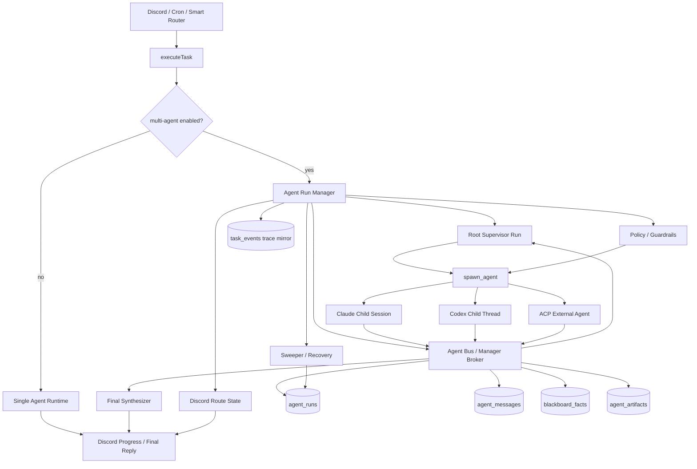

# MiniClaw Agent Run Manager 设计

Status: draft
Date: 2026-05-14

## Background

MiniClaw 当前已经有 `AgentRuntime` 抽象，可以把 Claude / Codex / fake task runner 包成统一的 coding-agent runtime。但现有 `/task` 多 agent 能力并不对称：

- Claude runner 通过 Claude Agent SDK 的 `agents` 和 `Agent` tool 接入 repo/user subagents。
- Codex runner 只把 Supervisor prompt 拼进输入，没有 SDK-level subagent 注册、mailbox、blackboard 或 child run 状态。
- `task_events` 已经能记录 trace，但它是观测层，不适合作为 agent 之间交换数据的主通道。

目标不是把 MiniClaw 改造成通用 agent marketplace，而是在现有 Discord / cron / task 体系内加入一个可控的 Agent Run Manager，并在第一阶段实现最小可用的 ACP-compatible agent bus/server，让主 agent、subagent 和外部 ACP-style agent 可以通过结构化 message、artifact 和 blackboard 交换数据。

## Goals

- 让 Supervisor 和 subagents 具备双向数据交换能力，而不是只靠 prompt 手工拼接上一个 agent 的全文输出。
- 对 Claude / Codex 提供统一的 managed multi-agent 执行模型，避免只依赖 Claude SDK native `Agent` tool。
- 支持 `finding` / `question` / `answer` / `challenge` / `handoff` / `verdict` 等结构化 agent messages。
- 支持 artifact 引用，避免大段 diff、调研报告、日志和 provider payload 反复塞进上下文。
- 支持 per-agent 权限、runtime、sandbox、预算、超时、最大迭代次数和取消。
- 支持在一个 Discord bot 账号内按需动态 spawn subagent；subagent 是 MiniClaw 内部 run/session，不是额外 Discord 账号。
- 保持现有 `/task`、cron task、Discord progress 和 `task_events` 输出可观测。

## Discussion Summary

这次讨论把 Agent Run Manager 的方向从“给 Codex/Claude prompt 里塞 Supervisor persona”收敛成“MiniClaw 自己管理 agent run、message、artifact、blackboard 和 ACP session”的执行层设计。

关键判断：

- `agent_runs`、`agent_messages`、`blackboard_facts`、`agent_artifacts` 是 task-scoped collaboration state，不是长期 memory。
- 这些表可以做 durable log、恢复和审计，但不能让 agent 直接通过 SQLite polling 来协作。默认交互体验必须是实时 Agent Bus。
- Agent Bus 对 agent 暴露的是 JSON tool/API：`send_message`、`wait_for_message`、`read_mailbox`、`publish_artifact`、`read_artifact`、`list_blackboard`、`upsert_blackboard_fact`。
- 每个 managed run 启动时必须注入 roster：有哪些 peers、每个 peer 的职责、可发送/接收的 message kind、什么时候应该 `wait_for_message` 或 `sessions_yield` 式等待。
- Supervisor 仍然是 orchestration authority，但 child agents 应该能定向发 `finding` / `question` / `challenge` / `verdict`，而不是所有内容都走“最终输出 -> 拼 prompt -> 下一个 agent”。
- 第一阶段就实现 ACP-compatible server/adapter 的最小闭环：manifest、session/run、message、artifact reference、blackboard，而不是把 ACP 推到未来。
- ACP 对外互操作，Agent Run Manager 对内调度；外部 ACP-style agent 进入 MiniClaw 后也要映射为 `agent_runs` 和 structured messages。
- 上下文管理的上限优化要依靠 artifact reference、active blackboard facts、per-role compact brief、final synthesizer，而不是继续扩大 Supervisor prompt。
- 当前产品目标不是多账号 multi-agent gateway，而是 **single Discord account, task-scoped dynamic spawn**：Discord 仍只有一个 MiniClaw bot 入口，Supervisor 在一次 chat/task/cron run 内动态创建 researcher/planner/generator/evaluator 等 child runs。
- 因此 OpenClaw 最值得参考的是 child session lifecycle、push completion、`sessions_yield`、active child context、thread/requester route binding、context mode、depth/fan-out guardrails 和 ACP runtime adapter；不应该把 gateway-wide multi-account routing 当作 MiniClaw 第一阶段主线。

这意味着 `agent_runs` 等数据结构确实是 subagent 间数据交换的 bus state，但 agent-facing transport 应该是 Manager API / MCP tool / ACP endpoint；SQLite 只负责 durable append 和 crash recovery。

## Non-Goals

- 不默认让所有 task 变成 multi-agent execution。
- 不在第一阶段实现对外 agent marketplace、完整 agent discovery catalog 或多租户托管平台。
- 不实现多个 Discord bot 账号、每个 subagent 独立 Discord identity、或 per-agent channel account binding；所有 child runs 都归属于同一个 MiniClaw Discord bot surface。
- 不追求覆盖 ACP 生态里的所有扩展能力；第一阶段只实现 MiniClaw 需要的 manifest、session/run、message、artifact 和 blackboard 最小闭环。
- 不让 subagent 直接互相无限对话；所有通信必须经过 MiniClaw manager broker。
- 不把长期 memory 当作 agent blackboard。Memory 是跨任务长期知识，blackboard 是单 task 临时协作状态。
- 不把 Stage persona / TUI orchestrator 直接搬进 Discord task path。

## Existing Architecture Evidence

- `src/runtime/agent-runtime.ts` 定义 `AgentRuntime.startTask()` / `resumeTask()` / `startChat()`，适合作为 manager 调 runtime 的边界。
- `src/agent/task.ts` 负责 task lifecycle、abort、DB 更新、Discord view reporter 和 trace callback wiring。
- `src/agent/runners/claude-task-runner.ts` 当前使用 Claude Agent SDK native subagents。
- `src/agent/runners/codex-task-runner.ts` 当前只注入 Supervisor prompt，没有真实 child-agent orchestration。
- `src/store/task-events.ts` 提供 task trace 写入，但缺少 agent run、mailbox、artifact、blackboard 等协作状态表。
- `agents/*.md` 已经是 role definition 来源，可以继续作为 managed subagent 的 prompt/permission manifest 输入。

## Target Execution Model

MiniClaw 第一阶段的目标是 **single Discord account, task-scoped dynamic spawn**，不是 OpenClaw 那种 gateway-wide multi-account routing。

- Discord 只有一个可见的 MiniClaw bot 账号和一个 operator-facing conversation surface。
- 一次 chat、`/task` 或 cron-triggered task 创建一个 root `agent_run`，role=`supervisor`。
- Supervisor 可以在这个 root task 内动态 spawn `researcher`、`planner`、`generator`、`evaluator` 等 child runs。
- Child runs 是 MiniClaw 内部 runtime sessions，拥有自己的 context、tool profile、budget、timeout、artifacts 和 mailbox；它们不是独立 Discord 用户或 bot 账号。
- 所有可见 Discord 更新都由 MiniClaw 根据 root route state 生成 compact task progress，不直接暴露 subagent raw transcript。

这个目标模型吸收 OpenClaw 的 run/session lifecycle 思路，但把协作协议改成 MiniClaw 自己的 typed Agent Bus：

- non-blocking spawn：`spawn_agent(...)` 立即返回 `run_id` 和 provider session reference。
- push completion：child completion 通过 Manager 回到 root task surface，不靠 polling。
- yield/wait：Supervisor 用 `yield_until_child_event` / `wait_for_message` 暂停并等待 child event。
- active child context：Supervisor turn 只接收 compact active-run roster，不接收完整 child transcript。
- context mode：默认 `isolated`，只有明确需要当前 transcript 时才用 `fork`。
- guardrails：manager 强制 depth、fan-out、concurrency、timeout、cancellation、role tool policy 和 loop prevention。

## OpenClaw Research Findings

Research snapshot:

- Source URL: `https://github.com/openclaw/openclaw`
- Current remote HEAD checked via temporary shallow clone: `0de6f938 fix(telegram): reuse sticky IPv4 dispatcher for getMe health check (#76852) (#76856)`.
- Existing local OpenClaw checkout was older (`201385548c`) and dirty, so this research used a temporary shallow clone to avoid touching user work.

OpenClaw 在 Agent Run Manager 相关能力上可以概括为：

- **Session-based routing**：一个 agent 是带 workspace、agent state、session store 和 channel/account bindings 的隔离 persona。它适合 gateway-wide 多 persona / 多渠道路由，但不是 MiniClaw 第一阶段的 task-scoped scheduler。
- **Background child runs**：`sessions_spawn` 非阻塞创建 child session，child completion 通过 announce/push-back 回到 requester；`sessions_yield` 让 parent 结束当前 turn 并等待 child completion。
- **Run registry and recovery**：subagent run state 先保存在 in-memory registry，再持久化 snapshot；sweeper 负责 stale active runs、orphaned runs、timeout、cleanup TTL 和 restart recovery。
- **Guardrails**：OpenClaw 已经有 depth、fan-out、concurrency、sandbox inheritance、tool capability 和 cleanup 控制，这些能力应体现在 MiniClaw 的 manager policy。
- **ACP runtime path**：OpenClaw 把 native subagent 和 ACP harness 分开，ACP sessions 有独立 control plane、actor queue、active-turn tracking、cancellation 和 timeout cleanup。MiniClaw 应该把 ACP 做成接入 Agent Bus 的 adapter/server，而不是让外部 ACP runtime 成为 scheduler。
- **Prompt/session-based A2A**：`sessions_send` 可以跨 session 发消息并有 bounded ping-pong，但它仍主要依赖 session transcript、announce 和 prompt guidance。MiniClaw 应把 A2A 默认实现为 manager-routed typed messages，并保证 parent-owned child completion 只有一个 primary return path。

这个章节只保留 OpenClaw 的实现摘要。具体借鉴点已经落在下文 MiniClaw 的数据模型、通信契约、执行流程、权限安全、Discord route state 和实施计划中。

## Proposed Architecture



Agent Run Manager 放在 `executeTask()` 和 provider-specific runtime 之间，但不是所有 task 都进入 manager。普通 task 仍然走当前 single-agent runtime；只有任务显式启用 multi-agent 或被 classifier 判定为 medium/high complexity 时才进入 manager。

进入 manager 后，Root Supervisor 只通过 `spawn_agent(...)` 创建 child runs；child runs 不直接写 Discord、不直接写对方 prompt，也不直接轮询 SQLite。它们通过 Agent Bus 发送 typed messages、artifact references 和 completion events；Manager 负责 policy 校验、in-memory mailbox 唤醒、durable append、route state 映射、sweeper/recovery 和 compact Discord progress。Final Synthesizer 只读取 active blackboard、artifact summaries 和 evaluator verdict，生成最终用户可见结果。

## Locked First-Phase Decisions

这些决策是第一阶段实现默认值；除非后续发现代码层 blocker，否则实现阶段不再把它们当作开放问题。

- **Manager placement**：Agent Run Manager 是 `executeTask()` 内部 optional orchestration layer，不做成新的 `AgentRuntime`。`AgentRuntime` 继续表示 provider-specific Claude/Codex runtime。
- **Feature flag**：新增 `agent_run_manager.enabled`，默认关闭。关闭时 `/task`、cron task 和 chat 继续走当前 single-agent path。
- **Runtime mode**：multi-agent enabled 时统一走 managed mode。Claude native Agent tool 只作为 compatibility/fallback；Codex 必须走 managed child thread。
- **Bus transport**：优先实现 Manager API / MCP tool 形式的 live Agent Bus；不支持 live bus 的 runtime 只能走 turn-end envelope fallback。禁止把 SQLite polling 当作默认 agent-facing 通信方式。
- **Context mode**：所有 spawn 默认 `context_mode="isolated"`；只有明确需要当前 transcript 时，Supervisor 才能请求 `fork`。
- **Route state**：Discord route state 只由 root run / Manager 持有；child runs 不能直接决定 Discord channel/thread/message。
- **ACP scope**：第一阶段实现 minimal localhost + token auth 的 ACP-compatible adapter/server；不实现公开 agent marketplace、远程 discovery 或多租户托管。
- **Wait model**：第一阶段实现 Manager-owned in-memory waiters + durable run state。`yield_until_child_event` 唤醒由 Manager 驱动，不依赖 provider transcript polling。
- **Loop control**：parent-owned child completion 和 peer-to-peer typed message 是两条协议路径；每个 child completion 只有一个 primary return path。

## Data Model

### `agent_runs`

记录每一个主 agent / subagent / external agent 的执行实体。

```ts
type AgentRunStatus =
  | "queued"
  | "running"
  | "waiting"
  | "completed"
  | "failed"
  | "cancelled";

type AgentContextMode = "isolated" | "fork";
type AgentControlScope = "root" | "child" | "peer";

interface DiscordRouteState {
  discord_channel_id?: string;
  discord_thread_id?: string;
  discord_message_id?: string;
  requester_user_id?: string;
  root_task_id?: string;
}

interface AgentRun {
  id: string;
  task_id: string;
  parent_run_id?: string;
  controller_run_id?: string;
  requester_run_id?: string;
  role: "supervisor" | "researcher" | "code-investigator" | "planner" | "generator" | "evaluator" | string;
  runtime: "claude" | "codex" | "external-acp";
  provider_session_id?: string;
  status: AgentRunStatus;
  spawn_depth: number;
  control_scope: AgentControlScope;
  context_mode: AgentContextMode;
  cwd: string;
  tool_policy_id: string;
  can_spawn: boolean;
  can_write_workspace: boolean;
  can_send_kinds: string[];
  can_receive_kinds: string[];
  route?: DiscordRouteState;
  prompt_context_hash?: string;
  started_at: string;
  completed_at?: string;
  error_message?: string;
}
```

关键要求：

- Root run 持有 Discord route state；child run 可通过 `root_task_id` 或 `requester_run_id` 反查，避免 child 直接决定 Discord 输出位置。
- `spawn_depth`、`control_scope` 和 `can_spawn` 用来限制 nested orchestration，防止 subagent 自行无限派生。
- `context_mode="isolated"` 是默认值；只有需要继承当前 transcript 时才允许 `fork`。
- `can_send_kinds` / `can_receive_kinds` 是 Agent Bus 的权限契约，不只写进 prompt，也要由 Manager 校验。

### `agent_messages`

Agent 间交换数据的主通道。所有 message 都属于一个 `task_id`，可以定向给某个 run，也可以广播给当前 task blackboard。

```ts
type AgentMessageKind =
  | "finding"
  | "question"
  | "answer"
  | "challenge"
  | "decision"
  | "handoff"
  | "artifact"
  | "verdict"
  | "error";

interface AgentMessage {
  id: string;
  task_id: string;
  from_run_id: string;
  to_run_id?: string;
  kind: AgentMessageKind;
  content_text?: string;
  payload_json?: unknown;
  artifact_ids?: string[];
  causal_message_id?: string;
  created_at: string;
}
```

### `blackboard_facts`

Blackboard 只保存经过 manager 接受的事实、决策和当前状态，不保存所有原始 transcript。

```ts
interface BlackboardFact {
  id: string;
  task_id: string;
  key: string;
  content: string;
  source_message_id: string;
  confidence: "low" | "medium" | "high";
  status: "active" | "superseded" | "rejected";
  created_at: string;
  updated_at: string;
}
```

### `agent_artifacts`

大文本、diff、日志、调研报告、plan、verdict YAML 都用 artifact 引用，message 里只放 `artifact_id`。

```ts
interface AgentArtifact {
  id: string;
  task_id: string;
  run_id: string;
  kind: "markdown" | "json" | "diff" | "log" | "file_ref";
  path: string;
  title?: string;
  summary?: string;
  content_hash: string;
  created_at: string;
}
```

推荐本地路径：

```text
.miniclaw-task/<taskId>/artifacts/<runId>/<artifactId>.<ext>
```

### `agent_scheduler_state`

Scheduler state 是 root Supervisor orchestration 的 durable snapshot，用于表达当前 FSM/DAG 执行到哪一步、root 是否在等待 child event，以及后续 sweeper/restart recovery 可以从哪里恢复。

```ts
interface AgentSchedulerState {
  task_id: string;
  root_run_id: string;
  scheduler_version: string;
  status: "initialized" | "running" | "waiting" | "completed" | "failed" | "cancelled";
  current_step: string;
  wait_run_id?: string;
  wait_kinds: AgentMessageKind[];
  last_message_id?: string;
  plan_json: unknown;
  created_at: string;
  updated_at: string;
}
```

关键要求：

- `status="waiting"` 时，root supervisor run 也应处于 `waiting`，并记录 `wait_run_id` / `wait_kinds`。
- Agent Bus 唤醒 root 后，scheduler 将 root 恢复为 `running`，并把 `last_message_id` 写入 state。
- C3 只持久化和恢复当前进程内 wait/resume；跨进程 restart 后自动续跑留给 C5 sweeper/recovery。

### Required Indexes

第一阶段 migration 必须至少包含这些索引，避免 manager 在等待、恢复和 trace 查询时退化成全表扫描：

- `agent_runs(task_id, status, created_at)`
- `agent_runs(parent_run_id, status)`
- `agent_runs(requester_run_id, status)`
- `agent_messages(task_id, created_at)`
- `agent_messages(to_run_id, created_at)`
- `agent_messages(from_run_id, created_at)`
- `blackboard_facts(task_id, key, status)`
- `agent_artifacts(task_id, run_id, created_at)`
- `agent_scheduler_state(status, updated_at)`
- `agent_scheduler_state(root_run_id)`

Store repository 必须提供 typed API，而不是让 manager 直接拼 SQL：

- `createRun` / `updateRunStatus` / `listRunsForTask` / `listActiveChildren`
- `appendMessage` / `readMailbox` / `markMessageDelivered`
- `upsertBlackboardFact` / `listActiveFacts`
- `writeArtifact` / `readArtifact` / `listArtifactsForRun`
- `upsertAgentSchedulerState` / `getAgentSchedulerState`

## Communication Contract

Agent 间通信不能退化成“写 SQLite 后让另一个 agent 自己轮询读取”。第一阶段就应该提供实时 Agent Bus：agent 体感上是通过 JSON tool/API 直接发消息、等待消息和引用 artifact；SQLite 只作为 durable log 和恢复/审计状态源。

推荐 hot path：

```text
subagent A
  -> agent_bus.send_message(JSON)
  -> Agent Run Manager 校验 schema / 权限 / target
  -> in-memory mailbox 唤醒 subagent B / Supervisor
  -> SQLite append-only durable log
  -> artifact store 只保存大对象引用
```

这解决两个问题：

- **速度**：不做 DB polling；消息先进入 in-memory mailbox 并立即唤醒目标 agent，SQLite 写入只是毫秒级 durable append，真正耗时仍是 LLM turn。
- **可见性**：每个 agent 启动时收到 roster 和 bus usage contract，知道有哪些 peers、每个 peer 能处理什么 message kind，以及何时调用 `wait_for_message` / `read_mailbox`。

Manager 必须区分两类通信路径：

- **Parent-owned child completion**：child 完成后只通过一个 primary completion path 回到 requester/root run，避免 completion announce 和 A2A reply 双通道重复。
- **Peer-to-peer typed message**：agent 之间可以定向发送 `finding` / `question` / `challenge` / `verdict`，但必须经过 Manager schema 校验、权限检查、loop budget 和 durable append。

### Direct JSON Message

Agent Bus 的基础消息是 JSON envelope。每条 message 必须有 `from`、`to`、`kind`、`task_id` 和 typed payload。

```json
{
  "from": "researcher",
  "to": "planner",
  "kind": "finding",
  "task_id": "task-123",
  "content": {
    "summary": "Codex runner only injects supervisor prompt; it does not register subagents.",
    "evidence": [
      "src/agent/runners/codex-task-runner.ts:26"
    ]
  },
  "artifacts": []
}
```

### Agent Roster

每个 managed run 启动时，Manager 应该注入当前 run 可见的 peers 和通信能力，而不是让 agent 猜。

```json
{
  "agent_roster": [
    {
      "name": "researcher",
      "can_send": ["finding", "answer", "artifact"],
      "can_receive": ["question"]
    },
    {
      "name": "planner",
      "can_send": ["decision", "handoff", "question"],
      "can_receive": ["finding", "answer", "challenge"]
    },
    {
      "name": "evaluator",
      "can_send": ["challenge", "verdict"],
      "can_receive": ["handoff", "artifact"]
    }
  ]
}
```

### Bus Tools / API

第一阶段需要的 bus API：

- `list_agents()`
- `send_message(to, kind, payload, artifacts?)`
- `wait_for_message(filter, timeout_ms)`
- `read_mailbox(after_cursor?)`
- `publish_artifact(kind, title, content_or_path, summary?)`
- `read_artifact(artifact_id)`
- `list_blackboard()`
- `upsert_blackboard_fact(key, content, confidence, source_message_id)`

### Durable Envelope

所有实时 JSON message 最终仍会被 Manager 转成 durable envelope 写入 `agent_messages` / `agent_artifacts` / `blackboard_facts`。如果某个 runtime 暂时不能在执行中调用 bus tool，可以降级为 turn-end envelope；但这不是目标体验，只是兼容路径。

```json
{
  "messages": [
    {
      "kind": "finding",
      "content_text": "codex-task-runner only injects supervisor prompt; it does not register subagents.",
      "payload_json": {
        "evidence": ["src/agent/runners/codex-task-runner.ts:26"]
      }
    }
  ],
  "artifacts": [
    {
      "kind": "markdown",
      "title": "Codex subagent capability findings",
      "path": ".miniclaw-task/task-1/artifacts/run-2/findings.md"
    }
  ],
  "summary": "Codex path needs managed child threads for real subagent behavior."
}
```

`miniclaw_agent_bus` MCP server 是一种实现方式，让支持 MCP 的 runtime 在执行过程中主动读写 mailbox：

- `post_message`
- `read_mailbox`
- `write_artifact`
- `read_artifact`
- `list_blackboard`
- `upsert_blackboard_fact`

## Execution Flow

1. `executeTask()` 根据 task complexity 和 config 判断是否启用 Agent Run Manager。
2. Manager 创建 root `agent_run`，role=`supervisor`。
3. Supervisor 输出结构化 orchestration plan：需要哪些 roles、输入、依赖、验收标准。
4. Manager 按 DAG 或有限状态机调用 `spawn_agent(...)` 启动 child runs；spawn 是非阻塞的，立即返回 `run_id`、`parent_run_id`、`spawn_depth` 和 provider session reference。
5. Supervisor 进入 `yield_until_child_event` / `wait_for_message` 状态时，Manager 挂起当前 orchestration turn，等待 child completion 或 typed message 唤醒。
6. Child run 执行过程中可以通过 Agent Bus 直接发送 JSON message；Manager 将 message 放入 in-memory mailbox 并唤醒目标 run，同时追加 durable log。
7. 如果 runtime 不支持 live bus，Child run 完成后 Manager 解析 turn-end envelope，写入 `agent_messages`、`agent_artifacts`、`blackboard_facts`。
8. 如果 message kind 是 `question`，Manager 决定是让 Supervisor 回答、定向问另一个 run，还是升级用户。
9. 如果 evaluator 输出 `verdict=FAIL`，Manager 可以按 `fix_list` 启动 generator fix run；默认最多 2 轮。
10. Final Synthesizer 读取 active blackboard + artifact summaries + final verdict，生成用户可读结果。
11. Manager 把重要状态同步写入 `task_events`，供 `/task-log`、incident view 和 trace export 使用。
12. Sweeper 定期处理 stale active runs、timeout、cancelled parent、orphaned child 和 restart recovery。

## Provider Strategy

### Claude

第一阶段建议使用 managed mode，而不是继续依赖 Claude SDK native `Agent` tool 作为唯一机制。

- Manager 自己启动多个 Claude child sessions。
- Native Agent tool 可以保留为 compatibility path。
- 这样才能统一写入 `agent_runs`、`agent_messages`、`blackboard_facts` 和 `agent_artifacts`。

### Codex

Codex 必须优先走 managed mode。

- 每个 subagent 是一个 Codex child thread。
- `researcher` / `planner` / `evaluator` 默认 `read-only` sandbox。
- `generator` 才允许 `workspace-write`。
- 当前 Codex SDK 没有 Claude SDK 那种 per-subagent `tools` whitelist，因此必须用 sandbox、prompt、exec policy 和 manager 层约束补齐。

### ACP Server And External Agents

第一阶段就实现 ACP-compatible adapter/server 的最小闭环，而不是把 ACP 放到未来阶段。ACP 是 MiniClaw 对外暴露 agent 协作能力的协议层，但内部调度权仍归 Agent Run Manager。

- MiniClaw 内部仍以 `agent_runs` / `agent_messages` / `artifacts` / `blackboard` 为真相源。
- 外部 ACP agent manifest 映射到 MiniClaw role/runtime/capability。
- ACP session/run 映射到 `agent_runs`。
- ACP message parts 映射到 `agent_messages` 和 `agent_artifacts`。
- ACP artifact/resource reference 映射到本地 artifact store。
- 第一阶段默认只监听 localhost 或受 token 保护的内网入口，避免把本地 task runtime 直接暴露到公网。
- 不把外部 ACP runtime 直接变成 MiniClaw 的 scheduler。

## Context Management

Agent Run Manager 的主要价值之一是减少 prompt 膨胀。

- Supervisor 不再把 subagent 全文输出复制给下一个 agent。
- 每个 child run 只收到：
  - 用户原始目标的 compact task brief。
  - 与自己 role 相关的 active blackboard facts。
  - 必要 artifact summaries。
  - 明确的输出 contract。
- 大型 artifact 只传路径或摘要，让 agent 按需读取。
- Final Synthesizer 只读最后的 blackboard、verdict 和 artifact summaries，不读所有子会话 transcript。

## Permission And Safety

- `generator` 是唯一默认允许 workspace write 的角色。
- `researcher` / `planner` / `evaluator` 默认不能写 workspace。
- `code-investigator` 可以有 Bash，但默认只读；危险命令在 manager policy 里拒绝。
- 每个 run 必须有：
  - `max_turns`
  - `timeout_ms`
  - `max_messages`
  - `max_artifact_bytes`
  - `max_fix_iterations`
- Manager 级别必须有：
  - `max_spawn_depth`
  - `max_children_per_run`
  - `max_concurrent_runs`
  - `max_ping_pong_turns`
  - `cleanup_ttl_ms`
- Manager 必须支持 task cancellation，取消 root run 时级联取消 child runs。
- Agent 间通信不能绕过 manager；不允许直接互相写 prompt 或直接操作对方 session。
- SQLite 是 durable bus state，不是 agent-facing transport；agent-facing transport 必须是 Manager API / MCP tool / ACP endpoint。
- 不允许用“subagent 自己轮询 SQLite 表”作为默认通信方式；轮询只能作为恢复路径或测试 fixture。
- 所有 child output 默认视为 evidence，不视为 instruction；Final Synthesizer 只能基于 active blackboard、artifact summaries 和 evaluator verdict 形成用户可见结论。

## Discord And Trace UX

第一阶段仍然只使用一个 Discord bot 账号。Subagent 的存在通过 task progress 表达，而不是通过多个 Discord 账号或多个对话身份暴露给用户。

每个 root run 必须记录 Discord route state：

- `discord_channel_id`
- `discord_thread_id`
- `discord_message_id`
- `requester_user_id`
- `root_task_id`

Child run 不能直接决定发到哪个 Discord surface；它只能向 Agent Bus 发送 completion/finding/verdict，由 Manager 根据 root route state 写 progress 或最终回复。

Discord progress 不应该展示所有 agent 原文。建议输出 compact event：

- `supervisor: plan created`
- `researcher: 3 findings`
- `planner: 5 implementation steps`
- `generator: changed 2 files`
- `evaluator: verdict PASS`

`task_events` 继续做观测镜像，但新增 event type：

- `agent_run_started`
- `agent_run_completed`
- `agent_message_posted`
- `blackboard_fact_upserted`
- `artifact_written`
- `verdict_received`
- `manager_route_decision`

## Implementation Plan

1. **Schema slice**
   - 新增 migration：`agent_runs`、`agent_messages`、`agent_artifacts`、`blackboard_facts`。
   - 增加 required indexes。
   - 验证旧库迁移、重复 migration、schema history 和 `user_version`。

2. **Store repositories**
   - 新增 `src/agent/run-manager/store/` 或 `src/store/agent-runs.ts` 等 typed repositories。
   - 提供 `createRun`、`appendMessage`、`readMailbox`、`upsertBlackboardFact`、`writeArtifact` 等 API。
   - Manager 禁止直接拼 SQL。

3. **Manager core**
   - 新增 `src/agent/run-manager/`。
   - 实现 run registry、in-memory mailbox、artifact store、blackboard store、bounded scheduler。
   - 实现 `spawn_agent(role, brief, context_mode, tool_policy)`：在同一个 Discord bot 账号下创建 internal child run，返回 `run_id`、`parent_run_id`、`spawn_depth` 和 provider session reference。
   - 保存 root run 的 Discord route state，并让所有 child completion 通过 Manager push 回 root task surface。
   - 实现 direct JSON message path：`send_message` 立即唤醒目标 run，并同步追加 durable log。
   - 实现 `yield_until_child_event` / `wait_for_message`：Supervisor 不通过 sleep/polling 等待，而是让当前 turn 进入 waiting state，收到 child event 后恢复 orchestration。
   - 保留 turn-end envelope 作为不支持 live bus runtime 的兼容路径。

4. **Agent Bus core API**
   - 新增 `src/agent/run-manager/bus/`。
   - 暴露 TypeScript service API：`listAgents`、`sendMessage`、`waitForMessage`、`readMailbox`、`publishArtifact`、`readArtifact`、`listBlackboard`、`upsertBlackboardFact`。
   - 每个 run 注入 roster 和 bus usage contract，让 agent 知道 peers 和可用 message kinds。
   - 禁止 agent 直接访问 SQLite；所有读写都经过 Manager policy。

5. **Fake runtime E2E**
   - 用 fake agent 模拟 `planner -> generator -> evaluator`。
   - 验证 message、artifact、blackboard 和 task_events 写入。
   - 验证 direct bus：researcher `send_message(finding)` 后 planner `wait_for_message()` 立即收到。
   - 验证 `yield_until_child_event` 能唤醒 Supervisor。

6. **`executeTask()` integration**
   - 增加 `agent_run_manager.enabled` feature flag，默认关闭。
   - multi-agent disabled 时保持当前 single-agent path 完全不变。
   - multi-agent enabled 时创建 root supervisor run，并把 compact progress 写入 Discord / `task_events`。

7. **Codex managed child threads**
   - 为 role 构造 compact prompt。
   - 每个 role 调 `AgentRuntime.startTask()` 或更低层 child runner。
   - 记录 `provider_session_id`，支持取消和失败恢复。
   - 注入 live Agent Bus MCP server/env/tool config，并保留 turn-end envelope 作为兼容 fallback。

8. **Claude managed child sessions**
   - 先复用 Claude task runner 能力，但不依赖 native Agent tool 作为 orchestration 真相源。
   - 保留 native Agent path 为 compatibility/fallback。

9. **Final Synthesizer**
   - 只读 blackboard + artifact summaries + verdict。
   - 生成用户可读中文结果和验证证据。

10. **Minimal ACP-compatible server/adapter**
   - 新增 `src/agent/run-manager/acp/`。
   - 暴露最小 manifest、session/run、message、artifact reference 和 blackboard endpoints。
   - inbound ACP message 写入 `agent_messages`，outbound mailbox 映射为 ACP message parts。
   - 默认 localhost + token auth；不做公开 marketplace。
   - 增加 ACP round-trip fixture：external fake ACP agent 读 mailbox、写 finding/verdict、回传 artifact reference。

11. **Agent Bus MCP compatibility**
   - 暴露 `post_message/read_mailbox/write_artifact/read_artifact/list_blackboard`。
   - MCP 是本进程内/LLM runtime 友好的 bus 入口；ACP 是对外 agent interoperability 入口，两者共享同一套 `agent_messages` / `agent_artifacts` / `blackboard_facts` 后端。

12. **ACP hardening**
   - 将 MiniClaw role manifest 映射为 ACP-style agent manifest。
   - 将 external message 映射进内部 `agent_messages`。
   - 补齐 auth、rate limit、payload size limit、redaction 和 trace export。

## First Implementation Definition Of Done

第一阶段完成标准不是“所有 provider 都完美支持 live multi-agent”，而是 MiniClaw 具备可验证、可回滚的 Agent Run Manager 骨架：

- `agent_run_manager.enabled=false` 时，现有 `/task`、cron task 和 single-agent runtime 行为不变。
- `agent_run_manager.enabled=true` + fake runtime 时，`planner -> generator -> evaluator` 能完整跑通，产生 agent runs、typed messages、artifacts、blackboard facts、task events 和 final synthesis。
- Manager 能在不依赖 SQLite polling 的情况下唤醒 waiting run；SQLite 只作为 durable append/recovery state。
- Root run 能持有 Discord route state，并把 child completion 映射为 compact Discord progress / final reply。
- 取消 root task 会级联取消 active child runs，并把状态写入 durable store。
- Codex / Claude managed child mode 支持 live `miniclaw-agent-bus` MCP 注入，并保留 turn-end envelope fallback。
- Minimal ACP adapter/server 有 fake round-trip 测试，但不对公网开放。
- 验证命令至少覆盖 `pnpm run build`、store migration tests、manager fake E2E、single-agent regression 和 docs quality gate。

## Verification Plan

- Type check: `pnpm run build`
- Unit tests:
  - migration creates all tables and indexes。
  - repository rejects malformed message kind / missing run id。
  - blackboard supersede/reject lifecycle。
  - artifact hash/path handling。
- Integration tests:
  - fake manager executes planner/generator/evaluator and produces final synthesis。
  - direct bus wakes a waiting run without DB polling。
  - minimal ACP server supports manifest, session/run, message, artifact reference and blackboard round-trip。
  - cancellation cancels active child runs。
  - evaluator FAIL triggers bounded generator fix loop。
  - max loop/timeout produces controlled failure。
- E2E checks:
  - `/task` single-agent path unchanged when multi-agent disabled。
  - `/task` multi-agent enabled writes agent run trace and sends compact Discord progress。
  - cron `outputMode=raw` still emits only final user-facing result。

## Risks And Rollback

- **Risk: scope creep into generic agent platform**
  - Mitigation: first version only supports MiniClaw task roles and local SQLite state。
  - Rollback: disable with `agent_run_manager.enabled=false` and fall back to current runtime。

## Implementation Notes

### 2026-05-15 managed fallback and transport slice

已补齐 first implementation skeleton 之后的下一批可验证切片：

- `executeTask()` 在 `agent_run_manager.enabled=true` 时可以进入 managed runtime path；默认 flag 仍为 false，single-agent path 不变。
- Codex / Claude child mode 先走 turn-end envelope fallback：child run 返回 `miniclaw_agent_envelope` JSON，Manager 解析后写入 `agent_messages`、`agent_artifacts` 和 `blackboard_facts`。
- Manager 增加 planner -> generator -> evaluator 控制流、evaluator FAIL 后的 bounded generator fix loop、root cancellation cascade、compact progress 和 final synthesis。
- Store repository 增加运行时 enum 校验，拒绝 malformed message kind、missing run id、未知 artifact owner 和非法 blackboard lifecycle 值。
- 新增 Minimal ACP adapter / localhost HTTP wrapper，支持 manifest、external run、message、artifact reference 和 blackboard round-trip；默认可用 bearer token 保护，不做公网 marketplace。
- 新增 `miniclaw-agent-bus` MCP-compatible tool surface：`post_message`、`read_mailbox`、`write_artifact`、`read_artifact`、`list_blackboard`、`upsert_blackboard_fact`，并提供 `pnpm run mcp:agent-bus` 入口。

仍待 hardening：

- ACP HTTP server 的正式 lifecycle 管理、rate limit、payload size limit、redaction policy 和 trace export。
- complexity classifier 自动选择 managed path；当前仍以 `agent_run_manager.enabled` flag 为主。

- **Risk: context cost rises instead of falls**
  - Mitigation: enforce artifact references, blackboard summaries, per-role context budgets。
  - Rollback: disable manager for narrow tasks and keep single-agent direct path。

- **Risk: Codex role permissions are weaker than Claude native tool whitelist**
  - Mitigation: sandbox mode per role, exec policy checks, generator-only write policy。
  - Rollback: restrict Codex managed mode to researcher/planner/evaluator until write policy is proven。

- **Risk: agent-to-agent loops**
  - Mitigation: max message count, max fix iterations, explicit manager route decisions。
  - Rollback: stop route loop and ask user for decision。

## Current Implementation Status

Snapshot date: 2026-05-15.

### Completed

- **Schema slice**: `agent_runs`、`agent_messages`、`agent_artifacts`、`blackboard_facts` 以及 required indexes 已通过 migration 落地。
- **Typed store repositories**: run/message/mailbox/blackboard/artifact 的 typed API 已落地，并校验 runtime/status/message kind/artifact kind/blackboard lifecycle、sender/receiver task 归属、artifact owner 和 source message。
- **Agent Bus core**: `listAgents`、`sendMessage`、`waitForMessage`、`readMailbox`、`publishArtifact`、`readArtifact`、`listBlackboard`、`upsertBlackboardFact` 已有 TypeScript service API；direct message 会唤醒 in-memory waiter，并同步写 durable log。
- **Fake runtime E2E**: `agent_run_manager.enabled=true` + fake runtime 可以跑通 `planner -> generator -> evaluator`，并产生 agent runs、typed messages、artifacts、blackboard facts、task events 和 final synthesis。
- **`executeTask()` feature flag integration**: `agent_run_manager.enabled=false` 时保持 single-agent path；开启后可进入 Agent Run Manager path。默认仍关闭。
- **Managed turn-end envelope fallback**: Codex / Claude child mode 已能通过 `miniclaw_agent_envelope` JSON 回传 summary/message/artifact/blackboard/verdict，Manager 解析后写入 durable collaboration state。
- **Bounded evaluator fix loop and cancellation cascade**: evaluator `FAIL` 可触发 bounded generator fix loop；root cancellation 会级联取消 active child runs 并写入 durable store。
- **Manager guardrails config + enforcement**: `agent_run_manager` 已支持 `max_turns`、`timeout_ms`、`max_messages`、`max_artifact_bytes`、`max_spawn_depth`、`max_children_per_run`、`max_concurrent_runs`、`max_ping_pong_turns`、`cleanup_ttl_ms`、`max_fix_iterations` 配置；Manager/Bus 会在 spawn、message append、artifact write、child runtime timeout 和 evaluator fix loop 上执行对应限制；Sweeper 已消费 `cleanup_ttl_ms` 做 terminal durable state cleanup。
- **Minimal ACP adapter/server**: 已有 localhost ACP-style manifest、external run、message、artifact reference、blackboard API 和 fake round-trip 测试；默认不做公开 marketplace。
- **Agent Bus MCP compatibility surface**: `miniclaw-agent-bus` MCP-compatible tool surface 已有 `post_message/read_mailbox/write_artifact/read_artifact/list_blackboard/upsert_blackboard_fact`，并提供 `pnpm run mcp:agent-bus` 入口。
- **Live MCP bus injection into real child runtime**: Manager 为每个真实 Codex / Claude managed child run 创建 `managedContext`，注入 `miniclaw-agent-bus` stdio MCP server config、task/run env、guardrail env、allowed tool names 和 prompt usage block；Codex 通过 SDK client config override 注入 `mcp_servers.miniclaw-agent-bus`，Claude 通过 `mcpServers` / `allowedTools` 合并注入。turn-end `miniclaw_agent_envelope` fallback 仍保留。
- **Dynamic scheduler / `yield_until_child_event` foundation**: 固定 managed runtime 控制流已抽成 `AgentRunScheduler` FSM plan；root supervisor 在等待 child event 时会持久化 `agent_scheduler_state.status=waiting` 并把 root run 置为 `waiting`，Agent Bus message 到达后恢复为 `running`。scheduler state snapshot 持久化了 `current_step`、wait filter、last wake message 和 plan JSON，为 C5 restart recovery/sweeper 做准备。当前默认 plan 仍是 planner -> generator -> evaluator + bounded fix loop，不是任意 runtime-generated DAG。
- **Role policy enforcement at runtime boundary**: Manager 会把 child run 的 `tool_policy_id` / `can_write_workspace` 转成 `managedContext.rolePolicy`。Codex child 按 role policy 覆盖 task thread `sandboxMode` / `approvalPolicy`，planner/evaluator 默认 read-only，generator 默认 workspace-write；Codex stream 中出现危险 command 或 read-only file change 时会触发 managed policy failure。Claude child 按 role policy 使用 scoped `allowedTools` / `permissionMode` / `canUseTool`，planner/evaluator 不暴露 Write/Edit/Bash/Agent，generator 才允许 workspace 写入；workspace 外写入、native subagent tool 和危险 Bash 命令会被拒绝。
- **Sweeper / restart recovery**: `AgentRunManagerSweeper` 已接入 app lifecycle，在 `agent_run_manager.enabled=true` 或 `agent_run_manager.auto_enabled=true` 时启动。它会周期性处理 stale active runs、waiting scheduler timeout、cancelled/terminal parent child、cross-task orphan child、terminal task reconciliation，并能在 restart 后从 durable Agent Bus message 恢复 waiting scheduler state。`cleanup_ttl_ms` 已用于清理 terminal Agent Run Manager durable state；文件清理只删除 manager-owned `.miniclaw-task/<task_id>/artifacts/...` artifact，保留用户工作区 file_ref。
- **Architecture doc sync**: `docs/architecture.md` 已记录 Agent Run Manager 当前受控插入层、dynamic scheduler foundation、live MCP bus injection、managed envelope fallback、MCP tool surface 和 ACP adapter 状态。
- **ACP lifecycle and hardening**: ACP server 已升级为 task-scoped lifecycle：`agent_run_manager.acp.enabled=true` 时随 managed task 启停，默认 localhost + ephemeral bearer token；HTTP 边界执行 payload size limit、per-token/IP rate limit、shared diagnostic redaction error response，并可选通过 `GET /trace` 导出 redacted task trace。
- **Complexity classifier routing**: `src/agent/run-manager/complexity.ts` 已提供 deterministic local classifier；`agent_run_manager.enabled=true` 强制 managed path，`enabled=false + auto_enabled=true` 时 medium/high complexity task 自动进入 manager，`enabled=false + auto_enabled=false` 保持 single-agent rollback path。
- **Documentation promotion**: 已新增正式 feature doc `docs/archive/features/21-agent-run-manager.md`，并同步 `docs/prompts.md`、`docs/archive/features/19-agent-prompt-context-audit.md`、`docs/README.md` 和 `docs/architecture.md`。
- **Arbitrary DAG scheduler foundation**: C7 已新增 `managed-runtime-dag-v1` validated plan schema、topological execution batches、cycle / missing dependency / unknown role / `max_nodes` / `max_depth` / `max_parallel` guardrails，并在 Manager 中提供 opt-in `schedulerPlan` path。默认 managed path 仍保持 `planner -> generator -> evaluator + bounded fix loop` rollback behavior；DAG fixture 覆盖 `planner -> researcher_a + researcher_b -> generator -> evaluator`。
- **Evidence-rich Final Synthesizer**: C8 已把 final synthesis 提升为中文证据型输出，系统读取 child run status、active blackboard、artifact metadata、agent messages 和 verification signal，固定输出 `完成内容`、`关键证据`、`验证结果`、`剩余风险`、`后续建议`，且不展开 artifact body。
- **Dedicated multi-agent trace UX**: C9 已新增 `src/store/agent-run-trace-export.ts`，`/task-log` / task trace Markdown 会追加 Agent Run Manager section，按 scheduler、run tree、messages、artifacts、blackboard 展示 managed state；`/incident view` 在关联 task 有 managed state 时展示 compact agent summary 并继续指向 `/task-log` full trace。

### Partially Implemented

- **LLM-generated DAG admission**: C7 第一版支持受控 opt-in DAG plan execution，但还没有让 planner envelope 自动生成并切换真实 runtime DAG；`miniclaw_agent_envelope.scheduler_plan` admission 可以作为后续 hardening。
- **Per-node durable DAG state / replay**: 当前 `agent_scheduler_state.plan_json` 保存整份 DAG plan，run/message/artifact 表能还原执行链；尚未增加独立 node-state 表，也不在 restart 后自动重放未完成 DAG node。

### Not Yet Implemented

- **Visual trace UI**: 当前 C9 是 Markdown / Discord operator surface，不是单独的 web timeline / graph UI。
- **DAG retry policy execution**: schema 保留 `repeat_policy`，但第一版 DAG executor 还没有实现 per-node bounded retry；现有 bounded fix loop 仍属于 default FSM path。

## Next Phase Plan

Phase 2 目标是把 first implementation skeleton 推进到可长期运行的 managed task path。每个切片必须能独立验证，且 `agent_run_manager.enabled=false` 时 single-agent path 继续保持不变。

### C0 - Status and Slice Planning

- 在本计划文档中维护 completed / partially implemented / not yet implemented 的单一状态段落。
- 将下一阶段拆成可 review、可 revert 的 C-slices，避免把 live runtime injection、scheduler、sweeper 和 ACP hardening 混入一个大改动。
- Verification: `pnpm run quality:docs`。

### C1 - Guardrails and Policy Enforcement

- 增加 `agent_run_manager` policy config 和 env override。
- 在 Manager spawn path 强制 `max_spawn_depth`、`max_children_per_run`、`max_concurrent_runs`、`max_turns`。
- 在 Bus path 强制 `max_messages`、`max_artifact_bytes`、`max_ping_pong_turns`。
- 在 managed child runtime path 强制 `timeout_ms`，并把 `max_fix_iterations` 从硬编码迁入 policy。
- Verification: config tests、Agent Bus tests、managed runtime tests、`pnpm run build`。

### C2 - Live MCP Bus Injection (completed 2026-05-15)

- 为真实 Codex / Claude managed child session 增加 managed context contract，让 `AgentRuntime.startTask()` 或 child runner 能接收 bus MCP server/env/tool config。
- Codex runner 需要把 `miniclaw-agent-bus` 暴露给 child session；Claude runner 需要把已有 `mcpServers` / `allowedTools` 注入点和 role policy 对齐。
- 保留 turn-end `miniclaw_agent_envelope` fallback，live bus failure 不应破坏 managed run。
- Verification: fake MCP bus fixture、Codex/Claude runner unit tests、managed runtime fallback regression。

### C3 - Dynamic Scheduler and Yield/Resume (completed 2026-05-15)

- 将固定 `planner -> generator -> evaluator` 控制流抽象成 Supervisor-owned DAG/FSM scheduler。
- `yield_until_child_event` / `wait_for_message` 需要能把 Supervisor 置为 waiting，并在 direct child event 到达后恢复 orchestration。
- 增加 scheduler state persistence，为 restart recovery 做准备。
- Verification: dynamic spawn fixture、direct wake without polling、cancel during waiting、max depth/fan-out regression。

### C4 - Role Policy Enforcement at Runtime Boundary (completed 2026-05-15)

- 把 `tool_policy_id`、`can_write_workspace`、`can_send_kinds` 从记录/prompt 约束推进到 runtime 启动层。
- Codex child 应按角色应用 sandbox、dangerous command policy、workspace write policy；Claude child 应对齐 allowed tools / canUseTool。
- Generator-only write 和 read-only planner/evaluator 需要有负向测试。
- Verification: per-role runner config tests、dangerous command denial fixture、generator write positive path。

### C5 - Sweeper and Restart Recovery (completed 2026-05-15)

- 增加 scheduled sweeper 处理 stale active runs、orphaned child、timeout、cancelled parent 和 restart recovery。
- 使用 `cleanup_ttl_ms` 控制 durable state cleanup，不删除用户工作区产物，artifact cleanup 只处理 manager-owned artifact path。
- Verification: stale run fixture、orphan child fixture、restart recovery simulation、state cleanup dry-run。

### C6 - ACP Lifecycle, Classifier Routing, and Docs Promotion (completed 2026-05-15)

- 将 ACP server 挂入 app lifecycle/config，补 rate limit、payload size limit、redaction policy、trace export。
- 增加 complexity classifier，让复杂任务可自动选择 managed path；保留显式 flag 作为 override / rollback。
- 生成正式 `docs/archive/features/21-agent-run-manager.md`，同步 `docs/prompts.md`、`docs/archive/features/19-agent-prompt-context-audit.md`、`docs/README.md`。
- Verification: ACP lifecycle tests、classifier routing tests、docs quality gate、single-agent regression。

### C7 - Arbitrary DAG Scheduler (completed 2026-05-15)

目标：把当前 bounded FSM managed scheduler 从固定 `planner -> generator -> evaluator` 扩展成受控的 arbitrary DAG executor，同时保留当前 fixed plan 作为默认 fallback。

Implementation scope：

- 新增 validated DAG plan schema：
  - `nodes[]`: `id`、`role`、`instruction`、`after` / `depends_on` semantics、`waits_for` / `wait_kinds`、`context_from`、`repeat_policy`。
  - plan-level guardrails：`max_nodes`、`max_depth`、`max_parallel`、`fail_policy`。
- Manager 目前通过 opt-in `ManagedRuntimeRunInput.schedulerPlan` 执行 DAG；planner envelope 自动产出 `scheduler_plan` 尚未接入，避免把 LLM-generated plan admission 和 executor foundation 混在同一切片。
- DAG executor 支持 dependency ready check、topological ready batches、child completion wake、`fail_fast` / `continue` verdict policy；第一版按 dependency order 执行 ready batch，尚未做真正并发 child wait 和 per-node retry。
- `agent_scheduler_state.plan_json` 继续保存计划 JSON；第一版通过 `agent_runs` / `agent_messages` / `agent_artifacts` / `blackboard_facts` 还原 node 执行链，不新增 node-state 表。
- 当前 `planner -> generator -> evaluator + bounded fix loop` path 必须继续作为 default plan，并保持 existing fake E2E / managed runtime regression 通过。

Definition of Done：

- fake runtime 能跑通一个并行 DAG，例如 `planner -> researcher_a + researcher_b -> generator -> evaluator`。
- 超过 `max_nodes`、`max_depth`、`max_parallel` 或 role policy 的 DAG 会被拒绝，并产生 controlled failure。
- root cancellation 会沿用 Manager cancellation cascade，取消 active DAG child runs 并持久化 scheduler status。
- restart recovery 不要求自动重放未完成 DAG，但 scheduler state 必须保留足够 plan/node status 供 C5 sweeper 标记 stale / timeout。

Verification：

- `pnpm exec vitest run src/agent/run-manager/__tests__/scheduler.test.ts src/agent/run-manager/__tests__/managed-runtime.test.ts`
- `pnpm run build`

### C8 - Evidence-Rich Final Synthesizer (completed 2026-05-15)

目标：把当前 thin final synthesis 升级成面向用户的中文证据型最终总结，系统读取 verdict、blackboard、artifact metadata 和 verification evidence，而不是只拼 verdict + summary。

Implementation scope：

- 新增 `src/agent/run-manager/final-synthesizer.ts`，把 synthesis 从 `manager.ts` 内联模板中抽出。
- 输入来源：
  - active blackboard facts。
  - latest evaluator verdict / fix list。
  - child run summaries。
  - artifact metadata / title / kind / summary / ids。
  - verification-related blackboard facts、artifact metadata 和 messages。
  - failed / risk / warning events。
- 输出固定中文结构：
  - `完成内容`
  - `关键证据`
  - `验证结果`
  - `剩余风险`
  - `后续建议`
- 不把大 artifact 正文塞进 final result；只引用 artifact id、title、kind、summary 和 file/path reference。
- 如果没有 verification evidence，最终结果必须明确写 `未找到验证证据`，不能暗示已经验证。

Definition of Done：

- managed task final result 稳定包含 evidence section。
- evaluator `FAIL` 时最终输出列出失败点、fix attempts 和剩余风险。
- artifact 很大时 final response 不包含 artifact full content。
- fake runtime 和 managed runtime tests 覆盖 PASS、FAIL、missing verification、large artifact reference。

Verification：

- `pnpm exec vitest run src/agent/run-manager/__tests__/managed-runtime.test.ts`
- `pnpm exec vitest run src/agent/run-manager/__tests__/final-synthesizer.test.ts`
- `pnpm run build`

### C9 - Dedicated Multi-Agent Trace UX (completed 2026-05-15)

目标：让 `/task-log`、incident detail 和 trace export 不只展示底层 `task_events`，而能按 Agent Run Manager 的 run/message/artifact/blackboard/scheduler 结构展示多 agent 执行链。

Implementation scope：

- 新增或扩展 trace exporter，例如 `src/store/agent-run-trace-export.ts` 或在 `src/store/task-trace-export.ts` 中增加 managed section。
- 读取：
  - `agent_runs`
  - `agent_messages`
  - `agent_artifacts`
  - `blackboard_facts`
  - `agent_scheduler_state`
- 输出 compact Markdown：
  - run tree：root supervisor、child roles、runtime、status、duration。
  - scheduler status：current step、waiting target、last wake message。
  - message timeline：kind、from/to、artifact refs、delivered status。
  - artifact refs：id、kind、title、path/ref、size/hash summary。
  - active blackboard facts：key、confidence、source message。
- `/task-log id:<task>` 增加 `Agent Run Manager` section；single-agent task output 不变。
- `/incident view` 如果关联 task 是 managed task，展示 compact multi-agent trace summary，并继续给出 full trace command。
- 全部输出复用 existing diagnostic redaction policy，禁止 raw prompt/body/token/cookie/provider payload 泄漏。

Definition of Done：

- 普通 single-agent `/task-log` 不出现 Agent Run Manager section。
- managed task `/task-log` 包含专门 multi-agent section。
- incident view 能展示 managed run summary 和 full trace command。
- trace exporter tests 覆盖 redaction、empty managed state、completed managed state、failed/waiting scheduler state。

Verification：

- `pnpm exec vitest run src/store/__tests__/task-trace-export.test.ts`
- `pnpm exec vitest run src/commands/__tests__/task-log.test.ts src/commands/__tests__/incident-detail.test.ts`
- `pnpm run quality:docs`
- `pnpm run build`

## Non-Blocking Follow-Ups

这些问题不阻塞第一阶段实现；不要因为它们延迟 schema、manager core、fake E2E 和 `/task` feature flag 集成。

- Blackboard fact 是否要在 P2 增加 confidence scoring 和 evaluator challenge 自动降权。
- Long-lived persona catalog 是否需要独立于 task-scoped roles，例如 `macro-analyst`、`industry-analyst`、`technical-analyst`、`sentiment-analyst`。
- ACP server 未来是否从 localhost/token auth 扩展到外部访问、agent discovery 或 marketplace。
- 非默认 code-investigator / read-only Bash 角色是否需要额外 command policy wrapper；默认 planner/evaluator/generator path 已在 runtime boundary 强制 role policy。
- Bounded peer-to-peer ping-pong 的默认开启条件；第一阶段默认关闭，只允许 parent-owned completion 和 directed typed messages。
- Bounded arbitrary DAG 是否需要长期独立 node-state 表；C7 第一版优先保存在 scheduler snapshot，除非 query / UX 需求证明需要 schema 扩展。

## Documentation Sync

- `docs/architecture.md`: 已补充 Agent Run Manager 受控插入层、auto routing、ACP lifecycle 和 guardrails。
- `docs/archive/features/01-stage.md`: 保持 Stage experimental boundary，不把 Stage orchestrator 直接描述为默认 task path。
- `docs/archive/features/19-agent-prompt-context-audit.md`: 已更新 Agent Run Manager 下 Codex Supervisor prompt 修复/隔离状态。
- `docs/prompts.md`: 已登记 manager child prompt、`miniclaw_agent_envelope` fallback 和 live Agent Bus MCP usage block 这些 code-owned prompt fragments。
- `docs/README.md`: 已补 `features/21-agent-run-manager.md` 索引。

## Execution Notes

- 2026-05-14: 初版设计文档。当前只记录架构方案，未修改生产代码。
- 2026-05-15: 补充本次讨论摘要和 OpenClaw 最新远端源码调研结论。OpenClaw 可作为 run/session lifecycle、push completion、yield、depth/fan-out guardrails、ACP control plane 的参考，但 MiniClaw 仍应实现自己的 typed Agent Bus、artifact store、blackboard 和 final synthesizer。
- 2026-05-15: 明确 MiniClaw 第一阶段不是多 Discord 账号 / multi-account gateway，而是在一个 Discord bot 账号内实现 task-scoped dynamic spawn。新增 single-account route state、OpenClaw 可借鉴边界、Manager `spawn_agent` / `yield_until_child_event` 设计要求。
- 2026-05-15: 收敛 OpenClaw 调研章节，只保留 Agent Run Manager 相关实现摘要；将可借鉴点下沉到 MiniClaw 的目标执行模型、数据模型、通信契约、执行流程、权限安全和 Discord route state 章节。
- 2026-05-15: 将文档从设计讨论进一步收敛为执行文档：锁定第一阶段决策、补充 required indexes / repository API、重排 implementation plan、增加 Definition of Done，并把阻塞性未决项改为非阻塞后续项。
- 2026-05-15: Phase 2 C0/C1 已落地：新增下一阶段 C-slice 计划，并实现 Agent Run Manager policy/guardrails 配置与 Manager/Bus enforcement。
- 2026-05-15: Phase 2 C2 已落地：新增 managed child runtime bus injection contract；Codex child 通过 `mcp_servers.miniclaw-agent-bus` config override 获得 live bus，Claude child 通过 `mcpServers` / `allowedTools` 合并获得 live bus；Manager 对每个 child 注入 task/run env、guardrail env 和 prompt usage block，同时继续要求 turn-end `miniclaw_agent_envelope` fallback。固定 planner -> generator -> evaluator 控制流尚未变成动态 DAG/FSM scheduler，留到 C3。
- 2026-05-15: Phase 2 C3 已落地：新增 `agent_scheduler_state` migration 和 typed store API；新增 `AgentRunScheduler`，将 managed runtime 从内联 planner -> generator -> evaluator 控制流改为持久化 FSM plan。root supervisor wait/yield 时进入 `waiting`，收到 Agent Bus child event 后恢复 `running`；取消 waiting scheduler 会持久化 `cancelled`。当前默认 plan 仍保持 planner -> generator -> evaluator + bounded fix loop，任意 LLM-generated DAG 和 restart recovery 自动续跑留给后续 hardening。
- 2026-05-15: Phase 2 C4 已落地：新增 `role-policy.ts`，将 child run 的 `tool_policy_id` / `can_write_workspace` 转成 runtime-boundary policy。Codex managed child 会按角色覆盖 sandbox / approval，并在 stream item 层把危险 command / read-only file change 转成 managed policy failure；Claude managed child 会按角色收窄 allowedTools / permissionMode / canUseTool，并拒绝 read-only 写入、workspace 外写入、native subagent tool 和危险 Bash 命令。C4 仍不处理 C5 的 sweeper/restart recovery。
- 2026-05-15: Phase 2 C5 已落地：新增 `run-manager/sweeper.ts`，在 `agent_run_manager.enabled=true` 时随 app lifecycle 启动 periodic sweeper；C6 后 auto routing 开启时也会启动 sweeper。sweeper 会处理 stale active runs、waiting scheduler timeout、terminal/cancelled parent child、cross-task orphan child、terminal task reconciliation；restart 后如果 durable Agent Bus 已有匹配 wake message，会把 waiting scheduler 恢复为 running 并记录 last message。`cleanup_ttl_ms` 已用于 terminal run-manager durable state cleanup，文件删除只覆盖 manager-owned artifact 路径，不删除用户 workspace file_ref。
- 2026-05-15: Phase 2 C6 已落地：新增 task-scoped ACP lifecycle/hardening、deterministic complexity classifier auto routing、`agent_run_manager.auto_enabled` / `complexity_min_score` / `acp.*` config、formal feature doc promotion 和 prompt audit/docs index 同步。Targeted verification 已通过：ACP server/adapter tests、task helper classifier tests、config boundary tests、`pnpm exec tsc --noEmit`。
- 2026-05-15: Phase 3 C7/C8/C9 已落地第一版：C7 新增 `managed-runtime-dag-v1` validated DAG plan、topological batches、guardrail validation 和 Manager opt-in DAG path；C8 新增中文 evidence-rich Final Synthesizer；C9 新增 Agent Run Manager trace exporter 并挂入 `/task-log` / incident detail。剩余 follow-up 是 planner envelope 自动 admission、per-node durable DAG state / retry policy、以及独立 visual trace UI。
