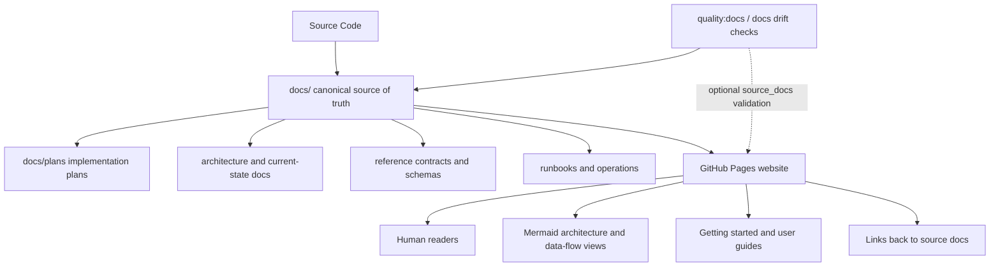
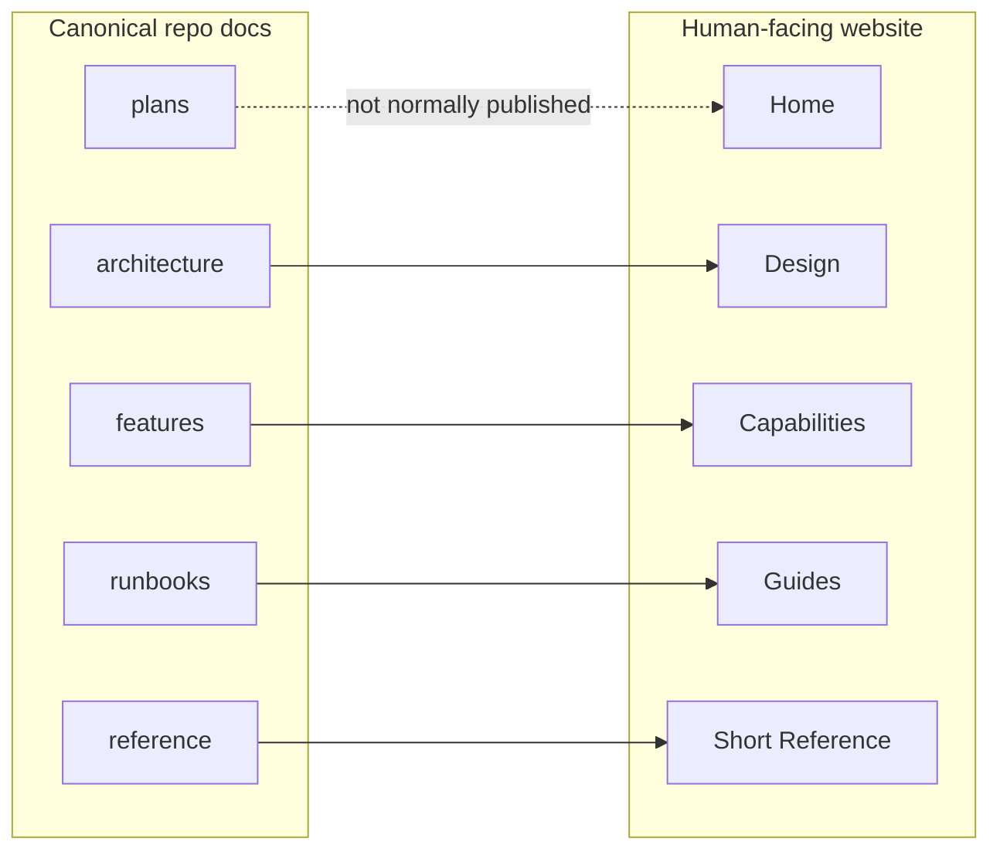
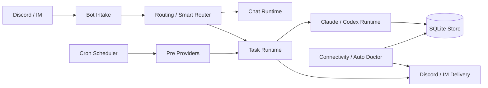

# MiniClaw Documentation Strategy

Status: draft
Date: 2026-05-15

> Conclusion: MiniClaw should keep `docs/` as the docs-driven development source of truth for LLMs and maintainers, and add a separate GitHub Pages website as the human-facing portal. The website should summarize, visualize, and route readers back to canonical repo docs instead of becoming a second source of truth.

## Goals

- Make `docs/` useful for LLM-driven design, implementation planning, and maintenance.
- Make the public website useful for people who want to understand MiniClaw quickly.
- Avoid duplicating current implementation facts across two independent documentation systems.
- Preserve plans, implementation notes, and drift checks in the repo where LLMs can maintain them with code changes.
- Use Mermaid diagrams and concise narratives for the website so readers can understand architecture and data flow without reading implementation-heavy docs.

## Two-Layer Model



`docs/` remains the canonical layer. The GitHub Pages site is a curated presentation layer derived from `docs/`.

## `docs/` Role

`docs/` is primarily for LLMs and maintainers. It should answer:

- What is the current implemented behavior?
- Which code paths own this behavior?
- What plan or design decision drove the implementation?
- What contracts must not drift when code changes?
- Which tests or quality gates validate the behavior?
- What must an LLM update before changing a module?

Recommended content:

- Current architecture and data flow.
- Implemented feature and provider docs.
- Reference docs for config, cron schema, database schema, commands, MCP tools, and quality gates.
- Development plans under `docs/plans/`.
- Runbooks for local operations and incident handling.
- Archive for historical reports that should not be treated as current source of truth.
- Private docs for sensitive provider research and account/session boundaries.

## Website Role

The GitHub Pages website is for human readers. It should answer:

- What is MiniClaw?
- What problems does it solve?
- How do Discord, Cron, Provider, Agent runtime, Store, and Ops fit together?
- What capabilities are available today?
- How do I install, configure, and try it?
- Where should I read next if I want implementation details?

Recommended website sections:

- Home: product positioning, key capabilities, quick start.
- Design: high-level architecture, runtime flow, data flow, reliability model.
- Capabilities: chat/task, Smart Router, cron automation, providers, memory/context, Auto Doctor.
- Guides: install, configure Discord, create cron jobs, refresh provider sessions, troubleshoot.
- Reference: concise config, cron schema, slash commands, provider catalog, quality gates.

The website should not expose `docs/private/`, should not present archived reports as current state, and should not publish implementation plans as user-facing docs unless they are explicitly reframed as roadmap/history.

## Source-Of-Truth Boundary

The repo docs own implementation facts. The website owns presentation.



Each website page should declare its backing source docs with lightweight metadata:

```yaml
source_docs:
  - docs/architecture.md
  - docs/features/16-provider-framework.md
status: public-summary
```

This keeps the site easy to read while preserving traceability for LLM maintenance.

## Mermaid And LLM Readability

Mermaid diagrams are useful for both humans and LLMs when they are paired with precise anchors.

Each major architecture or feature doc should use this structure:

- Summary: one short conclusion.
- Diagram: Mermaid flow or ER diagram.
- Current behavior: concise bullets.
- Owner code paths: exact files or directories.
- Contract: invariants that code must preserve.
- Development checklist: what to update when behavior changes.

Avoid turning docs into line-by-line code commentary. The implementation detail belongs in code. Docs should capture boundaries, flows, contracts, and maintenance obligations.

## Example Public Architecture Diagram



This kind of diagram belongs on the website and can also appear in `docs/architecture.md`. The repo doc should additionally link the diagram to owner code paths and contracts.

## Drift Control

The current docs-driven workflow should continue to treat repo docs as mandatory maintenance targets.

Recommended drift rules:

- Changes under `src/providers/**` should update provider docs or provider reference docs.
- Changes under `src/cron/**` should update cron architecture or cron schema docs.
- Changes under `src/store/**` should update data model or database reference docs.
- Changes under `src/config/**` or `config.example.yaml` should update config reference docs.
- Changes under `src/bot/**`, `src/discord/**`, or `src/routing/**` should update routing or Discord intake docs.
- Changes under `src/ops/**` or `src/monitoring/**` should update runbooks or operations docs.
- Website pages should be checked for valid `source_docs` references, but website pages should not replace repo docs in the docs drift gate.

## GitHub Pages Deployment Boundary

Use a separate `website/` or `docs-site/` directory for the GitHub Pages source. Do not publish the repo `docs/` directory directly as the Pages source, because `docs/` contains plans, archive, private boundaries, and implementation-facing material.

Recommended layout:

```text
website/
  index.md
  design/
  capabilities/
  guides/
  reference/
  llms.txt
```

GitHub Pages should build from `website/` through GitHub Actions. The action can publish a static site artifact while keeping internal repo docs private to the repository context.

## Migration Plan

1. Keep `docs/` as the LLM-maintained docs-driven development layer.
2. Add a concise docs taxonomy update so future LLMs know `docs/` is canonical and the website is presentation-only.
3. Create the first website skeleton with Home, Design, Capabilities, Guides, and Reference.
4. Add Mermaid-heavy architecture and data-flow pages to the website.
5. Add `source_docs` metadata to website pages.
6. Add a lightweight quality check that validates website `source_docs` references and blocks links to `docs/private/`.
7. Only then decide whether to migrate or reorganize existing `docs/features/` content.

## Decision

MiniClaw should use both layers:

- `docs/`: canonical, implementation-aware, LLM-maintained, docs-driven development.
- GitHub Pages website: curated, visual, human-facing, sourced from `docs/`.

This keeps MiniClaw friendly to readers without weakening the documentation discipline needed for LLM-driven development.
