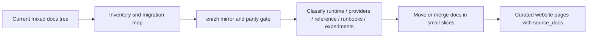
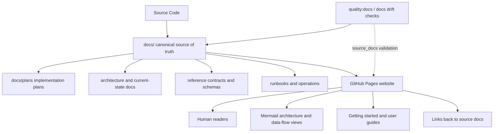
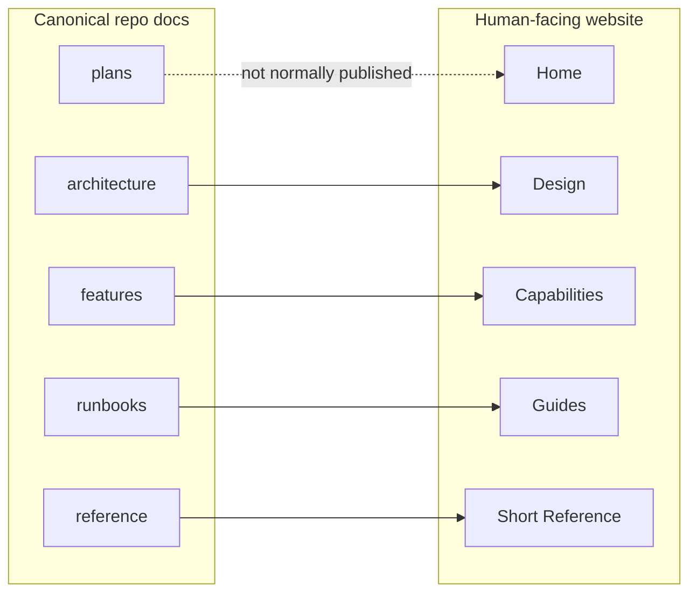
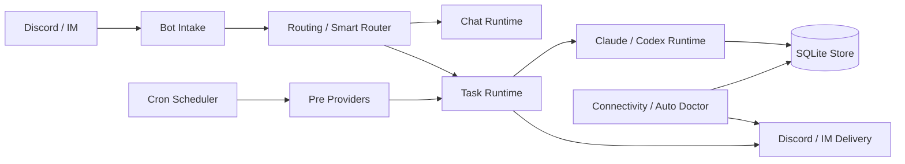

# MiniClaw Documentation Strategy

Status: in_progress
Date: 2026-05-15

## Background

MiniClaw needs two different documentation surfaces:

- `docs/` should remain the docs-driven development source of truth for LLMs and maintainers.
- A separate GitHub Pages website should become the human-facing project portal.

These surfaces have different readers and different maintenance requirements. `docs/` must preserve current implementation facts, plans, contracts, and drift checks. The website should summarize, visualize, and route human readers back to canonical repo docs without becoming a second source of truth.

The current `docs/` tree already contains current design docs, feature/provider docs, runbooks, plans, archive material, private research, and docs drift checks. Publishing this directory directly as a public website would mix implementation plans, historical reports, and sensitive boundaries into the user-facing portal. The website should instead be a curated presentation layer derived from `docs/`.

## Goals

- Keep `docs/` useful for LLM-driven design, implementation planning, and maintenance.
- Make the public website useful for people who want to understand MiniClaw quickly.
- Avoid duplicating current implementation facts across two independent documentation systems.
- Preserve plans, implementation notes, and drift checks in the repo where LLMs can maintain them with code changes.
- Use Mermaid diagrams and concise narratives on the website so readers can understand architecture and data flow without reading implementation-heavy docs.
- Add a `quality:website-docs` gate so website pages stay traceable to canonical repo docs.
- Define a migration plan for the current mixed `docs/` content instead of only describing the future website layer.
- Maintain both English and Chinese docs as first-class repo documentation, with explicit language parity checks.

## Non-Goals

- Do not publish `docs/` directly as the GitHub Pages source.
- Do not expose `docs/private/**` on the public website.
- Do not present `docs/archive/**` as current implementation state.
- Do not let `website/**` satisfy `quality:docs` changed-path requirements for code changes.
- Do not require website pages to include line-by-line implementation details.
- Do not migrate all existing `docs/features/` files in this plan-only change.
- Do not keep the current gitignored `docs/zh/` review-copy model as the long-term bilingual documentation model.
- Do not require private provider notes to be translated or published unless a safe redacted version is explicitly created.

## Existing Architecture Evidence

- Relevant files:
  - `docs/README.md`: current docs index and placement rules.
  - `docs/plans/README.md`: required structure for durable development plan documents.
  - `scripts/quality-docs.ts`: current D1 docs drift script.
  - `src/quality/docs-drift.ts`: changed-path to required-doc mapping.
  - `docs/quality-gates.md`: describes `quality:docs`, `quality:commit`, and `quality:push`.
  - `package.json`: exposes `quality:docs`, `quality:commit`, and `quality:push`.
  - `.github/workflows/quality.yml`: runs `pnpm run quality:docs` in CI.
  - `docs/zh/README.md`: currently describes `docs/zh/` as a gitignored local review-copy directory.
  - `.gitignore`: currently ignores `docs/zh/`.
- Relevant commands:
  - `pnpm run quality:docs`
  - `pnpm run quality:commit`
  - `pnpm run quality:push`
- Relevant data/config:
  - `docs/plans/**`, `docs/archive/**`, and `docs/private/**` are intentionally not user-facing website content.
  - Current docs drift checks treat repo docs as canonical, not presentation pages.
  - A future website should live under `website/` or `docs-site/`, not under the canonical `docs/` tree.
  - Current `docs/features/` mixes providers, runtime subsystems, business capabilities, experiments, and provider-family docs.
  - Current language layout is inconsistent: most source docs are English, some feature docs use ad hoc `.en.md` suffixes, and Chinese copies live under a gitignored local-review directory.

Current docs drift direction:

```text
source code -> canonical docs
```

Target website drift direction:

```text
source code -> canonical docs -> website
```

## Implementation Plan

1. Preserve `docs/` as the canonical docs-driven development layer.
   - Keep current implementation facts, plans, contracts, and runbooks under `docs/`.
   - Treat `docs/plans/` as durable plan records for non-trivial changes.
   - Keep archive and private material out of the public website.

2. Define the official `en` / `zh` maintenance model.
   - Keep the existing root `docs/` English paths as the short-term canonical English tree to avoid breaking current links and docs drift mappings.
   - Promote `docs/zh/` from local review copies to tracked first-class Chinese documentation.
   - Mirror the English relative path under `docs/zh/` instead of keeping all Chinese files flat.
   - Use `.zh.md` suffixes for Chinese files during the transition, for example `docs/features/16-provider-framework.md` and `docs/zh/features/16-provider-framework.zh.md`.
   - Add shared frontmatter to translated docs so LLMs and scripts can match language pairs:

```yaml
doc_id: provider-framework
lang: zh
translation_of: docs/features/16-provider-framework.md
translation_status: current
```

   - Long term, if root-level English docs become too ambiguous, move to explicit `docs/en/**` and `docs/zh/**` language trees in a dedicated migration slice. Do not mix that move into the first website slice.

3. Migrate current docs content in controlled phases.

Phase 0: inventory and migration map.

- Maintain a machine-readable migration map in `docs/documentation-migration-map.md`.
- Record `source_path`, `target_path`, `doc_id`, `zh_path`, `category`, `status`, `merge_group`, `website_exposure`, `translation_required`, and `translation_status`.
- Mark every current doc as one of: `keep`, `move`, `merge`, `archive`, `private`, or `website-source`.
- Treat every tracked canonical Markdown doc under `docs/` except `docs/zh/**` as required inventory. A doc move or new doc is not complete until the migration map records it.
- Use `quality:docs-i18n` to fail when a tracked canonical source doc is missing from the migration map.

Phase 1: stabilize the current source-of-truth layer before moving files.

- Update `docs/README.md` so it describes both the current English source tree and the `docs/zh/` mirror.
- Update `docs/zh/README.md` so it is no longer described as local-only review material after `.gitignore` stops excluding it.
- Add an i18n parity rule before doing large moves, so migration does not create untranslated or orphaned docs silently.
- Keep existing paths working until `quality:docs` and all internal links have been updated.

Phase 2: classify and merge `docs/features/`.

- Runtime and routing docs:
  - Smart Router, Discord task output, chat router logic, agent prompt context, memory lifecycle, connectivity monitor, and Auto Doctor should be grouped as runtime or operations docs.
- Provider and business capability docs:
  - Provider framework, WeChat MP, Futu, Email/CMB, Eastmoney JYWG, Eastmoney MyFavor, stock portfolio, stock pulse, market intel, and watchlist research should be grouped as provider docs.
  - Eastmoney provider docs should become one provider-family entry with separate sections for JYWG readonly and MyFavor watchlist, instead of independent top-level feature stories.
- Experiments:
  - Stage and Ralph controller should move under an experiments or experimental runtime section.
- Governance and reference:
  - Prompt assets, quality gates, install/distribution, config/schema, slash commands, and runbooks should stay outside provider docs.

Phase 3: migrate and leave traceability.

- Move or merge docs in small docs-only slices.
- Update `docs/README.md`, `docs/zh/README.md`, docs drift mappings, and all links in the same slice as each move.
- For merged docs, leave a short moved/merged stub for one release cycle or maintain a redirect index in `docs/README.md`.
- Update both English and Chinese versions in the same slice. If the Chinese version cannot be completed immediately, mark it `translation_status: pending` and make the i18n gate report it.

Phase 4: expose only curated material to the website.

- Publish website pages from the reorganized current-state docs, not from raw plans or private notes.
- Keep implementation plans and archive material available to LLMs in repo docs, but only surface them publicly as roadmap/history when explicitly rewritten.
- Generate high-drift reference pages from canonical docs or code metadata where practical.

Migration flow:



4. Add a separate `website/` or `docs-site/` directory for the GitHub Pages source.
   - Do not use the repo root `docs/` directory as the Pages publish source.
   - Use GitHub Actions to build and deploy the static website artifact.
   - Keep website pages curated, visual, and human-facing.

5. Use a two-layer documentation model.



6. Define the website information architecture.

Recommended first website sections:

- Home: product positioning, key capabilities, quick start.
- Design: high-level architecture, runtime flow, data flow, reliability model.
- Capabilities: chat/task, Smart Router, cron automation, providers, memory/context, Auto Doctor.
- Guides: install, configure Discord, create cron jobs, refresh provider sessions, troubleshoot.
- Reference: concise config, cron schema, slash commands, provider catalog, quality gates.

7. Add `source_docs` metadata to website pages.

Each website page should declare its backing source docs:

```yaml
source_docs:
  en:
    - docs/architecture.md
    - docs/features/16-provider-framework.md
  zh:
    - docs/zh/architecture.zh.md
    - docs/zh/features/16-provider-framework.zh.md
status: public-summary
```

The repo docs own implementation facts. The website owns presentation.



8. Use Mermaid diagrams for website readability, but keep repo docs anchored to code.

Each major architecture or feature doc should keep this structure:

- Summary: one short conclusion.
- Diagram: Mermaid flow or ER diagram.
- Current behavior: concise bullets.
- Owner code paths: exact files or directories.
- Contract: invariants that code must preserve.
- Development checklist: what to update when behavior changes.

Example public architecture diagram:



9. Add `quality:website-docs` after the first website skeleton exists.

Recommended package scripts:

```json
{
  "quality:website-docs": "tsx scripts/quality-website-docs.ts",
  "quality:docs": "tsx scripts/quality-docs.ts && pnpm run quality:website-docs"
}
```

The first version of `scripts/quality-website-docs.ts` should check:

- Every public website Markdown/MDX page has frontmatter.
- Every public website page declares language-aware `source_docs`, except pure landing pages explicitly marked `status: landing`.
- Every `source_docs` path exists in the repo.
- `source_docs` must not point to `docs/private/**`.
- `source_docs` must not point to `docs/archive/**` unless the website page is explicitly marked `status: history`.
- If a website page has both `/en/` and `/zh/` variants, both variants must point back to matching repo docs.
- Website pages must not present implementation facts without a `source_docs` anchor.
- If a canonical doc changes and a website page declares it in `source_docs`, the command should print the affected website pages.

The first version can warn on affected website pages instead of failing. Once the website becomes public and stable, tighten this rule so canonical doc changes require either:

- updating affected website pages,
- marking the page as unaffected with a short comment in frontmatter,
- or using an explicit emergency bypass such as `MINICLAW_WEBSITE_DOCS_DRIFT_ALLOW=1`.

Do not let `website/**` satisfy `quality:docs` changed-path requirements.

High-drift website sections should be generated or partially generated instead of hand-maintained. Good candidates:

- provider catalog,
- slash command reference,
- cron job schema,
- config/env reference,
- MCP tool list.

10. Add `quality:docs-i18n` as part of the docs migration.

The first version of `quality:docs-i18n` should check:

- Every tracked canonical Markdown source doc under `docs/` except `docs/zh/**` appears in `docs/documentation-migration-map.md`.
- Every tracked English source doc that requires translation has a Chinese pair or an explicit `translation_status: not_required`.
- Every Chinese doc has a valid `translation_of` path.
- `doc_id` matches across language pairs.
- Heading parity is checked for current architecture, feature, provider, reference, runbook, and plan docs.
- Changed English docs report affected Chinese translations.
- `docs/zh/` is not ignored once it becomes first-class repo documentation.

Missing migration-map inventory is blocking because later docs moves depend on a complete source list. Missing or pending translations can remain warning-only during migration and become blocking after the core bilingual docs inventory is stable.

11. Configure GitHub Pages deployment through GitHub Actions.

Recommended layout:

```text
website/
  en/
    index.md
    design/
    capabilities/
    guides/
    reference/
  zh/
    index.md
    design/
    capabilities/
    guides/
    reference/
  llms.txt
```

The Pages workflow should build from `website/` and publish a static site artifact, while internal repo docs remain in repository context.

12. Only after the docs inventory, bilingual mirror, and first migration slices are stable, decide whether to move the English root docs into explicit `docs/en/**`.

## Verification Plan

- Type check:
  - Not required for this plan-only document.
  - Required when implementing `scripts/quality-website-docs.ts`: run `pnpm run typecheck`.
- Unit tests:
  - Add focused tests for `quality:website-docs` frontmatter parsing, source path validation, forbidden path validation, and affected page detection.
  - Add focused tests for `quality:docs-i18n` translation pairing, heading parity, ignored-path detection, and missing translation reporting.
  - Run the focused test suite before wiring the script into `quality:docs`.
- Integration/E2E checks:
  - Run a docs inventory command before any migration slice and confirm every tracked doc is classified.
  - Run `pnpm run quality:docs` after any docs drift script changes.
  - Run `pnpm run quality:docs-i18n` once it exists, initially in warning mode.
  - Run `pnpm run quality:commit` before committing the implementation.
  - Run the GitHub Pages build command once website scaffolding exists.
- Manual checks:
  - Confirm moved or merged docs have updated inbound links from `docs/README.md`.
  - Confirm a sample migrated provider doc and its Chinese pair preserve the same owner code paths and contracts.
  - Confirm `website/**` pages link back to canonical `docs/` pages.
  - Confirm no website page links to `docs/private/**`.
  - Confirm `docs/archive/**` is only used by pages marked `status: history`.
  - Confirm public pages remain visual and human-readable rather than implementation dumps.

## Risks And Rollback

- Risk: website becomes a second source of truth.
  - Mitigation: require `source_docs` metadata and forbid website pages from satisfying code-to-docs drift requirements.
  - Rollback: remove or disable `website/` publishing while keeping canonical `docs/`.

- Risk: website pages drift because canonical docs change but public pages are not reviewed.
  - Mitigation: add `quality:website-docs` affected-page reporting, then later make it blocking.
  - Rollback: keep affected-page reporting as warning-only until the site matures.

- Risk: generated website references become stale or noisy.
  - Mitigation: generate only high-drift reference sections and keep narrative pages hand-authored.
  - Rollback: remove generated snippets and link directly to canonical repo docs.

- Risk: public website accidentally exposes private provider details.
  - Mitigation: block `docs/private/**` references in `quality:website-docs`.
  - Rollback: unpublish affected page and rotate any exposed sensitive material if needed.

- Risk: docs migration breaks existing links or docs drift mappings.
  - Mitigation: migrate in small docs-only slices, update indexes and drift mappings in the same slice, and keep moved/merged stubs for one release cycle.
  - Rollback: restore the previous path from git and keep the migration map entry marked `blocked`.

- Risk: English and Chinese docs diverge.
  - Mitigation: add `doc_id`, `translation_of`, and `translation_status` metadata plus `quality:docs-i18n`.
  - Rollback: mark affected Chinese pages `translation_status: pending` and keep the English source as temporarily authoritative until parity is restored.

- Risk: LLMs become confused about which language is authoritative.
  - Mitigation: keep one `doc_id` per concept, require explicit language metadata, and state that implementation facts must match code in both languages.
  - Rollback: temporarily designate the English source doc as authoritative for the affected concept while preserving the Chinese page as pending.

## Documentation Sync

- README:
  - Keep `docs/README.md` pointing to this plan while the website strategy is in draft.
  - Update `docs/README.md` with the migration map, bilingual policy, and moved/merged doc index before file moves.
  - Add website docs only after `website/` exists.
- docs:
  - Keep this plan under `docs/plans/`.
  - Keep the Chinese version under `docs/zh/plans/2026-05-15-documentation-strategy.zh.md`.
  - Update `docs/zh/README.md` from local-review-copy wording to first-class Chinese documentation wording when `docs/zh/` is no longer ignored.
  - Remove `docs/zh/` from `.gitignore` in the same slice that promotes Chinese docs to tracked repo docs.
  - Add `docs/documentation-migration-map.md` before moving or merging current docs.
  - Update `docs/quality-gates.md` when `quality:website-docs` is implemented.
  - Update `docs/quality-gates.md` when `quality:docs-i18n` is implemented.
  - Update `docs/plans/README.md` if this plan changes status.
- CHANGELOG:
  - Not required for plan-only changes.
  - Add an entry when the public website, docs migration, or docs i18n quality gate ships.

## Execution Notes

- 2026-05-15: Initial strategy captured as a plan after deciding that `docs/` should remain the LLM-maintained canonical layer and GitHub Pages should be a separate human-facing portal.
- 2026-05-15: Added the `quality:website-docs` gate proposal, including `source_docs` validation, forbidden private/archive references, affected page reporting, and the rule that `website/**` must not satisfy code-to-docs drift requirements.
- 2026-05-15: Added the current-docs migration plan and the first-class `en` / `zh` documentation maintenance model, including `quality:docs-i18n`, migration map requirements, and the rule that `docs/zh/` should stop being a gitignored local review-copy directory once bilingual docs are adopted.
- 2026-05-15: First implementation slice is available on branch `codex/documentation-strategy` in a separate worktree. It includes the migration map, tracked `docs/zh`, bilingual website skeleton, `quality:docs-i18n`, `quality:website-docs`, package script wiring, and docs index / quality gate updates. Large-scale `docs/features/` moves remain pending.
- 2026-05-15: Phase 2 classification started on `main` without deleting legacy feature docs. Added taxonomy entrypoints for runtime, providers, experiments, Eastmoney provider family, content providers, email providers, and stock research pipeline; updated the migration map, website `source_docs`, and D1 docs drift patterns so new taxonomy docs can satisfy source-of-truth requirements while legacy `docs/features/*` remains link-compatible for one migration cycle.
- 2026-05-15: Completed the migration-map inventory slice on `main`: `docs/documentation-migration-map.md` now covers every tracked canonical `docs/**/*.md` source outside `docs/zh/**`, and `quality:docs-i18n` treats any tracked source doc missing from the map as a blocking error. Focused verification passed with `pnpm exec vitest run src/quality/__tests__/docs-i18n.test.ts` and `pnpm run quality:docs-i18n`, which reported 73 migration map entries.
- 2026-05-15: Broader verification for the inventory slice passed with `pnpm run typecheck`, `pnpm run lint`, `pnpm run build`, `pnpm test` (185 files / 903 tests), and `MINICLAW_DOCS_DRIFT_ALLOW=1 pnpm run quality:docs`. Raw `pnpm run quality:docs` is currently blocked by concurrent Agent Run Manager runtime/store changes in the same worktree, not by this inventory slice.
- 2026-05-15: Added the first GitHub Pages deployment path for the human-facing website: `scripts/build-website.ts` builds `website/**/*.md(x)` into `website-dist/**/*.html`, `pnpm run website:build` exposes the local build command, `.github/workflows/pages.yml` validates `quality:website-docs`, builds the artifact, and deploys via GitHub Pages. The workflow also watches the website docs gate implementation and frontmatter parser so validation logic changes exercise the Pages build. `website-dist/` is ignored and remains generated output.
