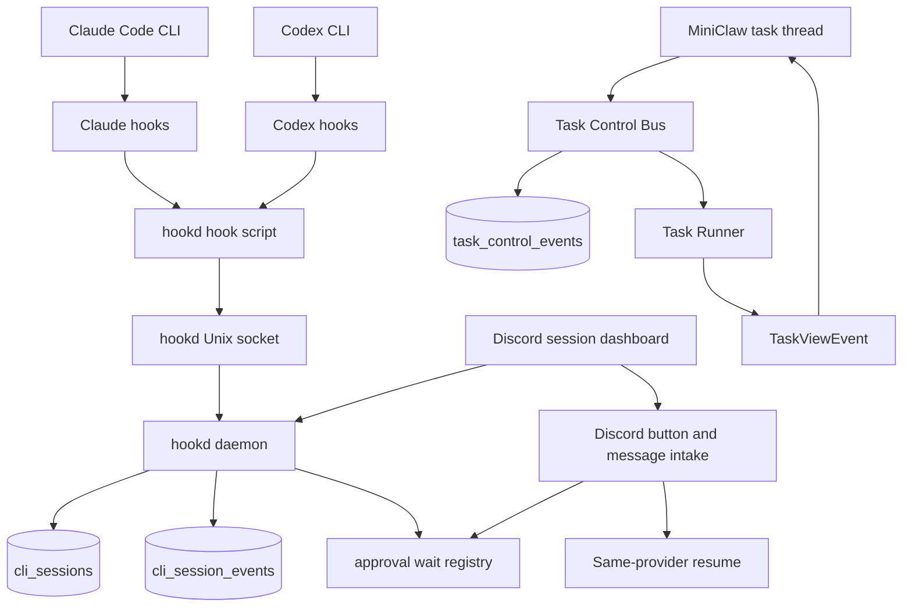

# Discord Agent Control Plane

Status: draft
Date: 2026-05-25
Updated: 2026-05-25

## Background

MiniClaw already owns Discord task intake for MiniClaw-started work. The missing capability is different: the operator often starts `claude` or `codex` directly in multiple iTerm2 windows, then leaves the Mac and wants Discord to show which CLI sessions are still working, which ones are waiting for input, and which ones have ended.

The desired behavior is not only "send final task results to Discord". The control surface should support:

- observing MiniClaw-started tasks and manually-started Claude Code or Codex CLI sessions;
- distinguishing a running turn from an idle session that is waiting for the next user prompt;
- removing closed terminal sessions from the active Discord surface;
- approving or denying high-risk tool operations from Discord;
- sending follow-up instructions through the safest same-provider path;
- continuing a Claude session as Claude, or a Codex session as Codex, without pretending that provider context can be converted.

The important correction from the reference analysis is that MiniClaw does not have to require a wrapper such as `mc-claude` or `mc-codex` for reliable discovery. MioIsland shows that ordinary `claude` and `codex` invocations can be observed when a host-level hook bridge is installed. MiniClaw should therefore add a local hook daemon, called `hookd` in this plan, before adding heavier terminal-control features.

## Goals

- Add `hookd` as a local session-discovery daemon for Claude Code and Codex CLI.
- Observe ordinary `claude` and `codex` sessions launched from iTerm2, tmux, cmux, Ghostty, Terminal.app, or other supported terminals after hooks are installed.
- Persist provider session id, provider, cwd, pid, tty, terminal surface hints, transcript path, phase, and last activity.
- Show active and idle CLI sessions in Discord without turning every external CLI session into a MiniClaw task row.
- Keep one Discord task thread per MiniClaw-started task, and add a separate Discord CLI-session surface for manually-started sessions.
- Support same-provider continuation: a Claude session resumes Claude context; a Codex session resumes Codex context.
- Support Claude permission approval through hook request and response when the CLI provider exposes a blocking hook.
- Keep `TaskControlBus` for MiniClaw-owned tasks, but do not make it the first dependency for observing external CLI sessions.
- Keep the current Codex SDK runner as the stable MiniClaw-started task path; treat `codex app-server` as a later opt-in runtime for deeper Codex live control.

## Non-Goals

- Do not require users to replace every local `claude` or `codex` command with a MiniClaw wrapper.
- Do not infer active or idle state from terminal output alone.
- Do not treat iTerm2 title, cwd matching, or terminal pane capture as the source of truth.
- Do not implement provider switching between Claude and Codex. A Claude session id and a Codex thread id are different provider contexts.
- Do not expose multi-user or public Discord control. Production remains single-operator unless access control is redesigned.
- Do not send raw provider payloads or unredacted tool input directly to Discord.
- Do not make terminal input injection the default continuation path for iTerm2. It can be a best-effort operation after session identity is known, not the reliability base.

## Existing Architecture Evidence

- `docs/runtime/README.md`: current runtime map is Discord or IM intake -> task runtime -> Claude, Codex, or managed runtime -> task events -> delivery.
- `docs/bot-routing.md`: thread continuation already wins before task-channel and chat routing, and resumes prior provider sessions through `resumeSessionId`.
- `src/agent/task.ts`: `executeTask()` owns MiniClaw task lifecycle, `AbortController`, task DB state, `TaskReporter`, and `DiscordTaskViewReporter` wiring.
- `src/agent/runners/types.ts`: the runner contract currently includes `signal`, `onViewEvent`, `onTraceEvent`, and `resumeSessionId`, but no control queue or approval callback.
- `src/agent/runners/claude-task-runner.ts`: Claude SDK tasks already use an async `canUseTool` callback for MiniClaw-started policy decisions.
- `src/agent/runners/codex-task-runner.ts`: Codex SDK tasks currently use `@openai/codex-sdk` `thread.runStreamed(...)`, which streams progress and supports abort, but is not a full interactive terminal control protocol.
- `src/store/schema.ts`: `tasks` and `task_events` exist, but there is no durable table for external CLI sessions or hook events.
- `src/bot/button-dispatch.ts`: button dispatch already centralizes cron retry and Smart Router buttons; task and hook approval buttons should use distinct prefixes.

## Reference Project Takeaways

### MioIsland

MioIsland is the strongest reference for the `hookd` layer. It does not rely on terminal output to know whether a session is active. It installs provider hooks, receives event payloads over a local Unix socket, maps those events into an explicit state machine, and then uses process liveness as a cleanup fallback.

Borrow:

- host-level hook installation for Claude Code and Codex;
- a local Unix socket bridge for low-latency hook events;
- hook payload enrichment with parent pid, tty, cwd, terminal app hints, cmux or tmux identifiers, and Codex transcript path;
- phase mapping from provider events into `processing`, `running_tool`, `waiting_for_approval`, `waiting_for_input`, `compacting`, and `ended`;
- zombie scanning with `kill(pid, 0)` to detect terminal windows or CLI processes that died without a clean provider end event;
- transcript parsing for summaries and recent messages;
- delayed display for Codex startup events so opening an empty Codex TUI does not create a noisy session.

Avoid:

- making terminal pane capture authoritative;
- assuming iTerm2 injection is precise when multiple windows, tabs, or panes share the same cwd;
- binding MiniClaw's task rows directly to every observed external CLI session.

### Happy

Happy remains useful as a reference for wrapper-owned execution, but it should not be the default MiniClaw discovery model.

Borrow:

- remote input queue semantics;
- explicit local versus remote control mode;
- attention-required notifications;
- abort-current-turn semantics separate from killing the whole session.

Avoid:

- requiring every user command to go through a wrapper;
- replacing Discord with a separate mobile application.

### Remodex

Remodex remains useful for future Codex deep control. Its important design point is that execution stays on the Mac while a local bridge forwards JSON-RPC traffic to `codex app-server`.

Borrow later:

- `codex app-server` as the substrate for true Codex interrupt, approval, and bidirectional control;
- explicit thread and turn lifecycle;
- persisted Codex sessions as the durable history source.

Avoid for the first slice:

- making app-server a prerequisite for basic active or idle detection;
- replacing the current Codex SDK task path before the app-server runtime has fake-server and live smoke coverage.

## Target Architecture



`hookd` and `TaskControlBus` are related but separate.

- `hookd` observes and controls host CLI sessions that may have been launched outside MiniClaw.
- `TaskControlBus` controls MiniClaw-started tasks that already run inside `executeTask()`.
- Discord can render both surfaces, but they should not share persistence tables until a session is explicitly converted into a MiniClaw task continuation.

## hookd Responsibilities

`hookd` should be a long-running local service inside the MiniClaw runtime process or a closely supervised child process.

Minimum responsibilities:

- install, verify, repair, and uninstall managed Claude Code hooks;
- install, verify, repair, and uninstall managed Codex hooks when Codex hook support is enabled;
- listen on a local Unix socket such as `~/.miniclaw/runtime/hookd.sock`;
- accept JSON hook events from a small hook script invoked by the providers;
- enrich events with process metadata collected by the hook script;
- map provider events into MiniClaw's canonical CLI session phases;
- persist session state and append raw redacted events;
- hold blocking permission requests open until Discord or local policy returns allow, deny, or ask;
- expire abandoned permission requests on timeout or daemon restart;
- scan for dead pids and mark sessions ended when the provider missed its own end event;
- expose read-only session snapshots to Discord rendering and operational commands.

## Hook Installation

`hookd` should manage hooks idempotently and keep a manifest so MiniClaw can distinguish its own hook entries from user-managed entries.

Claude hook target:

- file: `~/.claude/settings.json`;
- script: `~/.miniclaw/hooks/miniclaw-hookd.py`;
- events: `UserPromptSubmit`, `PreToolUse`, `PostToolUse`, `PermissionRequest`, `Notification`, `Stop`, `SubagentStop`, `SessionStart`, `SessionEnd`, and `PreCompact`;
- timeout: long enough for interactive approval on `PermissionRequest`, with MiniClaw-side timeout and deny-by-default policy.

Codex hook target:

- file: `~/.codex/hooks.json`;
- config: enable `[features] codex_hooks = true` only when MiniClaw manages that feature flag;
- script: `~/.miniclaw/hooks/miniclaw-hookd.py`;
- first required events: `SessionStart` with startup or resume matcher, `UserPromptSubmit`, and `Stop`;
- optional later events: tool and approval events if exposed by the installed Codex version.

The hook script should be provider-neutral. It should read hook JSON from stdin and send a compact event to `hookd`. It should include:

- `source`: `claude` or `codex`;
- `session_id`;
- `cwd`;
- `hook_event_name`;
- provider status mapped by the script if needed;
- parent process pid from `os.getppid()`;
- tty from `ps -p <pid> -o tty=`;
- terminal hint from environment variables such as `ITERM_SESSION_ID`, `TERM_PROGRAM`, `TMUX`, `CMUX_WORKSPACE_ID`, and `CMUX_SURFACE_ID`;
- tool name, tool input, and tool use id when available;
- Codex transcript path when the Codex hook payload includes one.

## Session State Model

Suggested tables:

```sql
CREATE TABLE cli_sessions (
  id TEXT PRIMARY KEY,
  provider TEXT NOT NULL,
  provider_session_id TEXT NOT NULL,
  cwd TEXT NOT NULL,
  pid INTEGER,
  tty TEXT,
  terminal_app TEXT,
  terminal_surface_json TEXT,
  transcript_path TEXT,
  phase TEXT NOT NULL,
  attention_kind TEXT,
  last_activity_at TEXT NOT NULL,
  started_at TEXT NOT NULL,
  ended_at TEXT,
  hidden_at TEXT,
  UNIQUE(provider, provider_session_id)
);

CREATE TABLE cli_session_events (
  id TEXT PRIMARY KEY,
  cli_session_id TEXT NOT NULL,
  provider TEXT NOT NULL,
  event_name TEXT NOT NULL,
  phase TEXT NOT NULL,
  payload_json TEXT NOT NULL,
  created_at TEXT NOT NULL
);
```

Canonical phases:

- `starting`: a provider session started but no user prompt has been seen yet;
- `processing`: the provider is generating or coordinating work;
- `running_tool`: a tool is currently executing;
- `waiting_for_approval`: the provider is blocked on an approval decision;
- `waiting_for_input`: the current turn finished and the CLI is waiting for the next prompt;
- `compacting`: context compaction is running;
- `ended`: the provider ended or the backing process is gone;
- `unknown`: the event could not be classified.

Display buckets:

- Active: `processing`, `running_tool`, `waiting_for_approval`, and `compacting`.
- Idle: `waiting_for_input` with a live pid.
- Closed: `ended`, dead pid, dead tty, or stale session past retention.
- Hidden: user archived the session, but history is retained.

Codex-specific rule: do not show a Codex `SessionStart` as an active session until a real `UserPromptSubmit` or transcript activity appears. This prevents empty TUI launches from polluting Discord.

## Discord UX

Discord should expose two related surfaces.

MiniClaw task threads:

- keep one thread per MiniClaw-created task;
- show task id, provider, model, cwd, provider session id, current phase, recent tool steps, queued operator instruction count, and valid buttons;
- use `TaskControlBus` for task-scoped messages, cancellation, pause, and MiniClaw-owned approval flow.

CLI session dashboard:

- group observed CLI sessions by cwd or project;
- show active count per project;
- show active sessions first, idle sessions second, closed sessions only in history or archive;
- show provider badge, phase, elapsed time, cwd, latest user prompt or summary, terminal hint, and last activity time;
- hide ended sessions from the active surface after a short retention window;
- keep a manual `Archive` or `Hide` action for idle sessions the operator no longer wants to see.

Discord-native rendering constraints:

- Do not try to render custom HTML, CSS, or JavaScript inside Discord messages. The static HTML prototype is only a product mock.
- Implement the mobile surface with native Discord messages: embeds, action rows, buttons, select menus, and modals.
- Use one pinned or otherwise discoverable "current sessions" dashboard message as the stable entry point. Hook events should edit this current snapshot rather than only appending ordinary chronological messages.
- Support a `/sessions` command and a `Refresh` button that can regenerate the current snapshot when the pinned message is buried or stale.
- Use select menus for project, provider, and status filters. Use buttons for `Approve`, `Deny`, `Continue`, `Queue Instruction`, `Hide`, and `Details`.
- Use modals for operator text input, especially same-provider continuation and queued instructions.
- Render session detail through an updated embed, an ephemeral follow-up, or a modal-friendly summary. Do not depend on a web-style sidebar or fixed three-column layout.
- Respect Discord message and component limits by paginating or collapsing long session lists. The dashboard should summarize first and expose detail on demand.

Dashboard ordering and anti-burial rules:

- The dashboard is a state-prioritized control surface, not a chronological feed of session creation times.
- Primary ordering: `waiting_for_approval` first, active sessions second, stale-active sessions third, idle sessions fourth, ended or hidden sessions last and normally collapsed.
- Active sessions must stay above idle sessions even if the active session was opened much earlier than the idle sessions.
- Within the active bucket, sort by attention first, then by `last_activity_at` descending. A long-running active session with no recent hook event should be labelled `active, quiet <duration>` or `possibly stuck`, not silently mixed into idle.
- Within the idle bucket, sort by `last_activity_at` descending and collapse or paginate after a small visible limit.
- Ended sessions should not push active or idle sessions down the dashboard. Keep them in history, with an explicit `History` or `Show hidden` action.
- High-priority transitions such as new approval requests or stale-active warnings may send a separate notification message, but the pinned/current dashboard remains the operator's canonical view.

Suggested CLI session buttons:

- `miniclaw:cli-session:open:<sessionId>`: show detail and transcript summary;
- `miniclaw:cli-session:approve:<requestId>`: approve a pending permission request;
- `miniclaw:cli-session:deny:<requestId>`: deny a pending permission request;
- `miniclaw:cli-session:continue:<sessionId>`: start a same-provider MiniClaw continuation using the stored provider session id when supported;
- `miniclaw:cli-session:hide:<sessionId>`: hide or archive the session from active Discord lists;
- `miniclaw:cli-session:jump:<sessionId>`: optional local terminal jump, only when a safe terminal target is known.

Thread message behavior:

- If a MiniClaw task is waiting for input, deliver the message through `TaskControlBus`.
- If a MiniClaw task is running, queue the message for the next safe point and acknowledge it in the thread.
- If an observed CLI session is idle, prefer same-provider continuation through MiniClaw rather than blind iTerm2 injection.
- If an observed CLI session is running, acknowledge the Discord message as queued or advisory unless the provider exposes an explicit interrupt or input API.
- If the session belongs to a cron task, do not allow user continuation unless an explicit manual resume path is added.

## Approval Flow

For Claude Code external CLI sessions, hooks can provide a blocking `PermissionRequest`. `hookd` should:

1. receive the permission event and correlate it to the latest matching `PreToolUse` if the provider omits a tool use id;
2. persist a redacted approval request;
3. update the CLI session phase to `waiting_for_approval`;
4. render a Discord approval card with safe tool name, redacted input summary, cwd, and provider;
5. wait for `Approve`, `Deny`, timeout, provider stop, or process death;
6. return the provider-specific hook response;
7. mark the request resolved and return the session to `processing`, `waiting_for_input`, or `ended`.

Timeout behavior must deny by default unless local policy explicitly allows ask-through. Restart behavior must expire pending approvals because the original hook socket is no longer alive.

Codex approval should not be promised until the installed Codex hook or app-server runtime exposes a reliable approval response path.

## Continuation And Terminal Input

There are three control paths, in reliability order:

1. Provider-native resume or MiniClaw runner continuation.
2. Provider hook or app-server control API.
3. Terminal input injection.

MiniClaw should prefer path 1 or path 2 whenever possible. Terminal input injection is useful for jump-back or cmux-style exact routing, but it should not be the foundation for state detection.

For iTerm2 specifically:

- tty matching can identify the hosting tab or pane for jump-to-terminal behavior;
- writing text into iTerm2 is best effort when multiple sessions are open;
- Discord "continue" should default to creating a same-provider MiniClaw continuation rather than sending keystrokes into the current foreground iTerm2 pane.

For cmux or tmux:

- exact workspace, surface, session, window, or pane identifiers can make terminal routing safer;
- MiniClaw can add terminal injection after the hookd state model is stable.

## MiniClaw-Owned Task Control

`TaskControlBus` still matters for tasks MiniClaw starts itself.

Candidate event shape:

```ts
type TaskControlEvent =
  | { type: "operator_message"; text: string; discordMessageId: string }
  | { type: "cancel"; reason?: string }
  | { type: "pause_after_turn" }
  | { type: "approve_tool"; requestId: string; actorId: string }
  | { type: "deny_tool"; requestId: string; actorId: string; reason?: string }
  | { type: "set_mode"; mode: "observe" | "interactive" | "yolo" };
```

Candidate runner control contract:

```ts
interface TaskRunnerControl {
  poll(): Promise<TaskControlEvent[]>;
  waitForOperatorInput(reason: string): Promise<string>;
  requestApproval(request: ToolApprovalRequest): Promise<ApprovalDecision>;
  attention(message: string): Promise<void>;
}
```

`TaskRunnerInput` should grow a `control?: TaskRunnerControl` field. Single-shot runners can ignore it initially. Interactive runtimes should use it for approvals, queued follow-up instructions, and pause or cancel decisions.

## Codex Runtime Plan

Codex has two separate needs.

First slice:

- use Codex hooks for session discovery, active versus idle state, and transcript summary;
- keep the existing `@openai/codex-sdk` runner for MiniClaw-started tasks;
- treat approval and true mid-turn interrupt as unsupported unless a reliable hook response path is present.

Later slice:

- add a `codex-app-server` runtime behind config such as `runtime.codex.mode: sdk | app_server`;
- start or reuse an app-server process;
- initialize JSON-RPC client state;
- start or resume a thread for a MiniClaw task;
- stream thread, turn, item, and approval events into `TaskViewEvent` and `task_events`;
- map Discord approve or deny buttons to app-server approval responses;
- map Discord cancel or pause to turn interruption;
- persist `codex:<threadId>` as the provider session id.

## Same-Provider Relay Model

Discord relay means the operator can continue or intervene in the provider session that already belongs to the Discord surface.

- A Claude CLI session resumes Claude context.
- A Codex CLI session resumes Codex context.
- A MiniClaw task thread resumes the provider session recorded by the task row.
- A running task or session can receive queued operator instructions only when the runner or provider reaches an explicit safe point.

Provider switching is intentionally out of scope. If the operator wants to start a new task with the other provider, that should be a separate task with an explicit prompt. MiniClaw should not hide that as an automatic continuation.

## Implementation Plan

1. Add `hookd` storage.
   - Create `cli_sessions` and `cli_session_events`.
   - Add repository helpers for upsert session, append event, list active or idle sessions, mark ended, hide session, and expire stale approvals.
   - Add redaction helpers for hook payloads and tool input.

2. Add `hookd` socket and hook script.
   - Add a small provider-neutral script under MiniClaw-managed user config.
   - Read JSON from stdin and enrich it with pid, tty, terminal hints, cmux or tmux identifiers, and transcript path.
   - Send one JSON object to `hookd` over a Unix socket.
   - For blocking approval hooks, wait for a decision response with a bounded timeout.

3. Add hook installers and diagnostics.
   - Install and repair Claude Code hooks idempotently.
   - Install Codex hooks only when the Codex hook feature is enabled.
   - Store a MiniClaw hook manifest for uninstall and drift checks.
   - Add doctor output for hook installed, socket reachable, last event time, and stale hook entries.

4. Add the hook session state machine.
   - Map provider events into canonical phases.
   - Skip empty Codex startup sessions until a real prompt or transcript activity arrives.
   - Run zombie scans for dead pid and stale tty cleanup.
   - Retain closed sessions for a short history window and hide them from active Discord lists.

5. Add Discord CLI session dashboard.
   - Group by cwd or project.
   - Render a Discord-native pinned or current dashboard with embeds, select menus, buttons, and modals.
   - Sort by attention state instead of message chronology: approval, active, stale active, idle, then hidden history.
   - Add details, hide, same-provider continue, queued-instruction, and approval buttons.
   - Keep raw hook payloads out of Discord.

6. Add Claude external approval relay.
   - Hold the hook request open in `hookd`.
   - Resolve it from Discord button dispatch.
   - Deny by default on timeout, stop event, process death, or daemon restart.
   - Add fake hook tests for allow, deny, timeout, and socket failure.

7. Add MiniClaw-owned task control after hookd.
   - Create `task_control_events`.
   - Add `TaskControlBus`.
   - Wire task-thread buttons and running-thread messages.
   - Keep this separate from `cli_sessions` until a session is explicitly resumed as a MiniClaw task.

8. Add Codex app-server runtime later.
   - Keep behind config.
   - Implement JSON-RPC transport and fake app-server tests before live use.

## Verification Plan

- Type check: `pnpm run typecheck`.
- Unit tests:
  - hook installer pure mutations for Claude settings and Codex hooks;
  - hook script event normalization with fixture payloads;
  - `hookd` socket request and response behavior;
  - CLI session repository upsert, phase transition, hide, end, and expiry;
  - zombie scan dead-pid detection;
  - Discord button dispatch for CLI session custom ids;
  - Claude approval allow, deny, timeout, process death, and daemon restart.
- Integration tests:
  - fake Claude hook stream moves a session from processing to waiting for input;
  - fake Codex startup is hidden until `UserPromptSubmit`;
  - fake iTerm2 session close marks the CLI session ended through zombie scan;
  - Discord dashboard keeps active sessions above idle sessions even when the active session is older;
  - Discord dashboard labels quiet active sessions as stale or possibly stuck;
  - Discord dashboard shows active sessions and hides ended sessions;
  - Discord native `Continue` or `Queue Instruction` actions open a modal-shaped input flow;
  - same-provider continuation creates a MiniClaw task with the stored provider session id.
- Manual live checks:
  - start `claude` directly in iTerm2 and confirm it appears as active, then waiting for input after `Stop`;
  - close the iTerm2 window and confirm the session leaves the active Discord surface;
  - start `codex` directly in iTerm2 and confirm empty TUI startup is not displayed until a prompt is submitted;
  - trigger a Claude permission request and approve or deny it from Discord mobile;
  - confirm multiple iTerm2 windows with the same cwd do not cause terminal-injection claims unless a precise tty or terminal target is known.
- Docs gates:
  - `pnpm run quality:docs`.
  - Update `CHANGELOG.md` in the implementation slice.

## Risks And Rollback

- Risk: provider hook schemas change.
  - Mitigation: version hook payload fixtures, keep unknown events as append-only records, and fail closed for approvals.
  - Rollback: disable managed hook installation while keeping MiniClaw-started task execution unchanged.

- Risk: hook installation overwrites user-managed hooks.
  - Mitigation: append only MiniClaw-managed entries, keep a manifest, and verify round-trip JSON or TOML before writing.
  - Rollback: uninstall MiniClaw-managed hooks using the manifest.

- Risk: stale sessions stay visible after a terminal closes.
  - Mitigation: provider end events, dead-pid scan, stale tty cleanup, retention TTL, and manual hide.
  - Rollback: hide hookd sessions from Discord while retaining local event logs.

- Risk: Discord approvals hang a provider turn forever.
  - Mitigation: approval timeout, deny-by-default, visible stale state, and startup expiry.
  - Rollback: return `ask` or deny locally and remove Discord approval buttons.

- Risk: terminal injection goes to the wrong iTerm2 pane.
  - Mitigation: do not default to iTerm2 injection; require precise tty or stronger terminal target evidence for jump or input.
  - Rollback: keep Discord continuation provider-native only.

- Risk: operator and agent edit the workspace concurrently.
  - Mitigation: show cwd, git status, and phase before accepting same-provider continuation.
  - Rollback: require cancel or completion before accepting further operator instructions.

## Documentation Sync

- Runtime docs: update `docs/runtime/README.md` once `hookd` is implemented.
- Bot routing docs: update `docs/bot-routing.md` when CLI session dashboard routes and custom ids land.
- Task view boundary docs: update only if `TaskViewEvent` gains persistent new event types.
- Agent Run Manager docs: update only if Manager events become visible through this operator control layer.
- Website: no update for the plan alone; update only when public user-visible Discord control ships.
- Changelog: add entries in each implementation slice.

## Execution Notes

- 2026-05-25: Initial analysis captured as a Discord control-plane design plan.
- 2026-05-25: Updated the plan to make `hookd` the first implementation layer after inspecting MioIsland's hook-based Claude and Codex session discovery. The outdated wrapper-first assumption was removed.
