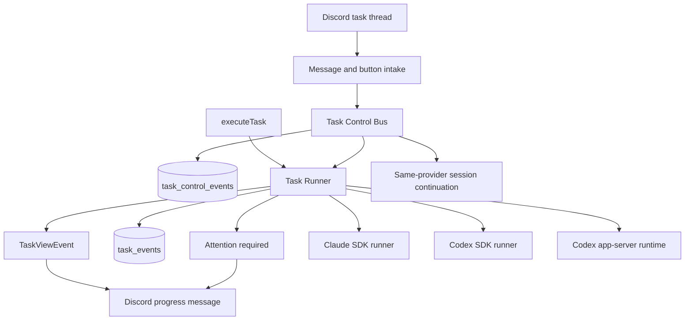

# Discord Agent Control Plane

Status: draft
Date: 2026-05-25

## Background

MiniClaw already owns the Discord task intake path and the Claude or Codex task runtime. The target requirement is mobile operational control: when the operator leaves the work computer, Discord should show live task progress and allow the operator to intervene from a phone.

The desired behavior is not only "send the final result to Discord". The control surface should support:

- observing running Claude and Codex tasks from the task thread;
- sending follow-up instructions while a task is active;
- approving or denying high-risk tool operations;
- cancelling or pausing a task from Discord;
- relaying control of either a Claude Code task or a Codex task through Discord while preserving that provider's task context.

Three reference projects show useful patterns:

- MioIsland: observes Claude Code sessions with hooks, routes phone messages into the exact terminal session, and relays permission requests back to the phone.
- Happy: wraps Claude and Codex startup, owns a remote message queue, and can switch a running session between local and remote mode.
- Remodex: keeps Codex execution on the Mac and forwards phone traffic through a local bridge to `codex app-server` using JSON-RPC.

MiniClaw should borrow the control-plane ideas, not the whole product shape. Discord is already the mobile UI, and MiniClaw already owns task runtime creation for its own tasks.

## Goals

- Keep MiniClaw as the authoritative owner of task lifecycle, provider selection, task rows, task events, Discord rendering, and cancellation.
- Add a task-scoped control bus so Discord messages and buttons can become structured control events.
- Preserve the existing one-thread-per-task Discord model.
- Support live progress for both Claude and Codex through `TaskViewEvent`.
- Support live Claude tool approval through the existing Claude Agent SDK `canUseTool` boundary.
- Keep the current Codex SDK runner as the stable default for streamed one-shot turns.
- Add a separate Codex app-server runtime for true Codex live interruption, approval, and bidirectional control.
- Support same-provider continuation: a Discord thread should be able to continue the Claude or Codex session that created it.

## Non-Goals

- Do not treat terminal injection as the primary path for MiniClaw-owned tasks.
- Do not implement provider switching between Claude and Codex. A Claude session id and a Codex thread id are different provider contexts and should not be transferred or converted.
- Do not make this primarily an Agent Run Manager feature. Internal multi-agent orchestration and operator control are separate layers.
- Do not build a new mobile app or relay service while Discord already covers the mobile surface.
- Do not expose multi-user or public Discord control. Production remains single-operator unless access control is redesigned.
- Do not send raw provider payloads or unredacted tool input directly to Discord.

## Existing Architecture Evidence

- `docs/runtime/README.md`: current runtime map is Discord or IM intake -> task runtime -> Claude, Codex, or managed runtime -> task events -> delivery.
- `docs/bot-routing.md`: thread continuation already wins before task-channel and chat routing, and resumes prior provider sessions through `resumeSessionId`.
- `src/agent/task.ts`: `executeTask()` owns task lifecycle, `AbortController`, task DB state, `TaskReporter`, and `DiscordTaskViewReporter` wiring.
- `src/agent/runners/types.ts`: the runner contract currently includes `signal`, `onViewEvent`, `onTraceEvent`, and `resumeSessionId`, but no control queue or approval callback.
- `src/agent/runners/claude-task-runner.ts`: Claude already uses an async `canUseTool` callback for policy decisions, which can become the Discord approval wait point.
- `src/agent/runners/codex-task-runner.ts`: Codex currently uses `@openai/codex-sdk` `thread.runStreamed(...)`, which streams progress and supports abort, but is not a full interactive control protocol.
- `src/bot/button-dispatch.ts`: button dispatch already centralizes cron retry and Smart Router buttons; task control buttons should be added with a distinct `miniclaw:task-control:*` prefix.
- `src/store/schema.ts`: `tasks` and `task_events` exist, but there is no durable task control event table.
- `src/agent/run-manager/**`: Agent Run Manager can expose internal orchestration events later, but the first slice should solve operator control outside the manager.

## Reference Project Takeaways

### MioIsland

MioIsland is strongest as an external-session companion. It detects Claude or Codex related session state, uses hooks for state and permission events, and can route phone messages into a selected terminal session.

Borrow:

- phase-oriented live status;
- permission request relay with allow or deny decisions;
- echo deduplication for messages injected from a remote surface;
- clear distinction between observation, terminal input, and permission requests.

Avoid as the primary path:

- relying on terminal pane capture as the source of truth;
- using terminal injection for tasks MiniClaw started itself;
- making cwd or terminal title matching part of normal task routing.

Terminal injection can remain a future fallback for external Claude Code sessions that MiniClaw did not start.

### Happy

Happy is strongest as a wrapper-owned remote execution loop. It launches Claude or Codex through its own command, owns remote mode, keeps a next-message queue, and handles permission requests through the wrapper.

Borrow:

- task-scoped remote input queue;
- explicit local vs remote control mode;
- ready and attention-required notifications;
- abort-current-turn semantics separate from killing the whole session.

Avoid as the primary product shape:

- requiring users to replace every local `claude` or `codex` command with a MiniClaw wrapper;
- introducing a separate mobile application when Discord already provides the mobile interaction surface.

### Remodex

Remodex is the best reference for Codex live control. Its important design point is that the Mac remains the execution host while the bridge forwards JSON-RPC messages to `codex app-server`.

Borrow:

- `codex app-server` as the substrate for true Codex live control;
- keeping the Codex process warm across transient mobile reconnects;
- explicit thread and turn lifecycle;
- using persisted Codex sessions as the durable history source, while treating the bridge as the live control path.

Avoid:

- building an iOS app or relay layer for MiniClaw before Discord control is insufficient;
- assuming Codex desktop is a live subscriber to externally driven app-server activity.

## Target Architecture



`TaskControlBus` should be task-scoped. It should provide a fast in-memory queue for live runs and a durable SQLite append table for restart recovery, audit, and stale-state cleanup.

Candidate event shape:

```ts
type TaskControlEvent =
  | { type: "operator_message"; text: string; discordMessageId: string }
  | { type: "cancel"; reason?: string }
  | { type: "pause_after_turn" }
  | { type: "approve_tool"; requestId: string; actorId: string }
  | { type: "deny_tool"; requestId: string; actorId: string; reason?: string }
  | { type: "set_mode"; mode: "observe" | "interactive" | "yolo" };
```

Candidate runner control contract:

```ts
interface TaskRunnerControl {
  poll(): Promise<TaskControlEvent[]>;
  waitForOperatorInput(reason: string): Promise<string>;
  requestApproval(request: ToolApprovalRequest): Promise<ApprovalDecision>;
  attention(message: string): Promise<void>;
}
```

`TaskRunnerInput` should grow a `control?: TaskRunnerControl` field. Single-shot runners can ignore it initially. Interactive runtimes should use it for approvals, queued follow-up instructions, and pause or cancel decisions.

## Discord UX

Keep one Discord thread per task. The persistent progress message should show:

- task id, provider, model, cwd, and provider session id;
- current phase: running, waiting for approval, waiting for input, paused, cancelled, failed, or completed;
- recent tool steps;
- queued operator instruction count;
- action buttons that are valid for the current phase.

Suggested button prefixes:

- `miniclaw:task-control:cancel:<taskId>`
- `miniclaw:task-control:pause:<taskId>`
- `miniclaw:task-control:approve:<requestId>`
- `miniclaw:task-control:deny:<requestId>`

Thread message behavior:

- If the task is waiting for input, deliver the message immediately through `TaskControlBus`.
- If the task is running, queue the message as the next operator instruction and acknowledge it in the thread.
- If the task is completed and has a `session_id`, keep the existing continuation behavior and create a resumed task.
- If the thread belongs to a cron task, do not allow user continuation unless an explicit manual resume path is added.

## Claude Runtime Plan

Claude should be the first provider to receive live approval support.

Implementation:

1. Extend `TaskRunnerInput` with `control`.
2. In `claude-task-runner.ts`, keep deterministic policy checks first.
3. When a tool use requires operator approval, call `control.requestApproval(...)` from `canUseTool`.
4. Emit an attention-required `TaskViewEvent` so Discord updates the persistent progress message and adds approve or deny buttons.
5. Resolve the pending `canUseTool` promise from `button-dispatch.ts` when the operator clicks a button.
6. On timeout, deny by default and record a `task_events` warning.

The first slice should not attempt arbitrary mid-turn prompt injection. Follow-up messages can be queued and applied at the next safe point or through the existing resume path.

## Codex Runtime Plan

Codex needs two runtimes:

1. `codex-sdk` runtime: keep the current `@openai/codex-sdk` streamed runner for stable one-shot task execution, live progress, cancellation, and natural continuation after turn completion.
2. `codex-app-server` runtime: add a new runtime that starts or connects to `codex app-server`, speaks JSON-RPC over stdio or a configured endpoint, and supports `thread/start`, `thread/resume`, `turn/start`, `turn/interrupt`, and approval request handling.

The app-server runtime should be opt-in until verified. It should not replace the existing SDK path in the same slice.

Minimum app-server runtime responsibilities:

- start or reuse an app-server process;
- initialize JSON-RPC client state;
- start or resume a thread for the MiniClaw task;
- stream thread, turn, item, and approval events into `TaskViewEvent` and `task_events`;
- map Discord approve or deny buttons to app-server approval responses;
- map Discord cancel or pause to turn interruption;
- persist `codex:<threadId>` as the provider session id.

## Same-Provider Relay Model

Discord relay means the operator can continue or intervene in the provider session that already belongs to the task thread.

- A Claude task thread resumes the existing Claude session.
- A Codex task thread resumes the existing Codex thread.
- A running task can receive queued operator instructions through `TaskControlBus` when the runner reaches a safe point.
- A completed task can keep the existing thread-continuation behavior and start a new MiniClaw task with `resumeSessionId`.

Provider switching is intentionally out of scope. If the operator wants to start a new task with the other provider, that should be a separate task with an explicit prompt. MiniClaw should not hide that as an automatic continuation.

## Implementation Plan

1. Add durable task control storage.
   - Create `task_control_events`.
   - Add repository helpers for append, list pending, resolve pending approval, and expire stale events.
   - Add unit tests for ordering, deduplication, and restart recovery shape.

2. Add `TaskControlBus`.
   - Provide an in-memory live queue per active task.
   - Mirror every control event to SQLite.
   - Add pending approval registry with timeout and deny-by-default behavior.

3. Wire Discord controls.
   - Extend `button-dispatch.ts` for `miniclaw:task-control:*`.
   - Extend task thread message handling to queue operator messages when the task is still running.
   - Update the persistent progress renderer for waiting approval, queued input, and pause states.

4. Implement Claude approvals.
   - Call `control.requestApproval` from `canUseTool` only after local policy allows escalation.
   - Emit attention-required events.
   - Add focused fake control tests and Claude runner unit tests around approve, deny, timeout, and abort.

5. Add same-provider relay and resume polish.
   - Make running-thread operator messages become queued control events.
   - Keep completed-thread continuation on the existing `resumeSessionId` path.
   - Add clear Discord copy when a user asks to switch providers, explaining that provider switching starts a separate task.

6. Add Codex app-server runtime.
   - Keep behind config such as `runtime.codex.mode: sdk | app_server`.
   - Implement JSON-RPC transport, initialize, thread start/resume, turn start, turn interrupt, and approval response.
   - Add fake app-server tests before enabling live usage.

7. Add recovery and operations cleanup.
   - On startup, mark stale pending approvals as expired.
   - Rehydrate pending control events for active or interrupted tasks.
   - Add task-log visibility for control events.
   - Add doctor checks for app-server availability when the app-server runtime is enabled.

## Verification Plan

- Type check: `pnpm run typecheck`.
- Unit tests:
  - task control repository;
  - `TaskControlBus`;
  - button dispatch for task-control custom ids;
  - Claude approval allow, deny, timeout, and abort;
  - same-provider relay and resume behavior;
  - Codex app-server JSON-RPC transport with a fake server.
- Integration tests:
  - Discord task thread queues follow-up input while a fake task is running;
  - approval button resolves a pending fake provider request;
  - cancel still lands as `cancelled`;
  - resume still works for completed provider sessions.
- Manual live checks:
  - start a Claude task that needs a risky tool, approve from Discord mobile, and confirm the task continues;
  - deny the same request and confirm the task receives a clear denial;
  - start a Codex SDK task and verify progress, cancel, and post-turn continuation;
  - run the app-server runtime in opt-in mode and verify interrupt, approval, and resume.
- Docs gates:
  - `pnpm run quality:docs`.
  - Update `CHANGELOG.md` in the implementation slice.

## Risks And Rollback

- Risk: Discord approvals can hang a provider turn forever.
  - Mitigation: approval timeout, deny-by-default, visible stale state, and startup expiry.
  - Rollback: disable interactive approval mode and return to local policy decisions.

- Risk: queued operator messages are applied at an unsafe point.
  - Mitigation: only consume queued input at explicit safe points, such as after a turn, after a provider asks for input, or after an operator-triggered pause.
  - Rollback: preserve queued messages as thread notes and rely on `/resume`.

- Risk: app-server JSON-RPC behavior changes across Codex versions.
  - Mitigation: isolate the app-server runtime, keep SDK runtime as default, add version and capability detection.
  - Rollback: switch `runtime.codex.mode` back to `sdk`.

- Risk: operator and agent both edit the workspace concurrently.
  - Mitigation: show current cwd and git status in progress and only consume queued operator instructions at safe points.
  - Rollback: require cancel or completion before accepting further operator instructions.

## Documentation Sync

- Runtime docs: update `docs/runtime/README.md` once the control bus is implemented.
- Bot routing docs: update `docs/bot-routing.md` when task control buttons and running-thread message behavior land.
- Task view boundary docs: update only if `TaskViewEvent` gains persistent new event types.
- Agent Run Manager docs: update only if Manager events become visible through this operator control layer.
- Website: no update for the plan alone; update only when public user-visible Discord control ships.
- Changelog: add entries in each implementation slice.

## Execution Notes

- 2026-05-25: Initial analysis captured as a design plan. No production code has been changed in this slice.
