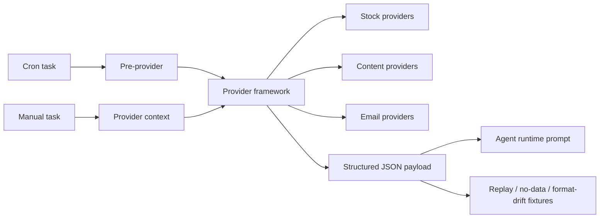

# MiniClaw Providers

> Conclusion: provider docs are the source-of-truth layer for external data collection, pre-provider context, provider safety boundaries, health/dry-run behavior, and provider output contracts. They are separate from runtime docs because providers own data trust and privacy boundaries, not Discord or Agent execution behavior.

## Provider Map

## Framework

- [`provider-framework.md`](provider-framework.md): provider manifest, health check, dry-run, structured output, fixture coverage, and compatibility adapter rules.

## Stock Providers

- [`stock/README.md`](stock/README.md): stock-provider family map and data-flow summary.
- [`stock/eastmoney.md`](stock/eastmoney.md): Eastmoney provider family, merging JYWG readonly holdings and MyFavor watchlist boundaries.
- [`stock/research.md`](stock/research.md): stock research pipeline across portfolio, pulse, market-intel, and watchlist research.
- [`../features/06-futu-stock.md`](../features/06-futu-stock.md): Futu stock account readonly MCP/provider.
- [`../features/10-stock-portfolio-provider.md`](../features/10-stock-portfolio-provider.md): multi-broker portfolio aggregation provider.
- [`../features/11-stock-pulse-provider.md`](../features/11-stock-pulse-provider.md): hourly stock pulse scanner.
- [`../features/14-market-intel-provider.md`](../features/14-market-intel-provider.md): CN/US market intelligence provider and forecast calibration loop.
- [`../features/18-stock-watchlist-research-provider.md`](../features/18-stock-watchlist-research-provider.md): watchlist-only research provider.

## Content Providers

- [`content.md`](content.md): content ingestion provider family and dedupe/data-flow boundary.
- [`../features/02-wechat-mp-provider.md`](../features/02-wechat-mp-provider.md): WeChat MP article metadata provider.

## Email Providers

- [`email.md`](email.md): shared email capability and email-business-consumer boundary.
- [`../features/07-email-capability.md`](../features/07-email-capability.md): read-only email capability.
- [`../features/08-cmb-credit-card-email-provider.md`](../features/08-cmb-credit-card-email-provider.md): CMB credit-card email parser/provider.

## Maintenance Rules

- Provider docs should state the trusted source, privacy boundary, owner code paths, output schema, and state/session commit semantics.
- Account/session/cookie details stay in `docs/private/**`; public provider docs only describe safe boundaries.
- Website pages may summarize provider capabilities, but implementation facts must link back through `source_docs`.
