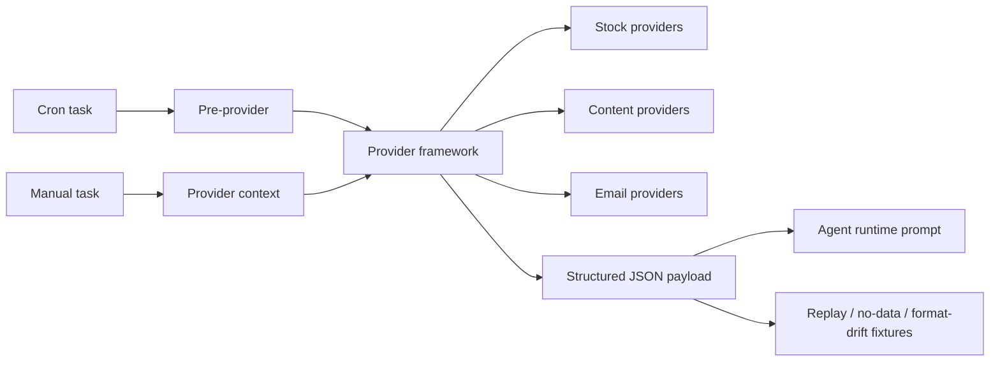

# MiniClaw Providers

> Conclusion: provider docs are the source-of-truth layer for external data collection, pre-provider context, provider safety boundaries, health/dry-run behavior, and provider output contracts. They are separate from runtime docs because providers own data trust and privacy boundaries, not Discord or Agent execution behavior.

## Provider Map

## Framework

- [`provider-framework.md`](provider-framework.md): provider manifest, health check, dry-run, structured output, fixture coverage, and compatibility adapter rules.

## Stock Providers

- [`stock/README.md`](stock/README.md): stock-provider family map, Futu readonly provider boundary, and stock data-flow summary.
- [`stock/eastmoney.md`](stock/eastmoney.md): Eastmoney provider family, merging JYWG readonly holdings and MyFavor watchlist boundaries.
- [`stock/research.md`](stock/research.md): stock research pipeline across portfolio, pulse, market-intel, and watchlist research.

Stock provider feature stubs have been merged and removed; use `stock/README.md` and `stock/research.md` as the current stock source docs.

## Content Providers

- [`content.md`](content.md): content ingestion provider family, currently the WeChat MP metadata provider and dedupe/data-flow boundary.

Content provider feature stubs have been merged and removed; use `content.md` as the current content source doc.

## Email Providers

- [`email.md`](email.md): Email provider family, merging the shared read-only Email capability, generic `email-query`, and CMB credit-card email parser boundaries.

Email provider feature stubs have been merged and removed; use `email.md` as the current email source doc.

## Maintenance Rules

- Provider docs should state the trusted source, privacy boundary, owner code paths, output schema, and state/session commit semantics.
- Account/session/cookie details stay in `docs/private/**`; public provider docs only describe safe boundaries.
- Website pages may summarize provider capabilities, but implementation facts must link back through `source_docs`.
