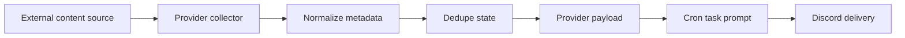

# Content Provider Docs

> Conclusion: content provider docs describe external content ingestion and dedupe boundaries. The current first content provider is WeChat MP; implementation details remain in the legacy feature doc for one migration cycle.

## Data Flow

## Current Providers

- [`../features/02-wechat-mp-provider.md`](../features/02-wechat-mp-provider.md): WeChat MP article metadata provider, session refresh, dedupe state, and cron usage.

## Contract

- Content providers should separate collection, dedupe, and prompt-ready payload formatting.
- Login/session refresh details belong in provider-specific docs or private notes, not website pages.
- Website pages may summarize content ingestion, but implementation facts should use this page or the linked canonical provider docs as `source_docs`.
