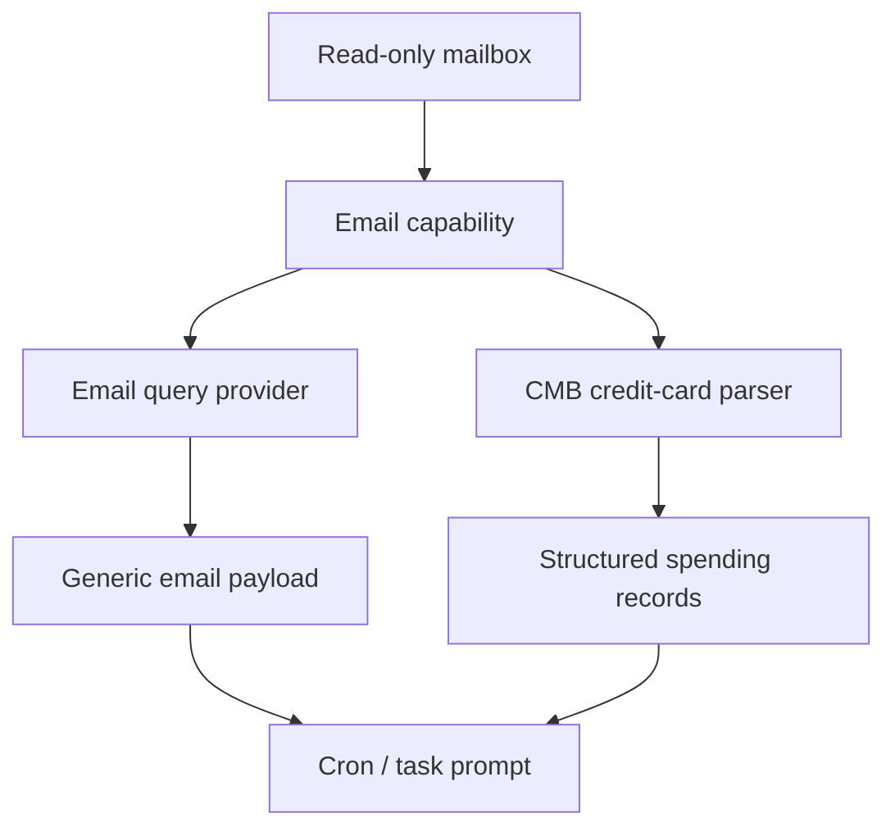

# Email Provider Docs

> Conclusion: email docs cover a shared read-only mail capability plus business consumers such as CMB credit-card parsing. The capability and the consumer should stay separate even when they share mailbox access.

## Data Flow

## Current Providers

- [`../features/07-email-capability.md`](../features/07-email-capability.md): shared read-only email capability and generic email query provider.
- [`../features/08-cmb-credit-card-email-provider.md`](../features/08-cmb-credit-card-email-provider.md): CMB credit-card email parser and consumer workflow.

## Contract

- Email access must stay read-only.
- Shared mailbox capability docs own auth, query, redaction, and general output behavior.
- Business consumer docs own parser-specific fields, accuracy limits, and cron usage.
