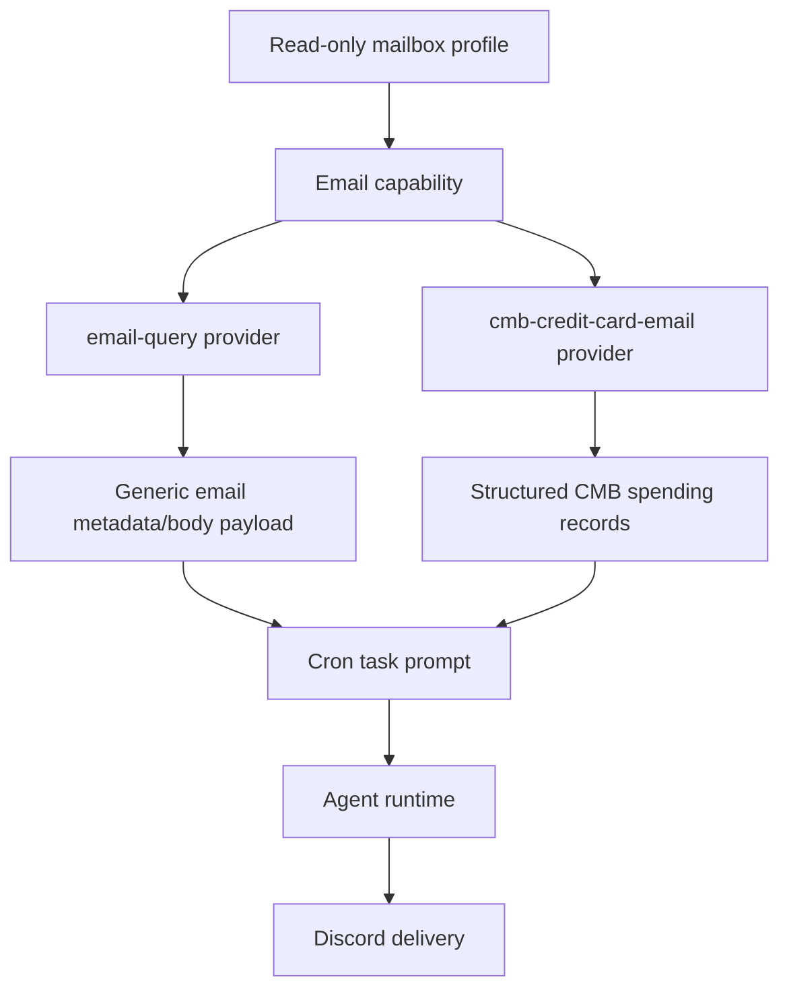

# Email Provider Family

> Conclusion: Email is a shared read-only capability plus provider consumers. `email-query` exposes controlled generic mailbox context, while `cmb-credit-card-email` parses CMB credit-card notifications into structured spending records. They share mailbox access, but parser-specific behavior and business semantics belong to the consumer provider.

## Family Map



## Runtime Boundaries

Shared email capability:

- Runtime path: `src/capabilities/email/**`.
- Trusted source: configured mailbox profiles under `~/.miniclaw/capabilities/email/config.yaml`.
- Business meaning: read-only message search, MIME body parsing, attachment metadata/text extraction under an explicit policy, redaction, and message-level dedupe state.
- Downstream use: `email-query`, `cmb-credit-card-email`, and future email-backed business providers.
- Non-goal: business parsing, Discord copywriting, or any mailbox write operation.

Generic email query provider:

- Runtime name: `email-query`.
- Runtime path: `src/providers/email-query/**`.
- Business meaning: controlled generic mailbox context for cron tasks.
- Output: formatted email query results with redacted sender/message information; body inclusion is opt-in.

CMB credit-card email provider:

- Runtime name: `cmb-credit-card-email`.
- Runtime path: `src/providers/cmb-credit-card-email/**`.
- Business meaning: CMB credit-card spending/refund extraction from matching notification emails.
- Output: structured spending records, totals, diagnostics, warnings, and optional task skip when no new transactions are found.

SMTP fallback notifier:

- Runtime path: `src/notifications/smtp-email.ts`.
- Business meaning: operations fallback notification when Discord or connectivity paths fail.
- Boundary: this notifier sends system alerts and is not part of the read-only Email capability.

## Shared Read-only Email Capability

Owner code paths:

```text
src/capabilities/email/
  config.ts          # ~/.miniclaw/capabilities/email/config.yaml loader
  query.ts           # profile-scoped message search entrypoint
  state.ts           # message-level dedupe state
  redaction.ts       # safe address/subject/message redaction helpers
  attachments.ts     # attachment metadata/text extraction policy
  clients/imap.ts    # current IMAP adapter
  types.ts
```

Current adapter support:

- Implemented: IMAP.
- Reserved provider values: `gmail` and `graph`; they are config-level future adapters, not current runtime implementations.

Mailbox profile config:

```yaml
# ~/.miniclaw/capabilities/email/config.yaml
profiles:
  cmb-notify:
    provider: imap
    account_alias: cmb-notify
    secret_path: "~/.miniclaw/secrets/email/cmb-notify.json"
    folders:
      - INBOX
    allowed_senders:
      - "cmbchina.com"
      - "cmbchina.com.cn"
    subject_allowlist:
      - 信用卡
      - 消费
      - 账单
    max_lookback_days: 7
    max_results: 50
    body_max_bytes: 512000
    raw_body_retention: none
    attachment_policy: download_allowlist
    redaction: strict
    state_path: "~/.miniclaw/capabilities/email/cmb-notify-state.json"
    imap:
      host: "imap.example.com"
      port: 993
      secure: true
      tls_reject_unauthorized: true
```

Secret file:

```json
{
  "username": "your-dedicated-mailbox@example.com",
  "password": "<mail-app-password>"
}
```

Safety contract:

- Allowed: read-only message search, MIME text parsing, attachment metadata, and explicit allowlisted text extraction.
- Forbidden: send, delete, move, mark-read, reply, forward, mailbox rule edits, secret persistence in repo docs/config, raw body retention beyond `raw_body_retention: none`, or unredacted addresses/tokens in logs/Discord/LLM prompts.
- State: capability state stores message hashes, provider UID, optional subject hash, received time, and seen time. It must not store raw body or credentials.

## Generic Email Query Provider

Config shape:

```yaml
# ~/.miniclaw/providers/email-query/default.yaml
email_profile: cmb-notify
folders:
  - INBOX
from:
  - "*.cmbchina.com"
subject_includes:
  - 信用卡
window_hours: 24
max_results: 20
include_body: false
include_attachments: false
dedupe: true
state_path: "~/.miniclaw/providers/email-query/default-state.json"
```

Cron example:

```yaml
name: daily-email-digest
schedule: "30 22 * * *"
timezone: Asia/Shanghai
enabled: true
type: task
channel: "<discord-channel-id>"
pre_provider: email-query
pre_provider_config: default
prompt: |
  Summarize the email metadata above.
  Do not output email addresses, raw message bodies, verification codes, or tokens.
```

Commit semantics:

```text
cron task
  -> pre_provider: email-query
    -> load query config
    -> search read-only mailbox profile
    -> filter already-seen messages when dedupe=true
    -> inject formatted provider result into the prompt
    -> commit seen-message state only after downstream task success
```

Provider contract:

- `include_body` defaults to `false`; body text must be deliberately enabled by the provider config.
- `include_attachments` defaults to `false`; attachment content extraction still depends on the capability profile policy.
- `dedupe: true` delays state writes until the cron task succeeds, preserving retry behavior.

## CMB Credit-card Email Provider

Config shape:

```yaml
# ~/.miniclaw/providers/cmb-credit-card-email/default.yaml
email_profile: cmb-notify
folders:
  - INBOX
from:
  - "cmbchina.com"
  - "cmbchina.com.cn"
subject_includes:
  - 招商
  - 信用卡
  - 消费
  - 账单
window_hours: 24
max_results: 50
currency: CNY
large_transaction_threshold: 1000
dedupe: true
include_attachments: true
parse_attachment_text: true
attachment_text_max_bytes: 128000
allowed_attachment_extensions:
  - .txt
  - .csv
  - .html
  - .htm
  - .json
  - .xml
  - .zip
diagnostic_search: true
skip_when_no_new_transactions: true
state_path: "~/.miniclaw/providers/cmb-credit-card-email/default-state.json"
```

Cron example:

```yaml
name: daily-cmb-credit-card
schedule: "*/30 11-23 * * *"
timezone: Asia/Shanghai
enabled: true
type: task
channel: "<private-discord-channel-id>"
pre_provider: cmb-credit-card-email
pre_provider_config: default
prompt: |
  Generate today's CMB credit-card spending summary from the parsed records above.

  Requirements:
  - Do not output email addresses, full card numbers, or raw email bodies.
  - Start with total spend, refund, net spend, and transaction count.
  - List large transactions and possible anomalies.
  - State that results are parsed from notification emails and final billing records remain authoritative.
```

Runtime flow:

```text
cron task
  -> pre_provider: cmb-credit-card-email
    -> load provider config
    -> search read-only email capability with body enabled
    -> optionally extract text from allowed attachment types
    -> parse CMB spend/refund records
    -> filter already-seen transactions when dedupe=true
    -> optionally skip downstream task when no new transactions exist
    -> commit transaction state only after downstream task success
```

Output fields:

- Summary: `transaction_count`, `skipped_duplicates`, `total_spend`, `total_refund`, `net_spend`, `large_transaction_threshold`, `large_transactions`, `transactions`.
- Transaction: `occurred_at`, `direction`, `amount`, `currency`, `merchant`, `card_tail_hash`, `message_id_hash`, `source_medium`, `source`.
- Diagnostics: `matched_email_count`, `candidate_email_count`, `attachment_count`, `downloadable_attachment_count`, parsed body/attachment counts, unsupported/failed attachment counts, `skipped_reason_counts`, and redacted `latest_candidates`.
- Warnings: parser mismatch, subject-filter mismatch, attachment extraction failures, duplicate skips, and no-parsed-transaction cases.

Parser contract:

- Directions are limited to `spend` and `refund`.
- Card tails are hashed; full card numbers must never be emitted.
- Attachments are text-only under explicit allowlisted extensions. PDF, encrypted ZIP, images, and unknown binary formats stay diagnostic-only unless a future parser adds a safe extraction path.
- This is not a bank ledger API. Email delays, template changes, refunds, reversals, pre-authorizations, FX fees, and monthly statement reconciliation can diverge from parsed notification records.

Skip behavior:

- When `skip_when_no_new_transactions: true`, the provider can skip the downstream LLM task.
- Skip reasons include no matching CMB email, no newly parsed transactions, or all parsed transactions being duplicates.
- This supports frequent polling without sending repeated "zero transaction" Discord summaries.

## Legacy Compatibility

The previous feature-level docs are compatibility stubs for one migration cycle:

- [`../archive/features/07-email-capability.md`](../archive/features/07-email-capability.md)
- [`../archive/features/08-cmb-credit-card-email-provider.md`](../archive/features/08-cmb-credit-card-email-provider.md)

New implementation facts should be added to this provider-family doc. Private mailbox, credential, or account-specific setup details should stay out of public docs.

## Development Checklist

- If mailbox config, redaction, attachment extraction, dedupe state, or read-only boundaries change, update the Shared Email Capability section.
- If `email-query` query config, body/attachment behavior, or commit semantics change, update the Generic Email Query Provider section.
- If CMB parsing, diagnostics, skip reasons, output fields, or attachment parsing changes, update the CMB Credit-card Email Provider section.
- If website provider pages mention Email behavior, keep their `source_docs` pointed at this page and its Chinese pair.
- Verification owner:

```bash
pnpm vitest run src/capabilities/email src/providers/email-query src/providers/cmb-credit-card-email
pnpm run quality:docs
pnpm run typecheck
```
