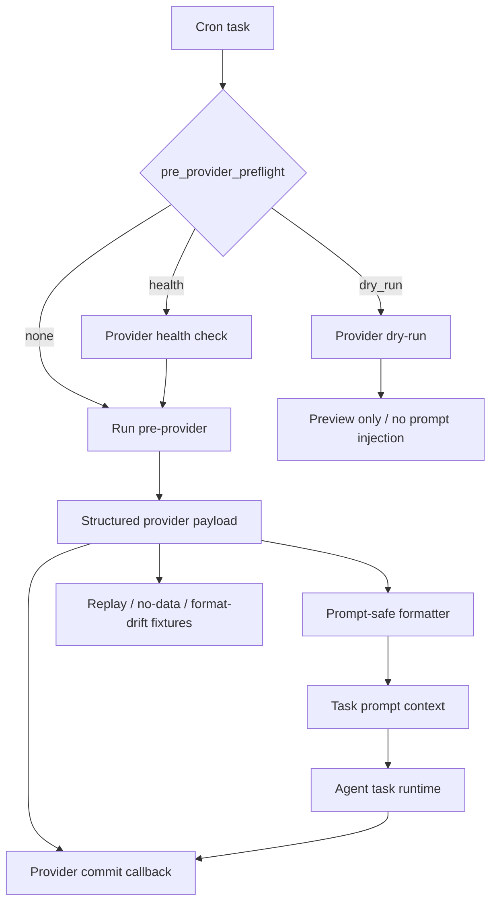

# MiniClaw Provider Framework

> Conclusion: provider framework docs own the contract for manifest metadata, health checks, dry-run previews, structured output, fixture coverage, failure taxonomy, and safe state/session commit semantics. Provider-specific docs own each provider's trusted source and business payload.

## Runtime Shape



## Owner Code Paths

```text
src/providers/framework.ts
src/providers/index.ts
src/cron/runner-task.ts
scripts/provider-health.ts
scripts/provider-dry-run.ts
scripts/quality-docs.ts
src/providers/*/__tests__/**
```

Provider modules that implement the framework path expose `manifest`, `healthCheck`, `dryRun`, and `run` through `ProviderModule`. Legacy providers can still be adapted through `runProviderModuleAsPreProvider()` while they are migrated.

## Contract

Provider framework invariants:

- Providers must declare safe boundaries through manifest metadata.
- Health check and dry-run are explicit capabilities, not assumed behavior.
- Dry-run preview is for validation; it must not inject provider output into the downstream prompt.
- Structured output must be redacted, deterministic where possible, and fixture-testable.
- Provider state/session commit must happen only after the downstream task succeeds when the provider has side effects.
- Sensitive providers must fail closed on expired sessions, login challenges, captchas, unexpected response shapes, or redaction failures.
- Provider failures should use stable categories that cron and Auto Doctor can report.

## Cron Preflight

`pre_provider_preflight` supports the runtime gate before actual task creation:

```yaml
pre_provider: stock-pulse
pre_provider_config: us-hourly
pre_provider_preflight: health
```

Expected behavior:

- `health`: run provider health check and continue only when it passes.
- `dry_run`: run provider dry-run and report preview without injecting prompt context.
- unset: run the provider directly as the cron pre-provider.

Provider docs must describe which preflight modes are supported and whether they require network/session access.

## Structured Output

Provider output should separate:

- `run_context`: profile, market scope, time window, skipped state, source status.
- `payload`: deterministic structured facts for the LLM.
- `warnings`: degraded sources, stale data, partial results, fallback sources.
- `usage_notes`: prompt-facing safety and interpretation constraints.
- `commit`: optional callback to update dedupe/session state after downstream success.

The provider formatter may produce a text block for task prompts, but canonical provider behavior should remain expressible as structured JSON for tests and future generated references.

## Fixture Coverage

Migrated framework providers should keep fixtures for:

- replay / successful payload,
- no-data or skipped-market behavior,
- format drift / degraded upstream response.

Good fixture locations:

```text
src/providers/<provider>/fixtures/*.json
src/providers/<provider>/__tests__/*.test.ts
```

`quality:docs` and provider docs should stay aligned when fixture expectations become part of provider quality gates.

## Failure Taxonomy

Provider failures should preserve enough information for cron and Auto Doctor without leaking sensitive details:

- `config_error`: invalid or missing local config.
- `auth_required`: missing or expired session.
- `upstream_blocked`: captcha, login challenge, permission failure, rate limit, or upstream denial.
- `upstream_format_drift`: response shape changed or parser no longer matches.
- `network_error`: timeout, DNS, TLS, or connection failure.
- `no_data`: source returned no eligible data and the provider treats that as a controlled skip.
- `partial_data`: optional source failed but the provider can continue with warnings.

## Provider Author Checklist

- Define the trusted upstream source and whether it is public, account-bound, or private.
- Define read/write boundaries and explicitly forbid unsafe operations.
- Keep credentials, cookies, account IDs, validatekeys, and tokens outside repo docs and prompt output.
- Add config examples under user-local `~/.miniclaw/**` paths.
- Make dedupe/session state commit conditional on downstream success.
- Add health/dry-run support when the provider has fragile upstream/session dependencies.
- Add replay/no-data/format-drift fixtures for migrated framework providers.
- Update website `source_docs` if the public provider summary mentions the changed behavior.

## Legacy Compatibility

The previous feature-level framework doc is a compatibility stub for one migration cycle:

- [`../features/16-provider-framework.md`](../features/16-provider-framework.md)

The old Chinese feature placeholder is historical; the current Chinese pair is [`../zh/providers/provider-framework.zh.md`](../zh/providers/provider-framework.zh.md).

Verification owner:

```bash
pnpm vitest run src/providers/__tests__/framework.test.ts
pnpm run quality:docs
pnpm run typecheck
pnpm run lint
```
