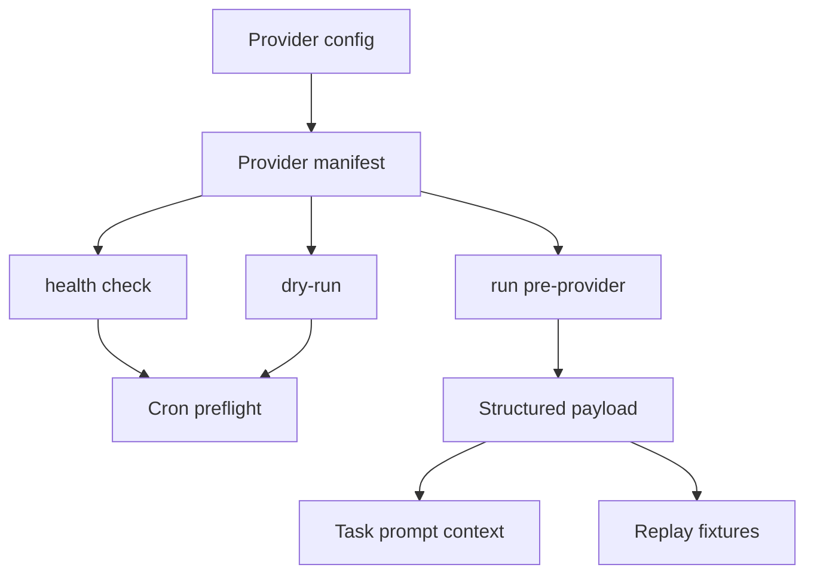

# MiniClaw Provider Framework

> Conclusion: `docs/features/16-provider-framework.md` remains the detailed implementation record for the first migration slice, while this page is the provider-framework entrypoint for the new docs taxonomy. Future provider framework changes should update this page first, and may keep the legacy feature doc as a historical compatibility path for one release cycle.

## Runtime Shape

## Canonical Detail

- Detailed implementation contract: [`../features/16-provider-framework.md`](../features/16-provider-framework.md)
- Current Chinese placeholder: [`../zh/features/16-provider-framework.zh.md`](../zh/features/16-provider-framework.zh.md)

## Owner Code Paths

- `src/providers/framework.ts`
- `src/providers/index.ts`
- `src/cron/runner-task.ts`
- `scripts/quality-*`
- provider-specific directories under `src/providers/**`

## Contract

- Providers must declare safe boundaries through manifest metadata.
- Health check and dry-run are explicit capabilities, not assumed behavior.
- Provider output should be structured, redacted, and fixture-testable.
- Provider state/session commit must happen only after the downstream task succeeds when the provider has side effects.
