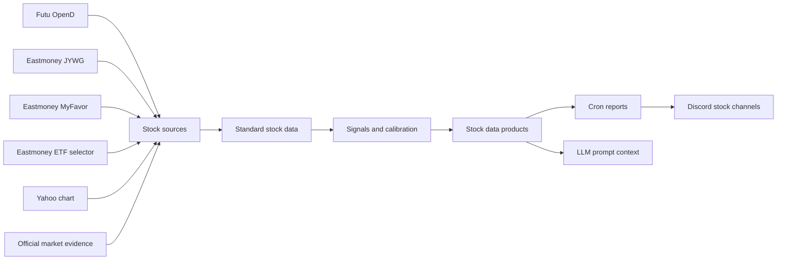

# Stock Data System

> Conclusion: stock docs are organized around the data system, not around the provider folder tree. Data sources fetch raw facts, `src/stock/data` and `src/stock/signals` normalize and score them, `src/stock/reports` packages task-ready products, and cron/provider wrappers only keep MiniClaw runtime compatibility.

## System Map



## Documentation Set

- [`data-and-sources.md`](data-and-sources.md): trusted sources, session boundaries, source reliability, and normalized stock data semantics.
- [`workflows.md`](workflows.md): stock data products and the current cron workflows that use them.
- [`operations-and-security.md`](operations-and-security.md): health checks, refresh commands, safety rules, and common recovery paths.
- [`../../plans/2026-05-17-stock-provider-data-layer-migration.md`](../../plans/2026-05-17-stock-provider-data-layer-migration.md): historical migration plan for the data-layer-first architecture.

## Runtime Layers

```text
src/stock/
  sources/   # external Futu, Eastmoney, Yahoo, and official evidence adapters
  data/      # calendar, universe, quotes, portfolio, ETF premium, market evidence, market memory
  signals/   # pulse anomaly, market-intel scoring, forecast evaluation, calibration
  reports/   # cron-facing stock report composers and prompt payload renderers
  types.ts   # vendor-neutral stock domain types
```

`src/providers/*/index.ts` files for stock providers are compatibility wrappers. They re-export report composers from `src/stock/reports/*` so existing cron YAML can keep using `pre_provider`, `pre_provider_config`, and `pre_context_providers`.

The boundary is deliberate:

- `src/stock/sources/*`, `src/stock/data/*`, and `src/stock/signals/*` do not import stock-specific provider modules.
- `src/stock/reports/*` may import provider config loaders and provider framework types because reports are the cron-facing product layer.
- `src/providers/<stock-provider>/config.ts` remains the named config loader for local files under `~/.miniclaw/providers/**`.
- Provider tests and fixtures may stay under `src/providers/**/__tests__` or `fixtures/` when they verify runtime compatibility.

## Data Products

Current stock products are:

- `stock-portfolio`: combines readonly broker/account evidence into redacted portfolio and asset summaries.
- `stock-pulse`: scans held and watchlist symbols for intraday movement and anomaly signals.
- `market-intel`: gathers market evidence, quote context, portfolio context, and calibrated market scores.
- `market-context`: stores and injects rolling multi-day market memory.
- `market-forecast-evaluation`: evaluates stored market forecasts against benchmark outcomes.
- `stock-watchlist-research`: researches broker watchlist symbols that are not already held.

## Core Rules

- Holdings and watchlist symbols are different data types.
- Public ETF premium data can enrich a held ETF by code, but it never proves account ownership.
- Market context is memory, not a real-time quote source.
- Forecast evaluations are calibration telemetry, not trading instructions.
- No stock provider may unlock trading, place orders, modify orders, transfer funds, or bypass login challenges.

## Verification

```bash
pnpm vitest run src/providers/stock-portfolio src/providers/stock-pulse src/providers/market-intel src/providers/market-context src/providers/market-forecast-evaluation src/providers/stock-watchlist-research
pnpm vitest run src/mcp/futu-stock src/mcp/eastmoney-jywg src/mcp/eastmoney-myfavor src/providers/futu-stock src/providers/eastmoney-jywg-readonly src/providers/eastmoney-etf-premium
pnpm run quality:docs
pnpm run typecheck
```
