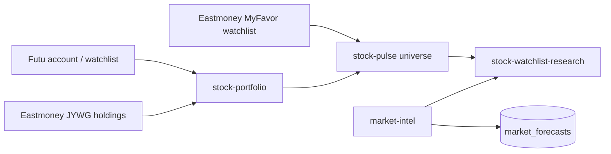

# Stock Provider Docs

> Conclusion: stock provider docs describe portfolio, watchlist, market-intel, and research data flows. Account-specific sessions and private brokerage details stay outside public website pages.

## Data Flow

## Canonical Docs

- [`eastmoney.md`](eastmoney.md): Eastmoney family boundary for JYWG holdings and MyFavor watchlist.
- [`research.md`](research.md): stock research provider pipeline across portfolio, pulse, market-intel, and watchlist research.
- [`../../features/06-futu-stock.md`](../../features/06-futu-stock.md): Futu readonly account provider.
- [`../../features/10-stock-portfolio-provider.md`](../../features/10-stock-portfolio-provider.md): stock portfolio aggregation provider.
- [`../../features/11-stock-pulse-provider.md`](../../features/11-stock-pulse-provider.md): stock pulse scanning provider.
- [`../../features/14-market-intel-provider.md`](../../features/14-market-intel-provider.md): market intelligence provider.
- [`../../features/18-stock-watchlist-research-provider.md`](../../features/18-stock-watchlist-research-provider.md): watchlist research provider.
