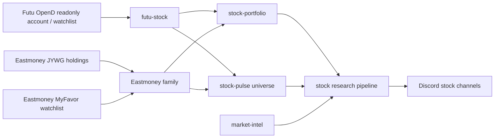

# Stock Provider Family

> Conclusion: stock provider docs describe readonly brokerage/account sources, watchlist sources, market evidence, and research workflows. Account-specific sessions and private brokerage details stay outside public website pages.

## Data Flow



## Canonical Docs

- [`../../plans/2026-05-17-stock-provider-data-layer-migration.md`](../../plans/2026-05-17-stock-provider-data-layer-migration.md): target migration plan for a data-layer-first stock architecture with cron providers as the orchestration layer.
- [`eastmoney.md`](eastmoney.md): Eastmoney family boundary for JYWG holdings and MyFavor watchlist.
- [`research.md`](research.md): stock research provider pipeline across portfolio, pulse, market-intel, and watchlist research.

## Current Code Layout

Stock cron provider names remain registered through `src/providers/index.ts`. Each stock provider `src/providers/*/index.ts` is now a compatibility wrapper that re-exports the report composer in `src/stock/reports/*`.

Reusable stock internals are organized by data responsibility:

```text
src/stock/
  sources/   # external Futu, Eastmoney, Yahoo, and official evidence adapters
  data/      # calendar, universe, quotes, portfolio, ETF premium, market evidence, market memory
  signals/   # pulse anomaly, market-intel scoring, forecast evaluation, context synthesis
  reports/   # cron-facing stock report composers
  types.ts   # vendor-neutral stock domain types
```

This is a compatibility migration: cron YAML fields such as `pre_provider`, `pre_provider_config`, and `pre_context_providers` do not change.

`src/providers/*` should not own stock source/data implementations. After the source/data cleanup slice, stock provider folders keep cron registration, runtime config loaders, provider-specific types, fixtures, and some report-format helpers; reusable source/data logic lives under `src/stock/sources/*` and `src/stock/data/*`.

## Futu Stock Provider

Runtime names:

- MCP server: `futu-stock`.
- Cron pre-provider: `futu-stock`.
- Stock-pulse universe source: `futu_watchlist`.

Owner code paths:

```text
src/mcp/futu-stock/
  server.ts        # stdio MCP server with readonly tools
  config.ts        # ~/.miniclaw/providers/futu-stock/config.yaml
  futu-client.ts   # Python bridge to official futu-api / moomoo package
  mapper.ts        # Futu fields -> unified account snapshot
  redact.ts        # prompt/Discord-safe redaction
  safety.ts        # readonly tool and forbidden API checks
  state.ts
  types.ts

src/providers/futu-stock/
  index.ts         # cron pre_provider compatibility wrapper
  config.ts        # ~/.miniclaw/providers/futu-stock/<name>.yaml
  format.ts        # safe context formatter

src/stock/reports/futu-stock.ts
  # report composer used by the cron provider wrapper

src/stock/sources/futu/
  # source adapter exports around Futu OpenD readonly access
```

Trusted source:

- Futu / moomoo official OpenAPI through local OpenD.
- OpenD should listen only on `127.0.0.1`.
- MiniClaw talks to OpenD through the official Python SDK bridge; it does not store Futu account password or trading password.

Command:

```bash
pnpm mcp:futu-stock
```

Readonly tools:

- `futu_health_check`
- `futu_get_account_snapshot`
- `futu_get_positions_summary`
- `futu_get_daily_pnl_report`

Forbidden behavior:

- `unlock_trade`
- `place_order`
- `modify_order`
- automatic trading, strategy trading, fund transfer, or any trade-password workflow
- exposing account IDs, phone numbers, tokens, raw SDK session data, or OpenD credentials to logs/Discord/LLM prompts

Provider usage:

```yaml
pre_provider: futu-stock
pre_provider_config: us-stock
```

Stock-pulse universe source usage:

```yaml
universe:
  include_sources: true
  sources:
    - type: futu_watchlist
      name: futu-us-watchlist
      market: us
      profile: us
      groups: ["Favorites"]
      limit: 80
```

Futu watchlist rows are observation-universe symbols. They must not be rendered as account holdings unless they also arrive through a portfolio/account provider payload.

## Provider Boundaries

- Holdings and watchlists are different source types.
- Account providers may feed `stock-portfolio`; watchlist sources may feed `stock-pulse` and watchlist research.
- Provider code should compute deterministic evidence before LLM interpretation.
- Public website pages may summarize stock capabilities, but implementation facts should link back to this directory through `source_docs`.

## Legacy Cleanup

The previous Futu feature stub has been removed after migration. Stock research topics are documented in [`research.md`](research.md).

Verification owner:

```bash
pnpm vitest run src/mcp/futu-stock src/providers/futu-stock
pnpm vitest run src/providers/stock-portfolio src/providers/stock-pulse src/providers/market-intel src/providers/market-context src/providers/market-forecast-evaluation src/providers/stock-watchlist-research
pnpm run quality:docs
pnpm run typecheck
```
