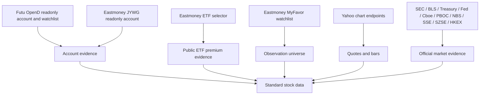

# Stock Data And Sources

> Conclusion: the stock system treats external integrations as data sources first. Each source has its own trust boundary, session model, and business meaning before any cron report or LLM prompt sees the data.

## Source Map



## Broker Account Sources

Futu OpenD:

- Runtime names: `futu-stock` MCP server and `futu-stock` cron pre-provider.
- Trusted source: official Futu / moomoo OpenAPI through local OpenD.
- Code paths: `src/mcp/futu-stock/**`, `src/stock/sources/futu/**`, `src/stock/reports/futu-stock*.ts`.
- Business meaning: account snapshot, positions summary, daily P&L, and optional watchlist symbols.
- Session model: MiniClaw talks to local OpenD; it does not store Futu account password or trading password.
- Watchlist rows are observation-universe symbols unless the same symbol also appears in an account payload.

Eastmoney JYWG:

- Runtime names: `eastmoney-jywg` MCP server and `eastmoney-jywg-readonly` cron pre-provider.
- Trusted source: `jywg.18.cn` readonly account pages and readonly query endpoints.
- Code paths: `src/mcp/eastmoney-jywg/**`, `src/stock/sources/eastmoney/**`, `src/stock/reports/eastmoney-jywg-readonly*.ts`.
- Business meaning: account holdings, account summary, position evidence, and premium fields returned with holdings.
- Session model: dedicated browser bootstrap, `~/.miniclaw/secrets/eastmoney-jywg-session.json`, atomic `0600` writes.
- Refresh model: `pnpm auth:refresh -- --provider eastmoney-jywg` only reads `/Trade/Buy` as a liveness proof and never queries holdings, orders, deals, or totals.

## Watchlist Sources

Futu watchlist:

- Source type: `futu_watchlist`.
- Trusted source: local Futu OpenD watchlist groups through the official SDK bridge.
- Downstream use: `stock-pulse.universe.sources` and watchlist research.
- Business meaning: observation universe only.

Eastmoney MyFavor:

- Source type: `eastmoney_myfavor_watchlist`.
- Trusted source: `myfavor.eastmoney.com` readonly group and securities endpoints.
- Code paths: `src/mcp/eastmoney-myfavor/**`, `src/stock/sources/watchlists.ts`, `src/stock/data/universe.ts`.
- Downstream use: `stock-pulse.universe.sources` and `stock-watchlist-research`.
- Session model: separate MyFavor browser bootstrap and separate `~/.miniclaw/secrets/eastmoney-myfavor-session.json`.
- Business boundary: MyFavor symbols must not feed `stock-portfolio` and must not be rendered as account holdings.

## Market And Public Sources

Eastmoney ETF selector:

- Runtime name: `eastmoney-etf-premium`.
- Trusted source: Eastmoney public fund selector endpoint queried by ETF code.
- Code paths: `src/stock/sources/eastmoney/etf-premium-client.ts`, `src/stock/data/etf-premium*.ts`, `src/stock/reports/eastmoney-etf-premium.ts`.
- Business meaning: public ETF discount/premium evidence only.
- Portfolio rule: it may enrich an existing JYWG-held ETF by exact code, but it never proves that the ETF is held.
- Field contract: raw `PREMIUM_DISCOUNT_RATIO` is preserved as `eastmoney_discount_ratio`; MiniClaw emits `premium_rate = 0 - PREMIUM_DISCOUNT_RATIO`.

ETF/index look-through sources:

- Runtime use: optional `stock-portfolio.equity_lookthrough_sources` config for private portfolio reports.
- Trusted source: configured public issuer or index holdings endpoints fetched at provider runtime.
- Supported shapes: HTTP JSON, CSV, and XLSX tables with configured company, ticker, and weight columns.
- Business meaning: single-stock exposure expansion for already-held ETF/index positions; it never proves account ownership.
- Failure policy: source failures, HTML/consent pages, empty tables, or parse drift become warnings; MiniClaw must not fall back to stale hardcoded index weights.
- Identity rule: static aliases may merge share classes or A/H lines for the same company, but aliases must not contain weight data.

Yahoo chart endpoints:

- Code paths: `src/stock/sources/yahoo/**`, `src/stock/data/market-quotes.ts`, `src/stock/data/quotes.ts`.
- Downstream use: `stock-pulse`, `market-intel`, `market-forecast-evaluation`, and watchlist research.
- Source tier: fallback or public market quote evidence, depending on the product.
- Failure policy: quote failures are warnings or controlled skips when the product can continue safely.

Official market evidence:

- Default sources include SEC, BLS, Treasury, Federal Reserve, Cboe history, PBOC, NBS, SSE, SZSE, HKEX, and Futu OpenD where permissions are available.
- Optional sources include FRED API, Polygon, and Tushare when local credentials exist.
- Code paths: `src/stock/sources/official/**`, `src/stock/data/market-evidence.ts`.
- Downstream use: `market-intel` and optional watchlist research market context.

## Standard Data Semantics

Holdings:

- Come only from account providers such as Futu account snapshots and Eastmoney JYWG holdings.
- May include quantity, market value, cost, P&L, allocation category, and premium evidence.
- May appear in private stock channels after redaction.

Watchlist symbols:

- Come from Futu watchlists, Eastmoney MyFavor, Yahoo screeners, Eastmoney public lists, or manual config.
- Represent an observation universe, not ownership.
- Must be excluded from watchlist research when already held.

Portfolio summaries:

- Built by `stock-portfolio` from readonly account sources.
- May contain `cny_summary`, `asset_summary`, `position_premium_summary`, source status, and warnings.
- `include_asset_totals: false` prevents double-counting integrated broker accounts or enrichment-only public sources.

Quote bars and benchmarks:

- Used by pulse anomaly scoring, market-intel snapshots, and forecast evaluation.
- Must carry capture time, provider symbol, source tier, and degradation warnings when fallback sources are used.

Market evidence:

- Structured evidence with source IDs, capture time, freshness, source tier, and scoring inputs.
- LLM reports should cite evidence IDs instead of inventing unsupported reasons.

Market memory:

- Stored through `market_context_daily` and `market_context_items`.
- Injected as background context; it must not override fresher provider evidence.

Forecast records:

- Stored in `market_forecasts`, `market_forecast_items`, and `market_forecast_evaluations`.
- Same-day forecast scoring requires explicit same-day probabilities.
- Horizon-only forecasts skip same-day hit/miss and Brier evaluation by design.

## Data Ownership

```text
src/stock/sources/   # adapters and upstream client boundaries
src/stock/data/      # normalized data structures and deterministic builders
src/stock/signals/   # scoring, anomaly detection, forecast evaluation, calibration
src/stock/reports/   # task-ready payloads, prompt formatting, and attachments
```

Provider config loaders still live under `src/providers/<name>/config.ts` because local runtime configuration is keyed by provider name.
