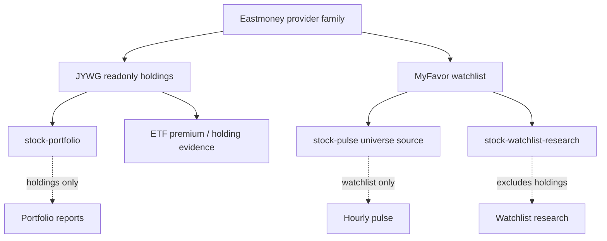

# Eastmoney Provider Family

> Conclusion: MiniClaw has two Eastmoney integrations with different trust and data boundaries. `eastmoney-jywg-readonly` reads account holdings from `jywg.18.cn`; `eastmoney-myfavor` reads watchlist securities from `myfavor.eastmoney.com`. They must stay separate at runtime even though they belong to one provider family in docs.

## Family Boundary

## JYWG Readonly Provider

Purpose:

- Read Eastmoney JYWG account holdings, fund/account summaries, and readonly portfolio evidence.
- Feed `stock-portfolio` and stock-account reporting flows.
- Preserve account privacy through redaction and private config/session boundaries.

Runtime owner paths:

- `src/mcp/eastmoney-jywg/**`
- `src/providers/eastmoney-jywg-readonly/**`
- `scripts/eastmoney-jywg-login.ts`

Safety contract:

- Readonly endpoints only.
- No order, trade, transfer, password, or write endpoint.
- Session/cookie details stay in `docs/private/eastmoney/**` or local `~/.miniclaw` state, not public docs or website pages.

Legacy detailed doc:

- [`../../features/09-eastmoney-jywg-readonly-provider.md`](../../features/09-eastmoney-jywg-readonly-provider.md)

## MyFavor Watchlist Provider

Purpose:

- Read Eastmoney MyFavor groups and securities.
- Feed `stock-pulse.universe.sources` and watchlist-only research.
- Keep watchlist symbols separate from account holdings and portfolio reporting.

Runtime owner paths:

- `src/mcp/eastmoney-myfavor/**`
- `scripts/eastmoney-myfavor-login.ts`
- `src/providers/stock-pulse/**`
- `src/providers/stock-watchlist-research/**`

Safety contract:

- Readonly group/list endpoints only.
- No create/delete/move/edit watchlist endpoint.
- No reuse of JYWG holdings session for MyFavor watchlist behavior.
- No connection to `stock-portfolio` as a holding source.

Legacy detailed doc:

- [`../../features/17-eastmoney-myfavor-watchlist.md`](../../features/17-eastmoney-myfavor-watchlist.md)

## Development Checklist

- If JYWG holding payloads or redaction change, update this family doc and the JYWG legacy detail doc.
- If MyFavor group/list behavior changes, update this family doc and the MyFavor legacy detail doc.
- If either integration is surfaced on the website, website pages must point to this page through `source_docs`.
- If private session or endpoint research changes, update `docs/private/eastmoney/**` instead of the public website.
