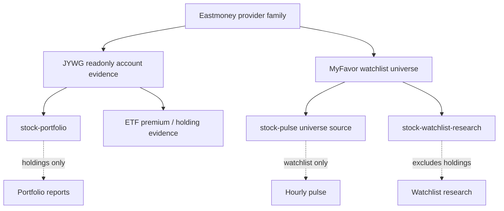

# Eastmoney Provider Family

> Conclusion: Eastmoney is now documented as one provider family with two separate runtime boundaries. `eastmoney-jywg-readonly` reads JYWG account evidence from `jywg.18.cn`; `eastmoney-myfavor` reads watchlist securities from `myfavor.eastmoney.com`. They share a docs family, but they must not share sessions, endpoints, or business semantics.

## Family Map



## Runtime Boundaries

JYWG readonly:

- Runtime names: `eastmoney-jywg-readonly` provider and `eastmoney-jywg` MCP server.
- Trusted source: `jywg.18.cn` readonly account pages and readonly query endpoints.
- Business meaning: account holdings, fund/account summary, position evidence, and ETF premium fields returned with holdings.
- Downstream use: `stock-portfolio`, account reporting, and holding-backed evidence.
- Session scope: `~/.miniclaw/secrets/eastmoney-jywg-session.json`, saved from a dedicated visible browser bootstrap.

MyFavor watchlist:

- Runtime name: `eastmoney-myfavor` watchlist source.
- Trusted source: `myfavor.eastmoney.com` readonly group/list endpoints.
- Business meaning: observation universe only, not holdings.
- Downstream use: `stock-pulse.universe.sources` and watchlist-only research.
- Session scope: `~/.miniclaw/secrets/eastmoney-myfavor-session.json`, saved from a separate visible browser bootstrap.

## JYWG Readonly Provider

Purpose:

- Read Eastmoney JYWG account holdings, fund/account summaries, and readonly portfolio evidence.
- Feed `stock-portfolio` and stock-account reporting flows.
- Preserve account privacy through redaction and private config/session boundaries.

Owner code paths:

```text
src/mcp/eastmoney-jywg/
  client.ts         # readonly HTTP client and validatekey parsing
  config.ts         # ~/.miniclaw/providers/eastmoney-jywg-readonly/config.yaml
  mapper.ts         # Eastmoney fields -> unified account snapshot
  redact.ts         # Discord/LLM-safe redaction
  safety.ts         # readonly tool and endpoint allowlist
  session-vault.ts  # 0600 cookie session load/save
  server.ts         # stdio MCP server with readonly tools

src/providers/eastmoney-jywg-readonly/
  index.ts          # cron pre_provider entry
  config.ts         # named provider config loader
  format.ts         # safe prompt/Discord context formatter

scripts/eastmoney-jywg-login.ts
```

Commands:

```bash
pnpm eastmoney-jywg:login
pnpm mcp:eastmoney-jywg
```

Safety contract:

- Allowed: user-visible login bootstrap, `jywg.18.cn` / `.18.cn` cookie capture, `/Trade/Buy` page read for `em_validatekey`, readonly asset/position queries, redacted snapshot output.
- Forbidden: account password storage, trade password storage, OCR/captcha bypass, SMS/device-control bypass, daily Chrome profile cookie reuse, order/write endpoints, full account IDs, cookies, `validatekey`, customer IDs, or shareholder IDs in logs/Discord/LLM prompts.
- Failure mode: login challenge, expired session, captcha, unexpected page shape, or unexpected response structure must fail closed and surface a pre-provider failure.

Config shape:

```yaml
# ~/.miniclaw/providers/eastmoney-jywg-readonly/config.yaml
profiles:
  default:
    account_alias: "Eastmoney A"
    base_url: "https://jywg.18.cn"
    session_secret_path: "~/.miniclaw/secrets/eastmoney-jywg-session.json"
    browser_profile_dir: "~/.miniclaw/browser-profiles/eastmoney-jywg"
    snapshot_dir: "~/.miniclaw/providers/eastmoney-jywg-readonly/snapshots"
    redaction: "summary"
    top_positions_limit: 8
    include_orders: false
    include_deals: false
    allow_non_jywg_host: false
    fail_on_login_challenge: true
    show_total_assets: false
```

Cron provider config:

```yaml
# ~/.miniclaw/providers/eastmoney-jywg-readonly/cn-stock.yaml
profile: default
account_alias: "Eastmoney A"
redaction: summary
top_positions_limit: 8
include_account_snapshot: true
include_daily_report: true
include_positions_summary: true
market_session_by_job:
  cn-stock-pre-market: cn_a_premarket_0900
  cn-stock-post-market: cn_a_postmarket_1640
```

Runtime flow:

```text
cron task
  -> pre_provider: eastmoney-jywg-readonly
    -> read 0600 session secret
    -> GET https://jywg.18.cn/Trade/Buy
    -> parse em_validatekey
    -> POST /Com/queryAssetAndPositionV1
    -> POST /Search/GetStockList
    -> map to unified snapshot
    -> emit redacted provider payload to the LLM prompt
```

Portfolio integration:

```yaml
pre_provider: stock-portfolio
pre_provider_config: cn-stock
```

`asset_gap_policy` handles the positive gap between Eastmoney's account-level market value and expanded per-position market value:

- Default `positive_market_value_gap: unclassified` preserves the gap as an unreconciled security-market-value row.
- Trusted private daily summaries may set `positive_market_value_gap: cash_like` with a label to fold the gap into cash and remove the `UNCLASSIFIED` line.

Premium fields:

- `mapper.ts` maps `premium_rate`, `reference_nav`, and `iopv` only when Eastmoney returns them with the holding payload.
- `positions_summary.position_premiums` is a full holding snapshot, not an overseas-ETF classifier.
- CN stock prompts decide which A-share listed overseas/cross-border ETFs to display.

Verification owner:

```bash
pnpm vitest run src/mcp/eastmoney-jywg src/providers/eastmoney-jywg-readonly
pnpm run build
pnpm test
```

## MyFavor Watchlist Provider

Purpose:

- Read Eastmoney MyFavor groups and securities.
- Feed `stock-pulse.universe.sources` and watchlist-only research.
- Keep watchlist symbols separate from account holdings and portfolio reporting.

Owner code paths:

```text
src/mcp/eastmoney-myfavor/
  client.ts         # readonly group/list securities JSONP client
  config.ts         # ~/.miniclaw/providers/eastmoney-myfavor/config.yaml
  safety.ts         # base URL and endpoint allowlist
  session-vault.ts  # 0600 cookie session load/save
  types.ts

scripts/eastmoney-myfavor-login.ts
src/providers/stock-pulse/**
src/providers/stock-watchlist-research/**
```

Command:

```bash
pnpm eastmoney-myfavor:login
```

Allowed readonly endpoints:

```text
/v4/webouter/ggdefstkindexinfos
/v4/webouter/gstkinfos
```

Safety contract:

- Allowed: dedicated visible-browser login bootstrap, MyFavor group list read, selected group securities read, market mapping to provider symbols.
- Forbidden: `jywg.18.cn` account data access, account/trade password storage, daily Chrome profile cookie reuse, creating/deleting/moving/editing watchlist groups or securities, using MyFavor symbols as account holdings, or wiring MyFavor into `stock-portfolio`.
- Session file stores only `myfavor.eastmoney.com`, `.myfavor.eastmoney.com`, `eastmoney.com`, and `.eastmoney.com` cookies with `0600` permissions.

Config shape:

```yaml
# ~/.miniclaw/providers/eastmoney-myfavor/config.yaml
profiles:
  default:
    account_alias: "Eastmoney MyFavor"
    base_url: "https://myfavor.eastmoney.com"
    appkey: "" # or MINICLAW_EASTMONEY_MYFAVOR_APPKEY
    session_secret_path: "~/.miniclaw/secrets/eastmoney-myfavor-session.json"
    browser_profile_dir: "~/.miniclaw/browser-profiles/eastmoney-myfavor"
    timeout_ms: 8000
```

`appkey` can stay blank in YAML so disabled sources do not block config parsing. A real request must still provide an appkey and should fail closed if it is missing.

Stock-pulse universe source example:

```yaml
universe:
  include_sources: true
  sources:
    - type: eastmoney_myfavor_watchlist
      name: eastmoney-cn-watchlist
      market: cn-a
      profile: default
      groups: ["自选股"]
      limit: 80
    - type: eastmoney_myfavor_watchlist
      name: eastmoney-hk-watchlist
      market: hk
      profile: default
      groups: ["港股"]
      limit: 80
```

Runtime flow:

```text
stock-pulse
  -> universe.include_sources=true
  -> eastmoney_myfavor_watchlist source
  -> load ~/.miniclaw/providers/eastmoney-myfavor/config.yaml
  -> load 0600 session secret
  -> GET MyFavor group list
  -> GET selected group securities
  -> map by market flag
  -> return universe_source_symbols
```

Market mapping:

- `105` / `106` -> `us`
- `116` -> `hk`
- `0` / `1` -> `cn-a`

Prompt contract:

- `source=universe:*` means observation universe.
- MyFavor rows must not be rendered as account holdings.
- ETF premium data is not fetched from MyFavor; premium evidence comes only from JYWG holding payloads when Eastmoney returns it.

Verification owner:

```bash
pnpm vitest run src/mcp/eastmoney-myfavor src/providers/stock-pulse/__tests__/watchlist-sources.test.ts
pnpm run quality:docs
pnpm run typecheck
```

## Bootstrap Rules

- Both integrations use visible browser bootstraps because login and account checks are user-controlled.
- Bootstrap is not a manual data export. After a successful bootstrap, cron/provider runs should use automated readonly requests.
- Bootstrap sessions are separate. JYWG cookies should not satisfy MyFavor behavior, and MyFavor cookies should not satisfy JYWG behavior.

## Legacy Compatibility

The previous feature-level docs are compatibility stubs for one migration cycle:

- [`../../features/09-eastmoney-jywg-readonly-provider.md`](../../features/09-eastmoney-jywg-readonly-provider.md)
- [`../../features/17-eastmoney-myfavor-watchlist.md`](../../features/17-eastmoney-myfavor-watchlist.md)

New implementation facts should be added to this family doc and, when sensitive, to `docs/private/eastmoney/**`.

## Development Checklist

- If JYWG holding payloads, redaction, asset gap handling, or premium field mapping changes, update the JYWG section here.
- If MyFavor group/list behavior, appkey handling, market mapping, or watchlist-source semantics change, update the MyFavor section here.
- If private session, endpoint research, or account-specific behavior changes, update `docs/private/eastmoney/**` instead of the public website.
- If website provider pages mention Eastmoney behavior, keep their `source_docs` pointed at this page.
