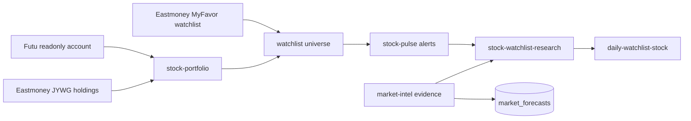

# Stock Research Provider Pipeline

> Conclusion: stock research docs should be read as one provider pipeline: portfolio and watchlist sources create a universe, `stock-pulse` detects movement, `market-intel` adds macro/evidence context, and `stock-watchlist-research` produces watchlist-only research.

## Pipeline

## Canonical Details

- [`../../features/10-stock-portfolio-provider.md`](../../features/10-stock-portfolio-provider.md): portfolio aggregation and account-level redaction.
- [`../../features/11-stock-pulse-provider.md`](../../features/11-stock-pulse-provider.md): intraday movement detection and alert payloads.
- [`../../features/14-market-intel-provider.md`](../../features/14-market-intel-provider.md): market evidence, forecast persistence, and calibration loop.
- [`../../features/18-stock-watchlist-research-provider.md`](../../features/18-stock-watchlist-research-provider.md): watchlist-only research flow and Discord delivery boundary.

## Contract

- Holdings and watchlists are different source types and must not be merged without an explicit provider contract.
- Provider code should compute deterministic evidence and alert payloads before LLM interpretation.
- Research output must keep watchlist-only research separate from account portfolio reporting.
