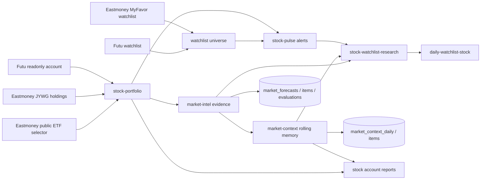

# Stock Research Provider Pipeline

> Conclusion: stock research docs should be read as one provider pipeline. `stock-portfolio` creates a redacted account/asset view, `stock-pulse` detects intraday movement, `market-intel` adds macro/evidence context and forecast persistence, `market-context` preserves rolling multi-day market memory, and `stock-watchlist-research` produces watchlist-only buy-timing research.

## Pipeline



## Stock Portfolio

Runtime name: `stock-portfolio`.

Owner code paths:

```text
src/providers/stock-portfolio/
  config.ts
  index.ts
  format.ts
  pie-chart.ts
  types.ts
```

Purpose:

- Aggregate multiple readonly broker providers before LLM execution.
- Preserve each source's redacted structured payload.
- Compute CNY summaries, top gainers/losers, premium summaries, and optional private-channel asset summaries before the prompt.
- Continue on optional source errors when configured, but fail closed when all required sources fail.

Config example:

```yaml
continue_on_error: true
fail_if_all_sources_fail: true
market_scope: cn
base_currency: CNY
fx_rates:
  CNY: 1
  USD: 7.10
  HKD: 0.91
fx_rates_as_of: "YYYY-MM-DD"
fx_rates_source: manual-public-fx-snapshot
include_cny_summary: true
sources:
  - provider: eastmoney-jywg-readonly
    config: cn-stock
    label: Eastmoney CN
    required: false
  - provider: eastmoney-etf-premium
    config: cn-stock
    label: Eastmoney ETF premium
    include_asset_totals: false
    required: false
  - provider: futu-stock
    config: cn-stock
    label: Futu HK
    required: false
```

Contract:

- `cny_summary` is the reporting source for CNY P&L; LLM reports should not recalculate missing values.
- `asset_summary` is private-channel only and may include exact total assets, cash, market value, holdings amount, and allocation categories.
- `include_asset_totals: false` prevents double-counting integrated broker accounts queried through multiple market profiles.
- Eastmoney ETF premium rows are anchored to JYWG holding rows. When configured, `eastmoney-etf-premium` may enrich a held ETF by matching the same six-digit code from Eastmoney's public fund selector.
- Public fund selector values use `data_source=eastmoney_fund_selector`; `PREMIUM_DISCOUNT_RATIO` is retained as `eastmoney_discount_ratio`, while `premium_rate = 0 - PREMIUM_DISCOUNT_RATIO`.
- Public ETF premium data never proves that a symbol is held. If the JYWG holding row is absent, `stock-portfolio` must not emit a position premium row from the public source alone.
- If no source succeeds and `fail_if_all_sources_fail=true`, do not call the LLM.

## Stock Pulse

Runtime name: `stock-pulse`.

Owner code paths:

```text
src/providers/stock-pulse/
  analyzer.ts
  config.ts
  index.ts
  market.ts
  symbols.ts
  watchlist-sources.ts
  yahoo-client.ts
  fixtures/*.json
```

Purpose:

- Scan portfolio and watchlist symbols during active market/user windows.
- Use deterministic quote/bar analysis before asking the LLM to explain alerts.
- Keep account holdings and observation-universe symbols distinct.

Runtime flow:

```text
cron task
  -> pre_provider: stock-pulse
    -> active_window + market session guard
    -> stock-portfolio for held symbols
    -> manual watchlist and optional universe sources
    -> Yahoo chart 5m / 60d bars
    -> anomaly scoring
    -> alerts[] + position_groups[] + run_context
```

Anomaly signals:

- `hour_move`
- `day_move`
- `abnormal_frequency`
- `one_way_bars`
- `z_score`

Severity levels:

- `notice`: one lightweight trigger.
- `alert`: two or more triggers.
- `urgent`: urgent z-score, large day move, or abnormal 5m-bar count above expected p95.

Universe sources:

- `futu_watchlist`: local Futu OpenD + official SDK watchlist groups.
- `eastmoney_myfavor_watchlist`: Eastmoney MyFavor readonly groups and securities.
- `yahoo_screener`: public predefined US screeners.
- `eastmoney_clist`: public CN/HK movers.

Universe rows are observation candidates. They must not be described as account holdings.

## Market Intel

Runtime names:

- `market-intel`
- `market-forecast-evaluation`
- `market-calibration`

Owner code paths:

```text
src/providers/market-intel/**
src/providers/market-forecast-evaluation/**
src/store/market-forecasts.ts
```

Purpose:

- Collect structured market evidence before the LLM writes pre-market reports.
- Make evidence auditable with source IDs, source tiers, capture times, and freshness.
- Persist forecast JSON and evaluate only appropriate forecast horizons.
- Keep market research separate from trading execution.

Evidence source policy:

- Default/primary: SEC, BLS, Treasury, Federal Reserve, Cboe history, PBOC, NBS, SSE, SZSE, HKEX, and Futu OpenD where permissions are available.
- Optional: FRED API, Polygon, Tushare when local credentials exist.
- Fallback-only: Yahoo chart and Eastmoney public endpoints, with `data_quality` downgrade.
- Excluded from default: Stooq and AKShare.

Forecast persistence:

- `market_forecasts`: provider payload, final report text, and run context.
- `market_forecast_items`: same-day probabilities, horizon probabilities, sector opportunities, and risk alerts.
- `market_forecast_evaluations`: post-market benchmark outcomes, hit/miss, Brier score, and calibration notes.

Horizon contract:

- `horizon_probabilities`, `horizon_sector_opportunities`, and `horizon_risk_alerts` are medium/long horizon items (`1m`, `3m`, `6m`, `1y`).
- Same-day hit/miss and Brier score require an explicit same-day `index_probability`.
- Horizon-only forecasts should report `status=horizon_only` and skip same-day evaluation.

## Market Context

Runtime name: `market-context`.

Owner code paths:

```text
src/providers/market-context/
  config.ts
  index.ts
  types.ts
src/store/market-context.ts
```

Purpose:

- Maintain rolling daily market memory for `us`, `cn-a`, `hk`, and `cross-market` scopes.
- Inject active macro/news/regime context into stock cron tasks without replacing the primary provider payload.
- Persist the LLM-maintained summary and stable long-lived items in SQLite so tomorrow's update starts from yesterday's memory.
- Keep broad-market memory separate from account holdings, quotes, and trading actions.

Runtime modes:

- `mode: update`: used by daily market-context cron jobs. The provider loads recent daily digests, active items, and optional latest `market_forecasts` data; the downstream LLM must end with a valid `<market_context_json>` block. `runner-task` persists that block to `market_context_daily` and upserts `market_context_items`.
- `mode: inject`: used by ordinary stock cron jobs through `pre_context_providers`. It loads the latest daily digests and active items for configured scopes and prepends them before the task's main `pre_provider`.

Config examples:

```yaml
# ~/.miniclaw/providers/market-context/us-update.yaml
mode: update
market_scope: us
timezone: America/New_York
forecast_market_scope: us
forecast_session: pre_market
max_items: 24
max_digest_chars: 3000
```

```yaml
# ~/.miniclaw/providers/market-context/cn-hk-inject.yaml
mode: inject
market_scopes:
  - cn-a
  - hk
  - cross-market
timezone: Asia/Shanghai
max_items: 20
max_digest_chars: 2500
```

Cron injection example:

```yaml
pre_context_providers:
  - provider: market-context
    config: cn-hk-inject
pre_provider: market-intel
pre_provider_config: cn-pre-market
```

Persistence contract:

- `market_context_daily` stores one digest per `(market_scope, trade_date)` and links to the previous daily context when available.
- `market_context_items` stores stable active/stale/resolved items by `(market_scope, stable_key)`.
- `resolved_items` default to `status=resolved`; active injection only returns non-expired `status=active` items.
- `market-context` is not a quote source. If it conflicts with fresher provider evidence, the downstream report must prefer the fresher provider and call out the conflict.

## Stock Watchlist Research

Runtime name: `stock-watchlist-research`.

Owner code paths:

```text
src/providers/stock-watchlist-research/
  config.ts
  index.ts
  research-client.ts
  types.ts
```

Purpose:

- Research broker watchlist symbols that are not already held.
- Use `stock-pulse.universe.sources` for enabled Futu / Eastmoney MyFavor watchlist sources.
- Exclude held symbols using the linked `stock-portfolio` config without exposing excluded holding symbols downstream.
- Add quote, profile, fundamentals, news, and optional portfolio-free `market-intel` context.

Output contract:

- `run_context.watchlist_only=true` must be present.
- `watchlist_source.portfolio_filter` can report counts and config names, but not excluded holding codes.
- `symbols[]` contains quote/profile/financials/news evidence for watchlist-only symbols.
- `market_context` must remove `portfolio_provider_config`; watchlist research should not output account assets, costs, P&L, or holding quantities.
- Buy-timing labels are constrained to: `worth_small_starter`, `wait_for_pullback`, `not_buyable_now`, and `watch_only`.

Cron example:

```yaml
channel: "<daily-watchlist-stock channel id>"
pre_provider: stock-watchlist-research
pre_provider_config: us-pre-market
pre_provider_preflight: health
```

## Report Boundaries

- Portfolio/account reports may mention held positions and P&L when they target trusted private stock channels.
- Watchlist research must not imply that watchlist symbols are holdings.
- Market-intel probabilities are research inputs, not trading instructions.
- No provider in this pipeline may unlock trading, place orders, modify orders, or move funds.

## Legacy Cleanup

The previous stock research feature-level stubs have been removed after migration. New implementation facts should be added here or to stock source family docs such as [`eastmoney.md`](eastmoney.md).

Verification owner:

```bash
pnpm vitest run src/providers/stock-portfolio src/providers/stock-pulse src/providers/market-intel src/providers/market-forecast-evaluation src/providers/stock-watchlist-research
pnpm run quality:docs
pnpm run typecheck
pnpm run lint
pnpm cron:list
```
