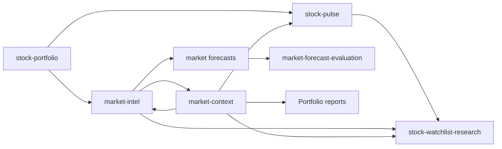

# Stock Workflows

> Conclusion: stock workflows are data products plus cron composition. The data products live in `src/stock/reports/*`; cron YAML chooses when to run them, which market context to inject, and which Discord stock channel receives the final report.

## Product Pipeline



## Data Products

`stock-portfolio`:

- Inputs: Futu account snapshots, Eastmoney JYWG account evidence, optional Eastmoney ETF premium enrichment.
- Output: redacted portfolio JSON with source status, CNY summary, optional asset summary, optional single-stock look-through summary, premium summary, warnings, and optional pie chart/table attachments.
- State: commits source provider state only after downstream task success.
- Failure policy: optional source failures can be preserved as warnings; required source failures or all-source failure can block the LLM task. ETF/index look-through sources fail closed as warnings and never reuse stale configured weights.
- Code paths: `src/stock/reports/stock-portfolio.ts`, `src/stock/data/portfolio*.ts`, `src/stock/data/equity-lookthrough*.ts`, `src/stock/reports/portfolio-pie-chart.ts`, `src/stock/reports/portfolio-equity-lookthrough-chart.ts`.

`stock-pulse`:

- Inputs: portfolio symbols, manual watchlists, optional broker watchlist sources, Yahoo chart bars.
- Output: alerts, position groups, quote failures, universe source summaries, and run context.
- State: uses delayed commits from nested portfolio providers.
- Failure policy: closed-market windows skip deterministically; source degradation is reported without exposing secrets.
- Code paths: `src/stock/reports/stock-pulse.ts`, `src/stock/data/pulse-types.ts`, `src/stock/data/universe.ts`, `src/stock/signals/pulse.ts`.

`market-intel`:

- Inputs: calendar state, benchmark quotes, optional portfolio context, official market evidence, scoring calibration.
- Output: market snapshot, evidence sections, index direction score, sector opportunities, risk level, data quality notes, and forecast prompt context.
- State: portfolio source commits are delayed until downstream success.
- Failure policy: closed markets can skip; fallback quotes downgrade data quality.
- Code paths: `src/stock/reports/market-intel.ts`, `src/stock/reports/market-intel-format.ts`, `src/stock/data/market-*.ts`, `src/stock/signals/market-intel*.ts`.

`market-context`:

- Inputs: recent market context rows, active/stale/resolved items, optional latest forecast data.
- Output: injected market memory or update-mode prompt context.
- State: update-mode persistence happens after the downstream LLM emits a valid `<market_context_json>` block.
- Failure policy: health and dry-run are framework-backed; stale memory should be explicit in output.
- Code paths: `src/stock/reports/market-context.ts`, `src/stock/data/market-context-types.ts`, `src/stock/data/market-memory.ts`, `src/store/market-context.ts`.

`market-forecast-evaluation`:

- Inputs: stored pre-market forecasts, benchmark quote outcomes, optional portfolio context.
- Output: benchmark outcomes, hit/miss, probability groups, Brier score, calibration notes, and stored evaluation rows.
- State: writes evaluation records to `market_forecast_evaluations`.
- Failure policy: horizon-only forecasts skip same-day scoring; unavailable quotes produce `unknown` outcomes.
- Code paths: `src/stock/reports/forecast-evaluation.ts`, `src/stock/signals/forecast-evaluation*.ts`, `src/store/market-forecasts.ts`.

`stock-watchlist-research`:

- Inputs: broker watchlist sources from stock-pulse config, portfolio exclusion filter, Yahoo research data, optional portfolio-free market-intel context.
- Output: watchlist-only symbol research with quote, profile, fundamentals, news, market context, and buy-timing labels.
- State: no account state commit.
- Failure policy: excludes held symbols without exposing excluded holding codes; unavailable broker watchlists fail closed for preflight when configured.
- Code paths: `src/stock/reports/watchlist-research.ts`, `src/stock/reports/watchlist-research-types.ts`, `src/stock/sources/yahoo/watchlist-research-client.ts`.

## Cron Workflow Groups

Pre-market:

- `us-stock-pre-market`: injects `market-context/us-inject`, then runs `market-intel/us-pre-market`.
- `cn-stock-pre-market`: injects `market-context/cn-hk-inject`, then runs `market-intel/cn-pre-market`.
- Purpose: prepare market evidence and forecast prompt context before the trading day.

Intraday pulse:

- `us-stock-hourly-pulse`: injects `market-context/us-inject`, then runs `stock-pulse/us-hourly`.
- `cn-stock-hourly-pulse`: injects `market-context/cn-hk-inject`, then runs `stock-pulse/cn-hourly`.
- Purpose: detect movement in holdings and observation universes during active windows.

Portfolio reports:

- `daily-stock-summary`: injects `market-context/global-stock-inject`, then runs `stock-portfolio/daily-stock-summary`.
- `cn-stock-ing-market`: injects `market-context/cn-hk-inject`, then runs `stock-portfolio/cn-stock`.
- Purpose: summarize account and asset state for trusted stock channels.

Post-market forecast evaluation:

- `us-stock-post-market`: injects `market-context/us-inject`, then runs `market-forecast-evaluation/us-post-market`.
- `cn-stock-post-market`: injects `market-context/cn-hk-inject`, then runs `market-forecast-evaluation/cn-post-market`.
- Purpose: compare stored forecasts with benchmark outcomes and feed calibration.

Market memory updates:

- `us-market-context-daily`: runs `market-context/us-update`.
- `cn-a-market-context-daily`: runs `market-context/cn-a-update`.
- `hk-market-context-daily`: runs `market-context/hk-update`.
- `cross-market-context-daily`: runs `market-context/cross-market-update`.
- Purpose: persist rolling daily memory for later `pre_context_providers` injection.

Watchlist research:

- `us-watchlist-stock-pre-market` and `us-watchlist-stock-daily`: inject `market-context/us-inject`, then run `stock-watchlist-research` configs.
- `cn-watchlist-stock-pre-market` and `cn-watchlist-stock-daily`: inject `market-context/cn-hk-inject`, then run `stock-watchlist-research` configs.
- Purpose: research non-held broker-watchlist symbols without exposing account holdings downstream.

## Cron Composition Rules

- `pre_context_providers` provide background context and should not replace the main product payload.
- `pre_provider_preflight: health` should be used for fragile session-backed products before task creation.
- Product output should remain structured JSON before the final LLM report.
- Reports may interpret facts, but they must not recalculate missing account values or transform watchlist rows into holdings.
- Runtime commits happen only after downstream task success when a provider has side effects.

## Local Config Roots

```text
~/.miniclaw/cron/*.yaml
~/.miniclaw/providers/stock-portfolio/*.yaml
~/.miniclaw/providers/stock-pulse/*.yaml
~/.miniclaw/providers/market-intel/*.yaml
~/.miniclaw/providers/market-context/*.yaml
~/.miniclaw/providers/market-forecast-evaluation/*.yaml
~/.miniclaw/providers/stock-watchlist-research/*.yaml
```

The repo docs describe stable semantics. Account-specific paths, channel IDs, and private runtime values remain in local config or `docs/private/**`.
