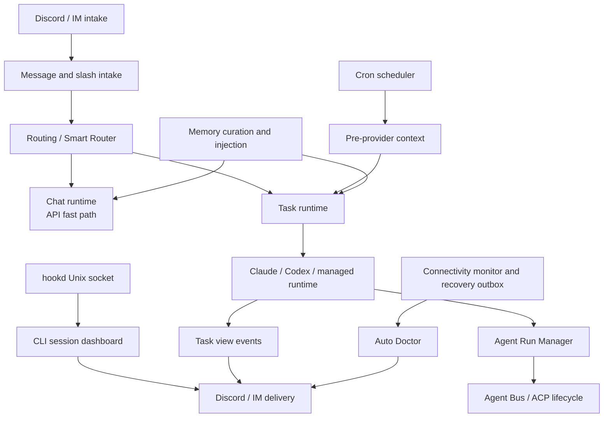
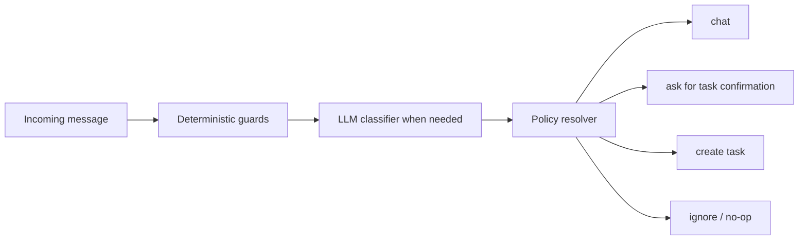
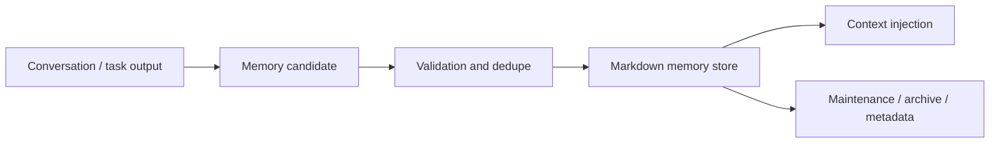

# MiniClaw Runtime

> Conclusion: runtime docs describe how MiniClaw accepts Discord/IM input, routes chat/task work, executes cron and agent tasks, manages memory/context, and handles operational recovery. Provider docs own external data collection contracts; runtime docs own execution, persistence, delivery, and repair behavior.

## Runtime Map



## Intake And Routing

Owner docs:

- [`../bot-routing.md`](../bot-routing.md): Discord Gateway, message handling, slash command dispatch, thread continuation, channel routing, and chat/task boundaries.
- [`../chat-router-current-logic.md`](../chat-router-current-logic.md): current code-level chat router logic and known misrouting boundaries.

Owner code paths:

```text
src/bot.ts
src/commands/**
src/discord/**
src/im/adapters/weixin/**
src/routing/**
src/agent/chat.ts
src/store/repositories/smart-router-decisions.ts
```

Routing contract:

- Slash commands route before natural-language message routing.
- Thread continuation must preserve the original task/chat context instead of reclassifying each reply from scratch.
- Smart Router may turn a task-like prompt into a task path, but it must not upgrade normal chat privileges.
- Confirmation buttons store pending task context and must expire safely.
- Per-channel cwd overrides are routing context, not prompt text.
- Weixin chat uses the shared `chat()` boundary but asks it to prefer a lightweight Anthropic/OpenAI-compatible API client before falling back to the configured agent runtime.
- Weixin direct may run as the only enabled IM gateway; when `im.transports.discord.enabled=false`, Discord credentials are optional and MiniClaw still starts non-Discord gateways.
- Weixin inbound media is normalized before routing: official `image_item.media` and `voice_item.media` CDN references are downloaded, AES-ECB decrypted, and voice SILK is best-effort transcoded to WAV before attachment processing.
- `/sessions` renders the hookd-observed CLI session dashboard. It is separate from `/status`: `/status` is MiniClaw-owned tasks, while `/sessions` is ordinary Claude Code or Codex CLI sessions observed from provider hooks.

Smart Router resolution order:



## Task Output And Trace UX

Owner code paths:

```text
src/agent/task.ts
src/agent/task-reporter.ts
src/agent/task-view-events.ts
src/discord/task-view-reporter.ts
src/discord/task-trace-attachment.ts
scripts/task-trace.ts
```

Runtime contract:

- The task runner owns execution and state; Discord view code owns rendering.
- Progress messages should persist long enough to debug a task instead of being deleted on success.
- Final task results should be sent as ordinary Markdown messages when possible, not hidden inside narrow embed descriptions.
- Task events are the shared boundary between runners, traces, and Discord rendering.
- Large traces should be exported or attached rather than spammed into Discord messages.

Current delivery shape:

- Status card: short embed for current state.
- Progress stream: persistent task progress/update message.
- Final result: normal Markdown message with chunking when needed. Discord body chunks suppress link embeds, and bare URLs are repeated only in a final link-preview footer so cards appear after the full result rather than between body chunks.
- Fanout and replay: Discord IM fanout, recovery outbox replay, and script cron `DISCORD_MESSAGE` output use the same deferred-link-preview helper as task results.
- Weixin delivery: text uses `sendmessage`; file delivery uses the official `getuploadurl -> CDN AES upload -> sendmessage` chain and sends captions and media as separate message items. Session-expired `-14` pauses the affected account for one hour.
- Weixin chat sends `sendtyping` start, keepalive, and cancel signals when `getconfig` returns a typing ticket, so long LLM replies have visible in-chat activity.
- Trace view: task events and trace-export commands provide operator-level details.

## External CLI Session Control

Owner code paths:

```text
src/hookd/**
src/store/cli-sessions.ts
src/discord/cli-session-dashboard.ts
src/bot/cli-session-buttons.ts
src/bot/cli-session-modals.ts
```

Runtime contract:

- `hookd` is opt-in through `hookd.enabled`; the first shipped slice does not auto-edit `~/.claude/settings.json` or `~/.codex/hooks.json`.
- Provider hooks send newline-delimited JSON to `hookd.sock`; MiniClaw normalizes provider, session id, cwd, pid, tty, terminal hints, transcript path, event name, and phase.
- CLI session state lives in `cli_sessions` and `cli_session_events`, not in `tasks`, until the operator explicitly starts a same-provider continuation.
- Dashboard ordering is state-prioritized: approval, active, stale active, idle, then history/hidden. Older active work stays above newer idle sessions.
- Empty Codex startup sessions are hidden from the default dashboard until a real prompt or transcript activity appears.
- `Details` and `Hide` are available from Discord buttons. `Continue` is available only for idle sessions and opens a Discord modal for the follow-up instruction.
- Same-provider continuation forces the runtime to match the observed session provider. A Claude session resumes through Claude; a Codex session resumes through Codex.
- Active external CLI sessions do not receive blind iTerm2 keystroke injection. Until provider-native interrupt/input APIs are available, MiniClaw refuses same-provider continuation while the observed session is still active.

## Weixin Protocol Compatibility

MiniClaw's Weixin adapter is a native IM transport implementation aligned with the official source snapshot `tencent-weixin-openclaw-weixin 2.4.3` and npm package `@tencent-weixin/openclaw-weixin` version `2.4.3`. It does not import that package at runtime; the local adapter owns MiniClaw routing, credential storage, Smart Router confirmation, task reporting, and delivery semantics.

Tracked official protocol files:

```text
src/api/types.ts
src/media/media-download.ts
src/messaging/send-media.ts
src/cdn/upload.ts
src/api/session-guard.ts
src/auth/login-qr.ts
```

Upgrade workflow when the official package changes:

1. Put the official package source on disk, then run `pnpm weixin:drift-check -- --package-dir /path/to/tencent-weixin-openclaw-weixin`.
2. Update MiniClaw only when the drift report shows an official protocol anchor changed, then rerun `pnpm test src/im/__tests__/weixin-transport.test.ts`.
3. Keep fixture coverage current in `src/im/__fixtures__/weixin-official-payloads.json`; it covers official-shape image media, voice media, media upload, QR expiration, session-expired `-14`, and chat/task confirmation payloads.
4. Run live smoke after unit tests: `pnpm weixin:login`, stop the normal gateway, then run `pnpm weixin:smoke -- --account <accountId> --target <user@im.wechat> --image /path/to/image --save-buffer`.
5. Restart MiniClaw and manually verify end-to-end routing: plain text should answer as chat, a task-like message should ask for `y` or `n`, `y` should execute a task, and `n` should continue as chat.

## Cron Runtime

Owner code paths:

```text
src/cron/**
src/providers/index.ts
src/providers/framework.ts
src/store/cron-runs.ts
```

Execution flow:

```text
cron schedule
  -> load job config
  -> apply global config.yaml cron.active_window guard when enabled
  -> optional provider health/dry-run preflight
  -> run pre_provider when configured
  -> inject provider text into task prompt
  -> inject task output contract when configured
  -> execute task runtime
  -> run output validator hook
  -> commit provider state only after downstream task success
  -> persist cron run and recovery metadata
```

Runtime contract:

- Provider commit callbacks must run only after the downstream task succeeds.
- Provider failures should fail closed unless the provider config explicitly allows partial data.
- `type=task` jobs may set inline `output_template` or `output_contract.template` text in the cron YAML to inject a prompt-level output contract after provider/script context and before the job prompt.
- When an output contract is configured, MiniClaw prepends a shared chat/IM output surface policy before the job-specific template; cron YAML should only describe report structure, machine blocks, privacy/link/length exceptions, and other job-specific formatting.
- Output contracts are formatting instructions for the LLM, not deterministic renderers; v1 does not rewrite the final message after task execution.
- `output_contract.validator` is reserved for runtime validation. v1 supports only `none`, but the hook runs after a successful task result and before extra delivery, attachment delivery, and provider commit callbacks.
- `cron.active_window` is a global scheduled-dispatch guard. Outside the window, MiniClaw writes a skipped `cron_runs` row with `error_category=outside_active_window` and does not call scripts, providers, or task runtime.
- Missed-run audit ignores expected schedules outside `cron.active_window` so sleep/off-hours do not create false missed-run incidents.
- Manual `pnpm cron:test` bypasses `cron.active_window` because it is an explicit operator action.
- Cron run records are operational evidence for Auto Doctor and recovery workflows.
- Script jobs and task jobs share delivery semantics but not prompt/provider handling.

## Memory And Prompt Context

Owner code paths:

```text
src/memory/**
src/agent/prompts.ts
src/routing/*context*.ts
src/cron/runner-task.ts
```

Prompt/context contract:

- Chat, task, cron, provider, memory, and runtime adapter context must be assembled as explicit components.
- Untrusted user/provider content should be isolated from system/developer instructions.
- Provider payloads should be schema-aware and compacted before they enter prompts.
- Memory injection should be useful but bounded; task prompts should not receive unrelated always-on memory when the route does not need it.
- Full cron prompts and provider payloads are high-sensitivity data and should not be over-persisted.

Memory lifecycle:



## Connectivity And Recovery

Owner code paths:

```text
src/monitoring/connectivity-core.ts
src/monitoring/connectivity-monitor.ts
src/monitoring/recovery-outbox.ts
src/monitoring/pre-client-ready-watchdog.ts
src/monitoring/weixin-alert.ts
src/runtime/discord-login.ts
src/im/adapters/weixin/transport.ts
src/notifications/smtp-email.ts
```

Operations contract:

- Connectivity checks classify Discord, network, SMTP fallback, and startup readiness separately.
- Discord/VPN/proxy outage alerts are delivered through Weixin when general network is still reachable; SMTP remains a diagnostic probe and a separate operations notifier capability.
- Discord startup login failures send Weixin ops alerts when Weixin direct is enabled, then retry after 10 minutes, 20 minutes, and 40 minutes before falling back to non-Discord IM gateways.
- Recovery outbox should backfill failed cron/task delivery after Discord connectivity recovers.
- Pre-clientReady watchdog failures should be locally visible and redacted.

## Auto Doctor

Owner code paths:

```text
src/ops/doctor.ts
src/ops/doctor/**
src/ops/doctor-scheduler/**
src/ops/doctor-repair/**
src/ops/doctor-ship.ts
scripts/doctor.ts
scripts/doctor-repair.ts
scripts/doctor-ship.ts
```

Doctor capabilities:

- Diagnose task, cron, PM2, logs, connectivity, third-party health, and recent incidents.
- Persist incidents with category, status, evidence, summaries, and trace references.
- Group repeated failures before posting Discord summaries.
- Run guarded repair in an isolated worktree with path policy and verification.
- Preview and ship repaired branches only through explicit guarded commands.

Safety boundary:

- Auto Doctor evidence collection is read-only by default.
- Repair execution must stay path-scoped, verified, and isolated from unrelated user changes.
- Ship flow must not bypass review, verification, or restart policy.
- Secrets, cookies, tokens, account IDs, and raw private provider payloads must be redacted from reports.

## Agent Run Manager

Owner code paths:

```text
src/agent/run-manager/**
src/agent/run-manager/acp/**
src/agent/run-manager/mcp/**
src/agent/runtimes/task-runner-runtime.ts
```

Runtime boundary:

- Agent Run Manager is task-scoped orchestration, not the default chat path.
- It owns managed child runtime scheduling, Agent Bus state, final synthesis, ACP lifecycle, and managed runtime routing.
- Optional `agent_run_manager.model_routing` can choose provider/model/reasoning per child role, so planner can use a stronger model while generator/evaluator use cheaper models. Escalation can retry later generator turns with a stronger model after runtime failure or evaluator `FAIL`.
- Child runtimes receive injected task context through controlled adapters, not arbitrary access to live MiniClaw state.
- Final synthesis should cite child outcomes and preserve failed/partial child state.
- Sweeper and guardrails must prevent stuck runs and unbounded child-runtime growth.

## Legacy Cleanup

The previous feature-level runtime stubs have been removed after migration. This file is now the canonical runtime source for the migrated runtime topics.

## Development Checklist

- Routing or Smart Router behavior changed: update this file, [`../bot-routing.md`](../bot-routing.md), and [`../chat-router-current-logic.md`](../chat-router-current-logic.md).
- Task output, task events, or trace behavior changed: update the Task Output section.
- Cron execution or provider commit semantics changed: update the Cron Runtime section and relevant provider docs.
- Prompt assembly, provider payload compaction, or memory injection changed: update the Memory And Prompt Context section.
- Connectivity, recovery, watchdog, or SMTP fallback changed: update the Connectivity And Recovery section.
- Auto Doctor diagnose/repair/ship behavior changed: update the Auto Doctor section.
- Agent Run Manager scheduling, bus, ACP lifecycle, child runtime injection, or final synthesis changed: update the Agent Run Manager section.

Verification owner:

```bash
pnpm run quality:docs
pnpm run typecheck
pnpm run lint
pnpm test
pnpm run e2e:cron
```
