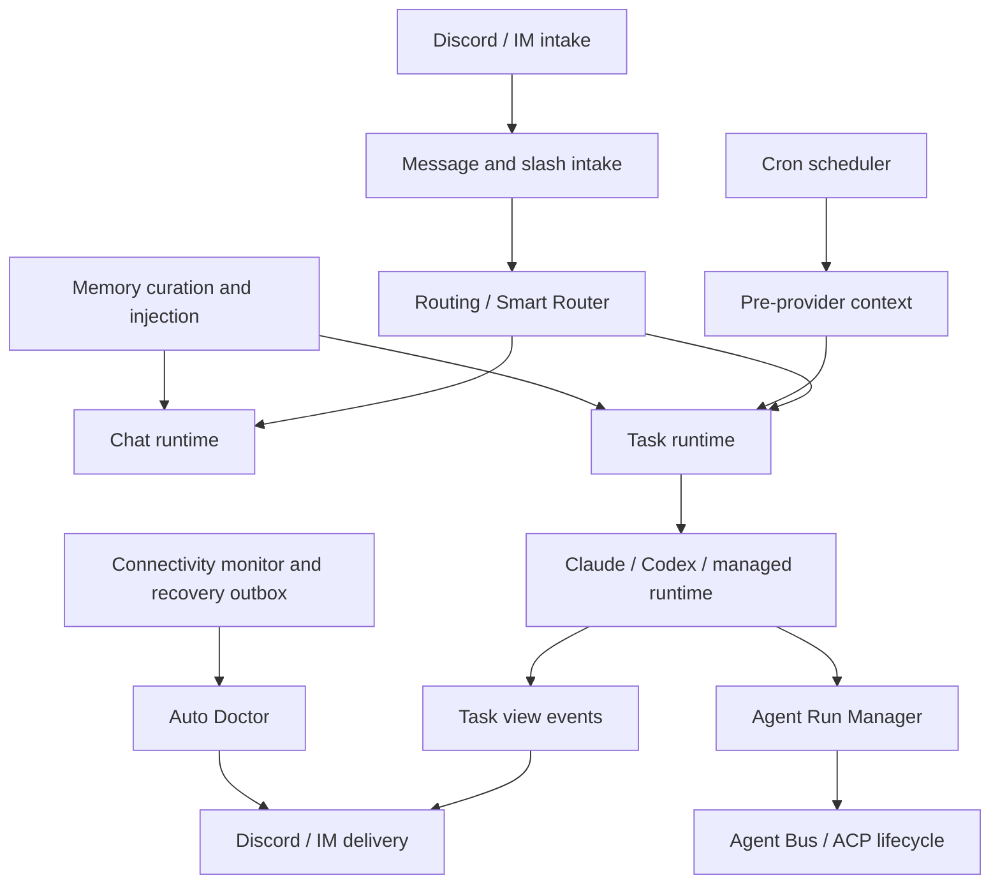
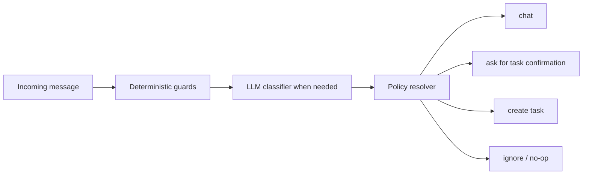
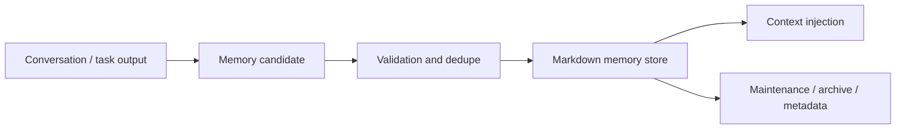

# MiniClaw Runtime

> Conclusion: runtime docs describe how MiniClaw accepts Discord/IM input, routes chat/task work, executes cron and agent tasks, manages memory/context, and handles operational recovery. Provider docs own external data collection contracts; runtime docs own execution, persistence, delivery, and repair behavior.

## Runtime Map



## Intake And Routing

Owner docs:

- [`../bot-routing.md`](../bot-routing.md): Discord Gateway, message handling, slash command dispatch, thread continuation, channel routing, and chat/task boundaries.
- [`../chat-router-current-logic.md`](../chat-router-current-logic.md): current code-level chat router logic and known misrouting boundaries.

Owner code paths:

```text
src/bot.ts
src/commands/**
src/discord/**
src/routing/**
src/store/repositories/smart-router-decisions.ts
```

Routing contract:

- Slash commands route before natural-language message routing.
- Thread continuation must preserve the original task/chat context instead of reclassifying each reply from scratch.
- Smart Router may turn a task-like prompt into a task path, but it must not upgrade normal chat privileges.
- Confirmation buttons store pending task context and must expire safely.
- Per-channel cwd overrides are routing context, not prompt text.

Smart Router resolution order:



## Task Output And Trace UX

Owner code paths:

```text
src/agent/task.ts
src/agent/task-reporter.ts
src/agent/task-view-events.ts
src/discord/task-view-reporter.ts
src/discord/task-trace-attachment.ts
scripts/task-trace.ts
```

Runtime contract:

- The task runner owns execution and state; Discord view code owns rendering.
- Progress messages should persist long enough to debug a task instead of being deleted on success.
- Final task results should be sent as ordinary Markdown messages when possible, not hidden inside narrow embed descriptions.
- Task events are the shared boundary between runners, traces, and Discord rendering.
- Large traces should be exported or attached rather than spammed into Discord messages.

Current delivery shape:

- Status card: short embed for current state.
- Progress stream: persistent task progress/update message.
- Final result: normal Markdown message with chunking when needed.
- Trace view: task events and trace-export commands provide operator-level details.

## Cron Runtime

Owner code paths:

```text
src/cron/**
src/providers/index.ts
src/providers/framework.ts
src/store/cron-runs.ts
```

Execution flow:

```text
cron schedule
  -> load job config
  -> optional provider health/dry-run preflight
  -> run pre_provider when configured
  -> inject provider text into task prompt
  -> execute task runtime
  -> commit provider state only after downstream task success
  -> persist cron run and recovery metadata
```

Runtime contract:

- Provider commit callbacks must run only after the downstream task succeeds.
- Provider failures should fail closed unless the provider config explicitly allows partial data.
- Cron run records are operational evidence for Auto Doctor and recovery workflows.
- Script jobs and task jobs share delivery semantics but not prompt/provider handling.

## Memory And Prompt Context

Owner code paths:

```text
src/memory/**
src/agent/prompts.ts
src/routing/*context*.ts
src/cron/runner-task.ts
```

Prompt/context contract:

- Chat, task, cron, provider, memory, and runtime adapter context must be assembled as explicit components.
- Untrusted user/provider content should be isolated from system/developer instructions.
- Provider payloads should be schema-aware and compacted before they enter prompts.
- Memory injection should be useful but bounded; task prompts should not receive unrelated always-on memory when the route does not need it.
- Full cron prompts and provider payloads are high-sensitivity data and should not be over-persisted.

Memory lifecycle:



## Connectivity And Recovery

Owner code paths:

```text
src/monitoring/connectivity-core.ts
src/monitoring/connectivity-monitor.ts
src/monitoring/recovery-outbox.ts
src/monitoring/pre-client-ready-watchdog.ts
src/notifications/smtp-email.ts
```

Operations contract:

- Connectivity checks classify Discord, network, SMTP fallback, and startup readiness separately.
- Email fallback is an operations notifier and is separate from the read-only Email capability in [`../providers/email.md`](../providers/email.md).
- Recovery outbox should backfill failed cron/task delivery after Discord connectivity recovers.
- Pre-clientReady watchdog failures should be locally visible and redacted.

## Auto Doctor

Owner code paths:

```text
src/ops/doctor.ts
src/ops/doctor/**
src/ops/doctor-scheduler/**
src/ops/doctor-repair/**
src/ops/doctor-ship.ts
scripts/doctor.ts
scripts/doctor-repair.ts
scripts/doctor-ship.ts
```

Doctor capabilities:

- Diagnose task, cron, PM2, logs, connectivity, third-party health, and recent incidents.
- Persist incidents with category, status, evidence, summaries, and trace references.
- Group repeated failures before posting Discord summaries.
- Run guarded repair in an isolated worktree with path policy and verification.
- Preview and ship repaired branches only through explicit guarded commands.

Safety boundary:

- Auto Doctor evidence collection is read-only by default.
- Repair execution must stay path-scoped, verified, and isolated from unrelated user changes.
- Ship flow must not bypass review, verification, or restart policy.
- Secrets, cookies, tokens, account IDs, and raw private provider payloads must be redacted from reports.

## Agent Run Manager

Owner code paths:

```text
src/agent/run-manager/**
src/agent/run-manager/acp/**
src/agent/run-manager/mcp/**
src/agent/runtimes/task-runner-runtime.ts
```

Runtime boundary:

- Agent Run Manager is task-scoped orchestration, not the default chat path.
- It owns managed child runtime scheduling, Agent Bus state, final synthesis, ACP lifecycle, and managed runtime routing.
- Child runtimes receive injected task context through controlled adapters, not arbitrary access to live MiniClaw state.
- Final synthesis should cite child outcomes and preserve failed/partial child state.
- Sweeper and guardrails must prevent stuck runs and unbounded child-runtime growth.

## Legacy Cleanup

The previous feature-level runtime stubs have been removed after migration. This file is now the canonical runtime source for the migrated runtime topics.

## Development Checklist

- Routing or Smart Router behavior changed: update this file, [`../bot-routing.md`](../bot-routing.md), and [`../chat-router-current-logic.md`](../chat-router-current-logic.md).
- Task output, task events, or trace behavior changed: update the Task Output section.
- Cron execution or provider commit semantics changed: update the Cron Runtime section and relevant provider docs.
- Prompt assembly, provider payload compaction, or memory injection changed: update the Memory And Prompt Context section.
- Connectivity, recovery, watchdog, or SMTP fallback changed: update the Connectivity And Recovery section.
- Auto Doctor diagnose/repair/ship behavior changed: update the Auto Doctor section.
- Agent Run Manager scheduling, bus, ACP lifecycle, child runtime injection, or final synthesis changed: update the Agent Run Manager section.

Verification owner:

```bash
pnpm run quality:docs
pnpm run typecheck
pnpm run lint
pnpm test
pnpm run e2e:cron
```
