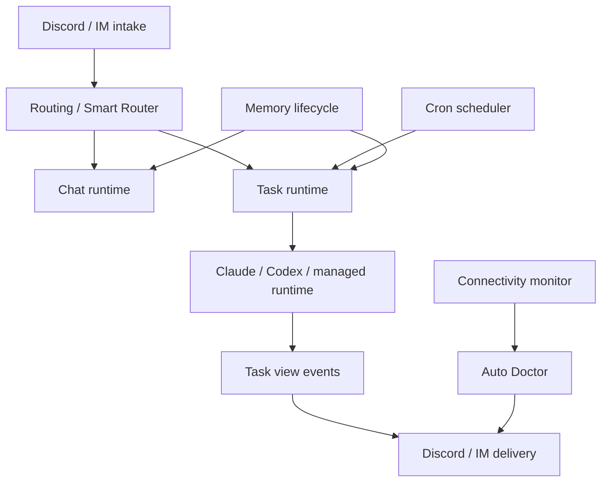

# MiniClaw Runtime Docs

> Conclusion: runtime docs describe how MiniClaw routes intake, executes chat/task/cron work, manages memory/context, and handles operations. Provider docs own data collection contracts; runtime docs own execution and delivery behavior.

## Runtime Map

## Canonical Runtime Docs

- [`../bot-routing.md`](../bot-routing.md): Discord Gateway, message, slash command, thread continuation, chat/task routing.
- [`../chat-router-current-logic.md`](../chat-router-current-logic.md): current code-level chat/router logic.
- [`../features/03-discord-task-output.md`](../features/03-discord-task-output.md): Discord task output and progress rendering.
- [`../features/04-smart-task-router.md`](../features/04-smart-task-router.md): Smart Router Chinese design.
- [`../features/05-smart-task-router.en.md`](../features/05-smart-task-router.en.md): Smart Router English design.
- [`../features/12-connectivity-monitor.md`](../features/12-connectivity-monitor.md): connectivity monitor and email fallback.
- [`../features/13-auto-doctor.md`](../features/13-auto-doctor.md): Auto Doctor diagnostics and guarded repair/ship boundaries.
- [`../features/19-agent-prompt-context-audit.md`](../features/19-agent-prompt-context-audit.md): prompt and context audit.
- [`../features/20-memory-curation-lifecycle.md`](../features/20-memory-curation-lifecycle.md): memory curation lifecycle.
- [`../features/21-agent-run-manager.md`](../features/21-agent-run-manager.md): Agent Run Manager, Agent Bus, ACP lifecycle, and managed runtime routing.

## Maintenance Rules

- Runtime docs should emphasize routing order, execution boundaries, data persistence, delivery behavior, and operational rollback.
- Provider payload details belong in `docs/providers/**`.
- Historical implementation plans stay in `docs/plans/**` and should not replace current runtime docs.
