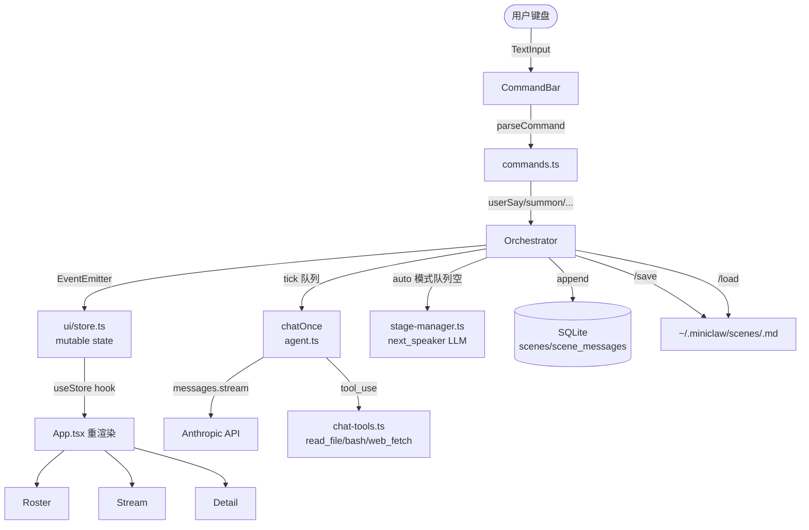
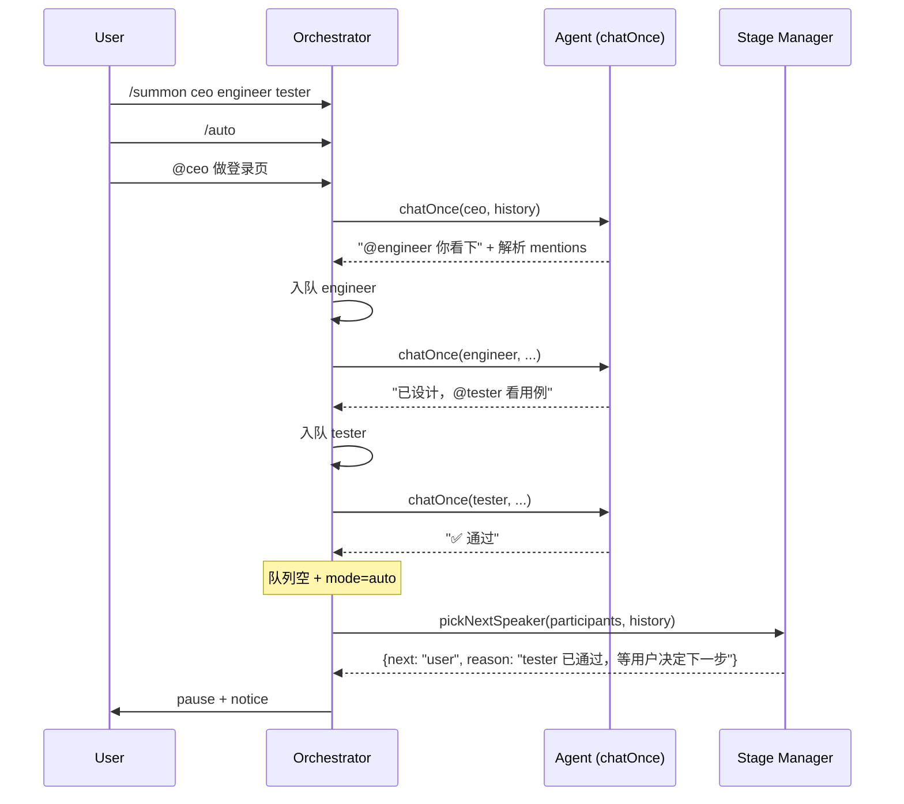

# MiniClaw Stage — CLI 多 Agent 控制台

> 终端里的"多 agent 群聊"。按需召唤角色（CEO / Engineer / Tester …），自由 @ 分派任务，做观察者看 agent 互相讨论。
> Discord bot 子系统的"对偶"——同样复用 chat-tools / memory / db / log，只换载体。

---

## 启动

```bash
pnpm stage         # Ink TUI（4 pane 主界面，推荐）
pnpm stage:repl    # readline REPL（无 TUI，适合 ssh / log 友好场景）
```

---

## 4 pane 布局

```
┌─ 🎭 Roster ────────┐  ┌─ 💬 Stream ───────────────────────────────┐
│ 🧠 🎩 CEO          │  │ [10:01:23] yyf: 做个登录页                 │
│ ⏸  💻 Engineer     │  │ [10:01:25] 🎩 CEO: @engineer 你出方案     │
│ ⏸  🧪 Tester       │  │ [10:01:50] 💻 Engineer: 思路是…           │
│                     │  │   🔧 read_file ✓                          │
│ 未召唤：            │  │ · stage-manager → @tester (验收)          │
│ ○ ...               │  │ [10:02:30] 🧪 Tester: 测试用例 …          │
└────────────────────┘  └────────────────────────────────────────────┘
                        ┌─ 📊 Active ────────┐
                        │ 💻 Engineer        │
                        │ status: thinking   │
                        │ 累计：             │
                        │ tok in: 3540       │
                        │ tok out: 612       │
                        │ tools: 2           │
                        │ cost: $0.0210      │
                        │                    │
                        │ Scene              │
                        │ turns: 4/30        │
                        │ cost: $0.06/$2     │
                        │ mode: manual       │
                        └────────────────────┘
┌─ > 输入消息或 /help 看命令 ───────────────────────────────────────┐
└──────────────────────────────────────────────────────────────────┘
```

状态图标：`⏸ idle` `🧠 thinking` `💬 speaking` `🔧 tool-call` `✗ aborted` `✓ done`

---

## Slash 命令

| 命令 | 作用 |
|---|---|
| `/summon <id> [id2 ...]` | 召唤一或多个 persona 进场 |
| `/dismiss <id>` | 遣散（中断 in-flight 调用） |
| `/say @<id> <msg>` | 等价于直接输入 `@<id> <msg>` |
| `/all <msg>` | 广播给所有在场 agent，每人独立 turn |
| `/abort` | 中断当前发言 agent |
| `/auto` | 切到 Stage Manager 自动 turn-taking |
| `/manual` | 切回 @-driven |
| `/save [name]` | 保存 scene → `~/.miniclaw/scenes/<name>.md` + DB |
| `/load <name>` | 恢复 scene |
| `/roster` | 列出所有 personas（在场/未召唤） |
| `/cost` | 当前 scene 花费分布 |
| `/clear` | 重置 scene messages（保留 personas） |
| `/q` | 退出 |
| `/help` | 命令清单 |

直接输入文字（无 `/`）= 你以"yyf"身份发言；含 `@<id>` 触发对应 agent 回应。

---

## 架构



### 文件分工

| 文件 | 职责 |
|---|---|
| `src/stage/types.ts` | Persona / Scene / SceneMessage / AgentStatus 类型 |
| `src/stage/personas.ts` | 加载 `personas/*.md` + `~/.miniclaw/personas/*.md`；解析 `@mention` |
| `src/stage/agent.ts` | `chatOnce(persona, history, callbacks)` 纯函数；复用 chat-tools |
| `src/stage/orchestrator.ts` | 调度核心：scene 状态机 + 队列 + 三层 cap + tick |
| `src/stage/stage-manager.ts` | auto 模式 next_speaker 决策（独立小成本 LLM） |
| `src/stage/scene-store.ts` | Save/Load：双轨 markdown + DB |
| `src/stage/commands.ts` | slash 命令解析 + dispatcher |
| `src/stage/repl.ts` | readline 入口（TUI 之外的可用通道） |
| `src/stage/index.tsx` | Ink 入口：`pnpm stage` |
| `src/stage/ui/store.ts` | 单 mutable store + `useStore` hook |
| `src/stage/ui/{App,Roster,Stream,Detail,CommandBar}.tsx` | UI 组件 |

### 复用 miniclaw 现有

| 复用 | 用途 |
|---|---|
| `src/agent/chat-tools.ts` | 4 个工具的 schema + executor，agent.ts 直接调 |
| `src/agent/subagents.ts` | `parseFrontmatter`，personas.ts 复用 |
| `src/lib/log.ts` | logger（模块 tag: `[stage]` `[orchestrator]` `[agent]` `[scene-store]` `[stage-manager]` `[personas]`） |
| `src/store/db.ts` | ALTER 加 `scenes` + `scene_messages` 两表 |
| `src/config.ts` | `anthropicApiKey` / `anthropicBaseUrl` / `model` |

---

## Persona 文件格式

`personas/<id>.md`（repo 默认）或 `~/.miniclaw/personas/<id>.md`（用户覆盖）：

```markdown
---
name: CEO
emoji: 🎩
model: claude-sonnet-4-6              # 可选，默认 config.model
tools: [read_file, web_fetch]         # 可选，默认全部 chat-tools
budget_per_turn_usd: 0.20             # 可选（暂仅记录）
---

你是 MiniClaw Stage 剧团的 CEO，负责...
```

文件名（去 `.md` 小写化）= persona id（@-mention 用）。

MVP 自带 `ceo.md` / `engineer.md` / `tester.md`。

---

## Anti-Loop / Budget Guards

| 触发 | 行为 |
|---|---|
| 同 agent 连续 ≥3 轮无 user 输入 | 暂停队列，提示用户 |
| Scene total turns ≥ `MINICLAW_STAGE_TURN_CAP`（默认 30） | 暂停 |
| Scene total cost ≥ `MINICLAW_STAGE_BUDGET_USD`（默认 $2） | **强制 abort 全场，清空队列** |
| Agent 自己 @ 自己 | `chatOnce` 静默过滤 |
| @ 不在场 persona | UI 提示 `先 /summon` |
| auto 模式 stage-manager 想让同 speaker 连续 ≥2 turn | 强制切到另一在场 agent |

环境变量：

```bash
MINICLAW_STAGE_BUDGET_USD=2          # 单 scene 预算上限
MINICLAW_STAGE_TURN_CAP=30           # 单 scene turn 上限
MINICLAW_STAGE_SAME_SPEAKER_CAP=3    # 同 speaker 连续 N 次 → pause
```

---

## 持久化

```
~/.miniclaw/scenes/
├── login-demo.md       # /save login-demo 生成的 transcript
└── another.md
```

Markdown transcript 格式：metadata 头 + 每条消息一个 H3 段（带时间戳 / emoji / 工具调用 / cost）。

DB 镜像同步在 `data.db`（`scenes` + `scene_messages` 两表）。

---

## auto-mode 工作流



---

## 验收

```bash
pnpm test src/stage/                    # 31 个 stage 单测
pnpm exec tsc --noEmit                  # 类型通过
pnpm stage                              # 真 TTY 跑 TUI（手 E2E）
```

剧本演示：

```
> /summon ceo engineer tester
> @ceo 做个简单登录页
... (CEO @engineer)
... (Engineer 调 read_file 探查项目)
... (Engineer @tester)
... (Tester 列出 5 个用例)
> /cost                              # 查看花费
> /save login-demo                   # 持久化
> /q
$ pnpm stage
> /load login-demo                   # 恢复继续
> @engineer 那个边界 case 改了吗
```

---

## 后续可扩展（v2+）

- Discord webhook 镜像：每 persona 独立头像/名字回灌到 channel
- Per-persona memory namespace（`~/.miniclaw/memories/<persona>.md`）
- worker_threads 进程隔离（OOM 保护）
- 跨 LLM 厂商（Codex / Gemini 通过 ACP）
- Web UI 浏览器版
