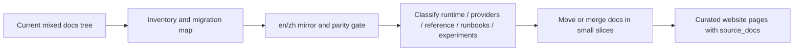
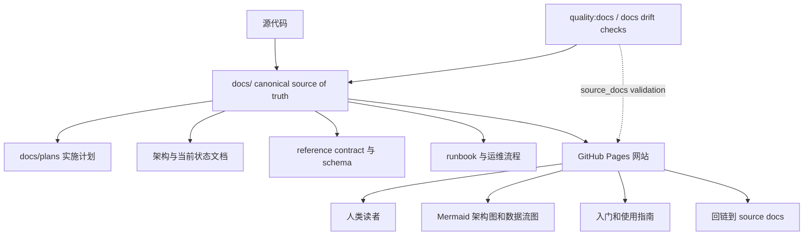
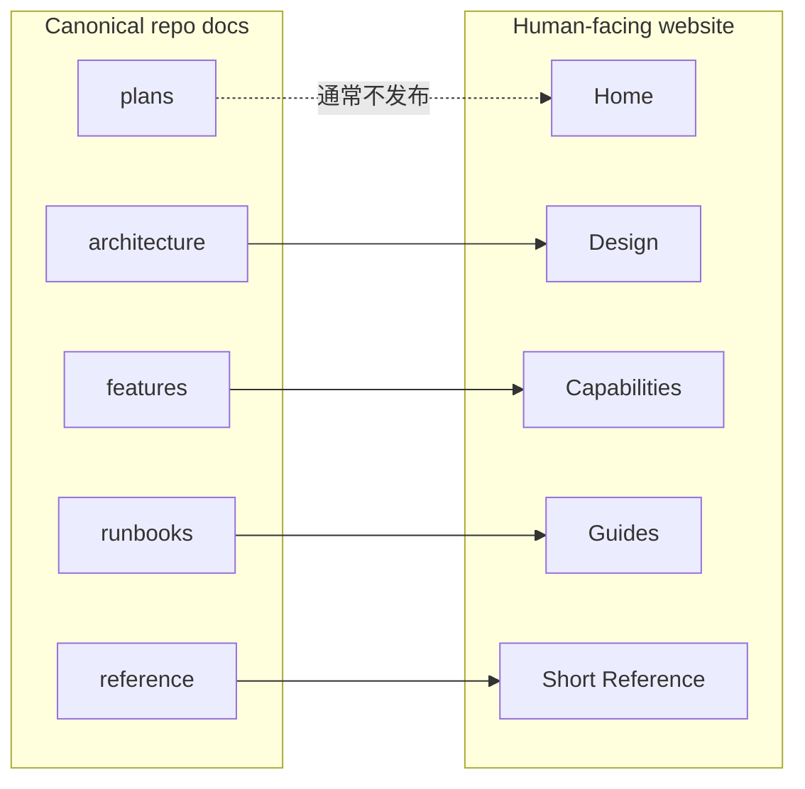
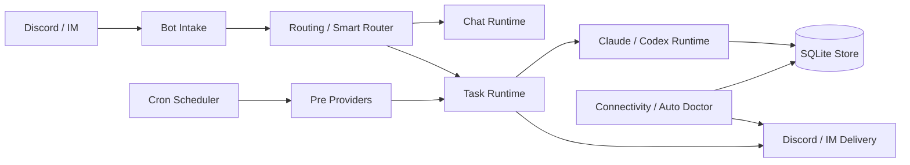

# MiniClaw 文档策略

Status: draft
Date: 2026-05-15
Source: `docs/plans/2026-05-15-documentation-strategy.md`

## Background

MiniClaw 需要两个不同的文档表面：

- `docs/` 应继续作为面向 LLM 和维护者的 docs-driven development source of truth。
- 单独的 GitHub Pages 网站应作为面向人类读者的项目门户。

这两个表面的读者和维护要求不同。`docs/` 必须保留当前实现事实、计划、contract 和 drift checks。网站应该总结、可视化并把人类读者引回 repo 内 canonical docs，而不是变成第二套 source of truth。

当前 `docs/` tree 已经包含当前设计文档、feature/provider 文档、runbooks、plans、archive material、private research 和 docs drift checks。直接把这个目录作为公开网站发布，会把实施计划、历史报告和敏感边界混入 user-facing portal。网站应该是从 `docs/` 派生出来的 curated presentation layer。

## Goals

- 让 `docs/` 继续服务 LLM 驱动的设计、实施计划和持续维护。
- 让公开网站服务想快速理解 MiniClaw 的人类读者。
- 避免在两套独立文档系统中重复维护当前实现事实。
- 把 plans、implementation notes 和 drift checks 保留在 repo 内，方便 LLM 随代码变更一起维护。
- 在网站中使用 Mermaid 图和简洁叙事，让读者不用阅读 implementation-heavy docs 也能理解架构和数据流。
- 增加 `quality:website-docs` gate，让网站页面保持对 canonical repo docs 的 traceability。
- 为当前混合的 `docs/` 内容定义迁移计划，而不是只描述未来 website layer。
- 把 English 和 Chinese docs 都作为 first-class repo documentation 维护，并增加明确的语言 parity checks。

## Non-Goals

- 不直接把 `docs/` 作为 GitHub Pages source 发布。
- 不在公开网站暴露 `docs/private/**`。
- 不把 `docs/archive/**` 展示为当前实现状态。
- 不允许 `website/**` 替代代码变更所需的 `quality:docs` changed-path 文档要求。
- 不要求网站页面包含逐行实现细节。
- 不在本次 plan-only change 中迁移所有现有 `docs/features/` 文件。
- 不把当前 gitignored `docs/zh/` review-copy 模型作为长期双语文档模型。
- 不要求 private provider notes 被翻译或发布，除非显式创建了安全的 redacted version。

## Existing Architecture Evidence

- Relevant files:
  - `docs/README.md`: 当前 docs index 和 placement rules。
  - `docs/plans/README.md`: durable development plan documents 的必需结构。
  - `scripts/quality-docs.ts`: 当前 D1 docs drift script。
  - `src/quality/docs-drift.ts`: changed-path 到 required-doc 的映射。
  - `docs/quality-gates.md`: 描述 `quality:docs`、`quality:commit` 和 `quality:push`。
  - `package.json`: 暴露 `quality:docs`、`quality:commit` 和 `quality:push`。
  - `.github/workflows/quality.yml`: 在 CI 中运行 `pnpm run quality:docs`。
  - `docs/zh/README.md`: 当前把 `docs/zh/` 描述为 gitignored local review-copy directory。
  - `.gitignore`: 当前忽略 `docs/zh/`。
- Relevant commands:
  - `pnpm run quality:docs`
  - `pnpm run quality:commit`
  - `pnpm run quality:push`
- Relevant data/config:
  - `docs/plans/**`、`docs/archive/**` 和 `docs/private/**` 有意不作为 user-facing website content。
  - 当前 docs drift checks 把 repo docs 视为 canonical，而不是 presentation pages。
  - 未来网站应该位于 `website/` 或 `docs-site/`，而不是 canonical `docs/` tree 下。
  - 当前 `docs/features/` 混合了 providers、runtime subsystems、business capabilities、experiments 和 provider-family docs。
  - 当前语言布局不一致：大多数 source docs 是英文，一些 feature docs 使用临时 `.en.md` 后缀，中文副本位于 gitignored local-review directory。

当前 docs drift 方向：

```text
source code -> canonical docs
```

目标 website drift 方向：

```text
source code -> canonical docs -> website
```

## Implementation Plan

1. 保留 `docs/` 作为 canonical docs-driven development layer。
   - 把当前实现事实、plans、contracts 和 runbooks 保留在 `docs/` 下。
   - 把 `docs/plans/` 视为 non-trivial changes 的 durable plan records。
   - 把 archive 和 private material 排除在公开网站之外。

2. 定义正式的 `en` / `zh` 维护模型。
   - 短期保留现有 root `docs/` English paths 作为 canonical English tree，避免破坏现有 links 和 docs drift mappings。
   - 把 `docs/zh/` 从 local review copies 提升为 tracked first-class Chinese documentation。
   - 在 `docs/zh/` 下镜像英文 relative path，而不是把所有中文文件继续平铺。
   - 过渡期使用 `.zh.md` 后缀，例如 `docs/features/16-provider-framework.md` 和 `docs/zh/features/16-provider-framework.zh.md`。
   - 给翻译文档增加 shared frontmatter，让 LLM 和 scripts 可以匹配语言对：

```yaml
doc_id: provider-framework
lang: zh
translation_of: docs/features/16-provider-framework.md
translation_status: current
```

   - 长期如果 root-level English docs 仍然不够清晰，再用独立 migration slice 迁移到显式 `docs/en/**` 和 `docs/zh/**` language trees。不要把这个 move 混进第一版 website slice。

3. 分阶段迁移当前 docs 内容。

Phase 0: inventory and migration map。

- 增加 machine-readable migration map，例如 `docs/documentation-migration-map.md`。
- 记录 `source_path`、`target_path`、`doc_id`、`lang`、`category`、`status`、`merge_group` 和 `website_exposure`。
- 给每个当前 doc 标记一种状态：`keep`、`move`、`merge`、`archive`、`private` 或 `website-source`。

Phase 1: 在移动文件前稳定当前 source-of-truth layer。

- 更新 `docs/README.md`，让它同时描述当前 English source tree 和 `docs/zh/` mirror。
- 更新 `docs/zh/README.md`，当 `.gitignore` 不再排除它之后，不再把它描述为 local-only review material。
- 在大规模 move 前增加 i18n parity rule，避免迁移静默产生 untranslated 或 orphaned docs。
- 保持现有 paths 可用，直到 `quality:docs` 和所有 internal links 都已更新。

Phase 2: 分类并合并 `docs/features/`。

- Runtime and routing docs:
  - Smart Router、Discord task output、chat router logic、agent prompt context、memory lifecycle、connectivity monitor 和 Auto Doctor 应归为 runtime 或 operations docs。
- Provider and business capability docs:
  - Provider framework、WeChat MP、Futu、Email/CMB、Eastmoney JYWG、Eastmoney MyFavor、stock portfolio、stock pulse、market intel 和 watchlist research 应归为 provider docs。
  - Eastmoney provider docs 应变成一个 provider-family entry，其中用独立 sections 区分 JYWG readonly 和 MyFavor watchlist，而不是继续作为两个独立 top-level feature stories。
- Experiments:
  - Stage 和 Ralph controller 应移动到 experiments 或 experimental runtime section。
- Governance and reference:
  - Prompt assets、quality gates、install/distribution、config/schema、slash commands 和 runbooks 应放在 provider docs 之外。

Phase 3: 迁移并保留 traceability。

- 用小的 docs-only slices 移动或合并 docs。
- 每次 move 都在同一 slice 更新 `docs/README.md`、`docs/zh/README.md`、docs drift mappings 和所有 links。
- 对 merged docs，保留一个简短 moved/merged stub 一个 release cycle，或在 `docs/README.md` 中维护 redirect index。
- 同一 slice 内更新 English 和 Chinese 版本。如果中文版本无法立即完成，标记为 `translation_status: pending`，并让 i18n gate 报告它。

Phase 4: 只把 curated material 暴露给 website。

- website pages 从重组后的 current-state docs 发布，而不是从 raw plans 或 private notes 发布。
- implementation plans 和 archive material 继续供 LLM 在 repo docs 中使用；只有在明确重写成 roadmap/history 后才公开展示。
- 对高漂移 reference pages，尽量从 canonical docs 或 code metadata 生成。

Migration flow:



4. 为 GitHub Pages source 增加单独的 `website/` 或 `docs-site/` 目录。
   - 不使用 repo root `docs/` 目录作为 Pages publish source。
   - 通过 GitHub Actions 构建并部署 static website artifact。
   - 保持网站页面 curated、visual、human-facing。

5. 使用双层文档模型。



6. 定义网站信息架构。

推荐第一版网站栏目：

- Home: product positioning、key capabilities、quick start。
- Design: high-level architecture、runtime flow、data flow、reliability model。
- Capabilities: chat/task、Smart Router、cron automation、providers、memory/context、Auto Doctor。
- Guides: install、configure Discord、create cron jobs、refresh provider sessions、troubleshoot。
- Reference: concise config、cron schema、slash commands、provider catalog、quality gates。

7. 给网站页面增加 `source_docs` metadata。

每个网站页面都应该声明背后的 source docs：

```yaml
source_docs:
  en:
    - docs/architecture.md
    - docs/features/16-provider-framework.md
  zh:
    - docs/zh/architecture.zh.md
    - docs/zh/features/16-provider-framework.zh.md
status: public-summary
```

repo docs 拥有实现事实，网站拥有展示叙事。



8. 用 Mermaid 图提升网站可读性，但 repo docs 仍要锚定到代码。

每篇主要 architecture 或 feature doc 建议保持这种结构：

- Summary: 一句简短结论。
- Diagram: Mermaid flow 或 ER 图。
- Current behavior: 精炼描述当前行为。
- Owner code paths: 精确文件或目录。
- Contract: 代码必须保持的不变量。
- Development checklist: 行为变化时必须同步更新什么。

示例公开架构图：



9. 在第一版网站骨架存在后增加 `quality:website-docs`。

推荐 package scripts：

```json
{
  "quality:website-docs": "tsx scripts/quality-website-docs.ts",
  "quality:docs": "tsx scripts/quality-docs.ts && pnpm run quality:website-docs"
}
```

第一版 `scripts/quality-website-docs.ts` 应检查：

- 每个公开 website Markdown/MDX 页面都有 frontmatter。
- 每个公开 website 页面声明 language-aware `source_docs`，纯 landing pages 除外，但必须显式标记 `status: landing`。
- 每个 `source_docs` path 在 repo 中存在。
- `source_docs` 不指向 `docs/private/**`。
- `source_docs` 不指向 `docs/archive/**`，除非网站页面显式标记 `status: history`。
- 如果网站页面同时有 `/en/` 和 `/zh/` variants，两个 variants 都必须回指匹配的 repo docs。
- 网站页面不应在没有 `source_docs` anchor 的情况下呈现实现事实。
- 如果 canonical doc 变化，并且网站页面声明了它的 `source_docs`，命令应该输出受影响的网站页面。

第一版可以只对受影响网站页面输出 warning。等网站公开且稳定后，再把规则收紧为 canonical doc 变化必须满足以下条件之一：

- 更新受影响的网站页面。
- 在 frontmatter 中用简短 comment 标记该页面不受影响。
- 使用显式 emergency bypass，例如 `MINICLAW_WEBSITE_DOCS_DRIFT_ALLOW=1`。

不要让 `website/**` 满足 `quality:docs` changed-path requirements。

高漂移的网站 section 应生成或部分生成，而不是完全手工维护。适合生成的候选包括：

- provider catalog。
- slash command reference。
- cron job schema。
- config/env reference。
- MCP tool list。

10. 把 `quality:docs-i18n` 加入 docs migration。

第一版 `quality:docs-i18n` 应检查：

- 每个需要翻译的 tracked English source doc 都有 Chinese pair，或显式 `translation_status: not_required`。
- 每个 Chinese doc 都有有效的 `translation_of` path。
- language pair 的 `doc_id` 一致。
- 对 current architecture、feature、provider、reference、runbook 和 plan docs 检查 heading parity。
- English docs 变化时输出受影响的 Chinese translations。
- 一旦 `docs/zh/` 成为 first-class repo documentation，它不能继续被 ignore。

该 gate 应在迁移期间以 warning-only 开始，等 core docs inventory 稳定后再变成 blocking。

11. 通过 GitHub Actions 配置 GitHub Pages deployment。

推荐布局：

```text
website/
  en/
    index.md
    design/
    capabilities/
    guides/
    reference/
  zh/
    index.md
    design/
    capabilities/
    guides/
    reference/
  llms.txt
```

Pages workflow 应从 `website/` 构建并发布 static site artifact，同时让内部 repo docs 保持在 repository context 中。

12. 只有当 docs inventory、bilingual mirror 和第一批 migration slices 稳定后，才决定是否把 English root docs 移动到显式 `docs/en/**`。

## Verification Plan

- Type check:
  - plan-only 文档变更不需要。
  - 实现 `scripts/quality-website-docs.ts` 时需要运行 `pnpm run typecheck`。
- Unit tests:
  - 为 `quality:website-docs` 的 frontmatter parsing、source path validation、forbidden path validation 和 affected page detection 增加 focused tests。
  - 为 `quality:docs-i18n` 的 translation pairing、heading parity、ignored-path detection 和 missing translation reporting 增加 focused tests。
  - 在把 script 接入 `quality:docs` 前运行 focused test suite。
- Integration/E2E checks:
  - 任意 migration slice 前运行 docs inventory command，并确认每个 tracked doc 都被分类。
  - 任意 docs drift script 变更后运行 `pnpm run quality:docs`。
  - `quality:docs-i18n` 存在后运行 `pnpm run quality:docs-i18n`，初期使用 warning mode。
  - 实现变更 commit 前运行 `pnpm run quality:commit`。
  - website scaffolding 存在后运行一次 GitHub Pages build command。
- Manual checks:
  - 确认 moved 或 merged docs 已从 `docs/README.md` 更新 inbound links。
  - 抽查一个 migrated provider doc 及其 Chinese pair，确认 owner code paths 和 contracts 一致。
  - 确认 `website/**` pages 回链到 canonical `docs/` pages。
  - 确认没有 website page 链接到 `docs/private/**`。
  - 确认 `docs/archive/**` 只被 `status: history` 页面使用。
  - 确认公开页面保持 visual 且 human-readable，而不是 implementation dump。

## Risks And Rollback

- Risk: website 变成第二套 source of truth。
  - Mitigation: 要求 `source_docs` metadata，并禁止 website pages 满足 code-to-docs drift requirements。
  - Rollback: 删除或禁用 `website/` publishing，同时保留 canonical `docs/`。

- Risk: canonical docs 变化后，website pages 没有同步 review，导致 drift。
  - Mitigation: 增加 `quality:website-docs` affected-page reporting，之后再变成 blocking。
  - Rollback: 在网站成熟前保持 affected-page reporting 为 warning-only。

- Risk: generated website references 过期或噪声过多。
  - Mitigation: 只生成高漂移 reference sections，叙事页面继续手写。
  - Rollback: 删除 generated snippets，直接链接 canonical repo docs。

- Risk: public website 意外暴露 private provider details。
  - Mitigation: 在 `quality:website-docs` 中阻止 `docs/private/**` references。
  - Rollback: 下线受影响页面，必要时轮换已经暴露的 sensitive material。

- Risk: docs migration 破坏现有 links 或 docs drift mappings。
  - Mitigation: 用小的 docs-only slices 迁移，在同一 slice 更新 indexes 和 drift mappings，并保留 moved/merged stubs 一个 release cycle。
  - Rollback: 从 git 恢复旧路径，并在 migration map 中把该 entry 标记为 `blocked`。

- Risk: English 和 Chinese docs 发生分歧。
  - Mitigation: 增加 `doc_id`、`translation_of`、`translation_status` metadata 和 `quality:docs-i18n`。
  - Rollback: 将受影响 Chinese pages 标记为 `translation_status: pending`，在 parity 恢复前暂时以 English source 为 authoritative。

- Risk: LLM 不清楚哪种语言是 authoritative。
  - Mitigation: 每个 concept 保持一个 `doc_id`，要求显式 language metadata，并声明两种语言的 implementation facts 都必须和代码一致。
  - Rollback: 对受影响 concept 临时指定 English source doc 为 authoritative，同时保留中文页面为 pending。

## Documentation Sync

- README:
  - 在网站策略处于 draft 期间，让 `docs/README.md` 继续指向本 plan。
  - 在文件移动前，用 migration map、bilingual policy 和 moved/merged doc index 更新 `docs/README.md`。
  - 只有在 `website/` 存在后再增加 website docs。
- docs:
  - 保持本 plan 位于 `docs/plans/`。
  - 保持中文版本位于 `docs/zh/2026-05-15-documentation-strategy.zh.md`。
  - 当 `docs/zh/` 不再被 ignore 时，把 `docs/zh/README.md` 从 local-review-copy wording 更新为 first-class Chinese documentation wording。
  - 在提升 Chinese docs 为 tracked repo docs 的同一个 slice 中，从 `.gitignore` 移除 `docs/zh/`。
  - 在移动或合并当前 docs 前增加 `docs/documentation-migration-map.md`。
  - 实现 `quality:website-docs` 后更新 `docs/quality-gates.md`。
  - 实现 `quality:docs-i18n` 后更新 `docs/quality-gates.md`。
  - 如果本 plan 的 status 变化，更新 `docs/plans/README.md`。
- CHANGELOG:
  - plan-only changes 不需要。
  - 当 public website、docs migration 或 docs i18n quality gate ship 后再增加 entry。

## Execution Notes

- 2026-05-15: 在决定 `docs/` 应保留为 LLM-maintained canonical layer、GitHub Pages 应作为独立 human-facing portal 后，初始策略被记录为 plan。
- 2026-05-15: 增加 `quality:website-docs` gate proposal，包括 `source_docs` validation、禁止 private/archive references、affected page reporting，以及 `website/**` 不能满足 code-to-docs drift requirements 的规则。
- 2026-05-15: 增加 current-docs migration plan 和 first-class `en` / `zh` documentation maintenance model，包括 `quality:docs-i18n`、migration map requirements，以及采用双语 docs 后 `docs/zh/` 不应继续作为 gitignored local review-copy directory 的规则。
