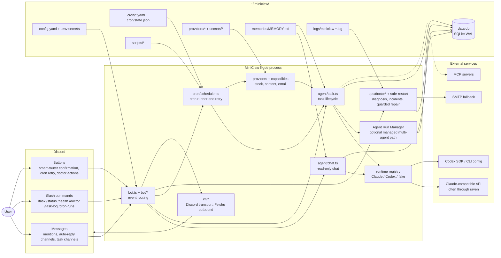
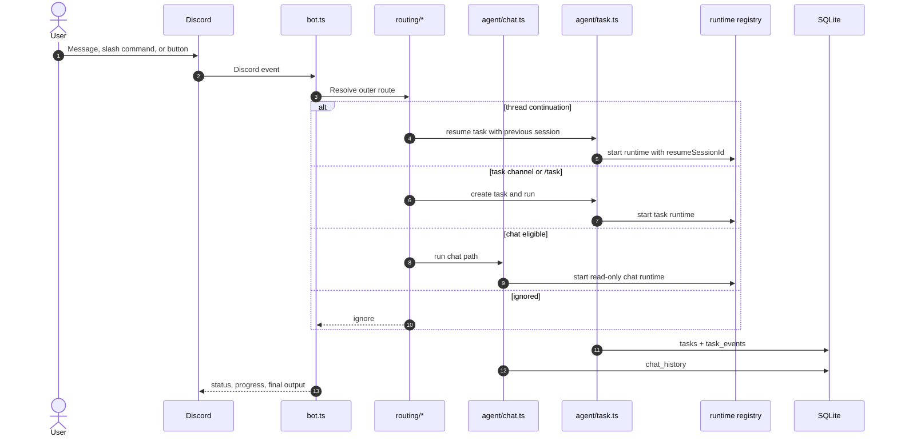
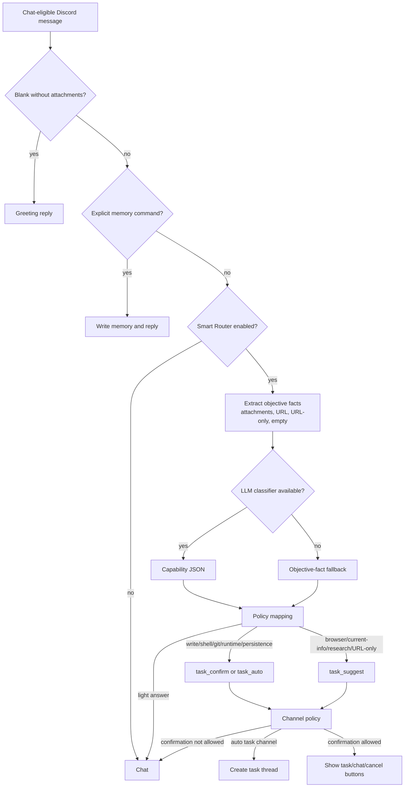
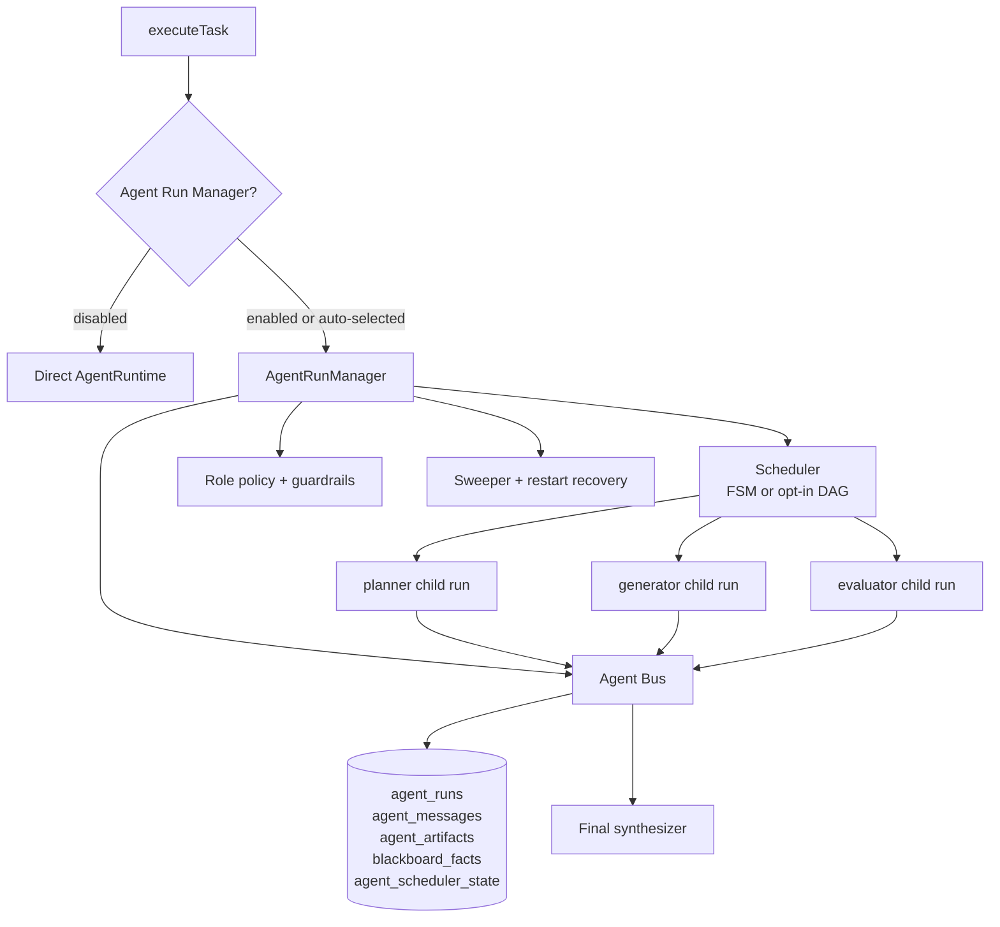
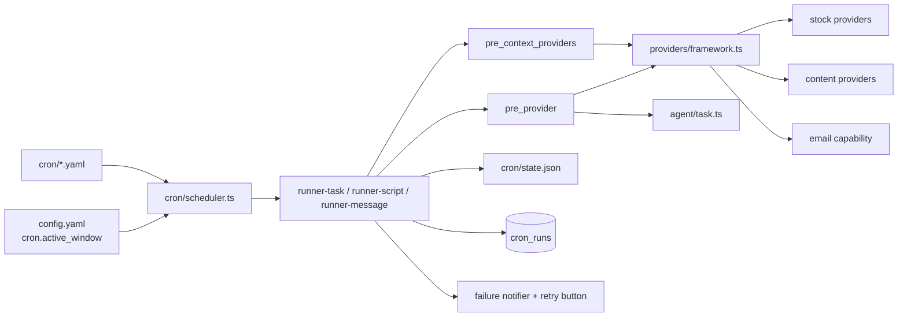
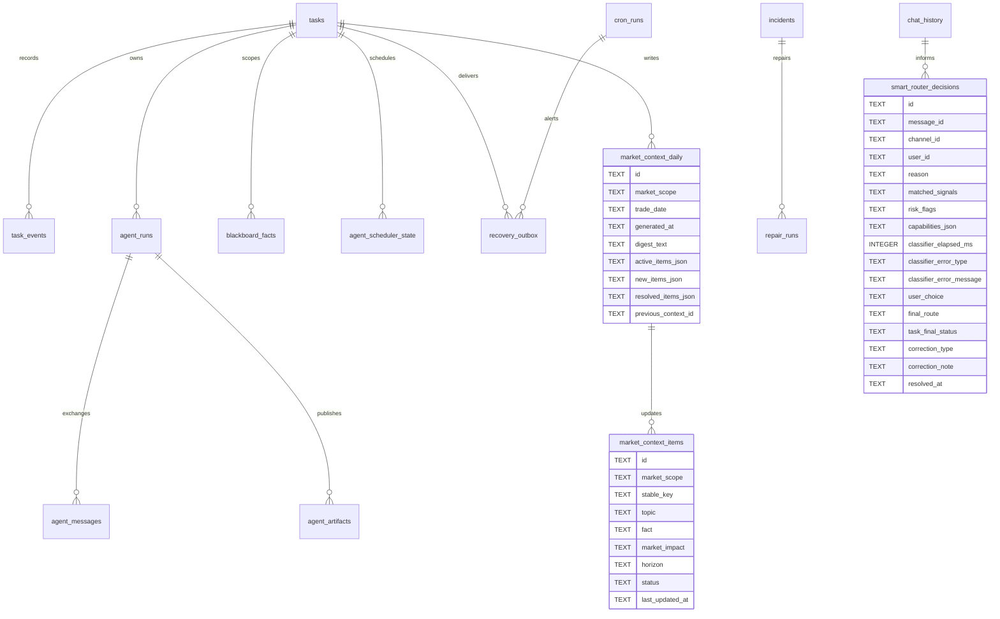

# MiniClaw 架构

> MiniClaw 是 local-first、Discord-native 的 agent runtime。Discord 是用户交互面；Node 22 是进程 runtime；`~/.miniclaw/` 是用户数据边界；SQLite 记录 durable task、routing、incident、provider 和 Agent Run Manager 状态。

## 系统视图

## Runtime 边界

MiniClaw 把 code、user state 和 public docs 做硬边界隔离：

- repo code 和 repo-owned prompts 放在 `src/`、`prompts/`、`agents/`、`personas/`。
- 用户配置、cron jobs、memory、scripts、provider sessions、logs 和 SQLite state 放在 `~/.miniclaw/`。
- secrets 只能放在 `.env` 或 `~/.miniclaw/secrets/**`，不能进入 public docs 或 examples。
- `docs/` 是 implementation source of truth；`website/` 是 presentation layer。

runtime registry 把 agent execution 和 routing 分离。`src/runtime/agent-runtime.ts` 定义统一 runtime interface，`src/agent/runtimes/registry.ts` 把配置映射到 Claude、Codex 或 fake task runner。`runtime.default_agent` 是推荐配置键；legacy `agent.provider` 仍作为兼容 fallback。

## 消息与任务流程

## Smart Router 路由器

Smart Router 是 chat-eligible path 内的第二层决策。第一层仍然负责 Discord hard routing：ignore、thread continuation、task channel 或 chat candidate。第二层决定 chat candidate 应继续 chat、显示 task confirmation，还是在配置过的 channel 中自动转 task。

## Agent Run Manager 管理器

Agent Run Manager 是 `executeTask()` 和 `AgentRuntime` 之间的可选 controlled insertion layer。`agent_run_manager.enabled=false` 且 `agent_run_manager.auto_enabled=false` 时，系统保持 single-agent runtime path。启用后，MiniClaw 会创建 root supervisor run 和 managed child runs，并提供 typed messages、artifacts、blackboard facts、policy checks、sweeper recovery 和可选 ACP-style access。

当前实现状态：

- managed fake runtime E2E 覆盖 planner、generator、evaluator、typed messages、artifacts、blackboard facts 和 final synthesis。
- Claude/Codex child runtime injection 支持 `miniclaw-agent-bus` MCP config 和 turn-end `miniclaw_agent_envelope` fallback。
- role policy 默认让 planner/evaluator read-only，并只在显式 policy 下允许 generator workspace writes。
- sweeper 处理 stale active runs、waiting scheduler timeout、orphan children、terminal cleanup 和 restart recovery。
- ACP server 是 localhost、task-scoped、bearer-token protected，默认关闭。

## Provider 与 Cron

`config.yaml` 中的 `cron.active_window` 是 scheduler-level guard。启用后，scheduled cron dispatch 和 missed-run catch-up 会在配置的本地时间窗口外记录为 skipped，不进入 runner 或 provider。手动 `pnpm cron:test` 仍保留为显式 operator troubleshooting 路径。

`pre_context_providers` 是 optional、non-blocking 的 background providers，会在 `pre_script` 和 primary `pre_provider` 前运行；它们用于注入 rolling market memory 这类 durable context，但不替代 task 的 source-of-truth provider。provider collection 默认 read-only，除非 provider 明确记录 commit phase。`commit()` 延迟到 downstream task success 后执行。provider docs 放在 `docs/providers/`；private account/session details 放在 `docs/private/` 或 `~/.miniclaw/`，不得进入 public docs。

## 存储模型

MiniClaw 使用 `~/.miniclaw/data.db`，SQLite WAL mode。schema migration 通过 `PRAGMA user_version` 管理；当前 schema 由 `src/store/schema.ts` 定义为 `SCHEMA_VERSION = 15`。

state retention 通过 `state.retention.*` 配置。cleanup 先 dry-run：`pnpm run state:cleanup -- --dry-run`；破坏性清理必须显式传入 `--execute`。

`market_context_daily` 按 market scope 和 trade date 存储一份 rolling digest。`market_context_items` 用 `(market_scope, stable_key)` 存储去重后的长期市场事实，让每日 update cron 可以解决过期事项，也让普通股票 cron 只注入 active context。

## 投递与恢复

`recovery_outbox` 把本地执行结果和 IM delivery 分离。`cron_failure_alert` 保存 Discord delivery 不可用时可重试的 cron failure alert；`task_result_delivery` 保存 task result fragments 以便后续 delivery recovery。Discord 仍是唯一完整 interactive gateway；Feishu 目前是 outbound-only。

## 可观测性与运维

- `task_events` 记录 lifecycle、protocol/tool events 和 Discord status transitions。
- `src/store/task-trace-export.ts` 与 `src/store/agent-run-trace-export.ts` 生成 redacted Markdown traces，供 `/task-log`、incident view 和本地 CLI review 使用。
- `/doctor` 和 scheduled scans 汇总 DB、cron state、config、PM2、logs 和 Git evidence。
- guarded repair/ship flow 必须经过 operator approval，并先通过 repair branch，不能直接碰 `main`。
- `safe-restart` 会在 active task/chat work 存在时阻止 unsafe restart。

## 设计不变量

- Discord routing 决定入口；agent runtimes 不决定 Discord event 是否允许处理。
- chat 是 read-oriented。file writes、shell execution、Git changes、durable output 和 multi-step coding 属于 task runtime。
- cron 和 providers source-isolated。provider 可以采集结构化输入，但 task execution 仍属于 agent runtime boundary。
- user state 属于 `~/.miniclaw/`；repo docs 和 examples 必须使用 placeholders。
- website pages 必须引用 `docs/` source，不能成为 implementation authority。
