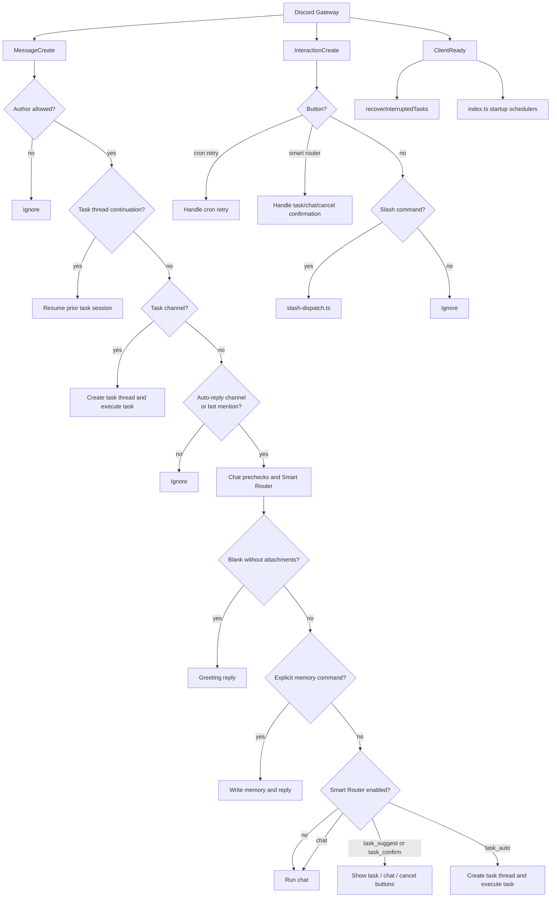
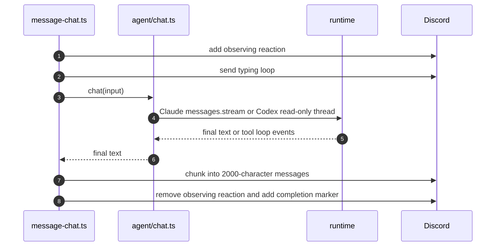

# Discord Bot 路由

> `src/bot.ts` 只注册少量 Discord event listeners，并把业务路由委托给 `src/bot/*`。本文档记录当前 message intake、slash commands、button interactions 和 task-thread continuation 的 routing map。

## 事件全景



## 监听器职责

| Location | Event | Responsibility |
|---|---|---|
| `createBot()` | `MessageCreate` | 计算外层 message route，并委托给 `message-thread-continuation.ts`、`message-task-channel.ts` 或 `message-chat.ts`。 |
| `createBot()` | `InteractionCreate` | 先把 buttons 委托给 `button-dispatch.ts`，再把 slash commands 委托给 `slash-dispatch.ts`。 |
| `createBot()` | `ClientReady` | 登录后恢复 interrupted tasks。 |
| `src/index.ts` | `ClientReady` | 启动 connectivity monitor、Auto Doctor scheduler 和 cron scheduler。 |

## MessageCreate 决策链

### Gate 1：发送者

```ts
if (message.author.bot) return;
if (message.author.id !== config.allowedUserId) return;
```

E2E mode 可以允许配置好的 test sender IDs；production mode 默认仍是 single-user。

### 路径 1：任务 Thread 续跑

thread continuation 的优先级高于 task-channel 和 chat routing。只有以下条件全部满足时才进入：

| Guard | Purpose |
|---|---|
| `isThread()` | 防止普通 channel 命中 continuation logic。 |
| `getTaskByThreadId(channel.id)` | 确认 thread 属于已有 task。 |
| `session_id` exists | 确认 previous task 可以 resume。 |
| `discord_user_id !== "cron"` | 防止 cron-created task 变成用户上一轮 chat session。 |

handler 会加 reaction、创建新 task row，并在同一个 Discord thread 中调用 `executeTask({ resumeSessionId })`。

### 路径 2：任务入口 Channel

如果 channel 在 `config.taskChannelIds` 中，普通消息就按 `/task` input 处理，不需要 mention。handler 会按 `message.id` 去重、解析 prompt 和 attachments、检查 concurrency、创建 thread、写入 task row、发送 start embed，并调用 `executeTask()`。

如果一个 channel 同时是 task channel 和 auto-reply channel，task-channel path 优先，避免 double processing。

### 路径 3：Chat 候选消息

当 channel 位于 `config.autoReplyChannelIds`、`config.autoReplyChannelIds` 包含 `*`，或 bot 被 mention 时，消息成为 chat-eligible。chat handler 随后：

1. 按 `message.id` 去重。
2. 从 content 中移除 bot mentions。
3. 检测 attachments。
4. text 和 attachments 都为空时回复 greeting。
5. 在任何 LLM call 前处理 explicit memory commands。
6. 启用时运行 Smart Router。
7. 最终 route 为 chat 时进入 `agent/chat.ts`。

## Smart Router 动作

| Priority | Decision | Result |
|---|---|---|
| Precheck | Attachments present | 构造 attachment blocks 并发送必要 notices。 |
| High | Empty content and no attachments | greeting reply，然后 return。 |
| Medium | Explicit memory command | 写 memory，回复成功，然后 return。 |
| Low | All other content | Smart Router 决定 chat、confirmation 或 task auto-route。 |

Smart Router button custom ID 只包含短 token，不包含 prompt。confirmation state 有短期过期时间，并且不跨进程重启保存。

## InteractionCreate 事件

button dispatch 先于 slash command dispatch：

1. `button-dispatch.ts` 处理 cron retry buttons。
2. `button-dispatch.ts` 处理 Smart Router confirmation buttons。
3. `slash-dispatch.ts` 把 slash commands 映射到 `commands/handlers.ts`。

当前 top-level slash commands 包括：

- `/task`
- `/status`
- `/task-log`
- `/cron-runs`
- `/cron-run`
- `/health`
- `/doctor`
- `/incidents`
- `/incident`
- `/agent-config`
- `/cancel`
- `/resume`
- `/remember`
- `/forget`
- `/memories`

## Chat Runtime 反馈



chat 故意保持 read-oriented。workspace writes、shell execution、Git operations、durable output 和 multi-file coding work 应走 task runtime。

最终 Discord Markdown 投递会使用共享的 2000 字符 chunker。裸 `https://...` 链接会被集中到最后的 link-preview footer，正文 chunk 会 suppress embeds；但用 `<https://...>` 包起来的 Discord no-embed 链接会保留 no-preview 语义，不会被复制到 preview footer。这个规则适用于 chat replies、task results、Discord IM fanout、recovery replay 和 script cron `DISCORD_MESSAGE` output；新增 Discord text-delivery 路径应使用同一个 helper，不要直接用 raw content 调 `channel.send()`。发布大量链接的 cron prompt 如果希望链接可点击但不出现预览卡片，应优先使用 angle-bracket 形式。

## 安全变更地图

| Goal | Change Area |
|---|---|
| Add a slash command | `commands/register.ts`、`commands/handlers.ts` 和 `src/bot/slash-dispatch.ts`。 |
| Add a new button action | `src/bot/button-dispatch.ts`；避免和 `miniclaw:smart:*`、`miniclaw:cron:retry:*` 冲突。 |
| Add a task intake channel | 创建 Discord channel，把 ID 加到 `MINICLAW_TASK_CHANNELS` 或 YAML config，然后 restart。 |
| Restrict normal chat to mentions only | 设置 `MINICLAW_AUTO_REPLY_CHANNELS=none` 或 `routing.auto_reply_channels: []`。 |
| Enable natural-language task detection | 设置 `routing.smart_router.enabled: true`，再配置 `confirm_channels` 或 `auto_task_channels`。 |
| Disable thread continuation | 修改 Path 1 continuation branch，同时保留 task-channel 和 chat routing。 |
| Add a cron job | 添加 `~/.miniclaw/cron/<name>.yaml`；不需要改代码。 |
