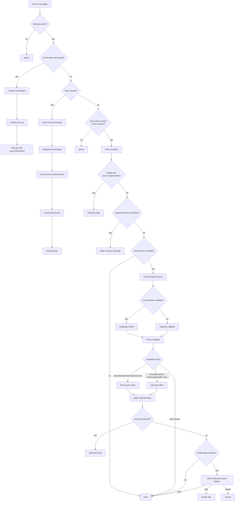

# MiniClaw Chat Router 当前逻辑

> Snapshot: 2026-05-15。本文档描述当前代码路径如何判断 inbound Discord message 是 ignore、chat、转成 task，还是在已有 task thread 中 resume。

## 结论

MiniClaw router 有两层：

1. `src/routing/message-route.ts` 做 Discord hard route：`ignore`、`thread_continuation`、`task_channel` 或 `chat`。
2. 只有进入 `chat` 的消息才会到 `src/routing/intent.ts`，Smart Router 在那里把 objective facts 和可选 LLM capability classification 映射成 `chat`、`task_suggest`、`task_confirm` 或 `task_auto`。

当前策略是 LLM-first 但保守。regex task/chat signals 不再拥有决策权。attachments、URL-only messages、empty messages 等 objective facts 在 classifier disabled 或 unavailable 时仍作为 fallback facts。

Weixin direct 在 Discord hard route 之前有自己的 gateway path。它先执行 Weixin allowlist，提取文字/语音/图片输入，再复用同一套 Smart Router classifier 判断 chat-vs-task。Smart Router 在 Weixin 上判断为 task 时，MiniClaw 一律用 y/n 文本确认，不使用 Discord buttons，也不自动创建 task。

## 路由流程

上图是 Discord message flow。Weixin direct 先经过自己的 long-poll receive path：media extraction -> optional Smart Router classification -> 对 task-like prompt 发 y/n 文本确认 -> chat runtime 或 Weixin task view reporter。

## 代码地图

- `src/bot.ts`：Discord event registration、client lifecycle 和 outer message-route delegation。
- `src/bot/message-chat.ts`：memory commands、Smart Router、attachment processing 和 chat response。
- `src/bot/message-task-channel.ts`：task-channel intake。
- `src/bot/message-thread-continuation.ts`：task thread continuation。
- `src/bot/button-dispatch.ts`：cron retry 和 Smart Router button dispatch。
- `src/bot/slash-dispatch.ts`：slash command dispatch。
- `src/routing/message-route.ts`：hard message route。
- `src/routing/intent.ts`：objective facts、capability-to-route mapping 和 channel policy。
- `src/routing/llm.ts`：可选 LLM capability classifier。
- `src/routing/confirmations.ts`：短生命周期 Smart Router confirmation state。
- `src/discord/task-intake.ts`：task creation 和 `executeTask()` 入口。
- `src/im/adapters/weixin/gateway.ts`：Weixin allowlist、media extraction、Smart Router y/n confirmation、direct chat 和 direct task execution。
- `src/agent/chat.ts`：真实 chat runtime execution。
- `src/routing/context.ts`、`src/routing/task-context.ts`、`src/routing/chat-context.ts`：recent context 和 source metadata。

## 第 1 层：Discord 消息路由

### 发送者 Gate

production mode 只接受 `config.allowedUserId`。bot-authored messages 和其他用户会被 ignored。E2E mode 可以允许配置好的 test sender IDs。

### Thread 续跑

只有当前 channel 是 thread、thread 映射到已有 task、task 有 `session_id` 且 task 不是 cron 创建时，才返回 `thread_continuation`。MiniClaw 随后创建新 task row 并调用 `executeTask({ resumeSessionId })`。

### Task Channel 判定

当前 channel ID 位于 `config.taskChannelIds` 时返回 `task_channel`。消息会成为 task prompt。attachment-only prompts 使用默认 attachment handling prompt。handler 检查 concurrency、创建 thread、写 DB state、发送 start embed，并启动 `executeTask()`。

### Chat Eligible 判定

bot 被 mention，或当前 channel 被 `config.autoReplyChannelIds` 允许时，返回 `chat`。否则返回 `ignore`。

常见本机配置使用 wildcard auto-reply channels、启用 Smart Router、没有 auto-task channels，并配置 confirmation channels。这意味着很多消息会先成为 chat candidate，再由 Smart Router 判断是否显示 task confirmation。

## 第 2 层：Chat 入口预检

route 进入 `chat` 后，`src/bot/message-chat.ts` 继续做本地短路判断：

1. 按 `message.id` 去重。
2. 移除文本中的 bot mentions。
3. 收集 attachment metadata。
4. 没有文本且没有附件时回复 greeting。
5. 通过 `parseExplicitMemory()` 和 `addMemory()` 执行 explicit memory commands。
6. 启用时进入 Smart Router。
7. 如果最终 route 仍是 chat，则处理附件、加 feedback reactions、发送 typing，并调用 `chat()`。

attachments 对 classifier 只呈现为 objective facts；附件内容会在已选择的 runtime path 中后续处理。

## Smart Router 能力分类

`classifySmartRoute()` 先提取 objective facts，再在 policy 允许时调用 LLM classifier。

objective facts 包括：

- `empty_message`
- `attachments` / `hasAttachments`
- `external_url` / `hasExternalUrl`
- `url_only` / `isUrlOnly`

objective layer 不根据“修改”“排序”“总结”“研究”等自然语言词语推断 intent；这些语义判断属于 classifier。

classifier：

- 只输出 JSON
- 不回答用户问题
- 不浏览、不抓 URL、不读文件、不运行命令
- 判断 required capabilities，而不是 final route
- 把 coding、persistence、shell、Git 和 runtime changes 映射到 task confirmation

示例 intent：

- 询问贡献者如何达成大量 contributions 的 prompt，应设置 `needs_current_info=true` 和 `needs_multi_step_research=true`。
- 要求给 `stock-pulse` 增加并排序字段的 prompt，应设置 `needs_file_write=true`。

## 分类器的 Provider 选择

classifier 使用 lightweight model client layer，而不是 task runtime：

- `routing.smart_router.llm_classifier.provider` 未设置时，Smart Router 优先使用 `model.default_client`。
- `provider: auto` 先尝试 Anthropic-compatible config，再尝试 OpenAI-compatible config，只有显式配置时才回退 Codex。
- `provider: raven` 或 `provider: anthropic` 强制 Anthropic Messages API path。
- `provider: openai` 要求 `OPENAI_API_KEY`。
- `provider: openai_compatible` 要求 `OPENAI_BASE_URL`；服务端不要求 bearer auth 时，`OPENAI_API_KEY` 可选。
- `provider: codex` 强制 legacy read-only Codex classifier path。

classifier failure 会 fallback 到 objective facts，并记录失败原因。classifier 不可用不应导致 routing 失败。

## 路由映射

| Capability | Default Intent |
|---|---|
| file writes, shell, Git, runtime state, durable output | `task_confirm` |
| browser/current info, multi-step research, URL-only requests | `task_suggest` |
| light Q&A, explanation, simple reading | `chat` |
| configured auto-task channel with strong task intent | `task_auto` |

Discord channel policy 决定 task intent 最终是 automatic task、confirmation buttons，还是 fallback chat。Weixin 会把 `task_auto`、`task_confirm` 和 `task_suggest` 都当作“先用文本询问”：`y` 创建 task，`n` 继续 chat，取消类回复丢弃 pending confirmation。

## 已知边界

- Smart Router 在 route 前不会读取 attachment content。
- confirmation state 是 process-local 且短生命周期。
- classifier 判断 capability requirements，不判断用户价值或答案质量。
- Discord `/task` 和 task-channel intake 会绕过 Smart Router，因为用户或 channel 已经选择 task mode。
- Weixin `/task ...` 仍然会询问 y/n，让移动聊天入口只有一条可反悔的 task conversion path。
- chat 保持 read-oriented；workspace-changing work 必须通过 task mode。
