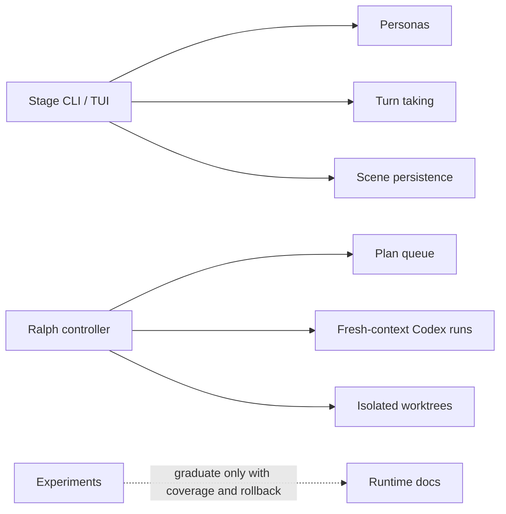

# MiniClaw Experiments

> 结论：experiments 用来验证未来 runtime pattern，但它们不是默认 MiniClaw product behavior。本目录把实验性 control planes 与稳定 runtime/provider docs 分离。

## Experiment Map



## Stage

Owner code paths:

```text
src/stage/**
personas/**
pnpm stage
pnpm stage:smoke
```

Purpose:

- Stage 是实验性的 CLI/TUI multi-agent console，用于 persona、turn-taking、transcript 和 scene-management 研究。
- 它运行在 Discord bot process 外部，不应意外变成默认 task path。
- 它可以复用 MiniClaw runtime contracts 和 model clients，但 Stage persona state、TUI state 和 orchestrator rules 都是实验性质。

Current behavior:

- 通过 `pnpm stage` 启动 Ink TUI。
- 从 `personas/` 加载 persona files。
- 支持 summon/dismiss participants、roster/cost、save/load scenes、auto mode 控制等 slash-like commands。
- Scene persistence 与默认 chat/task state 分离。
- 强制 anti-loop、budget 和 turn-cap guards。

Boundary contract:

- Stage 可以实验 multi-agent UX，但不能修改正常 Discord task routing。
- Stage promotion 需要 normal runtime coverage、rollback semantics，以及位于 `docs/plans/**` 之外的 docs。
- Stage smoke/e2e checks 应与默认 bot startup 分离。

## Ralph Controller

Owner docs and code paths:

```text
docs/ralph/README.md
docs/ralph/queue.json
docs/ralph/learnings.md
scripts/ralph-run.ts
scripts/ralph-loop.ts
scripts/ralph-verify.ts
```

Purpose:

- Ralph 是面向 fresh-context Codex work 的薄 controller，以 plan 为单位运行。
- 它位于 bot runtime 外部，不修改 live MiniClaw state。
- 它通过 isolated worktrees 和 verification profiles 串行化选中的 plan tasks。

Execution model:

```text
queue task
  -> fresh codex exec --ephemeral context
  -> isolated worktree / branch
  -> verification profile
  -> commit task branch
  -> optional integration-safe merge / push-main
```

Boundary contract:

- 每次 Codex run 只处理一个 plan task。
- Raw run logs 保持本地并忽略在 `.ralph/` 下。
- Durable learnings 只 append 到 `docs/ralph/learnings.md`。
- `ralph:loop --merge-main --push-main` 必须 fetch/rebase/reverify，并使用 lease-aware push behavior。
- Ralph 是 automation controller，不是 Discord-facing feature。

## Legacy Cleanup

上一轮 feature-level experiment stubs 已在迁移完成后删除。本文件和 `docs/ralph/**` 现在承载 experiment source-of-truth 内容。

## Graduation Rule

只有当 experiment code path 已在正常 MiniClaw execution 中启用、有 rollback semantics、有 quality coverage，并且有位于 `docs/plans/**` 之外的 source-of-truth docs 时，它才能移动到 runtime docs。

Verification owner:

```bash
pnpm vitest run src/stage
pnpm ralph:verify -- --task <task-id>
pnpm run quality:docs
```
