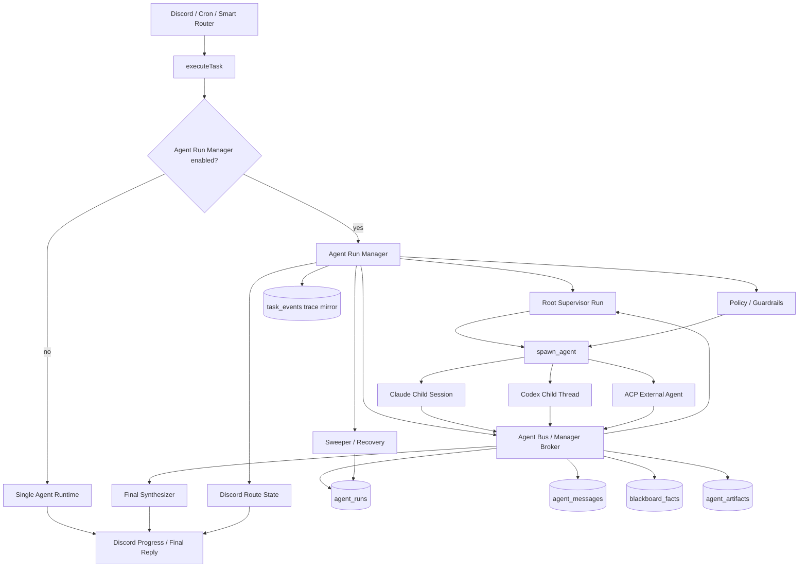

# MiniClaw Agent Run Manager 设计

Status: completed-foundation
Date: 2026-05-14

## 背景

MiniClaw 已经有 `AgentRuntime` 抽象，可以把 Claude、Codex 和 fake task runner 包在同一个 coding-agent runtime 后面。原有 `/task` 的多 agent 能力并不对称：

- Claude 可以使用 Claude Agent SDK 的 native `agents` 和 `Agent` tool。
- Codex 只收到 Supervisor prompt，没有 SDK 级 child-agent registry、mailbox、blackboard 或 child-run state。
- `task_events` 能记录 trace facts，但它是观测层，不是 agent-to-agent 协作的安全 transport。

目标不是把 MiniClaw 做成通用 agent marketplace，而是在现有 Discord、cron 和 task runtime 内增加一个受控的 Agent Run Manager，并提供最小 ACP-compatible bus/server，让 root agent、child agents 和可选的 external ACP-style agents 能通过 structured messages、artifact references 和 blackboard facts 交换信息。

## 目标

- 让 Supervisor 和 child agents 具备双向结构化通信，而不是把上一个 agent 的完整输出塞进下一个 prompt。
- 为 Claude 和 Codex 提供统一的 managed multi-agent execution model。
- 支持 `finding`、`question`、`answer`、`challenge`、`handoff`、`verdict` 等 typed messages。
- 用 artifact reference 承载大 diff、调研报告、日志和 provider payload。
- 执行 per-agent runtime、sandbox、写权限、预算、超时、循环和取消策略。
- 在一个 Discord bot 账号下支持 task-scoped dynamic child runs。
- 保留现有 `/task`、cron task、Discord progress 和 `task_events` 可观测性。

## 非目标

- 不默认把所有 task 都变成 multi-agent。
- 不构建 public agent marketplace、完整 agent discovery catalog 或多租户托管平台。
- 不为 child agents 创建多个 Discord bot identity。
- 不允许 child agents 绕过 MiniClaw Manager 无限互相通信。
- 不把长期 memory 当作 task blackboard。Memory 是跨任务知识；blackboard 是单任务协作状态。
- 不把 Stage persona 或 TUI orchestration 移入 Discord task path。

## 现有架构证据

- `src/runtime/agent-runtime.ts` 定义 `AgentRuntime.startTask()`、`resumeTask()` 和 `startChat()`。
- `src/agent/task.ts` 负责 task lifecycle、abort handling、DB state updates、Discord view reporting 和 trace callback wiring。
- `src/agent/runners/claude-task-runner.ts` 已支持 Claude native subagent behavior。
- `src/agent/runners/codex-task-runner.ts` 过去只注入 Supervisor prompt。
- `src/store/task-events.ts` 写入 task trace facts，但不建模 agent runs、mailboxes、artifacts 或 blackboard state。
- `agents/*.md` 仍是 managed child prompts 和 permissions 的 role definition source。

## 目标执行模型

MiniClaw 的目标是 **single Discord account, task-scoped dynamic spawn**，不是 gateway-wide multi-account routing。

- 一次 chat、`/task` 或 cron-triggered task 创建一个 root `agent_run`，`role="supervisor"`。
- Supervisor 可以 spawn `researcher`、`planner`、`generator`、`evaluator` 等 child runs。
- Child runs 是 MiniClaw 内部 runtime sessions，有各自的 context、tool profile、budget、timeout、artifacts 和 mailbox。
- 所有可见 Discord updates 都由 MiniClaw 根据 root route state 发出。Child raw transcripts 不直接发到 Discord。
- Child completion 和 peer messages 通过 Manager-owned bus state 返回，不靠 polling，也不直接改 prompt。

该模型借鉴 OpenClaw 的 run/session lifecycle、push completion、`sessions_yield` 模式、active child context、depth/fan-out guardrails 和 ACP adapter 边界。MiniClaw 保持 typed Manager-routed messages 作为协作契约，而不是采用 gateway-wide persona routing。

## 拟议架构



Manager 位于 `executeTask()` 内，在 task lifecycle 和 provider-specific runtimes 之间。普通 task 继续走 single-agent path。只有显式启用，或 auto classifier 选中时，task 才进入 managed path。

## 锁定的第一阶段决策

- **Manager placement**：Agent Run Manager 是 `executeTask()` 内部 orchestration layer，不是新的 `AgentRuntime`。
- **Feature flag**：`agent_run_manager.enabled` 默认 `false`；关闭时，普通 `/task`、cron task 和 chat 行为保持不变。
- **Runtime mode**：Claude native `Agent` 继续作为兼容路径；MiniClaw-managed child runs 是真相源。
- **Bus transport**：Manager API、MCP tools 和 ACP endpoints 是 agent-facing transport。SQLite 是 durable append 和 recovery state，不是 live collaboration transport。
- **Context mode**：child runs 默认 `context_mode="isolated"`；`fork` 需要显式请求。
- **Route state**：只有 root run/Manager 拥有 Discord channel、thread 和 message state。
- **ACP scope**：第一阶段只暴露 minimal local ACP-compatible adapter/server。不做 marketplace、remote discovery 或 multi-tenant hosting。
- **Loop control**：parent-owned child completion 和 peer-to-peer typed messages 是两条独立路径，并且都有有界返回行为。

## 数据模型

### `agent_runs`

记录每个 root、child 或 external managed execution entity。

```ts
type AgentRunStatus =
  | "queued"
  | "running"
  | "waiting"
  | "completed"
  | "failed"
  | "cancelled";

type AgentContextMode = "isolated" | "fork";
type AgentControlScope = "root" | "child" | "peer";

interface AgentRun {
  id: string;
  task_id: string;
  parent_run_id?: string;
  controller_run_id?: string;
  requester_run_id?: string;
  role: "supervisor" | "researcher" | "code-investigator" | "planner" | "generator" | "evaluator" | string;
  runtime: "claude" | "codex" | "external-acp";
  provider_session_id?: string;
  status: AgentRunStatus;
  spawn_depth: number;
  control_scope: AgentControlScope;
  context_mode: AgentContextMode;
  cwd: string;
  tool_policy_id: string;
  can_spawn: boolean;
  can_write_workspace: boolean;
  can_send_kinds: string[];
  can_receive_kinds: string[];
  started_at: string;
  completed_at?: string;
  error_message?: string;
}
```

关键要求：

- Root run 拥有 Discord route state。
- `spawn_depth`、`control_scope` 和 `can_spawn` 防止无限 child creation。
- `can_send_kinds` 和 `can_receive_kinds` 由 Manager 强制执行，不只是写在 prompts 里。

### `agent_messages`

任务范围内结构化通信的主要 durable channel。

```ts
type AgentMessageKind =
  | "finding"
  | "question"
  | "answer"
  | "challenge"
  | "decision"
  | "handoff"
  | "artifact"
  | "verdict"
  | "error";

interface AgentMessage {
  id: string;
  task_id: string;
  from_run_id: string;
  to_run_id?: string;
  kind: AgentMessageKind;
  content_text?: string;
  payload_json?: unknown;
  artifact_ids?: string[];
  causal_message_id?: string;
  created_at: string;
}
```

### `blackboard_facts`

Blackboard 只保存 Manager 接受的 facts、decisions 和 current state。它不保存每一行 raw transcript。

```ts
interface BlackboardFact {
  id: string;
  task_id: string;
  key: string;
  content: string;
  source_message_id: string;
  confidence: "low" | "medium" | "high";
  status: "active" | "superseded" | "rejected";
  created_at: string;
  updated_at: string;
}
```

### `agent_artifacts`

大输出以 artifacts 引用。Messages 应携带 artifact IDs 和 summaries，而不是完整正文。

```ts
interface AgentArtifact {
  id: string;
  task_id: string;
  run_id: string;
  kind: "markdown" | "json" | "diff" | "log" | "file_ref";
  path: string;
  title?: string;
  summary?: string;
  content_hash: string;
  created_at: string;
}
```

### `agent_scheduler_state`

用于 root Supervisor orchestration、wait state 和 recovery 的 durable snapshot。

```ts
interface AgentSchedulerState {
  task_id: string;
  root_run_id: string;
  scheduler_version: string;
  status: "initialized" | "running" | "waiting" | "completed" | "failed" | "cancelled";
  current_step: string;
  wait_run_id?: string;
  wait_kinds: AgentMessageKind[];
  last_message_id?: string;
  plan_json: unknown;
  created_at: string;
  updated_at: string;
}
```

### Required Indexes

- `agent_runs(task_id, status, created_at)`
- `agent_runs(parent_run_id, status)`
- `agent_runs(requester_run_id, status)`
- `agent_messages(task_id, created_at)`
- `agent_messages(to_run_id, created_at)`
- `agent_messages(from_run_id, created_at)`
- `blackboard_facts(task_id, key, status)`
- `agent_artifacts(task_id, run_id, created_at)`
- `agent_scheduler_state(status, updated_at)`
- `agent_scheduler_state(root_run_id)`

Store repositories 必须提供 typed APIs，例如 `createRun`、`updateRunStatus`、`appendMessage`、`readMailbox`、`upsertBlackboardFact`、`writeArtifact` 和 `upsertAgentSchedulerState`。Manager code 不能 inline 拼 raw SQL。

## 通信契约

Inter-agent communication 不能退化成“写 SQLite，然后希望另一个 agent 轮询到”。Live path 是通过 Manager API、MCP tools 或 ACP endpoint 暴露的 Agent Bus。SQLite 只保留 durable log 和 recovery/audit source。

推荐 hot path：

```text
subagent A
  -> agent_bus.send_message(JSON)
  -> Agent Run Manager validates schema, permissions, and target
  -> in-memory mailbox wakes subagent B or Supervisor
  -> SQLite append-only durable log
  -> artifact store keeps large object references
```

这保留两个保证：

- **Speed**：live messages 不需要 DB polling 就能唤醒 waiting runs。
- **Visibility**：每个 run 都收到 roster、allowed message kinds 和 bus usage instructions。

### Direct JSON Message

每条 message 必须包含 `from`、`to`、`kind`、`task_id` 和 typed content。

```json
{
  "from": "researcher",
  "to": "planner",
  "kind": "finding",
  "task_id": "task-123",
  "content": {
    "summary": "Codex runner only injects a supervisor prompt; it does not register subagents.",
    "evidence": ["src/agent/runners/codex-task-runner.ts:26"]
  },
  "artifacts": []
}
```

### Bus Tools / API

- `list_agents()`
- `send_message(to, kind, payload, artifacts?)`
- `wait_for_message(filter, timeout_ms)`
- `read_mailbox(after_cursor?)`
- `publish_artifact(kind, title, content_or_path, summary?)`
- `read_artifact(artifact_id)`
- `list_blackboard()`
- `upsert_blackboard_fact(key, content, confidence, source_message_id)`

### Durable Envelope

没有 live bus access 的 runtime 可以返回 turn-end envelope 作为兼容 fallback。这不是目标体验。

```json
{
  "messages": [
    {
      "kind": "finding",
      "content_text": "Codex child runtime needs managed threads for real child-agent behavior.",
      "payload_json": {
        "evidence": ["src/agent/runners/codex-task-runner.ts:26"]
      }
    }
  ],
  "artifacts": [
    {
      "kind": "markdown",
      "title": "Codex child-agent capability findings",
      "path": ".miniclaw-task/task-1/artifacts/run-2/findings.md"
    }
  ],
  "summary": "Codex path needs managed child threads for real child-agent behavior."
}
```

## 执行流程

1. `executeTask()` 检查 `agent_run_manager.enabled` 和 auto-routing policy。
2. Manager 创建 root `agent_run`，`role="supervisor"`。
3. Supervisor 输出 structured orchestration plan。
4. Manager 用 `spawn_agent(...)` 启动 child runs；spawn 是 non-blocking，并立即返回 run metadata。
5. Supervisor 可以进入 `yield_until_child_event` 或 `wait_for_message`；Manager 暂停 root orchestration turn。
6. Child runs 通过 Agent Bus 发送 typed JSON messages。
7. Manager 写入 durable `agent_messages`、`agent_artifacts` 和 `blackboard_facts`。
8. Evaluator `verdict=FAIL` 可以触发 bounded generator fix loop。
9. Final Synthesizer 读取 active blackboard facts、artifacts、run status 和 verdict signals，生成 user-facing result。
10. Manager 把关键状态镜像到 `task_events`、`/task-log`、incident views 和 trace export。
11. Sweeper 处理 stale active runs、waiting scheduler timeouts、orphan children、terminal cleanup 和 restart recovery。

## Provider 策略

### Claude

Claude native `Agent` 继续作为 compatibility path，但 Manager-owned `agent_runs`、`agent_messages`、`blackboard_facts` 和 `agent_artifacts` 是真相源。

### Codex

每个 Codex child 是 managed child thread。Planner/evaluator 默认 read-only policy；generator 可以在明确允许时获得 workspace-write policy。由于 Codex 不提供 Claude SDK 的 per-subagent tool registration，Manager 必须强制 sandbox、prompt、execution policy 和 artifact/message 边界。

### ACP Server And External Agents

ACP 是进入 Agent Bus 的 protocol adapter，不是 scheduler。第一阶段默认 local、bearer-token protected、task-scoped，并且不暴露为 public marketplace。

## Context Management

Agent Run Manager 应减少 prompt growth：

- Supervisor 不把完整 child output 复制到下一个 child prompt。
- Child runs 接收原始用户目标、compact role brief、active blackboard facts 和必要 artifact references。
- Large artifacts 只通过 ID、title、kind、summary 和 path/ref 传递。
- Final synthesis 读取 blackboard facts、artifact metadata、messages 和 verdicts，但不展开所有 artifact bodies。

## 权限与安全

- `generator` 是默认唯一允许写 workspace files 的 role。
- `researcher`、`planner` 和 `evaluator` 默认 read-only。
- `code-investigator` 可以拥有 Bash，但 dangerous commands 仍由 Manager policy 阻止。
- 每个 run 都有 `max_turns`、`timeout_ms`、`max_messages`、`max_artifact_bytes` 和 `max_fix_iterations`。
- Manager 有 `max_spawn_depth`、`max_children_per_run`、`max_concurrent_runs`、`max_ping_pong_turns` 和 `cleanup_ttl_ms`。
- Root cancellation 会级联到 active child runs。
- Agents 不能直接写入彼此的 prompts、sessions 或 SQLite state。
- 只有 redacted、user-facing conclusions 应进入 Discord。

## Discord And Trace UX

只暴露一个 Discord bot account。Child agent presence 以 compact task progress 表达：

- `supervisor: plan created`
- `researcher: 3 findings`
- `planner: 5 implementation steps`
- `generator: changed 2 files`
- `evaluator: verdict PASS`

`task_events` 继续作为 observation mirror，并增加 Agent Run Manager event types：

- `agent_run_started`
- `agent_run_completed`
- `agent_message_posted`
- `blackboard_fact_upserted`
- `artifact_written`
- `verdict_received`
- `manager_route_decision`

## 实施计划

1. 增加 `agent_runs`、`agent_messages`、`agent_artifacts`、`blackboard_facts` 和 `agent_scheduler_state` 的 DB schema。
2. 增加 typed store repositories；Manager 不能 inline raw SQL。
3. 增加 `src/agent/run-manager/`，包含 run registry、in-memory mailbox、artifact store、blackboard store、scheduler 和 policy checks。
4. 增加 Agent Bus service API 和 MCP-compatible tool surface。
5. 增加 fake runtime E2E，覆盖 planner、generator、evaluator、typed messages、artifacts、blackboard facts 和 final synthesis。
6. 在 `agent_run_manager.enabled` 后接入 `executeTask()`。
7. 增加 Codex managed child thread support。
8. 增加 Claude managed child session support。
9. 增加 evidence-oriented Final Synthesizer。
10. 增加 local ACP-compatible server/adapter。
11. 增加 sweeper 和 restart recovery。
12. 增加 docs、trace export 和 quality-gate coverage。

## 当前实现状态

Snapshot date: 2026-05-15.

### Completed

- Schema tables 和 required indexes 已落地。
- Runs、messages、mailbox、blackboard、artifacts 和 scheduler state 的 typed store APIs 已落地。
- Agent Bus core 已落地，支持 direct in-memory wake 和 durable append。
- Fake managed runtime E2E 覆盖 planner -> generator -> evaluator。
- `executeTask()` feature flag integration 已落地；默认仍是 single-agent path。
- Claude/Codex child runs 的 turn-end envelope fallback 已落地。
- Bounded evaluator fix loop 和 root cancellation cascade 已落地。
- Guardrail config 和 enforcement 已落地。
- Minimal local ACP adapter/server 已落地。
- `miniclaw-agent-bus` MCP-compatible tool surface 已落地，并提供 `pnpm run mcp:agent-bus`。
- Real child runtimes 的 live MCP bus injection 已落地。
- Dynamic scheduler / `yield_until_child_event` foundation 已落地。
- Codex 和 Claude child runs 的 runtime role policy enforcement 已落地。
- Sweeper 和 restart recovery 已落地。
- `agent_run_manager.auto_enabled=true` 时，complexity classifier 可以把 medium/high complexity tasks 路由到 managed path。
- C7 arbitrary DAG scheduler foundation 已落地。
- C8 evidence-rich final synthesizer 已落地。
- C9 multi-agent trace UX 已为 `/task-log` 和 incident views 落地。

### Partially Implemented

- LLM-generated DAG admission 仍然 gated。C7 支持 controlled opt-in DAG plans，但 Planner auto-generated plans 不会自动准入。
- Per-node DAG replay 仍通过 `agent_scheduler_state.plan_json` 做 snapshot-based 恢复；还没有独立 node-state table。

### Not Yet Implemented

- Managed traces 的独立 visual timeline UI。
- DAG executor 中 per-node `repeat_policy` execution。

## 下一阶段计划

### C0 - Status and Slice Planning

- 保持本计划作为当前 implementation/status record。
- 后续工作继续拆 slice，避免把 runtime injection、scheduler changes、sweeper behavior 和 ACP hardening 混在一个 review 单元。
- Verification: `pnpm run quality:docs`.

### C1 - Guardrails and Policy Enforcement

- 按需扩展 `agent_run_manager` policy config 和 env overrides。
- 保持 Manager spawn path 和 Bus path 的 guardrails enforcement。
- Verification: config tests、Agent Bus tests、managed runtime tests 和 `pnpm run build`.

### C2 - Live MCP Bus Injection

- Completed 2026-05-15.
- live bus 不可用时，继续保留 turn-end envelope fallback。
- Verification: fake MCP bus fixture、Codex/Claude runner unit tests 和 managed runtime fallback regression。

### C3 - Dynamic Scheduler and Yield/Resume

- Completed 2026-05-15.
- 当前默认仍是 planner -> generator -> evaluator 加 bounded fix loop。
- Verification: dynamic spawn fixture、direct wake without polling、cancel during waiting 和 fan-out regression。

### C4 - Role Policy Enforcement at Runtime Boundary

- Completed 2026-05-15.
- 继续保留 read-only planner/evaluator negative tests 和 generator write positive tests。
- Verification: per-role runner config tests 和 dangerous-command denial fixtures。

### C5 - Sweeper and Restart Recovery

- Completed 2026-05-15.
- Sweeper 处理 stale runs、orphan children、waiting scheduler timeout 和 manager-owned artifact cleanup。
- Verification: stale run fixture、orphan child fixture、restart recovery simulation 和 state cleanup dry run。

### C6 - ACP Lifecycle, Classifier Routing, and Docs Promotion

- Completed 2026-05-15.
- ACP 默认保持 localhost/token protected。
- Verification: ACP lifecycle tests、classifier routing tests、docs quality gate 和 single-agent regression。

### C7 - Arbitrary DAG Scheduler

- Completed 2026-05-15.
- `managed-runtime-dag-v1` 校验 nodes、dependencies、depth、width、parallelism 和 fail policy。
- 除非显式传入 scheduler plan，默认 managed path 仍保持固定 planner/generator/evaluator flow。
- Verification: scheduler and managed-runtime tests plus `pnpm run build`.

### C8 - Evidence-Rich Final Synthesizer

- Completed 2026-05-15.
- Final output 使用 child run status、blackboard facts、artifact metadata、messages、verdicts 和 verification signals。
- 没有 verification evidence 时，synthesizer 必须明确说明。
- Verification: managed-runtime and final-synthesizer tests plus `pnpm run build`.

### C9 - Dedicated Multi-Agent Trace UX

- Completed 2026-05-15.
- `/task-log` 只在 managed tasks 中包含 managed section。
- Incident detail 可以总结 managed run state，并指向 full trace export。
- Verification: task trace export tests、task-log tests、incident detail tests、`pnpm run quality:docs` 和 `pnpm run build`.

## 验证计划

- Type/build: `pnpm run build`
- Unit: run-manager scheduler、managed-runtime、role-policy、bus、final-synthesizer 和 store tests。
- Integration: fake managed runtime、ACP round trip、cancellation cascade、direct wake without DB polling。
- Regression: Agent Run Manager disabled 时，single-agent `/task` 行为不变。
- Docs: `pnpm run quality:docs`

## 风险与回滚

- **范围膨胀成通用 agent platform**：保持 first-party MiniClaw task roles 和 local SQLite state 的产品边界。用 `agent_run_manager.enabled=false` 回滚。
- **Context cost 不降反升**：强制 artifact references、blackboard summaries 和 per-role context budgets。窄任务回滚到 single-agent direct path。
- **Codex role permissions 弱于 Claude native tool whitelist**：在 Manager/runtime boundary 强制 sandbox mode、execution policy 和 generator-only writes。
- **Agent-to-agent loops**：强制 max message count、max fix iterations、explicit route decisions 和 user escalation。

## 文档同步

- `docs/architecture.md`：记录 Agent Run Manager controlled insertion layer、auto routing、ACP lifecycle 和 guardrail status。
- `docs/prompts.md`：记录 `miniclaw_agent_envelope` fallback 和 live Agent Bus MCP usage block。
- `docs/README.md`：Agent Run Manager plan 已列入 plans。
- `CHANGELOG.md`：release-visible Agent Run Manager 和 docs governance changes 必须记录。

## 执行记录

- 2026-05-14：创建初始设计文档。
- 2026-05-15：OpenClaw research 总结为 run/session lifecycle、push communication、typed message、guardrail 和 ACP adapter references。
- 2026-05-15：MiniClaw 第一阶段明确为 one Discord bot account 下的 task-scoped dynamic spawn。
- 2026-05-15：Phase 2 C0-C6 落地：policy guardrails、live bus injection、scheduler wait/resume、role policy enforcement、sweeper/recovery、ACP lifecycle 和 classifier routing。
- 2026-05-15：Phase 3 C7-C9 落地：controlled DAG scheduler foundation、evidence-rich final synthesis 和 dedicated multi-agent trace UX。
