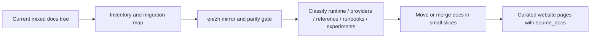

# MiniClaw 文档策略

Status: in_progress
Date: 2026-05-15

## Background

MiniClaw 需要两个文档表面：repo 内 `docs/` 继续作为 LLM 和维护者使用的 docs-driven development source of truth，另建 GitHub Pages 网站作为面向人的项目门户。

`docs/` 需要保留当前实现事实、计划、contract、runbook 和 drift checks。网站负责总结、可视化和引导阅读，并通过 `source_docs` 回链到 canonical repo docs，不能变成第二套 source of truth。

## Goals

- 保持 `docs/` 对 LLM 开发、实施计划和维护友好。
- 创建适合人类读者快速理解 MiniClaw 的公开网站。
- 避免在 repo docs 和 website 之间重复维护实现事实。
- 为当前混合的 `docs/` 内容建立迁移计划。
- 把 English 和 Chinese docs 都作为 first-class repo documentation 维护。
- 增加 `quality:website-docs` 和 `quality:docs-i18n`，降低 website/docs/i18n drift。

## Non-Goals

- 不直接把 repo 的 `docs/` 发布成 GitHub Pages。
- 不公开 `docs/private/**`。
- 不把 archive 报告当作当前实现状态。
- 不让 `website/**` 替代 code-to-docs drift gate 所要求的 canonical docs。
- 不在本 slice 中一次性移动所有 `docs/features/` 文件。

## Existing Architecture Evidence

- `docs/README.md`: 当前 docs index 和 placement rules。
- `docs/plans/README.md`: plan 文档模板。
- `scripts/quality-docs.ts` 与 `src/quality/docs-drift.ts`: 现有 D1 docs drift gate。
- `docs/quality-gates.md`: 质量门禁说明。
- `.gitignore`: 历史上忽略 `docs/zh/`，本策略要求后续移除。

当前 drift 方向：

```text
source code -> canonical docs
```

目标 drift 方向：

```text
source code -> canonical docs -> website
```

## Implementation Plan

1. 保留 `docs/` 作为 canonical docs-driven development layer。
2. 定义 `en` / `zh` 维护模型：短期保留 root `docs/` 作为 English canonical tree，`docs/zh/` 作为 tracked Chinese mirror。
3. 维护 `docs/documentation-migration-map.md`，用 `doc_id`、`source_path`、`target_path`、`zh_path`、`category`、`status`、`merge_group`、`website_exposure`、`translation_required` 和 `translation_status` 记录迁移状态；所有 tracked canonical `docs/**/*.md` source（排除 `docs/zh/**`）都必须进入 migration map。
4. 分阶段迁移当前 docs：先 inventory，再建立 i18n parity gate，然后分类/合并 `docs/features/`，最后只把 curated material 暴露给 website。
5. 对 Eastmoney 相关文档，后续应合并成一个 provider-family entry，用 sections 区分 JYWG readonly 和 MyFavor watchlist。
6. 新增 `website/en/**` 和 `website/zh/**` 骨架，网站页面必须声明 language-aware `source_docs`。
7. 新增 `quality:website-docs` 检查 frontmatter、`source_docs`、private/archive source 禁用规则和 affected page reporting。
8. 新增 `quality:docs-i18n` 检查 migration map inventory completeness、translation pairing、heading parity、ignored-path detection 和 missing translation reporting；migration map 漏收 tracked source doc 是 blocking error，missing / pending translation 在迁移期可以先作为 warning。
9. Phase 2 分类迁移先增加 taxonomy entrypoints，不立即删除 legacy `docs/features/*`。当前入口包括 `docs/runtime/README.md`、`docs/providers/README.md`、`docs/providers/provider-framework.md`、`docs/providers/content.md`、`docs/providers/email.md`、`docs/providers/stock/eastmoney.md`、`docs/providers/stock/research.md` 和 `docs/experiments/README.md`。



## Verification Plan

- plan-only 变更不需要 typecheck。
- 实现 quality scripts 时需要运行 focused Vitest、`pnpm run typecheck` 和 `pnpm run quality:docs`。
- `quality:docs-i18n` 对 migration map 漏收 tracked canonical source doc 必须 blocking；对 missing / pending translation 初期可以 warning-only，等 bilingual inventory 稳定后再收紧。
- website scaffolding 存在后运行 `pnpm run quality:website-docs`。

## Risks And Rollback

- Risk: website 变成第二套 source of truth。
  - Mitigation: `source_docs` metadata 和 website docs gate。
  - Rollback: 停止 website publishing，保留 canonical `docs/`。

- Risk: docs migration 破坏链接或 docs drift mappings。
  - Mitigation: 小 slice 迁移，并在同一 slice 更新 indexes、links 和 drift mappings。
  - Rollback: 从 git 恢复旧路径，并在 migration map 中标记 blocked。

- Risk: English 和 Chinese docs 分歧。
  - Mitigation: `doc_id`、`translation_of`、`translation_status` 和 `quality:docs-i18n`。
  - Rollback: 暂时把中文页标为 `translation_status: pending`，以英文 source 为 authoritative。

## Documentation Sync

- `docs/README.md`: 增加 migration map、bilingual policy 和 website policy。
- `docs/zh/README.md`: 从 local review copy 改成 tracked Chinese docs index。
- `.gitignore`: 移除 `docs/zh/`。
- `docs/quality-gates.md`: 补充 `quality:docs-i18n` 和 `quality:website-docs`。
- `package.json`: 增加质量脚本并接入 `quality:docs`。

## Execution Notes

- 2026-05-15: 首批实现落地为独立 worktree slice，范围包括 migration map、tracked `docs/zh`、i18n/website docs gates、website skeleton 和 docs index 同步。
- 2026-05-15: 本 slice 位于 branch `codex/documentation-strategy` 的独立 worktree；大规模 `docs/features/` 分类、移动和合并仍保留为后续 docs-only slices。
- 2026-05-15: 已在 `main` 开始 Phase 2 分类，不删除 legacy feature docs。新增 runtime/providers/experiments taxonomy 入口、Eastmoney provider family、content/email provider family 和 stock research pipeline，并同步 migration map、website `source_docs` 与 D1 docs drift patterns。
- 2026-05-15: 在 `main` 完成 migration-map inventory slice：`docs/documentation-migration-map.md` 覆盖所有 tracked canonical `docs/**/*.md` source（排除 `docs/zh/**`），`quality:docs-i18n` 会把 migration map 漏收 tracked source doc 判为 blocking error。Focused verification 已通过：`pnpm exec vitest run src/quality/__tests__/docs-i18n.test.ts` 和 `pnpm run quality:docs-i18n`，后者报告 73 个 migration map entries。
- 2026-05-15: inventory slice 的 broader verification 已通过：`pnpm run typecheck`、`pnpm run lint`、`pnpm run build`、`pnpm test`（185 files / 903 tests）和 `MINICLAW_DOCS_DRIFT_ALLOW=1 pnpm run quality:docs`。当前 raw `pnpm run quality:docs` 被同一 worktree 中并行的 Agent Run Manager runtime/store 改动挡住，不是本 inventory slice 导致。
