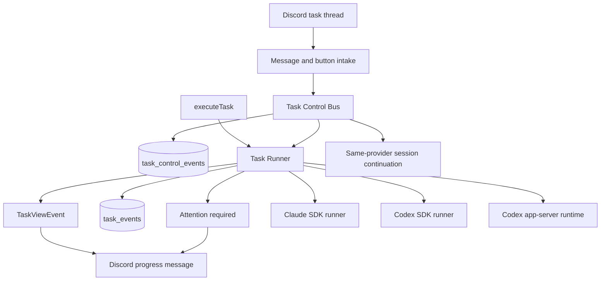

# Discord Agent Control Plane

状态：draft
日期：2026-05-25

## 背景

MiniClaw 已经拥有 Discord task intake 路径，也拥有 Claude 或 Codex task runtime。这个需求的目标是 mobile operational control：当操作者离开工作电脑时，Discord 应该能显示 live task progress，并允许操作者从手机插手任务。

目标行为不只是“把最终结果发到 Discord”。控制面需要支持：

- 从 task thread 观察正在运行的 Claude 和 Codex task；
- 在 task 活跃时发送 follow-up instruction；
- 审批或拒绝高风险 tool operation；
- 从 Discord 取消或暂停 task；
- 通过 Discord 接力 Claude Code task 或 Codex task，并保留该 provider 自己的 task context。

三个参考项目展示了可借鉴的模式：

- MioIsland：用 hooks 观察 Claude Code session，把手机消息路由进精确 terminal session，并把 permission request 回传到手机。
- Happy：包装 Claude 和 Codex 启动，拥有 remote message queue，并能在本机和手机远程模式之间切换 running session。
- Remodex：让 Codex 执行留在 Mac 上，通过 local bridge 把手机流量用 JSON-RPC 转发给 `codex app-server`。

MiniClaw 应借鉴 control-plane 思路，而不是照搬完整产品形态。Discord 已经是 mobile UI，MiniClaw 对自己创建的任务也已经拥有 runtime creation。

## 目标

- 保持 MiniClaw 作为 task lifecycle、provider selection、task row、task event、Discord rendering 和 cancellation 的权威 owner。
- 增加 task-scoped control bus，让 Discord message 和 button 可以变成结构化 control event。
- 保留现有 one-thread-per-task Discord 模型。
- 通过 `TaskViewEvent` 同时支持 Claude 和 Codex live progress。
- 通过现有 Claude Agent SDK `canUseTool` 边界支持 Claude live tool approval。
- 保持当前 Codex SDK runner 作为稳定默认 streamed one-shot turn 路径。
- 增加独立 Codex app-server runtime，用于真正的 Codex live interruption、approval 和 bidirectional control。
- 支持 same-provider continuation：Discord thread 应能继续创建它的 Claude 或 Codex session。

## 非目标

- 不把 terminal injection 作为 MiniClaw-owned task 的主路径。
- 不实现 Claude 和 Codex 之间的 provider switching。Claude session id 和 Codex thread id 是不同 provider context，不应被迁移或转换。
- 不把这个能力主要做成 Agent Run Manager 功能。内部 multi-agent orchestration 和 operator control 是两层。
- Discord 已能覆盖 mobile surface 时，不新建 mobile app 或 relay service。
- 在 access control 重新设计前，不暴露 multi-user 或 public Discord control。生产环境仍保持 single-operator。
- 不把 raw provider payload 或未脱敏 tool input 直接发到 Discord。

## 现有架构证据

- `docs/runtime/README.md`：当前 runtime map 是 Discord 或 IM intake -> task runtime -> Claude、Codex 或 managed runtime -> task events -> delivery。
- `docs/bot-routing.md`：thread continuation 已经优先于 task-channel 和 chat routing，并通过 `resumeSessionId` resume 之前的 provider session。
- `src/agent/task.ts`：`executeTask()` 拥有 task lifecycle、`AbortController`、task DB state、`TaskReporter` 和 `DiscordTaskViewReporter` wiring。
- `src/agent/runners/types.ts`：当前 runner contract 包含 `signal`、`onViewEvent`、`onTraceEvent` 和 `resumeSessionId`，但没有 control queue 或 approval callback。
- `src/agent/runners/claude-task-runner.ts`：Claude 已使用 async `canUseTool` callback 做 policy decision，可扩展为 Discord approval wait point。
- `src/agent/runners/codex-task-runner.ts`：Codex 当前使用 `@openai/codex-sdk` 的 `thread.runStreamed(...)`，能 stream progress 和 abort，但不是完整 interactive control protocol。
- `src/bot/button-dispatch.ts`：button dispatch 已集中处理 cron retry 和 Smart Router button；task control button 应使用独立 `miniclaw:task-control:*` 前缀。
- `src/store/schema.ts`：已有 `tasks` 和 `task_events`，但没有 durable task control event table。
- `src/agent/run-manager/**`：Agent Run Manager 之后可以暴露内部 orchestration events，但第一阶段应先解决 manager 外部的 operator control。

## 参考项目结论

### MioIsland

MioIsland 最适合作为 external-session companion。它检测 Claude 或 Codex 相关 session state，用 hooks 传递 state 和 permission event，并可把手机消息路由到选定 terminal session。

可借鉴：

- phase-oriented live status；
- 带 allow 或 deny decision 的 permission request relay；
- 对远端注入消息做 echo deduplication；
- 明确区分 observation、terminal input 和 permission request。

不适合作为主路径：

- 依赖 terminal pane capture 作为 source of truth；
- 对 MiniClaw 自己启动的任务使用 terminal injection；
- 把 cwd 或 terminal title matching 变成正常 task routing 的一部分。

Terminal injection 可以作为未来 fallback，用来处理 MiniClaw 没有启动的外部 Claude Code session。

### Happy

Happy 最适合作为 wrapper-owned remote execution loop。它通过自己的 command 启动 Claude 或 Codex，拥有 remote mode，维护 next-message queue，并通过 wrapper 处理 permission request。

可借鉴：

- task-scoped remote input queue；
- 显式 local vs remote control mode；
- ready 和 attention-required notification；
- abort-current-turn semantics 与 kill whole session 分离。

不适合作为主产品形态：

- 要求用户把所有本地 `claude` 或 `codex` command 换成 MiniClaw wrapper；
- Discord 已经提供 mobile interaction surface 时，再引入单独 mobile application。

### Remodex

Remodex 是 Codex live control 最好的参考。关键设计点是 Mac 仍是 execution host，bridge 只把 JSON-RPC message 转发给 `codex app-server`。

可借鉴：

- 把 `codex app-server` 作为 true Codex live control 的底座；
- 在 transient mobile reconnect 期间保持 Codex process warm；
- 显式 thread 和 turn lifecycle；
- 用 persisted Codex session 作为 durable history source，同时把 bridge 作为 live control path。

不适合照搬：

- 在 Discord control 仍然足够之前，为 MiniClaw 构建 iOS app 或 relay layer；
- 假设 Codex desktop 是 externally driven app-server activity 的 live subscriber。

## 目标架构



`TaskControlBus` 应该是 task-scoped。它应提供低延迟 live run 使用的 in-memory queue，同时用 SQLite append table 做 restart recovery、audit 和 stale-state cleanup。

候选 event shape：

```ts
type TaskControlEvent =
  | { type: "operator_message"; text: string; discordMessageId: string }
  | { type: "cancel"; reason?: string }
  | { type: "pause_after_turn" }
  | { type: "approve_tool"; requestId: string; actorId: string }
  | { type: "deny_tool"; requestId: string; actorId: string; reason?: string }
  | { type: "set_mode"; mode: "observe" | "interactive" | "yolo" };
```

候选 runner control contract：

```ts
interface TaskRunnerControl {
  poll(): Promise<TaskControlEvent[]>;
  waitForOperatorInput(reason: string): Promise<string>;
  requestApproval(request: ToolApprovalRequest): Promise<ApprovalDecision>;
  attention(message: string): Promise<void>;
}
```

`TaskRunnerInput` 应增加 `control?: TaskRunnerControl` 字段。single-shot runner 初期可以忽略它。interactive runtime 应用它处理 approvals、queued follow-up instructions、pause 和 cancel decisions。

## Discord UX

保持一个 task 一个 Discord thread。persistent progress message 应显示：

- task id、provider、model、cwd 和 provider session id；
- 当前 phase：running、waiting for approval、waiting for input、paused、cancelled、failed 或 completed；
- recent tool steps；
- queued operator instruction count；
- 当前 phase 有效的 action buttons。

建议 button 前缀：

- `miniclaw:task-control:cancel:<taskId>`
- `miniclaw:task-control:pause:<taskId>`
- `miniclaw:task-control:approve:<requestId>`
- `miniclaw:task-control:deny:<requestId>`

Thread message behavior：

- 如果 task 正在等待 input，立即通过 `TaskControlBus` 交付 message。
- 如果 task 正在运行，把 message 排队为 next operator instruction，并在 thread 中确认。
- 如果 task 已完成且有 `session_id`，保留现有 continuation behavior，创建 resumed task。
- 如果 thread 属于 cron task，除非增加 explicit manual resume path，否则不允许 user continuation。

## Claude Runtime Plan

Claude 应作为第一个获得 live approval 支持的 provider。

实现：

1. 扩展 `TaskRunnerInput`，加入 `control`。
2. 在 `claude-task-runner.ts` 中，先保留 deterministic policy checks。
3. 当 tool use 需要 operator approval 时，从 `canUseTool` 调用 `control.requestApproval(...)`。
4. 发出 attention-required `TaskViewEvent`，让 Discord 更新 persistent progress message 并添加 approve 或 deny button。
5. operator 点击 button 后，由 `button-dispatch.ts` resolve pending `canUseTool` promise。
6. timeout 时默认 deny，并记录 `task_events` warning。

第一阶段不应尝试 arbitrary mid-turn prompt injection。Follow-up message 可以排队，在下一个 safe point 应用，或通过现有 resume path 处理。

## Codex Runtime Plan

Codex 需要两个 runtime：

1. `codex-sdk` runtime：保留当前 `@openai/codex-sdk` streamed runner，用于稳定 one-shot task execution、live progress、cancellation，以及 turn completion 之后的自然 continuation。
2. `codex-app-server` runtime：增加新 runtime，启动或连接 `codex app-server`，通过 stdio 或 configured endpoint 说 JSON-RPC，并支持 `thread/start`、`thread/resume`、`turn/start`、`turn/interrupt` 和 approval request handling。

app-server runtime 在验证前应保持 opt-in。它不应在同一 slice 替换现有 SDK 路径。

最小 app-server runtime 职责：

- start 或 reuse app-server process；
- initialize JSON-RPC client state；
- 为 MiniClaw task start 或 resume thread；
- 把 thread、turn、item 和 approval event stream 转成 `TaskViewEvent` 和 `task_events`；
- 把 Discord approve 或 deny button 映射到 app-server approval responses；
- 把 Discord cancel 或 pause 映射到 turn interruption；
- 把 `codex:<threadId>` 持久化为 provider session id。

## Same-Provider Relay Model

Discord relay 指 operator 可以继续或插手 task thread 已经归属的 provider session。

- Claude task thread resume 现有 Claude session。
- Codex task thread resume 现有 Codex thread。
- running task 可以在 runner 到达 safe point 时，通过 `TaskControlBus` 接收 queued operator instructions。
- completed task 可以保留现有 thread-continuation behavior，并用 `resumeSessionId` 启动新的 MiniClaw task。

Provider switching 明确不在范围内。如果 operator 想用另一个 provider 启动新 task，应显式发起单独 prompt。MiniClaw 不应把这包装成自动 continuation。

## 实施计划

1. 增加 durable task control storage。
   - 创建 `task_control_events`。
   - 增加 repository helpers：append、list pending、resolve pending approval、expire stale events。
   - 增加 ordering、deduplication、restart recovery shape 的 unit tests。

2. 增加 `TaskControlBus`。
   - 为每个 active task 提供 in-memory live queue。
   - 每个 control event 同步 mirror 到 SQLite。
   - 增加 pending approval registry，带 timeout 和 deny-by-default behavior。

3. 接入 Discord controls。
   - 扩展 `button-dispatch.ts` 支持 `miniclaw:task-control:*`。
   - 扩展 task thread message handling：task 仍在 running 时 queue operator messages。
   - 更新 persistent progress renderer，显示 waiting approval、queued input 和 pause states。

4. 实现 Claude approvals。
   - 只在 local policy 允许升级后，从 `canUseTool` 调用 `control.requestApproval`。
   - 发出 attention-required events。
   - 增加 fake control tests 和 Claude runner unit tests，覆盖 approve、deny、timeout 和 abort。

5. 增加 same-provider relay 和 resume polish。
   - 让 running-thread operator messages 变成 queued control events。
   - completed-thread continuation 继续走现有 `resumeSessionId` path。
   - 当用户要求切换 provider 时，在 Discord 中明确说明 provider switching 会启动 separate task。

6. 增加 Codex app-server runtime。
   - 放在 `runtime.codex.mode: sdk | app_server` 这类配置后面。
   - 实现 JSON-RPC transport、initialize、thread start/resume、turn start、turn interrupt 和 approval response。
   - live 使用前先增加 fake app-server tests。

7. 增加 recovery 和 operations cleanup。
   - startup 时把 stale pending approvals 标记为 expired。
   - 为 active 或 interrupted tasks rehydrate pending control events。
   - 在 task-log 中展示 control events。
   - 当 app-server runtime enabled 时，在 doctor checks 中检查 app-server availability。

## 验证计划

- Type check：`pnpm run typecheck`。
- Unit tests：
  - task control repository；
  - `TaskControlBus`；
  - task-control custom ids 的 button dispatch；
  - Claude approval allow、deny、timeout 和 abort；
  - same-provider relay 和 resume behavior；
  - 使用 fake server 的 Codex app-server JSON-RPC transport。
- Integration tests：
  - fake task running 时，Discord task thread 能 queue follow-up input；
  - approval button 能 resolve pending fake provider request；
  - cancel 仍落为 `cancelled`；
  - completed provider sessions 的 resume 仍可用。
- Manual live checks：
  - 启动一个需要 risky tool 的 Claude task，从 Discord mobile approve，并确认 task 继续；
  - deny 同一个 request，并确认 task 收到清晰 denial；
  - 启动 Codex SDK task，验证 progress、cancel 和 post-turn continuation；
  - 在 opt-in mode 运行 app-server runtime，验证 interrupt、approval 和 resume。
- Docs gates：
  - `pnpm run quality:docs`。
  - implementation slice 中更新 `CHANGELOG.md`。

## 风险与回滚

- Risk：Discord approvals 可能让 provider turn 永久挂起。
  - Mitigation：approval timeout、deny-by-default、可见 stale state，以及 startup expiry。
  - Rollback：关闭 interactive approval mode，恢复 local policy decisions。

- Risk：queued operator messages 在不安全时机被应用。
  - Mitigation：只在 explicit safe points 消费 queued input，例如 turn 后、provider 请求 input 后、或 operator-triggered pause 后。
  - Rollback：保留 queued messages 作为 thread notes，并依赖 `/resume`。

- Risk：app-server JSON-RPC behavior 随 Codex 版本变化。
  - Mitigation：隔离 app-server runtime，SDK runtime 继续作为默认值，并增加 version 和 capability detection。
  - Rollback：把 `runtime.codex.mode` 切回 `sdk`。

- Risk：operator 和 agent 并发编辑 workspace。
  - Mitigation：在 progress 中显示当前 cwd 和 git status，并只在 safe points 消费 queued operator instructions。
  - Rollback：要求 cancel 或 completion 后才能接受进一步 operator instructions。

## 文档同步

- Runtime docs：control bus 实现后更新 `docs/runtime/README.md`。
- Bot routing docs：task control buttons 和 running-thread message behavior 落地时更新 `docs/bot-routing.md`。
- Task view boundary docs：只有当 `TaskViewEvent` 增加持久新 event type 时再更新。
- Agent Run Manager docs：只有当 Manager events 通过 operator control layer 可见时再更新。
- Website：仅有 plan 不更新；真正发布 public user-visible Discord control 时再更新。
- Changelog：每个 implementation slice 加 entry。

## 执行记录

- 2026-05-25：初始分析整理为 design plan。本 slice 没有修改 production code。
