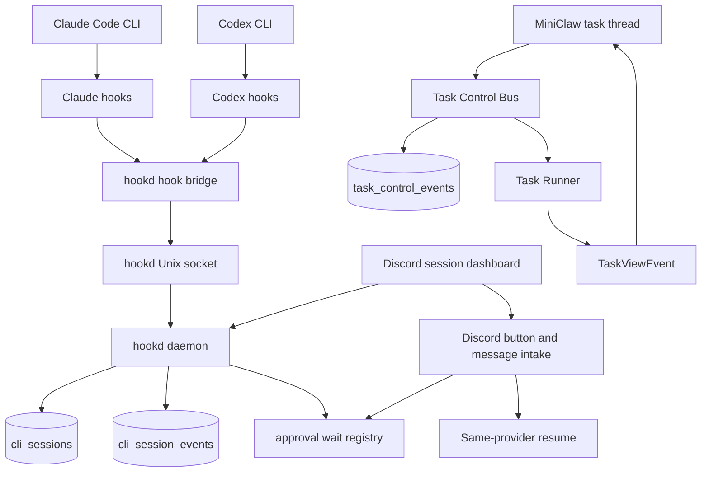

# Discord Agent Control Plane

状态：draft
日期：2026-05-25
更新：2026-05-25

## 背景

MiniClaw 已经拥有自己启动任务的 Discord task intake。现在缺的能力不同：操作者通常会在多个 iTerm2 窗口里直接启动 `claude` 或 `codex`，离开 Mac 后，希望 Discord 能显示哪些 CLI session 仍在执行、哪些只是完成了当前 turn 并等待下一句输入、哪些已经因为终端关闭而结束。

目标行为不只是“把任务最终结果发到 Discord”。控制面需要支持：

- 同时观察 MiniClaw 启动的 task，以及手动启动的 Claude Code 或 Codex CLI session；
- 区分 running turn 和正在等待下一句 prompt 的 idle session；
- 终端关闭后，把对应 session 从 Discord active surface 中移除；
- 从 Discord 审批或拒绝高风险 tool operation；
- 通过最可靠的 same-provider path 发送 follow-up instruction；
- Claude session 继续 Claude，Codex session 继续 Codex，不把 provider context 包装成可以互相转换。

参考项目分析后的关键修正是：MiniClaw 不必要求用户通过 `mc-claude` 或 `mc-codex` 这类 wrapper 才能可靠发现 session。MioIsland 证明，只要安装 host-level hook bridge，普通 `claude` 和 `codex` 调用也可以被观察。因此 MiniClaw 应先增加一个本地 hook daemon，本计划称为 `hookd`，再做更重的 terminal-control 能力。

## 目标

- 增加 `hookd`，作为 Claude Code 和 Codex CLI 的本地 session-discovery daemon。
- 安装 hooks 后，可以观察从 iTerm2、tmux、cmux、Ghostty、Terminal.app 或其他支持终端中直接启动的普通 `claude` 和 `codex` session。
- 持久化 provider session id、provider、cwd、pid、tty、terminal surface hints、transcript path、phase 和 last activity。
- 在 Discord 中展示 active 和 idle CLI session，但不把每个外部 CLI session 都变成 MiniClaw task row。
- MiniClaw-created task 继续保持 one Discord thread per task，同时为手动启动的 session 增加独立的 Discord CLI-session surface。
- 支持通过 Discord 给 observed sessions 发送 follow-up；idle 且由 iTerm2 承载的 session 默认走精确 live iTerm2 input。
- 当 CLI provider 暴露 blocking hook 时，通过 hook request/response 支持 Claude permission approval。
- `TaskControlBus` 继续用于 MiniClaw-owned task，但外部 CLI session 的观察不应先依赖它。
- 当前 Codex SDK runner 继续作为 MiniClaw-started task 的稳定路径；`codex app-server` 作为后续更深 Codex live control 的 opt-in runtime。

## 非目标

- 不要求用户把每个本地 `claude` 或 `codex` command 替换成 MiniClaw wrapper。
- 不只根据 terminal output 判断 active 或 idle state。
- 不把 iTerm2 title、cwd matching 或 terminal pane capture 当作 source of truth。
- 不实现 Claude 和 Codex 之间的 provider switching。Claude session id 和 Codex thread id 是不同 provider context。
- 在 access control 重新设计前，不暴露 multi-user 或 public Discord control。生产环境保持 single-operator。
- 不把 raw provider payload 或未脱敏 tool input 直接发到 Discord。
- 不向不支持的 terminals 或 active sessions 注入输入。默认 live-input path 仅支持 iTerm2，并要求 recorded iTerm2 session id 或唯一 tty match。

## 现有架构证据

- `docs/runtime/README.md`：当前 runtime map 是 Discord 或 IM intake -> task runtime -> Claude、Codex 或 managed runtime -> task events -> delivery。
- `docs/bot-routing.md`：thread continuation 已优先于 task-channel 和 chat routing，并通过 `resumeSessionId` resume 之前的 provider session。
- `src/agent/task.ts`：`executeTask()` 拥有 MiniClaw task lifecycle、`AbortController`、task DB state、`TaskReporter` 和 `DiscordTaskViewReporter` wiring。
- `src/agent/runners/types.ts`：当前 runner contract 包含 `signal`、`onViewEvent`、`onTraceEvent` 和 `resumeSessionId`，但没有 control queue 或 approval callback。
- `src/agent/runners/claude-task-runner.ts`：Claude SDK task 已经使用 async `canUseTool` callback 做 MiniClaw-started policy decision。
- `src/agent/runners/codex-task-runner.ts`：Codex SDK task 当前使用 `@openai/codex-sdk` 的 `thread.runStreamed(...)`，能 stream progress 和 abort，但不是完整 interactive terminal control protocol。
- `src/store/schema.ts`：已有 `tasks` 和 `task_events`，但没有 durable external CLI session 或 hook event table。
- `src/bot/button-dispatch.ts`：button dispatch 已集中处理 cron retry 和 Smart Router button；task button 和 hook approval button 应使用不同前缀。

## 参考项目结论

### MioIsland

MioIsland 是 `hookd` 层最值得参考的实现。它不是靠 terminal output 判断 session 是否 active，而是安装 provider hooks，通过本地 Unix socket 接收 event payload，把 event 映射到显式 state machine，再用 process liveness 作为 cleanup fallback。

可借鉴：

- Claude Code 和 Codex 的 host-level hook installation；
- 用本地 Unix socket bridge 传递低延迟 hook event；
- hook payload enrichment：parent pid、tty、cwd、terminal app hint、cmux 或 tmux identifier、Codex transcript path；
- 把 provider event 映射为 `processing`、`running_tool`、`waiting_for_approval`、`waiting_for_input`、`compacting` 和 `ended`；
- 用 `kill(pid, 0)` 做 zombie scanning，识别没有 clean provider end event 但 terminal window 或 CLI process 已死亡的 session；
- 解析 transcript，用于 summary 和 recent message；
- 延迟展示 Codex startup event，避免只是打开空 Codex TUI 就产生噪音 session。

不照搬：

- 不让 terminal pane capture 成为权威状态源；
- 多个 iTerm2 window、tab、pane 共享 cwd 时，不假设 iTerm2 injection 足够精准；
- 不把 MiniClaw task row 直接绑定到每个被观察到的外部 CLI session。

### Happy

Happy 仍适合作为 wrapper-owned execution 的参考，但不应成为 MiniClaw 默认 discovery model。

可借鉴：

- remote input queue semantics；
- 显式 local versus remote control mode；
- attention-required notification；
- abort-current-turn semantics 与 kill whole session 分离。

不照搬：

- 要求每个用户命令都走 wrapper；
- 用单独 mobile application 替代 Discord。

### Remodex

Remodex 仍适合作为未来 Codex deep control 的参考。关键设计点是执行留在 Mac 上，本地 bridge 只把 JSON-RPC traffic 转发给 `codex app-server`。

后续可借鉴：

- 把 `codex app-server` 作为 true Codex interrupt、approval 和 bidirectional control 的底座；
- 显式 thread 和 turn lifecycle；
- persisted Codex session 作为 durable history source。

第一阶段不照搬：

- 不把 app-server 作为 basic active 或 idle detection 的前置条件；
- app-server runtime 没有 fake-server 和 live smoke coverage 前，不替换当前 Codex SDK task path。

## 目标架构



`hookd` 和 `TaskControlBus` 相关，但应分层处理。

- `hookd` 观察和控制可能不是 MiniClaw 启动的 host CLI session。
- `TaskControlBus` 控制已经在 `executeTask()` 内运行的 MiniClaw-started task。
- Discord 可以渲染两个 surface，但在 session 被显式转换为 MiniClaw task continuation 前，不应共享 persistence table。

## hookd 职责

`hookd` 应是 MiniClaw runtime process 内的 long-running local service，或一个受 MiniClaw 监管的 close child process。

最小职责：

- install、verify、repair、uninstall MiniClaw-managed Claude Code hooks；
- 当 Codex hook support enabled 时，install、verify、repair、uninstall MiniClaw-managed Codex hooks；
- 监听本地 Unix socket，例如 `~/.miniclaw/runtime/hookd.sock`；
- 接收 providers 调用的小 hook bridge 发来的 JSON hook event；
- 使用 hook bridge 收集的 process metadata enrich event；
- 把 provider event 映射成 MiniClaw canonical CLI session phases；
- 持久化 session state，并追加保存脱敏后的 raw events；
- 对 blocking permission request 保持等待，直到 Discord 或 local policy 返回 allow、deny 或 ask；
- timeout 或 daemon restart 时 expire abandoned permission request；
- 扫描 dead pid，在 provider 漏发 end event 时把 session 标记为 ended；
- 为 Discord rendering 和 operational commands 暴露 read-only session snapshots。

## Hook 安装

`hookd` 应幂等管理 hooks，并保留 manifest，让 MiniClaw 能区分自己的 hook entry 和用户管理的 hook entry。

Claude hook target：

- 文件：`~/.claude/settings.json`；
- 脚本：构建后的 MiniClaw hook bridge `dist/hookd/hook-client.js`；
- 事件：`UserPromptSubmit`、`PreToolUse`、`PostToolUse`、`PermissionRequest`、`Notification`、`Stop`、`SubagentStop`、`SessionStart`、`SessionEnd` 和 `PreCompact`；
- timeout：`PermissionRequest` 需要足够长以支持 interactive approval，但 MiniClaw 侧必须有 timeout 和 deny-by-default policy。

Codex hook target：

- 文件：`~/.codex/hooks.json`；
- 配置：只有当 MiniClaw 管理该 feature flag 时，才启用 `[features] codex_hooks = true`；
- 脚本：构建后的 MiniClaw hook bridge `dist/hookd/hook-client.js`；
- 第一阶段必需事件：带 startup 或 resume matcher 的 `SessionStart`、`UserPromptSubmit` 和 `Stop`；
- 后续可选事件：如果已安装 Codex 版本暴露 tool 和 approval event，再接入。

hook bridge 应保持 provider-neutral。它从 stdin 读取 hook JSON，并向 `hookd` 发送紧凑 event。Managed hook commands 带有 `MINICLAW_HOOKD_MANAGED=1` marker，因此 uninstall 和 repair 只会移除 MiniClaw-owned entries。bridge 应包含：

- `source`：`claude` 或 `codex`；
- `session_id`；
- `cwd`；
- `hook_event_name`；
- 必要时由 script 映射出的 provider status；
- `os.getppid()` 得到的 parent process pid；
- 通过 `ps -p <pid> -o tty=` 取得 tty；
- 从 `ITERM_SESSION_ID`、`TERM_PROGRAM`、`TMUX`、`CMUX_WORKSPACE_ID` 和 `CMUX_SURFACE_ID` 等环境变量取得 terminal hint；
- 可用时包含 tool name、tool input 和 tool use id；
- Codex hook payload 提供时包含 Codex transcript path。

## Session State Model

建议 tables：

```sql
CREATE TABLE cli_sessions (
  id TEXT PRIMARY KEY,
  provider TEXT NOT NULL,
  provider_session_id TEXT NOT NULL,
  cwd TEXT NOT NULL,
  pid INTEGER,
  tty TEXT,
  terminal_app TEXT,
  terminal_surface_json TEXT,
  transcript_path TEXT,
  phase TEXT NOT NULL,
  attention_kind TEXT,
  last_activity_at TEXT NOT NULL,
  started_at TEXT NOT NULL,
  ended_at TEXT,
  hidden_at TEXT,
  UNIQUE(provider, provider_session_id)
);

CREATE TABLE cli_session_events (
  id TEXT PRIMARY KEY,
  cli_session_id TEXT NOT NULL,
  provider TEXT NOT NULL,
  event_name TEXT NOT NULL,
  phase TEXT NOT NULL,
  payload_json TEXT NOT NULL,
  created_at TEXT NOT NULL
);
```

Canonical phases：

- `starting`：provider session 已启动，但还没有看到 user prompt；
- `processing`：provider 正在生成或协调工作；
- `running_tool`：tool 正在执行；
- `waiting_for_approval`：provider 被 approval decision 阻塞；
- `waiting_for_input`：当前 turn 已完成，CLI 正在等待下一句 prompt；
- `compacting`：正在做 context compaction；
- `ended`：provider 已结束，或背后的 process 已消失；
- `unknown`：event 无法分类。

Display buckets：

- Active：`processing`、`running_tool`、`waiting_for_approval` 和 `compacting`。
- Idle：`waiting_for_input` 且 pid 仍 alive。
- Closed：`ended`、dead pid、dead tty，或超过 retention 的 stale session。
- Hidden：用户 archive 了 session，但保留 history。

Codex-specific rule：不要把 Codex `SessionStart` 直接显示成 active session。只有出现真实 `UserPromptSubmit` 或 transcript activity 后再展示，避免空 TUI 启动污染 Discord。

## Discord UX

Discord 应暴露两个相关 surface。

MiniClaw task threads：

- 保持一个 MiniClaw-created task 一个 thread；
- 显示 task id、provider、model、cwd、provider session id、current phase、recent tool steps、queued operator instruction count 和有效 buttons；
- 使用 `TaskControlBus` 处理 task-scoped messages、cancellation、pause 和 MiniClaw-owned approval flow。

CLI session dashboard：

- 按 cwd 或 project 分组 observed CLI sessions；
- 显示每个 project 的 active count；
- active sessions 优先，idle sessions 次之，closed sessions 只出现在 history 或 archive；
- 展示 provider badge、phase、elapsed time、cwd、latest user prompt 或 summary、terminal hint 和 last activity time；
- ended sessions 在短 retention window 后从 active surface 隐藏；
- 为不想继续看的 idle session 保留手动 `Archive` 或 `Hide` action。

Discord-native rendering constraints：

- 不要尝试在 Discord message 内渲染自定义 HTML、CSS 或 JavaScript。静态 HTML prototype 只作为 product mock。
- 手机端 surface 应使用 Discord 原生消息能力实现：embeds、action rows、buttons、select menus 和 modals。
- 使用一条 pinned 或其他容易发现的 “current sessions” dashboard message 作为稳定入口。hook event 应编辑这个当前 snapshot，而不是只追加普通时间线消息。
- 提供 `/sessions` command 和 `Refresh` button，在 pinned message 被埋掉或变 stale 时重新生成当前 snapshot。
- project、provider、status filter 使用 select menus。`Approve`、`Deny`、`Continue`、`Queue Instruction`、`Hide` 和 `Details` 使用 buttons。
- operator text input 使用 modals，尤其用于 live iTerm2 continuation 和 queued instructions。
- session detail 通过更新 embed、ephemeral follow-up 或 modal-friendly summary 渲染。不要依赖 web-style sidebar 或固定三栏 layout。
- 尊重 Discord message 和 component limits，对长 session list 做 pagination 或 collapse。dashboard 先做 summary，再按需展开 detail。

Dashboard ordering and anti-burial rules：

- dashboard 是按状态优先级排序的 control surface，不是按 session 创建时间排列的 chronological feed。
- 主排序：`waiting_for_approval` 第一，active sessions 第二，stale-active sessions 第三，idle sessions 第四，ended 或 hidden sessions 最后且默认折叠。
- active sessions 必须始终排在 idle sessions 上方，即使这个 active session 很久之前就已经打开。
- active bucket 内部先按 attention 排序，再按 `last_activity_at` 倒序。长时间没有 hook event 的 active session 应标记为 `active, quiet <duration>` 或 `possibly stuck`，不能静默混进 idle。
- idle bucket 内部按 `last_activity_at` 倒序，并在少量可见项之后 collapse 或 paginate。
- ended sessions 不应把 active 或 idle sessions 往下挤。它们进入 history，并通过显式 `History` 或 `Show hidden` action 查看。
- new approval request 或 stale-active warning 这类高优先级 transition 可以单独发 notification message，但 pinned/current dashboard 仍是 operator 的 canonical view。

建议 CLI session buttons：

- `miniclaw:cli-session:open:<sessionId>`：显示 detail 和 transcript summary；
- `miniclaw:cli-session:approve:<requestId>`：approve pending permission request；
- `miniclaw:cli-session:deny:<requestId>`：deny pending permission request；
- `miniclaw:cli-session:continue:<sessionId>`：存在精确 terminal target 时，把 follow-up text 写入原始 idle iTerm2 live process；
- `miniclaw:cli-session:hide:<sessionId>`：从 active Discord lists 中 hide 或 archive session；
- `miniclaw:cli-session:jump:<sessionId>`：仅当存在安全 terminal target 时，做可选 local terminal jump。

Thread message behavior：

- 如果 MiniClaw task 正在等待 input，通过 `TaskControlBus` 交付 message。
- 如果 MiniClaw task 正在 running，把 message 排队到 next safe point，并在 thread 中确认。
- 如果 observed CLI session 是 idle 且有精确 iTerm2 target，把 Discord follow-up 发送到该 live terminal process。
- 如果 observed CLI session 正在 running，除非 provider 暴露明确 interrupt 或 input API，否则 Discord message 只应被确认成 queued 或 advisory。
- 如果 session 属于 cron task，除非增加 explicit manual resume path，否则不允许 user continuation。

## Approval Flow

对于 Claude Code external CLI sessions，hooks 可以提供 blocking `PermissionRequest`。`hookd` 应：

1. 接收 permission event；如果 provider 没带 tool use id，则和最近匹配的 `PreToolUse` 关联；
2. 持久化脱敏 approval request；
3. 把 CLI session phase 更新为 `waiting_for_approval`；
4. 在 Discord 渲染 approval card，包含安全 tool name、redacted input summary、cwd 和 provider；
5. 等待 `Approve`、`Deny`、timeout、provider stop 或 process death；
6. 返回 provider-specific hook response；
7. 标记 request resolved，并把 session 转回 `processing`、`waiting_for_input` 或 `ended`。

Timeout behavior 必须默认 deny，除非 local policy 明确允许 ask-through。Restart behavior 必须 expire pending approvals，因为原始 hook socket 已经不存在。

Codex approval 不应在已安装 Codex hook 或 app-server runtime 暴露可靠 approval response path 前承诺。

## Continuation And Terminal Input

控制路径按可靠性从高到低分三类：

1. Provider-native resume 或 MiniClaw runner continuation。
2. Provider hook 或 app-server control API。
3. Terminal input injection。

MiniClaw 仍应使用 hook events，而不是 terminal output，作为 state detection 基础。对 Discord dashboard `Continue`，operator preference 是只在 observed session idle 且 iTerm2 target 精确时，默认使用 terminal input injection。

对 iTerm2：

- tty matching 可以用于识别 hosting tab 或 pane，从而支持 jump-to-terminal；
- 只有匹配 recorded iTerm2 session id 或唯一 tty 后，才允许向 iTerm2 写入文本；
- Discord `Continue` 默认把文本发送到原始 iTerm2 live process，不创建 MiniClaw resume task。

对 cmux 或 tmux：

- workspace、surface、session、window、pane 等精确 identifiers 可以让 terminal routing 更安全；
- MiniClaw 应在 hookd state model 稳定后再增加 terminal injection。

## MiniClaw-Owned Task Control

`TaskControlBus` 仍然对 MiniClaw 自己启动的 task 很重要。

候选 event shape：

```ts
type TaskControlEvent =
  | { type: "operator_message"; text: string; discordMessageId: string }
  | { type: "cancel"; reason?: string }
  | { type: "pause_after_turn" }
  | { type: "approve_tool"; requestId: string; actorId: string }
  | { type: "deny_tool"; requestId: string; actorId: string; reason?: string }
  | { type: "set_mode"; mode: "observe" | "interactive" | "yolo" };
```

候选 runner control contract：

```ts
interface TaskRunnerControl {
  poll(): Promise<TaskControlEvent[]>;
  waitForOperatorInput(reason: string): Promise<string>;
  requestApproval(request: ToolApprovalRequest): Promise<ApprovalDecision>;
  attention(message: string): Promise<void>;
}
```

`TaskRunnerInput` 应增加 `control?: TaskRunnerControl` 字段。single-shot runner 初期可以忽略。interactive runtime 应用它处理 approvals、queued follow-up instructions、pause 和 cancel decisions。

## Codex Runtime Plan

Codex 有两个独立需求。

第一阶段：

- 使用 Codex hooks 做 session discovery、active versus idle state 和 transcript summary；
- MiniClaw-started tasks 继续使用现有 `@openai/codex-sdk` runner；
- 除非存在可靠 hook response path，否则不承诺 approval 和 true mid-turn interrupt。

后续阶段：

- 在 `runtime.codex.mode: sdk | app_server` 这类配置后增加 `codex-app-server` runtime；
- start 或 reuse app-server process；
- initialize JSON-RPC client state；
- 为 MiniClaw task start 或 resume thread；
- 把 thread、turn、item 和 approval events stream 转成 `TaskViewEvent` 和 `task_events`；
- 把 Discord approve 或 deny button 映射到 app-server approval responses；
- 把 Discord cancel 或 pause 映射到 turn interruption；
- 把 `codex:<threadId>` 持久化为 provider session id。

## Same-Provider Relay Model

Discord relay 指 operator 可以继续或插手 Discord surface 已归属的 provider session。

- Claude CLI session resume Claude context。
- Codex CLI session resume Codex context。
- MiniClaw task thread resume task row 记录的 provider session。
- running task 或 session 只有在 runner 或 provider 到达明确 safe point 时，才消费 queued operator instructions。

Provider switching 明确不在范围内。如果 operator 想用另一个 provider 启动新 task，应显式发起单独 prompt。MiniClaw 不应把它包装成自动 continuation。

## 实施计划

1. 增加 `hookd` storage。
   - 创建 `cli_sessions` 和 `cli_session_events`。
   - 增加 repository helpers：upsert session、append event、list active or idle sessions、mark ended、hide session、expire stale approvals。
   - 增加 hook payload 和 tool input 的 redaction helpers。

2. 增加 `hookd` socket 和 hook bridge。
   - 在 MiniClaw build output 中增加一个 provider-neutral hook bridge，并从 managed hook entries 引用它。
   - 从 stdin 读取 JSON，并 enrich pid、tty、terminal hints、cmux 或 tmux identifiers、transcript path。
   - 通过 Unix socket 向 `hookd` 发送一个 JSON object。
   - 对 blocking approval hooks，用 bounded timeout 等待 decision response。

3. 增加 hook installers 和 diagnostics。
   - 幂等 install 和 repair Claude Code hooks。
   - 仅当 Codex hook feature enabled 时 install Codex hooks。
   - 保存 MiniClaw hook manifest，用于 uninstall 和 drift checks。
   - 增加 doctor output：hook installed、socket reachable、last event time、stale hook entries。

4. 增加 hook session state machine。
   - 把 provider events 映射成 canonical phases。
   - 跳过空 Codex startup sessions，直到出现真实 prompt 或 transcript activity。
   - 用 zombie scan 清理 dead pid 和 stale tty。
   - closed sessions 保留短 history window，并从 active Discord lists 隐藏。

5. 增加 Discord CLI session dashboard。
   - 按 cwd 或 project 分组。
   - 使用 embeds、select menus、buttons 和 modals 渲染 Discord-native pinned/current dashboard。
   - 按 attention state 而不是 message chronology 排序：approval、active、stale active、idle，然后是 hidden history。
   - 增加 details、hide、same-provider continue、queued-instruction 和 approval buttons。
   - 不把 raw hook payloads 暴露到 Discord。

6. 增加 Claude external approval relay。
   - 在 `hookd` 中保持 hook request open。
   - 由 Discord button dispatch resolve。
   - timeout、stop event、process death 或 daemon restart 时默认 deny。
   - 增加 fake hook tests，覆盖 allow、deny、timeout 和 socket failure。

7. 在 hookd 后增加 MiniClaw-owned task control。
   - 创建 `task_control_events`。
   - 增加 `TaskControlBus`。
   - 接入 task-thread buttons 和 running-thread messages。
   - 在 session 明确作为 MiniClaw task resume 前，与 `cli_sessions` 保持分离。

8. 后续增加 Codex app-server runtime。
   - 放在 config 后面。
   - live 使用前实现 JSON-RPC transport 和 fake app-server tests。

## 验证计划

- Type check：`pnpm run typecheck`。
- Unit tests：
  - Claude settings 和 Codex hooks 的 hook installer pure mutations；
  - 使用 fixture payloads 验证 hook bridge event normalization；
  - `hookd` socket request 和 response behavior；
  - CLI session repository 的 upsert、phase transition、hide、end 和 expiry；
  - zombie scan dead-pid detection；
  - CLI session custom ids 的 Discord button dispatch；
  - Claude approval allow、deny、timeout、process death 和 daemon restart。
- Integration tests：
  - fake Claude hook stream 能把 session 从 processing 转到 waiting for input；
  - fake Codex startup 会被隐藏，直到 `UserPromptSubmit`；
  - fake iTerm2 session close 会通过 zombie scan 把 CLI session 标记 ended；
  - Discord dashboard 即使 active session 更早创建，也会让 active sessions 排在 idle sessions 上方；
  - Discord dashboard 会把长时间安静的 active session 标记为 stale 或 possibly stuck；
  - Discord dashboard 显示 active sessions，并隐藏 ended sessions；
  - Discord-native `Continue` 或 `Queue Instruction` actions 会打开 modal-shaped input flow；
  - live iTerm2 `Continue` 会写入原始 terminal process，不创建 MiniClaw task row。
- Manual live checks：
  - 在 iTerm2 直接启动 `claude`，确认它先显示 active，`Stop` 后显示 waiting for input；
  - 关闭 iTerm2 window，确认 session 离开 active Discord surface；
  - 在 iTerm2 直接启动 `codex`，确认空 TUI startup 不展示，提交 prompt 后才展示；
  - 触发 Claude permission request，并从 Discord mobile approve 或 deny；
  - 确认多个相同 cwd 的 iTerm2 windows 不会触发 terminal-injection claim，除非存在精确 tty 或 terminal target。
- Docs gates：
  - `pnpm run quality:docs`。
  - implementation slice 中更新 `CHANGELOG.md`。

## 风险与回滚

- Risk：provider hook schemas 变化。
  - Mitigation：版本化 hook payload fixtures，把 unknown events 作为 append-only records 保存，并对 approvals fail closed。
  - Rollback：关闭 managed hook installation，保持 MiniClaw-started task execution 不变。

- Risk：hook installation 覆盖用户管理的 hooks。
  - Mitigation：只追加 MiniClaw-managed entries，保留 manifest，写入前验证 JSON 或 TOML round-trip。
  - Rollback：用 manifest uninstall MiniClaw-managed hooks。

- Risk：terminal 关闭后 stale sessions 仍可见。
  - Mitigation：provider end events、dead-pid scan、stale tty cleanup、retention TTL 和 manual hide。
  - Rollback：从 Discord 隐藏 hookd sessions，同时保留本地 event logs。

- Risk：Discord approvals 让 provider turn 永久挂起。
  - Mitigation：approval timeout、deny-by-default、可见 stale state，以及 startup expiry。
  - Rollback：本地返回 `ask` 或 deny，并移除 Discord approval buttons。

- Risk：terminal injection 发到错误 iTerm2 pane。
  - Mitigation：要求 recorded iTerm2 session id 或唯一 tty match，拒绝 GUID/tty mismatch，并 fail closed，不做 provider-native fallback。
  - Rollback：关闭 `hookd.live_terminal_continue_enabled`。

- Risk：operator 和 agent 并发编辑 workspace。
  - Mitigation：接受 live terminal input 前显示 cwd、terminal target 和 phase。
  - Rollback：要求 cancel 或 completion 后再接受进一步 operator instructions。

## 文档同步

- Runtime docs：`hookd` 实现后更新 `docs/runtime/README.md`。
- Bot routing docs：CLI session dashboard routes 和 custom ids 落地时更新 `docs/bot-routing.md`。
- Task view boundary docs：只有 `TaskViewEvent` 增加持久新 event type 时再更新。
- Agent Run Manager docs：只有 Manager events 通过 operator control layer 可见时再更新。
- Website：仅有 plan 不更新；真正发布 public user-visible Discord control 时再更新。
- Changelog：每个 implementation slice 加 entry。

## 执行记录

- 2026-05-25：初始分析整理为 Discord control-plane design plan。
- 2026-05-25：检查 MioIsland 的 hook-based Claude 和 Codex session discovery 后，把计划更新为 `hookd` first implementation layer，并移除过期 wrapper-first assumption。
- 2026-05-25：已发布首个 implementation slice：SQLite `cli_sessions` / `cli_session_events`、hookd Unix-socket event ingestion、canonical phase mapping、dead-pid cleanup、Discord `/sessions` dashboard、`Details` / `Hide` buttons，以及初版 idle-session `Continue` modal。
- 2026-05-25：已发布第二个 implementation slice：schema v19 增加 `cli_session_approvals` 和 `task_control_events`；hookd 可以保持 Claude `PermissionRequest` hook open，在 Discord session dashboard 中显示 pending approvals，并通过 Discord buttons resolve allow 或 deny，同时 timeout 和 startup expiry 默认 deny。
- 2026-05-25：增加显式 hook installer tooling。`pnpm hookd:install` 默认 dry-run，`--execute` 只写入 MiniClaw-managed Claude 或 Codex hook entries，`--uninstall` 移除这些 entries，`pnpm hookd:doctor` 报告 managed hook count、socket-path status 和 Codex hook feature state。Codex hook feature enablement 仍需通过 `--enable-codex-feature` opt-in。
- 2026-05-25：增加首个 MiniClaw-owned task control queue。running task thread 中的 replies 现在会持久化一条 `task_control_events` 的 `operator_message` row，并 ack queue，而不是启动并发 resume task。当前 runners 还不会消费这个 queue；这仍是下一个 interactive-runner slice。
- 2026-05-25：已 review `codex app-server` 作为实验性后续 runtime path。它不在本 slice 内，也不会替换稳定的 `@openai/codex-sdk` MiniClaw task runner。
- 2026-05-25：dashboard `Continue` 已改为对 idle 且由 iTerm2 承载的 sessions 默认执行 live iTerm2 input。它按 recorded iTerm2 session id 或唯一 tty 解析目标，把 modal follow-up 写入原始 terminal process，并在失败时 fail closed，不创建 MiniClaw resume task。
