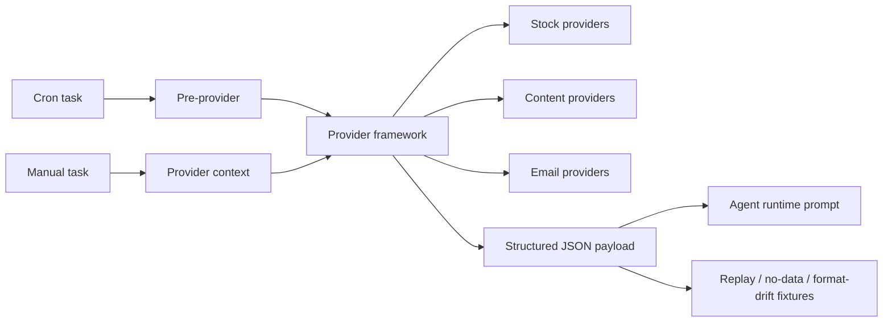

# MiniClaw Provider 文档

> 结论：provider docs 是外部数据采集、pre-provider context、provider safety boundary、health/dry-run 行为和 provider output contract 的 source-of-truth 层。它们和 runtime docs 分离，因为 provider 负责 data trust 和 privacy boundary，不负责 Discord 或 Agent 执行行为。

## Provider 地图

## Framework 框架

- [`../../providers/provider-framework.md`](../../providers/provider-framework.md): provider manifest、health check、dry-run、structured output、fixture coverage 和 compatibility adapter 规则。

## 股票 Provider

- [`../../providers/stock/README.md`](../../providers/stock/README.md): stock data-system overview 和 runtime layering。
- [`../../providers/stock/data-and-sources.md`](../../providers/stock/data-and-sources.md): trusted data sources、account/watchlist boundaries 和 normalized stock data semantics。
- [`../../providers/stock/workflows.md`](../../providers/stock/workflows.md): stock data products 和 cron workflow composition。
- [`../../providers/stock/operations-and-security.md`](../../providers/stock/operations-and-security.md): stock operations、session refresh、troubleshooting 和 safety rules。

Stock provider feature stubs 已合并并删除；当前 stock source docs 是上面的 stock data-system docs。

## 内容 Provider

- [`../../providers/content.md`](../../providers/content.md): content ingestion provider family，当前是 WeChat MP metadata provider 和 dedupe/data-flow boundary。

Content provider feature stub 已合并并删除；当前 content source doc 是 [`../../providers/content.md`](../../providers/content.md)。

## Email Provider 文档

- [`../../providers/email.md`](../../providers/email.md): Email provider family，合并 shared read-only Email capability、generic `email-query` 和 CMB credit-card email parser 边界。

Email provider feature stubs 已合并并删除；当前 email source doc 是 [`../../providers/email.md`](../../providers/email.md)。

## 维护规则

- Provider docs 应声明 trusted source、privacy boundary、owner code paths、output schema 和 state/session commit semantics。
- Account/session/cookie 细节保留在 `docs/private/**`；public provider docs 只描述安全边界。
- Website pages 可以总结 provider capabilities，但实现事实必须通过 `source_docs` 回链到 canonical docs。
