# 内容 Provider 系列

> 结论：content providers 采集外部文章/内容 metadata、做 dedupe，并把可进入 prompt 的 context 格式化给 cron tasks。当前 content provider 是 `wechat-mp`；它通过用户控制的 web session 读取微信公众号后台文章 metadata，可以先做标题筛选，并且只对高信号候选抓取有界的公开正文摘录。session file 仍然必须当作敏感凭据。

## 数据流

```mermaid
flowchart LR
  Session[mp.weixin.qq.com session] --> Collector[wechat-mp collector]
  Collector --> Accounts[Configured account queries]
  Accounts --> Normalize[Normalize article metadata]
  Normalize --> Window[Fixed time window filter]
  Window --> Dedupe[Dedupe state]
  Dedupe --> Screen[Title screening]
  Screen --> Excerpt[Bounded public excerpt fetch]
  Excerpt --> Payload[Provider payload]
  Payload --> Cron[Cron task prompt]
  Cron --> Discord[Discord delivery]
```



## 微信公众号 Provider

Runtime name: `wechat-mp`.

Owner code paths:

```text
src/providers/wechat-mp/
  auth.ts       # session loading/redaction
  browser-refresh.ts # persistent browser-profile session refresh
  client.ts     # mp.weixin.qq.com backend calls
  collector.ts  # account query, window, dedupe orchestration
  config.ts     # ~/.miniclaw/providers/wechat-mp/<name>.yaml
  content.ts    # bounded public article excerpt fetch/extraction
  format.ts     # prompt/Discord-safe provider text
  parser.ts     # article metadata normalization
  screening.ts  # title-only reading-priority heuristic
  state.ts      # fakeid cache and sent-article dedupe

scripts/wechat-mp-login.ts
scripts/wechat-mp-refresh.ts
scripts/wechat-mp-check.ts
scripts/wechat-mp-collect.ts
scripts/auth-session-refresh.ts
```

Purpose:

- 从配置的微信公众号采集文章列表 metadata。
- 按固定北京时间 slots 过滤文章。
- 在早/晚运行之间 dedupe 已发送文章。
- 在抓正文前，先基于标题和摘要判断文章阅读价值。
- 只对高分候选抓取有界的公开文章摘录。
- 把 metadata 注入 LLM task，生成适合 Discord 阅读的总结。

Non-goals:

- 不读取个人微信聊天记录。
- 不归档完整文章正文，也不把完整正文暴露给下游 prompt；正文级筛选只使用有界 excerpt。
- 不把 WeChat session token/cookies 暴露到 Discord、logs、repo docs 或 LLM prompts。

## 配置形态

User config lives under `~/.miniclaw/providers/wechat-mp/<name>.yaml`:

```yaml
auth_path: "~/.miniclaw/secrets/wechat-mp-session.json"
browser_profile_dir: "~/.miniclaw/browser-profiles/wechat-mp"
state_path: "~/.miniclaw/providers/wechat-mp/state.json"
window:
  mode: fixed_slots
  timezone_offset_hours: 8
  slots:
    - at_hour: 9
      start_day_offset: -1
      start_hour: 17
      end_day_offset: 0
      end_hour: 9
    - at_hour: 17
      start_day_offset: 0
      start_hour: 9
      end_day_offset: 0
      end_hour: 17
max_pages_per_account: 5
page_size: 10
dedupe: true
read_filter:
  enabled: true
  min_title_score: 55
  max_articles_to_fetch: 6
  excerpt_chars: 2600
  fetch_timeout_ms: 15000
accounts:
  - name: 机器之心
    query: 机器之心
    alias: almosthuman2014
```

Fixed window semantics:

- 北京时间 09:00 run：前一天 17:00 到当天 09:00。
- 北京时间 17:00 run：当天 09:00 到当天 17:00。
- Window 左闭右开：`start <= publish_time < end`。

Read filter semantics:

- `title_screen` 是确定性规则，只使用 title/digest/account。AI Engineering、Data Engineering、Agent、RAG、MCP、LLM infra、工程实践、数据平台和工具链信号会加分。
- 标题党、招聘、活动推广、消费级硬件轻资讯、以及明显偏离用户 AI/Data Engineering 关注方向的内容会在抓正文前降权。
- 只有 `title_screen.score >= read_filter.min_title_score` 的文章才会成为公开 excerpt 抓取候选，`max_articles_to_fetch` 限制 WeChat 页面请求数量。
- `content_fetch.excerpt` 是用于总结/排序的有界摘录，不是完整文章归档。抓取失败只影响单篇文章，并应降级为 title/digest-only 判断。

## Session 刷新

Commands:

```bash
pnpm wechat-mp:login -- --config daily-ai-wechat
pnpm wechat-mp:refresh -- --config daily-ai-wechat
pnpm wechat-mp:refresh -- --config daily-ai-wechat --visible
pnpm auth:refresh -- --provider wechat-mp --config daily-ai-wechat
pnpm wechat-mp:check -- --config daily-ai-wechat
pnpm wechat-mp:collect -- --config daily-ai-wechat --dry-run
```

Session contract:

- Login 使用可见的 persistent browser profile，并且只把 `mp.weixin.qq.com` token/cookies 保存到 `auth_path`。
- Refresh 会先用专用 browser profile 以 headless 模式尝试续期；如果 profile 还能进入带数字 `token` 的后台 URL，MiniClaw 会在 `searchbiz` health check 通过后重写 `auth_path`。
- `--visible` 是 QR scan、设备确认、captcha 或其他 login challenge 出现时的人工恢复路径。
- `auth_path` 应使用 `0600` 权限，且绝不能提交到 git。
- `browser_profile_dir` 应该是 MiniClaw 专用 profile 目录，并使用 private local permissions；不要指向用户日常 Chrome profile。
- Check 和 collect commands 必须 redact token/cookie values。
- Dry run 不能提交 dedupe state。
- Automatic refresh 遇到 invalid session 或 frequency-control challenge 时必须 fail closed；不能保存账号密码，也不能绕过人工验证。

## Cron 使用方式

Example cron job:

```yaml
name: daily-wechat-mp
schedule: "0 9,17 * * *"
timezone: Asia/Shanghai
enabled: true
type: task
channel: "<discord-channel-id>"
pre_provider: wechat-mp
pre_provider_config: daily-ai-wechat
prompt: |
  You are a Chinese AI/data technology editor. The provider JSON above contains article metadata for the current fixed window.
  First summarize articles in read_filter.full_read_articles whose content_fetch.status is ok.
  Use content_fetch.excerpt for deep-read summaries; use title/digest only for skim or skipped articles.
  Do not invent article body details when body fetch failed or was not attempted.
```

Provider commit semantics:

```text
cron task
  -> runPreProvider("wechat-mp")
  -> collect metadata and filter/dedupe
  -> title-screen articles
  -> fetch bounded public excerpts for selected candidates
  -> inject JSON into task prompt
  -> execute LLM task
  -> commit dedupe state only after downstream task success
```

## 安全契约

- `auth_path` 等价于 Official Account backend web session credential。
- Provider output 可以包含 article metadata、account names、titles、digests、publish times、links、title-screen decisions，以及高分候选的有界公开文章摘录。
- Provider failure 不能把 articles 标记为 sent。
- 单篇 article excerpt 抓取失败不应让整个 provider run 失败，除非 metadata collection 本身失败。
- Frequency control 或 invalid-session errors 应作为带 redacted diagnostics 的 provider failures 暴露。
- Website pages 可以总结 WeChat ingestion，但实现事实应把本页作为 `source_docs`。

## 历史遗留清理

上一轮 feature-level content stub 已在迁移完成后删除。新的实现事实应写到本文件。

Verification owner:

```bash
pnpm vitest run src/providers/wechat-mp
pnpm run quality:docs
pnpm run typecheck
```
