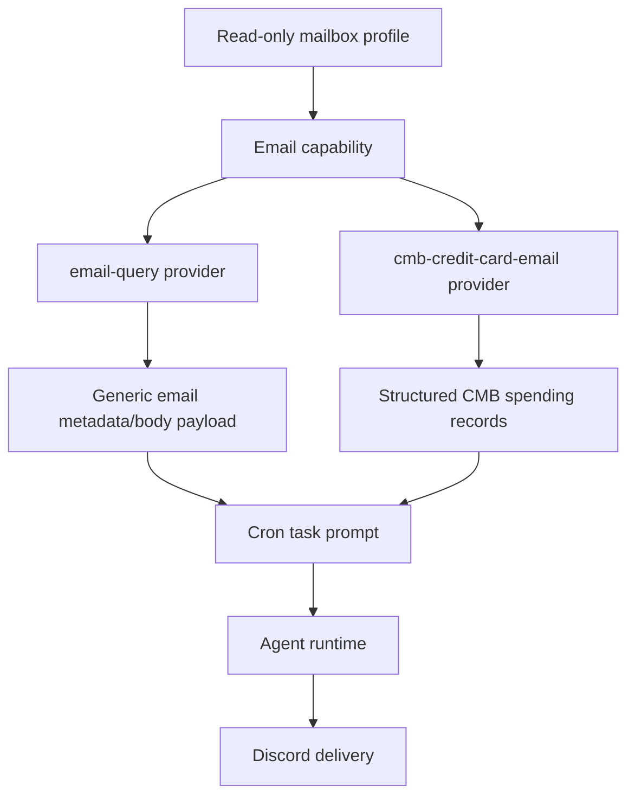

# Email Provider Family

> 结论：Email 是 shared read-only capability 加上若干 provider consumers。`email-query` 暴露受控的通用 mailbox context，`cmb-credit-card-email` 把招商信用卡通知邮件解析成结构化消费记录。它们共享邮箱访问能力，但 parser-specific 行为和业务语义属于 consumer provider。

## Family Map



## Runtime Boundaries

Shared email capability:

- Runtime path: `src/capabilities/email/**`.
- Trusted source: 配置在 `~/.miniclaw/capabilities/email/config.yaml` 下的 mailbox profiles。
- Business meaning: read-only message search、MIME body parsing、显式 policy 下的 attachment metadata/text extraction、redaction 和 message-level dedupe state。
- Downstream use: `email-query`、`cmb-credit-card-email` 和未来 email-backed business providers。
- Non-goal: business parsing、Discord copywriting 或任何 mailbox write operation。

Generic email query provider:

- Runtime name: `email-query`.
- Runtime path: `src/providers/email-query/**`.
- Business meaning: 给 cron tasks 使用的受控通用 mailbox context。
- Output: redacted sender/message information 的格式化 email query results；body inclusion 是 opt-in。

CMB credit-card email provider:

- Runtime name: `cmb-credit-card-email`.
- Runtime path: `src/providers/cmb-credit-card-email/**`.
- Business meaning: 从匹配的通知邮件中提取消费/退款记录。
- Output: structured spending records、totals、diagnostics、warnings，以及没有新交易时可选跳过 task。

SMTP fallback notifier:

- Runtime path: `src/notifications/smtp-email.ts`.
- Business meaning: Discord 或 connectivity path 失败时的 operations fallback notification。
- Boundary: 该 notifier 发送 system alerts，不属于 read-only Email capability。

## Shared Read-only Email Capability

Owner code paths:

```text
src/capabilities/email/
  config.ts          # ~/.miniclaw/capabilities/email/config.yaml loader
  query.ts           # profile-scoped message search entrypoint
  state.ts           # message-level dedupe state
  redaction.ts       # safe address/subject/message redaction helpers
  attachments.ts     # attachment metadata/text extraction policy
  clients/imap.ts    # current IMAP adapter
  types.ts
```

Current adapter support:

- Implemented: IMAP.
- Reserved provider values: `gmail` 和 `graph`；它们是 config-level future adapters，不是当前 runtime implementations。

Mailbox profile config:

```yaml
# ~/.miniclaw/capabilities/email/config.yaml
profiles:
  cmb-notify:
    provider: imap
    account_alias: cmb-notify
    secret_path: "~/.miniclaw/secrets/email/cmb-notify.json"
    folders:
      - INBOX
    allowed_senders:
      - "cmbchina.com"
      - "cmbchina.com.cn"
    subject_allowlist:
      - 信用卡
      - 消费
      - 账单
    max_lookback_days: 7
    max_results: 50
    body_max_bytes: 512000
    raw_body_retention: none
    attachment_policy: download_allowlist
    redaction: strict
    state_path: "~/.miniclaw/capabilities/email/cmb-notify-state.json"
    imap:
      host: "imap.example.com"
      port: 993
      secure: true
      tls_reject_unauthorized: true
```

Secret file:

```json
{
  "username": "your-dedicated-mailbox@example.com",
  "password": "<mail-app-password>"
}
```

Safety contract:

- Allowed: read-only message search、MIME text parsing、attachment metadata，以及显式 allowlisted text extraction。
- Forbidden: send、delete、move、mark-read、reply、forward、mailbox rule edits、把 secret 持久化进 repo docs/config、超过 `raw_body_retention: none` 的 raw body retention，或在 logs/Discord/LLM prompts 中输出未 redacted addresses/tokens。
- State: capability state 存储 message hashes、provider UID、optional subject hash、received time 和 seen time。它不能存 raw body 或 credentials。

## Generic Email Query Provider

Config shape:

```yaml
# ~/.miniclaw/providers/email-query/default.yaml
email_profile: cmb-notify
folders:
  - INBOX
from:
  - "*.cmbchina.com"
subject_includes:
  - 信用卡
window_hours: 24
max_results: 20
include_body: false
include_attachments: false
dedupe: true
state_path: "~/.miniclaw/providers/email-query/default-state.json"
```

Cron example:

```yaml
name: daily-email-digest
schedule: "30 22 * * *"
timezone: Asia/Shanghai
enabled: true
type: task
channel: "<discord-channel-id>"
pre_provider: email-query
pre_provider_config: default
prompt: |
  Summarize the email metadata above.
  Do not output email addresses, raw message bodies, verification codes, or tokens.
```

Commit semantics:

```text
cron task
  -> pre_provider: email-query
    -> load query config
    -> search read-only mailbox profile
    -> filter already-seen messages when dedupe=true
    -> inject formatted provider result into the prompt
    -> commit seen-message state only after downstream task success
```

Provider contract:

- `include_body` 默认是 `false`；body text 必须由 provider config 有意打开。
- `include_attachments` 默认是 `false`；attachment content extraction 仍取决于 capability profile policy。
- `dedupe: true` 会延迟 state writes，直到 cron task 成功，从而保留 retry 行为。

## CMB Credit-card Email Provider

Config shape:

```yaml
# ~/.miniclaw/providers/cmb-credit-card-email/default.yaml
email_profile: cmb-notify
folders:
  - INBOX
from:
  - "cmbchina.com"
  - "cmbchina.com.cn"
subject_includes:
  - 招商
  - 信用卡
  - 消费
  - 账单
window_hours: 24
max_results: 50
currency: CNY
large_transaction_threshold: 1000
dedupe: true
include_attachments: true
parse_attachment_text: true
attachment_text_max_bytes: 128000
allowed_attachment_extensions:
  - .txt
  - .csv
  - .html
  - .htm
  - .json
  - .xml
  - .zip
diagnostic_search: true
skip_when_no_new_transactions: true
state_path: "~/.miniclaw/providers/cmb-credit-card-email/default-state.json"
```

Cron example:

```yaml
name: daily-cmb-credit-card
schedule: "*/30 11-23 * * *"
timezone: Asia/Shanghai
enabled: true
type: task
channel: "<private-discord-channel-id>"
pre_provider: cmb-credit-card-email
pre_provider_config: default
prompt: |
  Generate today's CMB credit-card spending summary from the parsed records above.

  Requirements:
  - Do not output email addresses, full card numbers, or raw email bodies.
  - Start with total spend, refund, net spend, and transaction count.
  - List large transactions and possible anomalies.
  - State that results are parsed from notification emails and final billing records remain authoritative.
```

Runtime flow:

```text
cron task
  -> pre_provider: cmb-credit-card-email
    -> load provider config
    -> search read-only email capability with body enabled
    -> optionally extract text from allowed attachment types
    -> parse CMB spend/refund records
    -> filter already-seen transactions when dedupe=true
    -> optionally skip downstream task when no new transactions exist
    -> commit transaction state only after downstream task success
```

Output fields:

- Summary: `transaction_count`、`skipped_duplicates`、`total_spend`、`total_refund`、`net_spend`、`large_transaction_threshold`、`large_transactions`、`transactions`。
- Transaction: `occurred_at`、`direction`、`amount`、`currency`、`merchant`、`card_tail_hash`、`message_id_hash`、`source_medium`、`source`。
- Diagnostics: `matched_email_count`、`candidate_email_count`、`attachment_count`、`downloadable_attachment_count`、parsed body/attachment counts、unsupported/failed attachment counts、`skipped_reason_counts` 和 redacted `latest_candidates`。
- Warnings: parser mismatch、subject-filter mismatch、attachment extraction failures、duplicate skips 和 no-parsed-transaction cases。

Parser contract:

- Directions 只允许 `spend` 和 `refund`。
- Card tails 必须 hash；绝不能输出完整卡号。
- Attachments 只在显式 allowlisted extensions 下按 text-only 处理。PDF、encrypted ZIP、images 和 unknown binary formats 只保留 diagnostic，除非未来 parser 增加安全 extraction path。
- 这不是 bank ledger API。Email delays、template changes、refunds、reversals、pre-authorizations、FX fees 和 monthly statement reconciliation 都可能导致结果与 parsed notification records 不一致。

Skip behavior:

- 当 `skip_when_no_new_transactions: true` 时，provider 可以跳过 downstream LLM task。
- Skip reasons 包括没有匹配的 CMB email、没有新解析出的 transactions，或所有 parsed transactions 都是 duplicates。
- 这样可以支持高频 polling，而不会反复发送 "zero transaction" Discord summaries。

## Legacy Compatibility

上一轮 feature-level docs 会作为兼容 stub 保留一个迁移周期：

- [`../../features/07-email-capability.md`](../../features/07-email-capability.md)
- [`../../features/08-cmb-credit-card-email-provider.md`](../../features/08-cmb-credit-card-email-provider.md)

新的实现事实应写到本 provider-family doc。Private mailbox、credential 或 account-specific setup details 不应进入 public docs。

## Development Checklist

- 如果 mailbox config、redaction、attachment extraction、dedupe state 或 read-only boundaries 变化，更新 Shared Email Capability section。
- 如果 `email-query` query config、body/attachment behavior 或 commit semantics 变化，更新 Generic Email Query Provider section。
- 如果 CMB parsing、diagnostics、skip reasons、output fields 或 attachment parsing 变化，更新 CMB Credit-card Email Provider section。
- 如果 website provider pages 提到 Email behavior，让它们的 `source_docs` 指向本页和对应中文 pair。
- Verification owner:

```bash
pnpm vitest run src/capabilities/email src/providers/email-query src/providers/cmb-credit-card-email
pnpm run quality:docs
pnpm run typecheck
```
