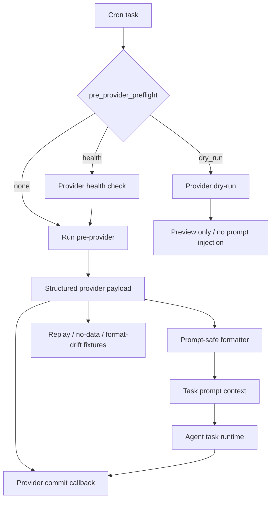

# MiniClaw Provider Framework

> 结论：provider framework docs 负责 manifest metadata、health checks、dry-run previews、structured output、fixture coverage、failure taxonomy，以及安全 state/session commit semantics 的 contract。Provider-specific docs 负责各 provider 的 trusted source 和 business payload。

## Runtime Shape



## Owner Code Paths

```text
src/providers/framework.ts
src/providers/index.ts
src/cron/runner-task.ts
scripts/provider-health.ts
scripts/provider-dry-run.ts
scripts/quality-docs.ts
src/providers/*/__tests__/**
```

实现 framework path 的 provider modules 通过 `ProviderModule` 暴露 `manifest`、`healthCheck`、`dryRun` 和 `run`。Legacy providers 在迁移期间仍可通过 `runProviderModuleAsPreProvider()` 适配。

## Contract

Provider framework invariants:

- Providers 必须通过 manifest metadata 声明安全边界。
- Health check 和 dry-run 是显式能力，不能假设每个 provider 都有。
- Dry-run preview 只用于 validation；不能把 provider output 注入 downstream prompt。
- Structured output 必须 redacted、尽可能 deterministic，并且能通过 fixture tests 验证。
- 当 provider 有 side effects 时，provider state/session commit 只能在 downstream task 成功后发生。
- Sensitive providers 遇到 expired sessions、login challenges、captchas、unexpected response shapes 或 redaction failures 时必须 fail closed。
- Provider failures 应使用稳定 categories，方便 cron 和 Auto Doctor report。

## Cron Preflight

`pre_provider_preflight` 支持实际 task creation 前的 runtime gate：

```yaml
pre_provider: stock-pulse
pre_provider_config: us-hourly
pre_provider_preflight: health
```

Expected behavior:

- `health`: 运行 provider health check，只有通过才继续。
- `dry_run`: 运行 provider dry-run 并报告 preview，不注入 prompt context。
- unset: 直接把 provider 作为 cron pre-provider 运行。

Provider docs 必须说明支持哪些 preflight modes，以及这些 modes 是否需要 network/session access。

## Structured Output

Provider output 应分离：

- `run_context`: profile、market scope、time window、skipped state、source status。
- `payload`: 给 LLM 使用的 deterministic structured facts。
- `warnings`: degraded sources、stale data、partial results、fallback sources。
- `usage_notes`: 面向 prompt 的安全和解释约束。
- `commit`: downstream success 后更新 dedupe/session state 的可选 callback。

Provider formatter 可以为 task prompts 生成 text block，但 canonical provider behavior 应仍能表达为 structured JSON，以支持 tests 和未来 generated references。

## Fixture Coverage

迁移到 framework 的 providers 应保留以下 fixtures：

- replay / successful payload,
- no-data 或 skipped-market behavior,
- format drift / degraded upstream response.

Good fixture locations:

```text
src/providers/<provider>/fixtures/*.json
src/providers/<provider>/__tests__/*.test.ts
```

当 fixture expectations 成为 provider quality gates 的一部分时，`quality:docs` 和 provider docs 应保持一致。

## Failure Taxonomy

Provider failures 应保留足够信息给 cron 和 Auto Doctor，同时不能泄露敏感细节：

- `config_error`: invalid or missing local config.
- `auth_required`: missing or expired session.
- `upstream_blocked`: captcha、login challenge、permission failure、rate limit 或 upstream denial.
- `upstream_format_drift`: response shape 改变或 parser 不再匹配。
- `network_error`: timeout、DNS、TLS 或 connection failure.
- `no_data`: source 没有返回 eligible data，provider 将其视为 controlled skip.
- `partial_data`: optional source failed，但 provider 可以带 warnings 继续。

## Provider Author Checklist

- 定义 trusted upstream source，以及它是 public、account-bound 还是 private。
- 定义 read/write boundaries，并明确禁止 unsafe operations。
- Credentials、cookies、account IDs、validatekeys 和 tokens 不能进入 repo docs 或 prompt output。
- 在 user-local `~/.miniclaw/**` paths 下提供 config examples。
- Dedupe/session state commit 必须依赖 downstream success。
- Provider 有脆弱 upstream/session dependencies 时，应增加 health/dry-run support。
- 为迁移到 framework 的 providers 增加 replay/no-data/format-drift fixtures。
- 如果 public provider summary 提到变化行为，更新 website `source_docs`。

## Legacy Compatibility

上一轮 feature-level framework doc 会作为兼容 stub 保留一个迁移周期：

- [`../../features/16-provider-framework.md`](../../features/16-provider-framework.md)

旧中文 feature placeholder 是历史文档；当前中文 pair 是 [`provider-framework.zh.md`](provider-framework.zh.md)。

Verification owner:

```bash
pnpm vitest run src/providers/__tests__/framework.test.ts
pnpm run quality:docs
pnpm run typecheck
pnpm run lint
```
